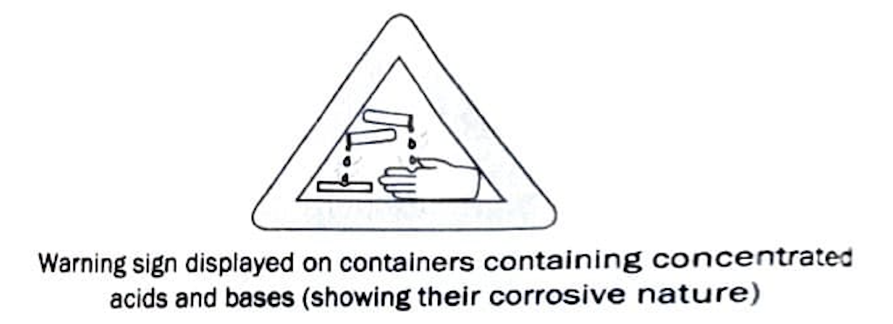

# 2.3 What do Acids and Bases have in Common

## Table of Contents
- [Common Properties of Acids and Bases](#23-what-do-acids-and-bases-have-in-common)
- [Effect of Dilution on an Acid or Base](#effect-of-dilution-on-an-acid-or-base)
- [2.4 Reaction between Acids and Bases](#24-reaction-between-acids-and-bases)
- [Try These 2.1 (with Solutions)](#try-these-21)

---

**• In presence of water, all acids give $H^+$ ion.** These $[H^+]$ ion combines with water molecules and form $H_3O^+$ (hydronium ion). Hence, we can say that in presence of water, all acids give $H^+$ ion or $[H_3O^+]$ ion.

$$HA(aq) \longrightarrow H^+(aq) + A^-(aq)$$

$$\text{(Acid)}$$

e.g. $\text{HCl}(aq) \longrightarrow H^+(aq) + Cl^-(aq)$

$$H^+ + H_2O \longrightarrow H_3O^+$$

**• In presence of water, all the bases give $OH^-$ ion.**

$$BOH(aq) \longrightarrow B^+(aq) + OH^-(aq)$$

$$\text{(Base)}$$

e.g. $\text{NaOH}(s) \xrightarrow{H_2O} Na^+(aq) + OH^-(aq)$

$$\text{KOH}(s) \xrightarrow{H_2O} K^+(aq) + OH^-(aq)$$

$$\text{Mg(OH)}_2(s) \longrightarrow Mg^{2+}(aq) + 2OH^-(aq)$$

**Note:** All bases do not dissolve in water except a few. The bases which can dissolve in water without undergoing any kind of chemical reactions are called alkalis. An alkali is a base which dissolves in water.

**• Since, ions help in conduction of charge, so aqueous solution of both acids and bases conducts electricity.** Therefore, the common property of acids and bases is to dissociate into ions in aqueous solution and conduct electricity.

---

## Effect of Dilution on an Acid or Base

Mixing of an acid or base with water is called **dilution**. It results in decrease in the concentration of ions $(H_3O^+/OH^-)$ per unit volume and the acid or base is said to be diluted.

When we dilute an acid or a base, the reaction is highly exothermic (heat generating). Hence, care must be taken while doing it. During dilution, *acids must always be added slowly to water with constant stirring*.

*Water should not be added to concentrated acid* because if water is added, the heat generated may cause the mixture to splash out and cause burns.

The glass container may also break due to excessive local heating.

  
  
Warning sign displayed on containers containing concentrated acids and bases (showing their corrosive nature)

---

## 2.4 Reaction between Acids and Bases

Acids react with bases to produce salt and water. In this reaction, an acid neutralises a base, i.e. acid nullifies or reduces the effect of a base or *vice-versa* thus, the reaction is known as **neutralisation reaction**.

In general, neutralisation reaction can be written as

Base + Acid $\longrightarrow$ Salt + Water

$$H(\overline{X + M})\text{ OH} \longrightarrow MX + \text{HOH}$$

Here, H represents hydrogen atom and $M$ represents metal atom.

$$H^+(aq) + OH^-(aq) \longrightarrow H_2O(l)$$

e.g. $\text{NaOH}(aq) + \text{HCl}(aq) \longrightarrow \text{NaCl}(aq) + H_2O(l)$

$$\begin{matrix} \text{Sodium} & \text{Hydrochloric} & \text{Sodium} & \text{Water} \\ \text{hydroxide} & \text{acid} & \text{chloride} & \end{matrix}$$

---

<h3>Try These 2.1</h3>

<ol>
<li>Which acid is found in nettle's sting?</li>
<li>Bases should not be kept in active metal container. Why?</li>
<li>Name the precipitate formed when $CO_2$ reacts with lime water.</li>
<li>Give a chemical reaction to prove that non-metallic oxides are acidic in nature.</li>
<li>What is the effect of dilution on an acid or base?</li>
<li>Write the product formed when sodium hydroxide reacts with hydrochloric acid.</li>
</ol>

<h4>Solutions:</h4>

<strong>1.</strong> <strong>Methanoic acid</strong> is found in nettle's sting.

<strong>2.</strong> Bases should not be kept in active metal containers because strong bases react with active metals to produce hydrogen gas. This can cause pressure build-up and potential hazards.

$$\text{Zn}(s) + 2\text{NaOH}(aq) \longrightarrow \text{Na}_2\text{ZnO}_2(s) + H_2(g)$$

<strong>3.</strong> The precipitate formed when $CO_2$ reacts with lime water is <strong>calcium carbonate</strong> $(CaCO_3)$, which appears as a white precipitate.

$$\text{Ca(OH)}_2(aq) + \text{CO}_2(g) \longrightarrow \text{CaCO}_3(s) + H_2O(l)$$

<strong>4.</strong> Non-metallic oxides are acidic in nature. This can be proved by the reaction of carbon dioxide (a non-metallic oxide) with calcium hydroxide (a base) to form salt and water:

$$\text{Ca(OH)}_2(aq) + \text{CO}_2(g) \longrightarrow \text{CaCO}_3(s) + H_2O(l)$$

This is an acid-base neutralization reaction, proving that $CO_2$ is acidic in nature.

<strong>5.</strong> The effect of dilution on an acid or base is that it <strong>decreases the concentration of ions</strong> $(H_3O^+/OH^-)$ <strong>per unit volume</strong>. The acid or base becomes weaker. The reaction is highly exothermic (heat generating).

<strong>6.</strong> When sodium hydroxide reacts with hydrochloric acid, the products formed are <strong>sodium chloride and water</strong>:

$$\text{NaOH}(aq) + \text{HCl}(aq) \longrightarrow \text{NaCl}(aq) + H_2O(l)$$

---

