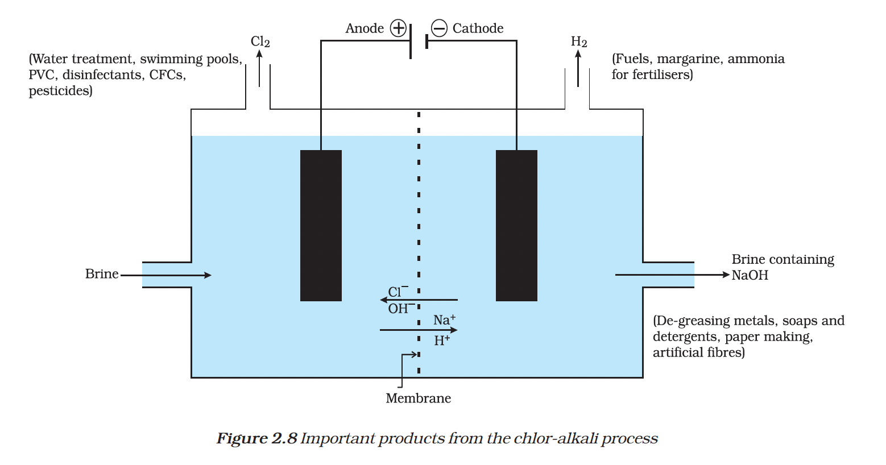

# 2.9 Salts

## Table of Contents
- [Introduction](#29-salts)
- [Quick Navigation (Salt Cards)](#quick-navigation)
- [I. Common Salt (NaCl)](#i-common-salt)
- [II. Caustic Soda (NaOH)](#ii-caustic-soda)
- [III. Bleaching Powder (CaOCl₂)](#iii-bleaching-powder)
- [IV. Baking Soda (NaHCO₃)](#iv-baking-soda)
- [V. Washing Soda (Na₂CO₃·10H₂O)](#v-washing-soda)
- [VI. Plaster of Paris (CaSO₄·½H₂O)](#vi-plaster-of-paris)
- [2.10 Water of Crystallisation](#210-water-of-crystallisation)
- [Try These 2.3](#try-these-23)

---

They are produced by the **neutralisation reaction** between acid and base. Salts of strong acid and a strong base are neutral with pH value of 7.

Salts of a strong acid and weak base **are acidic** with pH value less than 7. Salts of strong base and weak acid are basic in nature with pH value more than 7.

Now, we will study about preparation and properties of some salts.

---

## Quick Navigation

  <h3>I. <a href="#i-common-salt">Common Salt</a></h3>
  
<strong>NaCl</strong> - Sodium chloride 
  Used in cooking and raw material for various chemicals

  <h3>II. <a href="#ii-caustic-soda">Caustic Soda</a></h3>
  
<strong>NaOH</strong> - Sodium hydroxide 
  Produced by chlor-alkali process, used in soaps and detergents

  <h3>III. <a href="#iii-bleaching-powder">Bleaching Powder</a></h3>
  
<strong>CaOCl₂</strong> - Calcium oxychloride 
  Used for bleaching and as a disinfectant

  <h3>IV. <a href="#iv-baking-soda">Baking Soda</a></h3>
  
<strong>NaHCO₃</strong> - Sodium hydrogencarbonate 
  Used in baking powder and as antacid

  <h3>V. <a href="#v-washing-soda">Washing Soda</a></h3>
  
<strong>Na₂CO₃·10H₂O</strong> - Sodium carbonate decahydrate 
  Used in glass, soap industries and removes water hardness

  <h3>VI. <a href="#vi-plaster-of-paris">Plaster of Paris</a></h3>
  
<strong>CaSO₄·½H₂O</strong> - Calcium sulphate hemihydrate 
  Used in casts, moulds, and construction

---

---

## I. Common Salt

**Chemical name:** Sodium chloride

**Chemical formula:** NaCl

### Preparation

- It is formed by the combination of hydrochloric acid and sodium hydroxide solution. Sea water contains many salts dissolved in it.

- It is obtained on large scale from sea water by separating other salts from it.

- It may also be obtained from rock salt. (Rock salt is mined like coal.)

### Uses

- It is the salt that we use for cooking purpose.

- It is an important raw material which is used for preparing, various materials like sodium hydroxide, baking soda, washing soda, bleaching powder etc.

## II. Caustic Soda

**Chemical name:** Sodium hydroxide

**Chemical formula:** NaOH

### Preparation

- When electricity is passed through an aqueous solution of sodium chloride (called brine), it decomposes to form sodium hydroxide and chlorine.

  This process is named as, **chlor-alkali process** because the products formed, i.e. chlor for chlorine and alkali for sodium hydroxide.

- The reaction involved is as follows

$$2\text{NaCl}(aq) + 2H_2O(l) \xrightarrow{\text{Electric current}} 2\text{NaOH}(aq)$$

$$\begin{matrix} \text{Sodium chloride} & \text{Water} & \text{Sodium hydroxide} \\ & & \text{(Near cathode)} \end{matrix}$$

$$+ \text{Cl}_2(g) + H_2(g)$$

$$\begin{matrix} \text{Chlorine} & \text{Hydrogen} \\ \text{(At anode)} & \text{(At cathode)} \end{matrix}$$

  
  
Important products from the chlor-alkali process

### Uses

The uses of different products formed in chlor-alkali process are as follows

- **$H_2$** is used in fuels, margarine, ammonia for fertilizers.

- **$Cl_2$** is used in water treatment, swimming pools, PVC, disinfectants, CFCs, pesticides.

- **NaOH** is used for de-greasing metals, soaps and detergents, paper making, artificial fibres.

- **Chlorine and hydrogen** are use as raw material for the preparation of **hydrochloric acid** (HCl). Further, HCl is used for cleaning steel, ammonium chloride, medicines, cosmetics.

- Cl and NaOH used as raw material for the preparation of **bleach**. Moreover, this bleach is used in different household work, for bleaching fabric etc.

## III. Bleaching Powder

**Chemical name:** Calcium oxychloride

**Chemical formula:** $\text{CaOCl}_2$

### Preparation

- It is produced by the action of chlorine on dry slaked lime.

$$\text{Ca(OH)}_2 + \text{Cl}_2 \longrightarrow \text{CaOCl}_2 + H_2O$$

$$\begin{matrix} \text{Slaked lime} & \text{Chlorine} & \text{Bleaching} & \text{Water} \\ & & \text{powder} & \end{matrix}$$

- On standing for a longer time, it undergoes auto-oxidation due to which bleaching action decreases.

### Uses

The uses of bleaching powder are as follows

- It is used for bleaching cotton and linen in the textile industry, for bleaching wood pulp in paper industries and for bleaching washed clothes in laundry.

- It is also used as a disinfectant for water to make it free from germs.

- It is used as an oxidising agent in many chemical industries.

## IV. Baking Soda

**Chemical name:** Sodium hydrogencarbonate

**Chemical formula:** $\text{NaHCO}_3$

### Preparation

- It is produced by using sodium chloride as one of the raw material.

- The reaction involved is as follows

$$\text{NaCl}(aq) + H_2O(l) + \text{CO}_2(g) + \text{NH}_3(g) \longrightarrow$$

$$\begin{matrix} \text{Brine} & & \text{Carbon dioxide} & \text{Ammonia} \end{matrix}$$

$$\text{NH}_4\text{Cl}(g) + \text{NaHCO}_3(s)$$

$$\begin{matrix} \text{Ammonium} & \text{Sodium hydrogen} \\ \text{chloride} & \text{carbonate} \end{matrix}$$

- The following reaction takes place when it is heated during cooking.

$$2\text{NaHCO}_3 \xrightarrow{\text{Heat}} \text{Na}_2\text{CO}_3 + H_2O + \text{CO}_2 \uparrow$$

$$\begin{matrix} \text{Sodium hydrogen} & \text{Sodium carbonate} \\ \text{carbonate} & \end{matrix}$$

### Properties

- The soda is commonly used in the kitchen for making tasty crispy pakora.

- It is a mild non-corrosive basic salt.

- It is the major constituent of baking powder.

- Sometimes, it is added for faster cooking.

### Uses

The uses of sodium hydrogen carbonate are as follows

- For making baking powder, which is a mixture of baking soda (sodium hydrogen carbonate) and a mild edible acid such as tartaric acid. When baking powder is heated or mixed in water, the following reaction takes place.

$$\text{NaHCO}_3 + H^+ \longrightarrow \text{CO}_2 + H_2O + \text{ Sodium salt of acid}$$

$$\begin{matrix} \text{Sodium} & \text{(From} & \text{Carbon} & \text{Water} \\ \text{hydrogen} & \text{any acid)} & \text{dioxide} & \\ \text{carbonate} & & & \end{matrix}$$

Carbon dioxide produced during the reaction causes bread or cake to rise making them soft and spongy.

- Sodium hydrogen carbonate is also an ingredient of antacid. Being alkaline, it neutralises excess acid in the stomach and provides relief.

- It is also used in soda-acid fire extinguishers.

- Baking soda is also acts as a preservative for milk. In summer, it is added to the milk, as milk decompose and release lactic acid which makes milk sour. Added $\text{NaHCO}_3$ reacts with acid to form salt and water. It neutralises the acidic effect and milk does not become sour.

## V. Washing Soda

**Chemical name:** Sodium carbonate decahydrate

**Chemical formula:** $\text{Na}_2\text{CO}_3 \cdot 10H_2O$

### Preparation

- Sodium carbonate can be obtained by heating baking soda.

- Further, the recrystallisation of sodium carbonate gives washing soda. It is also a basic salt.

- The reaction involved is as follows

$$\text{Na}_2\text{CO}_3(s) + 10H_2O(l) \longrightarrow \text{Na}_2\text{CO}_3 \cdot 10H_2O_{(s)}$$

$$\text{Sodium carbonate}$$

### Properties

- It is a white crystalline solid.

- Its solution in water is alkaline in nature (turns red litmus blue).

- It has the property to remove dirt and grease from dirty clothes thus, it is called **washing soda**.

### Uses

The uses of sodium carbonate are as follows

- It is used in glass, soap and paper industries.

- It is used for the manufacture of sodium compounds like borax.

- It also removes permanent hardness of water.

- It is used as a cleansing agent (detergent) in houses and laundries.

## VI. Plaster of Paris

**Chemical name:** Calcium sulphate hemihydrate

**Chemical formula:** $\text{CaSO}_4 \cdot \frac{1}{2}H_2O$

### Preparation

- It is obtained by heating gypsum $(\text{CaSO}_4 \cdot 2H_2O)$ at 373 K. At this temperature, gypsum loses water molecules and forms calcium sulphate hemihydrate (Plaster of Paris).

- The reaction involved is as follows

$$\text{CaSO}_4 \cdot 2H_2O \xrightarrow[\text{Heat}]{373 \text{ K}} \text{CaSO}_4 \cdot \frac{1}{2}H_2O + 1\frac{1}{2}H_2O$$

$$\begin{matrix} \text{(Gypsum)} & & \text{(Plaster of Paris)} & \end{matrix}$$

- Plaster of Paris is a white powder and on mixing with water, it changes to gypsum giving a hard solid mass.

$$\text{CaSO}_4 \cdot \frac{1}{2}H_2O + 1\frac{1}{2}H_2O \longrightarrow \text{CaSO}_4 \cdot 2H_2O$$

$$\begin{matrix} \text{(Plaster of Paris)} & & \text{(Gypsum)} \end{matrix}$$

- When gypsum is heated above 400 K, dead burnt plaster (anhydrous $\text{CaSO}_4$) is obtained which does not have the property of hardening.

### Uses

The uses of plaster of Paris are as follows

- It is used by doctors for joining the fractured bones at right position, i.e. for making plaster to support fractured bones.

- It is also used for making toys, decorative pieces and for making designs on ceilings.

---

## 2.10 Water of Crystallisation

Crystals of some compounds seem to be dry but actually contain some water molecules attached to them as an essential part of their crystal structure. These water molecules are called **water of crystallisation** and such salts are called **hydrated salts**. Every hydrated salts has a fixed number of water molecules of water of crystallisation in its one formula unit.

For example, copper sulphate (blue vitriol; $\text{CuSO}_4 \cdot 5H_2O$). It contains as water of crystallisation.

- Gypsum ($\text{CaSO}_4 \cdot 2H_2O$). It has two water molecules as water of crystallisation.

- Plaster of Paris possesses 1/2 molecule of water of crystallisation.

### Action of Heat on Hydrated Salts

When we heat the hydrated salts, the water of crystallisation is removed and the hydrated salts lose their regular shape and colour and become colourless powdery substance. The salts so formed are called **anhydrous salts**. If we moisten the anhydrous salts, it becomes hydrated once again and regain its colour.

*For example*, when blue colour copper sulphate crystals ($\text{CuSO}_4 \cdot 5H_2O$) are heated strongly, they lose all the water of crystallisation and form anhydrous copper sulphate, which is white in colour.

$$\text{CuSO}_4 \cdot 5H_2O \xrightarrow{\text{Heat}} \text{CuSO}_4 + 5H_2O$$

$$\begin{matrix} \text{Hydrated copper} & \text{Anhydrous copper} \\ \text{sulphate (Blue)} & \text{sulphate (White)} \end{matrix}$$

---

<h3>Try These 2.3</h3>

<ol>
<li>What is the nature of salt of strong acid and weak base?</li>
<li>Which raw material is used for the preparation of bleach?</li>
<li>Name the chemical compound which is used as a disinfectant for water.</li>
<li>When a sodium compound X, which is also used in soda-fire extinguisher, when is heated gives a sodium compound Y along with water and carbon dioxide. Y on crystallisation forms compound Z. Identify X, Y and Z.</li>
<li>Write the chemical formula of blue vitriol.</li>
<li>What happens when gypsum is heated above 373 K?</li>
</ol>

---

