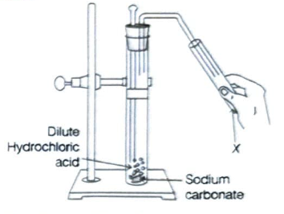
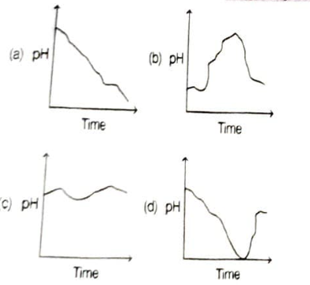

# Review Exercise

Including Competency Based Questions

## Competency Focused (Objective) Questions

### Multiple Choice Questions

<h4 style="text-transform: none;">1. Select a pair of natural indicator from the following:</h4>

CBSE 2024

(a) Litmus and methyl orange  
(b) Turmeric and litmus  
(c) Phenolphthalein and methyl orange  
(d) Methyl orange and turmeric

<strong class="sol-label">Sol.</strong> (b) Natural indicators are those substances that exist naturally and help to identify acids and bases. Among the given options turmeric and litmus are the natural indicator.

---

<h4 style="text-transform: none;">2. An aqueous solution 'A' turns phenolphthalein solution pink. On addition of an aqueous solution 'B' to 'A', the pink colour disappears. Which of the following statement is true for solution 'A' and 'B'?</h4>

CBSE 2020

(a) \(A\) is strongly basic and \(B\) is a weak base.  
(b) \(A\) is strongly acidic and \(B\) is a weak acid.  
(c) \(A\) has pH greater than 7 and \(B\) has pH less than 7.  
(d) \(A\) has pH less than 7 and \(B\) has pH greater than 7.

<strong class="sol-label">Sol.</strong> (c) Phenolphthalein gives pink colour in basic medium so pH of \(A\) is greater than 7. It is colourless in acidic medium so pH of \(B\) is less than 7.

---

<h4 style="text-transform: none;">3. When sodium bicarbonate reacts with dilute hydrochloric acid the gas evolved is</h4>

CBSE 2023

(a) hydrogen; it given pop sound with burning match stick.  
(b) hydrogen; it turns lime water milky.  
(c) carbon dioxide; it turns lime water milky.  
(d) carbon dioxide it blows off a burning match stick with a pop sound.

<strong class="sol-label">Sol.</strong> (c) When sodium bicarbonate reacts with dilute hydrochloric acid the gas evolved is carbon dioxide.

$$
\text{NaHCO}_3(s) + 2\text{HCl}(aq) \longrightarrow \text{NaCl}(aq) + \text{H}_2\text{O} + \text{CO}_2(g)
$$

When $\text{CO}_2$ is passed through lime water, it turns milky due to the formation of white precipitate of $\text{CaCO}_3$.

---

<h4 style="text-transform: none;">4. Which of the following gives the correct increasing order of acid strength?</h4>

NCERT Exemplar

(a) Water < acetic acid < hydrochloric acid  
(b) Water < hydrochloric acid < acetic acid  
(c) Acetic acid < water < hydrochloric acid  
(d) Hydrochloric acid < water < acetic acid

<strong class="sol-label">Sol.</strong> (a) Hydrochloric acid ionises completely in water, that's why it is a strong acid. Acetic acid ionises only partially in water, hence, it is a weak acid. Water has some what neutral nature. Thus, the order of acidity is, water < acetic acid < hydrochloric acid.

---

<h4 style="text-transform: none;">5. In the given experimental setup, it is observed that on passing the gas produced in the reaction in the solution 'X' the solution 'X' first turns milky and then colourless.</h4>

**The option that justifies the above stated observation that 'X' is aqueous calcium hydroxide and**

Competency Based Que.

(a) it turns milky due to carbon dioxide gas liberated in the reaction and after sometime it becomes colourless due to formation of calcium carbonate.

(b) it turns milky due to formation of calcium carbonate and on passing excess of carbon dioxide it becomes colourless due to formation of calcium hydrogen carbonate which is soluble in water.

(c) it turns milky due to passing of carbon dioxide through it. It turns colourless as on further passing carbon dioxide, sodium hydrogen carbonate is formed which is soluble in water.

(d) the carbon dioxide liberated during the reaction turns lime water milky due to formation of calcium hydrogen carbonate and after some time it turns colourless due to formation of calcium carbonate which is soluble in water.

<strong class="sol-label">Sol.</strong> (b) When \\(\text{CO}_2\\) gas is passed through lime water, it turns milky due to the formation of white precipitate of \\(\text{CaCO}_3\\).

$$\text{Ca(OH)}_2(aq) + \text{CO}_2(g) \longrightarrow \text{CaCO}_3(s) + \text{H}_2\text{O}(l)$$

If excess of \\(\text{CO}_2\\) is passed, milkiness disappears due to the formation of \\(\text{Ca(HCO}_3)_2\\) which is soluble in water.

$$\text{CaCO}_3(s) + \text{H}_2\text{O}(l) + \text{CO}_2(g) \longrightarrow \text{Ca(HCO}_3)_2(aq)$$

---

<h4 style="text-transform: none;">6. The change in colour of the moist litmus paper in the given set up is due to</h4>

Competency Based Que.

(a) presence of acid  
(b) presence of base  
(c) presence of H⁺ (aq) in the solution  
(d) presence of litmus which acts as an indicator

<strong class="sol-label">Sol.</strong> (c) The colour of litmus paper change due to presence of H⁺ in the solution.

---

<h4 style="text-transform: none;">7. Which of the following statements is true for an amphoteric oxide?</h4>

Competency Based Que.

(a) It reacts only with acid and does not form water.  
(b) It reacts with acid as well as base to form salt and hydrogen gas.  
(c) It reacts with both acid as well as base to form salt and water.  
(d) It reacts only with base and does not form water.

<strong class="sol-label">Sol.</strong> (c) Amphoteric oxides can react with both acids and bases to produce water and salts. e.g. ZnO, PbO.

---

<h4 style="text-transform: none;">8. Which of these graphs shows how the pH of milk changes as it forms curd?</h4>

Competency Based Que.

<strong class="sol-label">Sol.</strong> (a) Milk is nearly neutral. When it changes to curd its pH decreases as lactic acid is present in curd.

---

<h4 style="text-transform: none;">9. The yellow colour of turmeric changes to red on addition of soap solution. When substance P is added to this red turmeric, there is no change in colour. Which of the following is definitely true about substance P?</h4>

Competency Based Que.

(a) \(P\) is an acid.  
(b) \(P\) is not a salt.  
(c) \(P\) is not a base.  
(d) \(P\) is a neutral substance.

<strong class="sol-label">Sol.</strong> (d) Turmeric + Base (Soap solution) ⟶ Red colour

No change in red colour ⟶ Neutral substance (P)

---

<h4 style="text-transform: none;">10. During the preparation of hydrogen chloride gas on a humid day, the gas is usually passed through the guard tube containing calcium chloride. The role of calcium chloride taken in the guard tube is to</h4>

NCERT Exemplar

(a) absorb the evolved gas.  
(b) moisten the gas.  
(c) absorb moisture from the gas.  
(d) absorb Cl⁻ ions from the evolved gas.

<strong class="sol-label">Sol.</strong> (c) The role of calcium chloride (\(\text{CaCl}_2\)) is to absorb moisture from the gas. Because calcium chloride is a good dehydrating agent.

---

<h4 style="text-transform: none;">11. An aqueous solution 'A' turns phenolphthalein solution pink. On addition of an aqueous solution 'B' to 'A', the pink colour disappears. The following statement is true for solutions 'A' and 'B'.</h4>

Competency Based Que.

(a) \(A\) is strongly basic and \(B\) is a weak base.  
(b) \(A\) is strongly acidic and \(B\) is a weak acid.  
(c) \(A\) has pH greater than 7 and \(B\) has pH less than 7.  
(d) \(A\) has pH less than 7 and \(B\) has pH greater than 7.

<strong class="sol-label">Sol.</strong> (c) \(A\) is basic solution having pH greater than 7 and \(B\) is acidic solution having pH less than 7.

This is because, phenolphthalein is a synthetic indicator which turns pink in basic solution and colourless in acidic or neutral solution.

---

<h4 style="text-transform: none;">12. A chemical compound used in glass, soap and paper industries is</h4>

CBSE 2023

(a) washing soda  
(b) baking soda  
(c) bleaching powder  
(d) common salt

<strong class="sol-label">Sol.</strong> (a) Washing soda, chemically known as sodium carbonate (\(\text{Na}_2\text{CO}_3\)), is extensively used in glass, soap and paper industries.

---

<h4 style="text-transform: none;">13. If 10 mL of H₂SO₄ is mixed with 10 mL of Mg(OH)₂ of the same concentration, the resultant solution will give the following colour with universal indicator.</h4>

CBSE (All India) 2023

(a) Red  
(b) Yellow  
(c) Green  
(d) Blue

<strong class="sol-label">Sol.</strong> (c) The colour of the resulting solution of 10 mL of H₂SO₄ and 10 mL of Mg(OH)₂ with universal indicator will be green. Because, H₂SO₄ is an acid and Mg(OH)₂ is a base. Thus, they both produce a neutral salt which shows green colour on universal indicators.

---

<h4 style="text-transform: none;">14. A solution turns the colour of turmeric to reddish brown. If the same solution is poured on universal indicator, its colour would change to</h4>

CBSE 2023

(a) violet  
(b) blue  
(c) red  
(d) green

<strong class="sol-label">Sol.</strong> (a) Turmeric is a natural indicator which gives reddish tinge in bases. While when bases are poured on universal indicator, it changes into violet colour.

---

<h4 style="text-transform: none;">15. Anita added a drop each of diluted acetic acid and diluted hydrochloric acid on pH paper and compared the colours. Which of the following is the correct conclusion?</h4>

CBSE SQP 2022-23

(a) pH of acetic acid is more than that of hydrochloric acid.  
(b) pH of acetic acid is less than that of hydrochloric acid.  
(c) Acetic acid dissociates completely in aqueous solution.  
(d) Acetic acid is a strong acid.

<strong class="sol-label">Sol.</strong> (a) pH of acetic acid is more than that of hydrochloric acid because acetic acid is weak acid while hydrochloric acid is strong acid.

---

<h4 style="text-transform: none;">16. The graph given below depicts a neutralisation reaction (acid + alkali ⟶ salt + water). The pH of a solution changes as we add excess of acid to an alkali.</h4>

**Which letter denotes the area of the graph where both acid and salt are present?**

Competency Based Que.

(a) A  
(b) B  
(c) C  
(d) D

<strong class="sol-label">Sol.</strong> (d) Acid and base reacts with each other to form salt and water, this reaction is known as neutralisation reaction.

Acid + Base ⟶ Salt + Water

As the pH of acid is below 7, so the letter which denotes the area of the graph where both acid and salt are present after addition of excess acid to an alkali is (D).

---

<h4 style="text-transform: none;">17. Adding which of the following to a colourless solution would give an indication that the solution could possibly be hydrochloric acid?</h4>

Competency Based Que.

(a) Copper metal strips  
(b) Silver metal strips  
(c) Calcium carbonate  
(d) Sodium chloride

<strong class="sol-label">Sol.</strong> (c) CaCO₃ + HCl ⟶ CaCl₂ + H₂O + CO₂

Evolution of bubbles of CO₂ in above reaction confirms the presence of HCl.

---

<h4 style="text-transform: none;">18. Vinay observed that the stain of curry on a white shirt becomes reddish-brown when soap is scrubbed on it, but it turns yellow again when the shirt is washed with plenty of water. What might be the reason for this observation?</h4>

Competency Based Que.

(a) Water is acidic in nature.  
(b) Soap is basic in nature.  
(c) Turmeric is a synthetic indicator which gives reddish tinge in bases.  
(d) Turmeric is a natural indicator which gives reddish tinge in acids.

<strong class="sol-label">Sol.</strong> (b) Soap is made up of a weak acid and a strong base therefore, it is basic in nature and in basic medium, turmeric (natural indicator) gives reddish tinge.

---

<h4 style="text-transform: none;">19. A sample of soil is mixed with water and allowed to settle. The clear supernatant solution turns the pH paper yellowish-orange. Which of the following would change the colour of this pH paper to greenish-blue?</h4>

NCERT Exemplar

(a) Lemon juice  
(b) Vinegar  
(c) Common salt  
(d) An antacid

<strong class="sol-label">Sol.</strong> (d) As pH paper turns greenish blue for weakly basic compound and antacids contain weak base like Mg(OH)₂. So, an antacid would change the colour of this pH paper to greenish-blue. Other options (a) and (b) contain acids and option (c) is a neutral salt.

---

<h4 style="text-transform: none;">20. Salt 'A' commonly used in food products, is a reactant to produce salt 'B', used in the kitchen for making tasty, crispy pakoras. Salt 'B' on heating converts into another salt 'C', which is used in the manufacturing of glass. Salts 'A', 'B' and 'C' respectively are</h4>

CBSE 2021 (Term-I)

(a) NaHCO₃, NaCl, Na₂CO₃  
(b) Na₂CO₃, NaHCO₃, NaCl  
(c) Na₂CO₃, NaCl, NaHCO₃  
(d) NaCl, NaHCO₃, Na₂CO₃

<strong class="sol-label">Sol.</strong> (d) Salt 'A' is common salt, i.e. NaCl. Salt 'B' is sodium bicarbonate (NaHCO₃) and is also known as baking soda. Salt 'C' is sodium carbonate (Na₂CO₃).

---

<h4 style="text-transform: none;">21. Baking soda is a mixture of</h4>

CBSE 2020

(a) sodium carbonate and acetic acid  
(b) sodium carbonate and tartaric acid  
(c) sodium hydrogen carbonate and tartaric acid  
(d) sodium hydrogen carbonate and acetic acid

<strong class="sol-label">Sol.</strong> (c) Baking soda is a mixture of sodium hydrogen carbonate and tartaric acid.

---

<h4 style="text-transform: none;">22. If 10 mL of H₂SO₄ is mixed with 10 mL of Mg(OH)₂ of the same concentration, the resultant solution will give the following colour with universal indicator.</h4>

CBSE 2020

(a) Red  
(b) Yellow  
(c) Green  
(d) Blue

<strong class="sol-label">Sol.</strong> (c) Mixing of H₂SO₄ and Mg(OH)₂ is a neutralisation reaction resulting in salt and water as its products. In a neutral solution, the universal indicator turns green.

---

<h4 style="text-transform: none;">23. Select washing soda from the following.</h4>

CBSE 2023

(a) NaHCO₃  
(b) Na₂CO₃.5H₂O  
(c) Na₂CO₃.10H₂O  
(d) NaOH

<strong class="sol-label">Sol.</strong> (c) Na₂CO₃·10H₂O called sodium carbonate decahydrate and commonly known as washing soda.

---

<h4 style="text-transform: none;">24. Given below is a reaction showing chlor-alkali process.</h4>

CBSE 2023

2NaCl(aq) + 2H₂O(l) ⟶ 2NaOH(aq) + Cl₂(g) + H₂(g)  
&nbsp;&nbsp;&nbsp;&nbsp;&nbsp;&nbsp;&nbsp;&nbsp;&nbsp;&nbsp;&nbsp;&nbsp;&nbsp;&nbsp;&nbsp;&nbsp;&nbsp;&nbsp;&nbsp;&nbsp;&nbsp;&nbsp;&nbsp;&nbsp;(A)&nbsp;&nbsp;&nbsp;&nbsp;&nbsp;&nbsp;&nbsp;&nbsp;&nbsp;&nbsp;&nbsp;(B)&nbsp;&nbsp;&nbsp;&nbsp;&nbsp;&nbsp;&nbsp;(C)

**The products A, B and C are produced respectively**

(a) at the anode, at the cathode, near the cathode  
(b) near the cathode, at the anode, at the cathode  
(c) at the cathode, near the cathode, at the anode  
(d) at the anode, near the cathode, at the anode

Competency Based Que.

<strong class="sol-label">Sol.</strong> (b) In the chlor-alkali process, the product A (NaOH) produced near the cathode, product B(Cl₂ gas) at the anode and product C (H₂ gas) at the cathode.

---

<h4 style="text-transform: none;">25. Fresh milk has a pH of 6. To delay its curdling, a chemical substance is added to it, which is</h4>

CBSE 2023

(a) sodium carbonate  
(b) baking powder  
(c) sodium hydroxide (Caustic soda)  
(d) baking soda (Sodium hydrogen carbonate)

<strong class="sol-label">Sol.</strong> (d) Baking soda acts as an preservative for milk in summer.

---

<h4 style="text-transform: none;">26. The name of the salt used to remove permanent hardness of water is</h4>

CBSE 2023

(a) sodium hydrogen carbonate (NaHCO₃)  
(b) sodium chloride (NaCl)  
(c) sodium carbonate decahydrate (Na₂CO₃·10H₂O)  
(d) calcium sulphate hemihydrate CaSO₄·½H₂O

<strong class="sol-label">Sol.</strong> (c) Sodium carbonate decahydrate is used to removes permanent hardness of water.

---

<h4 style="text-transform: none;">27. An aqueous solution turns red litmus solution blue. Excess addition of which of the following solution would reverse the change.</h4>

(a) Baking powder  
(b) Lime water  
(c) Hydrochloric acid  
(d) Ammonium hydroxide solution

<strong class="sol-label">Sol.</strong> (c) Excess addition of hydrochloric acid (HCl) would reverse the change.

---

<h4 style="text-transform: none;">28. Which of the following salts has no water of crystallisation?</h4>

(a) Blue vitriol  
(b) Washing soda  
(c) Baking soda  
(d) Gypsum

<strong class="sol-label">Sol.</strong> (c) Among the given option, baking soda (NaHCO₃) has no water of crystallisation.

---

<h4 style="text-transform: none;">29. Several factories were pouring their wastes in two rivers A and B. Water samples were collected from these two rivers. It was observed that sample collected from river A was acidic while that of river B was basic. The factories located near A and B are</h4>

CBSE (All India) 2020

(a) soaps and detergents factories near A and alcohol distillery near B.  
(b) soaps and detergents factories near B and alcohol distillery near A.  
(c) lead storage battery manufacturing factories near A and soaps and detergents factories near B.  
(d) lead storage battery manufacturing factories near B and soaps and detergents factories near A.

<strong class="sol-label">Sol.</strong> (b) The wastes of soaps and detergents factories are basic in nature, while the wastes from the alcohol distillery are acidic in nature. Therefore, the soap and detergent industries are located near river B and alcohol distillery industries are located near river A.

---

<h4 style="text-transform: none;">30. Builders use plaster of Paris to make the surface layer of the inner walls of a building. Which property of plaster of Paris powder makes it a suitable building material?</h4>

(a) It is lightweight.  
(b) It is white in colour  
(c) It is found readily in nature.  
(d) It gets hard when mixed with water.

<strong class="sol-label">Sol.</strong> (d) The property of getting hard when mixed with water makes plaster of Paris powder suitable for building materials.

---

