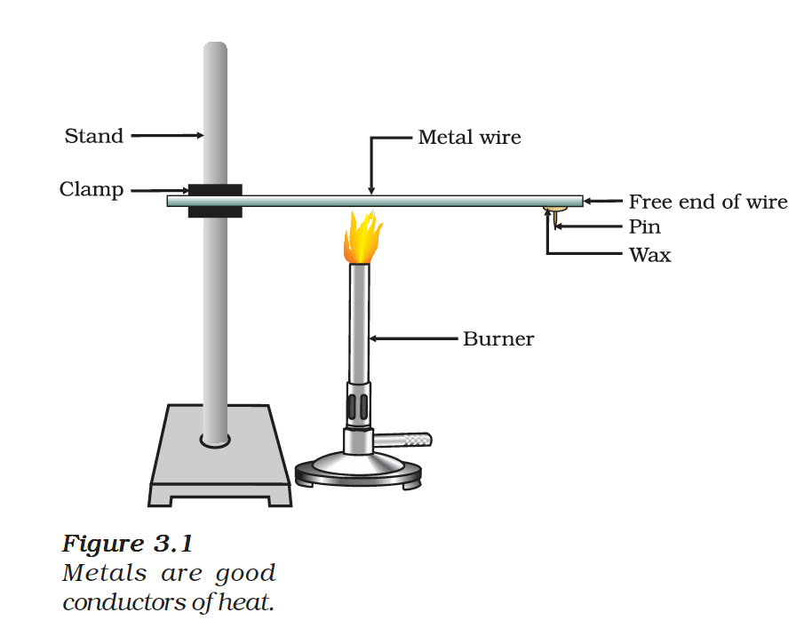
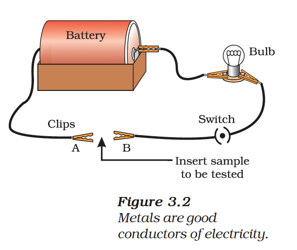

# Physical Properties of Metals

Metals have the following characteristic physical properties:

## 1. Metallic Lustre
Metals, in their pure state, have a shining surface. This property is called **metallic lustre**. Gold and copper have characteristic colours (yellow and reddish-brown respectively), while most other metals are silvery-grey.

## 2. Hardness
Metals are generally hard. The hardness varies from metal to metal. Alkali metals (Li, Na, K) are so soft that they can be cut with a knife.

## 3. Malleability
The ability of metals to be hammered into thin sheets is called **malleability**. Gold and silver are the most malleable metals. Aluminium and copper are also highly malleable.

## 4. Ductility
The ability of metals to be drawn into thin wires is called **ductility**. Gold is the most ductile metal — a wire of about 2 km length can be drawn from one gram of gold.

## 5. Conductivity
- **Thermal conductivity:** Metals are good conductors of heat. Silver and copper are the best conductors of heat. Lead and mercury are comparatively poor conductors.

*Figure 3.1: Metals are good conductors of heat*

- **Electrical conductivity:** Metals are good conductors of electricity. Silver is the best conductor, followed by copper, gold, and aluminium.

*Figure 3.2: Metals are good conductors of electricity*

## 6. Sonority
Metals that produce a sound on striking a hard surface are said to be **sonorous**. This is why school bells are made of metals.

## 7. Melting and Boiling Points
Most metals have high melting and boiling points. Exceptions include gallium and caesium, which have very low melting points.

## 8. State
All metals are solid at room temperature except **mercury** (liquid).

## 9. Density
Metals generally have high densities. Exceptions include lithium, sodium, and potassium which have low densities and float on water.

{: .note }
> **Exceptions to Physical Properties of Metals**
> - Mercury is a liquid metal at room temperature
> - Gallium and caesium melt if kept on the palm
> - Alkali metals (Li, Na, K) are soft enough to be cut with a knife
> - Lead and mercury are poor conductors of heat
> - Sodium and potassium have low densities
