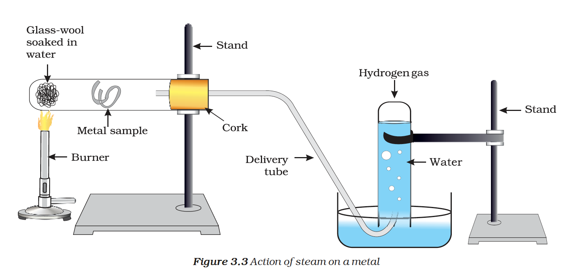

# Chemical Properties of Metals

## 1. Reaction with Oxygen (Burning in Air)

Almost all metals combine with oxygen to form metal oxides.

$$\text{Metal} + \text{Oxygen} \rightarrow \text{Metal oxide}$$

$$2Cu + O_2 \rightarrow 2CuO \quad \text{(black oxide)}$$

$$4Al + 3O_2 \rightarrow 2Al_2O_3$$

**Amphoteric oxides** (react with both acids and bases): $Al_2O_3$, $ZnO$

$$Al_2O_3 + 6HCl \rightarrow 2AlCl_3 + 3H_2O$$

$$Al_2O_3 + 2NaOH \rightarrow 2NaAlO_2 + H_2O$$

**Order of reactivity with oxygen:** $Na > Mg > Al > Zn > Fe > Cu > Ag > Au$

---

## 2. Reaction with Water

$$\text{Metal} + \text{Water} \rightarrow \text{Metal oxide/hydroxide} + \text{Hydrogen}$$

*Figure 3.3: Action of steam on a metal*

| Metal | Reacts with | Product |
| :--- | :--- | :--- |
| K, Na | Cold water (violently) | $KOH/NaOH + H_2$ |
| Ca | Cold water (less vigorous) | $Ca(OH)_2 + H_2$ |
| Mg | Hot water | $Mg(OH)_2 + H_2$ |
| Al, Zn, Fe | Steam only | Metal oxide + $H_2$ |
| Cu, Ag, Au | No reaction | --- |

---

## 3. Reaction with Dilute Acids

$$\text{Metal} + \text{Dilute acid} \rightarrow \text{Salt} + \text{Hydrogen gas}$$

$$Mg + 2HCl \rightarrow MgCl_2 + H_2$$

$$Zn + H_2SO_4 \rightarrow ZnSO_4 + H_2$$

**Reactivity order:** $Mg > Al > Zn > Fe$. Copper does not react with dilute $HCl$.

{: .note }
> **Important:** Hydrogen gas is NOT evolved when a metal reacts with **nitric acid** ($HNO_3$) because it is a strong oxidising agent. It oxidises $H_2$ to water.

---

## 4. Reaction with Salt Solutions (Displacement)

A more reactive metal displaces a less reactive metal from its salt solution.

$$Fe(s) + CuSO_4(aq) \rightarrow FeSO_4(aq) + Cu(s)$$

$$Cu(s) + 2AgNO_3(aq) \rightarrow Cu(NO_3)_2(aq) + 2Ag(s)$$

*Figure 3.4: Reaction of metals with salt solutions*
