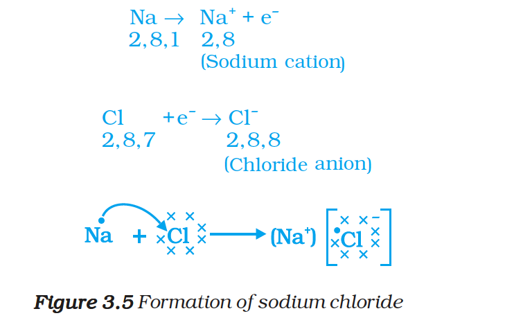
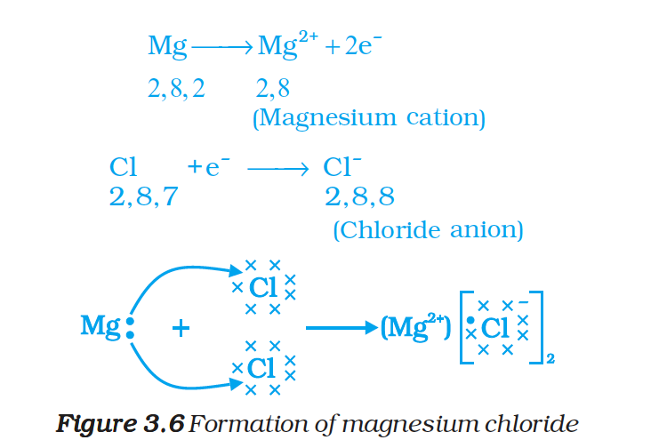

# How do Metals and Non-metals React? (Ionic Bonding)

Elements react to attain a completely filled valence shell (noble gas configuration).

## Formation of Sodium Chloride (NaCl)

$$Na \rightarrow Na^+ + e^- \quad (2,8,1 \rightarrow 2,8)$$

$$Cl + e^- \rightarrow Cl^- \quad (2,8,7 \rightarrow 2,8,8)$$

Sodium loses 1 electron to form $Na^+$ (cation). Chlorine gains 1 electron to form $Cl^-$ (anion). The oppositely charged ions attract each other by strong electrostatic forces to form **sodium chloride (NaCl)**.

*Figure 3.5: Formation of sodium chloride*

## Formation of Magnesium Chloride ($MgCl_2$)

$$Mg \rightarrow Mg^{2+} + 2e^- \quad (2,8,2 \rightarrow 2,8)$$

Each chlorine atom gains one electron. Since magnesium loses 2 electrons, two chlorine atoms are needed.

*Figure 3.6: Formation of magnesium chloride*

## Types of Bonds

| Property | Ionic Bond | Covalent Bond |
| :--- | :--- | :--- |
| Formation | Transfer of electrons | Sharing of electrons |
| Formed between | Metal and non-metal | Non-metal and non-metal |
| Example | NaCl, $MgCl_2$, CaO | $H_2O$, $CO_2$, $CH_4$ |

The compounds formed by the transfer of electrons from a metal to a non-metal are called **ionic compounds** or **electrovalent compounds**.
