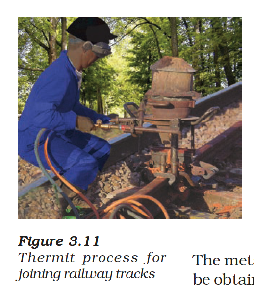
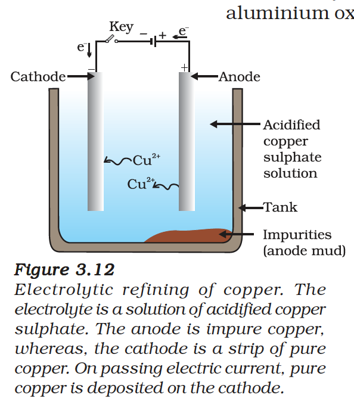

# Occurrence and Extraction of Metals

## Minerals and Ores
- **Minerals:** Elements or compounds that occur naturally in the earth's crust.
- **Ores:** Minerals from which a metal can be profitably extracted.

## Extraction Based on Reactivity

*Figure 3.9: Activity series and related metallurgy*

*Figure 3.10: Steps involved in the extraction of metals from ores*

### Metals of Low Reactivity (Cu, Ag, Au)
Reduced by heating alone:
$$2HgS(s) + 3O_2(g) \xrightarrow{Heat} 2HgO(s) + 2SO_2(g)$$
$$2HgO(s) \xrightarrow{Heat} 2Hg(l) + O_2(g)$$

### Metals of Medium Reactivity (Zn, Fe, Pb)
**Roasting** (sulphide ores heated in excess air):
$$2ZnS(s) + 3O_2(g) \xrightarrow{Heat} 2ZnO(s) + 2SO_2(g)$$

**Calcination** (carbonate ores heated in limited air):
$$ZnCO_3(s) \xrightarrow{Heat} ZnO(s) + CO_2(g)$$

Then reduced with carbon:
$$ZnO(s) + C(s) \rightarrow Zn(s) + CO(g)$$

**Thermit Reaction** (used to join railway tracks):
$$Fe_2O_3(s) + 2Al(s) \rightarrow 2Fe(l) + Al_2O_3(s) + \text{Heat}$$

*Figure 3.11: Thermit process for joining railway tracks*

### Metals of High Reactivity (K, Na, Ca, Mg, Al)
Obtained by **electrolytic reduction** of molten salts:

At cathode: $Na^+ + e^- \rightarrow Na$

At anode: $2Cl^- \rightarrow Cl_2 + 2e^-$

## Refining of Metals (Electrolytic Refining)
- **Anode:** Impure metal
- **Cathode:** Pure metal strip
- **Electrolyte:** Solution of metal salt

Pure metal deposits on cathode; impurities settle as **anode mud**.

*Figure 3.12: Electrolytic refining of copper*

---

# Corrosion

The process of slowly eating away of a metal due to the attack of atmospheric gases (mainly oxygen and moisture) on its surface.

$$4Fe + 3O_2 + 2xH_2O \rightarrow 2Fe_2O_3 \cdot xH_2O \quad (\text{rust})$$

*Figure 3.13: Investigating conditions under which iron rusts*

## Prevention of Corrosion
1. **Painting / Oiling / Greasing**
2. **Galvanisation** (coating with zinc)
3. **Electroplating** (coating with chromium/nickel)
4. **Alloying**

---

# Alloys

An **alloy** is a homogeneous mixture of two or more metals, or a metal and a non-metal.

| Alloy | Composition | Properties / Uses |
| :--- | :--- | :--- |
| Steel | Fe + C (0.05%) | Hard, strong; construction |
| Stainless Steel | Fe + Ni + Cr | Does not rust; utensils, cutlery |
| Brass | Cu + Zn | Decorative items, taps |
| Bronze | Cu + Sn | Statues, medals, coins |
| Solder | Pb + Sn | Low melting point; welding wires |
| Amalgam | Metal + Hg | Dental fillings |

{: .note }
> **Gold Purity:**
> Pure gold is 24 carat. Ornament gold is usually 22 carat (22 parts gold + 2 parts copper/silver) to make it hard enough.
> If a piece of iron is coated with zinc, it is called **galvanisation**. Zinc provides a protective layer and prevents the iron from rusting.
