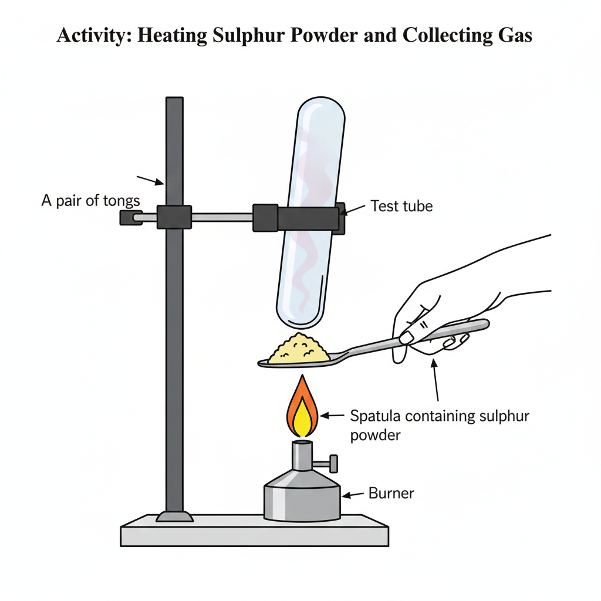
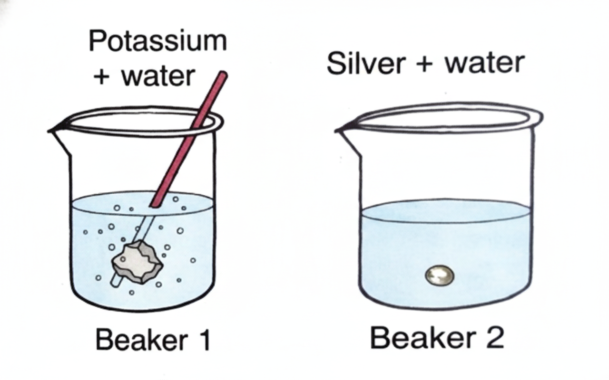
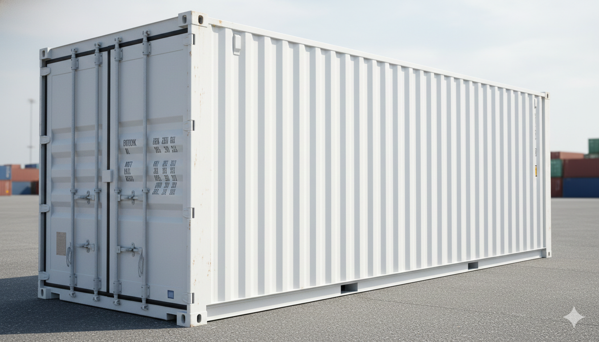

# Assessment Exercise — Questions

Competency Focused (Objective) Questions

## Multiple Choice Questions

<h4 style="text-transform: none;">1. An element A is soft and can be cut with a knife. This is very reactive to air and cannot be kept open in air. It reacts vigorously with water. Identify the element from the following.</h4>

(a) Mg
(b) Na
(c) P
(d) Ca

---

<h4 style="text-transform: none;">2. Which one of the following four metals would be displaced from the solution of its salts by other three metals?</h4>

(a) Mg
(b) Ag
(c) Zn
(d) Cu

---

<h4 style="text-transform: none;">3. When a non-metal is allowed to react with water,</h4>

(a) $CO_2$ gas is formed.
(b) $H_2$ gas is formed.
(c) product formed depends on the temperature.
(d) no products are formed.

---

<h4 style="text-transform: none;">4. During electrolytic refining of zinc, it gets</h4>

(a) deposited on cathode
(b) deposited on anode
(c) deposited on cathode as well as anode
(d) remains in the solution

---

<h4 style="text-transform: none;">5. Which of the following can undergo a chemical reaction?</h4>

(a) $MgSO_4$ + Fe
(b) $ZnSO_4$ + Fe
(c) $MgSO_4$ + Pb
(d) $CuSO_4$ + Fe

---

<h4 style="text-transform: none;">6. Pratyush took sulphur powder on a spatula and heated it. He collected the gas evolved by inverting a test tube over it. The gas evolved is</h4>

(a) $O_2$
(b) $SO_2$
(c) $H_2S$
(d) $H_2$ and $SO_2$

---

<h4 style="text-transform: none;">7. A student drops pieces of potassium and silver in beakers containing water. The image shows the reaction.</h4>

Competency Based Que.

**What are the products formed in each beaker?**

(a) Beaker 1: $K_2O$ and $H_2$; Beaker 2: No reaction takes place
(b) Beaker 1: KOH and $H_2$; Beaker 2: $Ag_2O$ and $H_2$
(c) Beaker 1: $K_2O$ and $H_2O$; Beaker 2: AgO and $H_2O$
(d) Beaker 1: KOH and $H_2$; Beaker 2: No reaction takes place

---

<h4 style="text-transform: none;">8. Containers used for transportation of goods over long distances are made of steel. Which property of steel is mainly used to make these containers?</h4>

Competency Based Que.

(a) Its ductility
(b) Its malleability
(c) Its metallic lustre
(d) Its electrical conductivity

---

## Assertion-Reason Questions

<strong>Direction (Q. 9-11):</strong> In each of the following questions, a statement of Assertion (A) is given with a corresponding statement of Reason (R). Mark the correct answer as: 
(a) Both A and R are true and R is the correct explanation of A. 
(b) Both A and R are true, but R is not the correct explanation of A. 
(c) A is true, but R is false. 
(d) A is false, but R is true.

<h4 style="text-transform: none;">9. Assertion (A): Hydrogen is not a metal but it has been assigned a place in the reactivity series of metals.</h4>

**Reason (R):** Hydrogen has a tendency to lose electron and forms a positive ion $H^+$.

---

<h4 style="text-transform: none;">10. Assertion (A): When lead vessel is kept in a solution of $ZnSO_4$, lead will remain unaffected.</h4>

**Reason (R):** Lead is less reactive than zinc.

---

<h4 style="text-transform: none;">11. Assertion (A): Zinc becomes dull in moist air.</h4>

**Reason (R):** Zinc is coated by a thin film of its basic carbonate in moist air.

---

## Case Based Questions

<h4 style="text-transform: none;">12. Read the passage and answer the questions that follow:</h4>

Generally, the metals form basic oxides whereas non-metals form acidic oxides. Only a few metals form hydrides with hydrogen and these hydrides are unstable while the non-metals form stable hydrides. Metal atoms can donate electrons easily hence they act as reducing agents and the non-metals can accept electrons readily, therefore they act as oxidising agents. Thermal conductivity is the ability of an element to allow heat to pass through it. Generally, all metals are good conductors of heat except lead and mercury.

| Element | Symbol | Thermal conductivity (W/cm-K) |
| :--- | :---: | :---: |
| Lead | Pb | 0.34 |
| Copper | Cu | 4.01 |
| Aluminium | Al | 2.37 |
| Iron | Fe | 0.802 |
| Selenium | Se | 0.0204 |
| Sulphur | S | 0.00269 |
| Phosphorus | P | 0.00235 |

(i) Name a metal which is a best conductor of heat and name the electrolyte used in refining of copper.

(ii) Which reducing agent can be used in the extraction of metals placed at the top of the reactivity series?

(iii) Which metal forms both acidic oxide and basic oxide? Classify $Na_2O$, $Al_2O_3$ and $SO_3$ as acidic, basic or amphoteric oxide.

**Or**

(iii) An element forms an oxide $A_2O_3$ which is acidic in nature. Identify whether A is metal or non-metal.

---

## Very Short Answer Type Questions

<h4 style="text-transform: none;">13. Which of the following elements is a metal? Explain: $_{7}X$, $_{13}Y$, $_{9}Z$</h4>

---

<h4 style="text-transform: none;">14. (i) Name one metal and one non-metal which are obtained on a large scale from sea water. (ii) Name the metal which is liquid at room temperature.</h4>

---

<h4 style="text-transform: none;">15. Write the chemical equation for the reaction of hot aluminium with steam.</h4>

---

## Short Answer Type Questions

<h4 style="text-transform: none;">16. A student was given samples of $MgSO_4$, $ZnSO_4$, $FeSO_4$ and $CuSO_4$ solutions. She added iron filings to each solution. In which case would she observe a colour change? Explain with a balanced chemical equation.</h4>

---

<h4 style="text-transform: none;">17. Explain how corrosion of iron takes place. How can it be prevented?</h4>

---

<h4 style="text-transform: none;">18. An element X is placed in the middle of the activity series. Write the steps involved in extracting X from its sulphide ore.</h4>

---

## Long Answer Type Questions

<h4 style="text-transform: none;">19. (i) Give differences between roasting and calcination with suitable examples. (ii) Explain how the following metals are obtained from their compounds by the reduction process: (a) Metal M which is in the middle of the reactivity series. (b) Metal N which is high up in the reactivity series.</h4>

---

<h4 style="text-transform: none;">20. In what forms are metals found in nature? With the help of examples, explain how metals react with oxygen, water and dilute acids. Also, write chemical equations for reactions.</h4>

---

[View Solutions](12-assessment-exercise-solutions.html)

