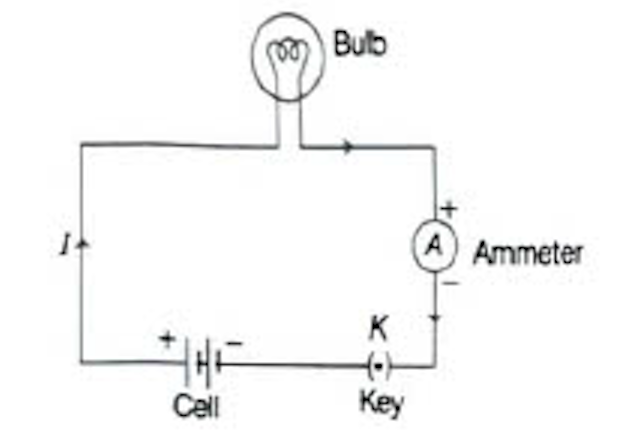

# 11.3 Electric Circuit

A closed and continuous path through which electric current flows is known as electric circuit.

It consists of various components like:
- a source of current (say a cell or battery)
- a load (say a bulb or any other appliance)
- a switch/key (to open or close a circuit)
- a fuse

These all are connected through connecting wires and these wires are generally made of copper.

---

## Circuit Diagram

It is a schematic diagram which represents the relative positions and connections of various circuit components represented by their symbols.

A schematic diagram of an electric circuit having cell, electric bulb, ammeter and plug key

---

## Symbols used in Electric Circuits

| Circuit Components | Descriptions | Symbols |
|---|---|---|
| Wires crossing without joining (or touching) | — | ─┼─ |
| Electric bulb | Circuit components | 💡 |
| Resistor or Resistance | Controls current flowing through the circuit | ─∿∿∿─ |
| Rheostat or Variable resistance | Provides variable resistance or potential divider | ─∿∿⟶ |
| Ammeter | Measures current flowing through circuit | ─(A)─ |
| Voltmeter | Measures potential difference between two points | ─(V)─ |
| Fuse | Safety device | ─○─○─ |
| Galvanometer | Detects the presence of electric current | ─(G)─ |
| An electric cell | Provides constant potential difference between two points | ─\|├─ |
| Battery | Combination of two or more cells connected in series | ─\|\|├├─ |
| Switch or Plug key (open) | Open the circuit | ─○/ ─ |
| Switch or Plug key (closed) | Close the circuit | ─○─○─ |
| Wire joints | — | ─●─ |

