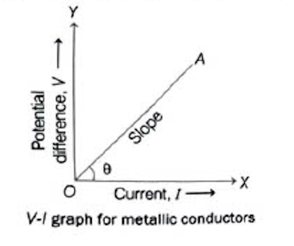

# 11.4 Ohm's Law

This law was given by a German Physicist <b>Georg Simon Ohm</b> (1787-1854) in the year 1827. It gives a <b>relationship between current $I$, flowing in a metallic wire and potential difference $V$</b>, across its terminals.

<b>According to this law</b>, the electric current flowing through a conductor is directly proportional to the potential difference applied across its ends, providing the physical conditions (such as temperature) remain unchanged.

If $V$ is the potential difference applied across the ends of a conductor through which current $I$ flows, then according to Ohm's law,

$V \propto I \quad \text{[at constant temperature]}$
  
or
  
$\displaystyle V = IR \quad \text{or} \quad I = \frac{V}{R}$

where, $R$ is the constant of proportionality is called <b>resistance</b> of the conductor at a given temperature.

<b>Note:</b> The conductors which obey Ohm's law are called <b>ohmic conductors</b>, while the conductors which do not obey Ohm's law are called <b>non-ohmic conductors</b>.

---

## Graph

The graph between the potential difference $V$ and the corresponding current $I$ is found to be a straight line passing through the origin for ohmic (metallic) conductors.

V-I graph for metallic conductors

