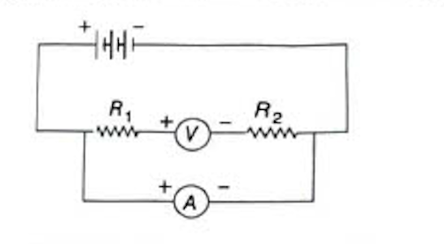

# 11.5 Resistance

It is that property of a conductor by virtue of which it opposes/resists the flow of charges/flow of current through it.

Its SI unit is <b>ohm</b> and is represented by the Greek letter $\Omega$.

<b>According to Ohm's law,</b>

Resistance of a conductor is given by $\displaystyle R = \frac{V}{I}$.

From the above formula, it is clear that <b>current is inversely proportional to resistance</b>. If resistance is doubled, then current gets halved and if resistance is halved, then current gets doubled.

It is said to be <b>1 ohm</b>, if a potential difference of 1 volt across the ends of the conductor makes a current of 1 ampere to flow through it.

$\displaystyle 1 \text{ ohm} = \frac{1 \text{ volt}}{1 \text{ ampere}}$
  
$\displaystyle 1\Omega = \frac{1 \text{ V}}{1 \text{ A}} = 1 \text{ VA}^{-1}$

---

## Some Important Terms Related to Resistance

Some important terms related to resistance are as follows:

<b>■ Resistor</b> — A component in an electric circuit which offers resistance to the flow of electrons constituting electric current is known as resistor. These are used to make those electrical devices, where high resistance is required. It reduces current in a circuit, e.g. alloys like nichrome, manganin and constantan.

<b>■ Rheostat/Variable resistance</b> — It is a variable resistor, which is used to control the flow of electric current by manually increasing or decreasing the resistance.

<b>■ Good conductor</b> — A material which offers low resistance to the flow of electrons or electric current in an electric circuit is known as a good conductor, e.g. silver, copper, aluminium. Amongst these, <b>silver is the best conductor of electricity</b>.

<b>■ Poor conductor</b> — A material which offers higher resistance than conductors to the flow of electrons or electric current in an electric circuit is known as poor conductor, e.g. mercury, lead, stainless steel, alloys of iron and chromium.

<b>■ Insulator</b> — A material which offers very high resistance to the flow of electrons or electric current in an electric circuit is known as insulator, e.g. rubber, dry wood and plastic. Electric current does not flow through them.

---

## Factors on which the Resistance of a Conductor Depends

The electrical resistance of a conductor depends on the following factors:

### (i) Length of the conductor

The resistance of a conductor $R$ is directly proportional to its length $l$.

$R \propto l \quad ...(i)$

Since, the <b>resistance of a wire is directly proportional to its length</b>, i.e. when the length of a wire is doubled/halved, then its resistance also gets doubled/halved.

### (ii) Area of cross-section of the conductor

The resistance of a conductor $R$ is inversely proportional to its area of cross-section $A$.

$\displaystyle R \propto \frac{1}{A} \quad ...(ii)$

Since, the <b>resistance of a wire is inversely proportional to its area of cross-section</b> i.e., when the area of cross-section of wire is doubled, then its resistance gets halved and if area of cross-section of wire is halved, then its resistance will get doubled.

<b>Note:</b> When a conductor is stretched (increased its length), then its area of cross-section decreases accordingly but the volume (i.e. area × length) of the conductor remains same.

### (iii) Nature of the material of the conductor

The resistance of a conductor depends on the nature of the material of which it is made. Some materials have low resistance, whereas others have high resistance.

Therefore, from Eqs. (i) and (ii), we can write

$\displaystyle R \propto \frac{l}{A} \quad \text{or} \quad R = \rho \frac{l}{A}$

where, $\rho$ is the constant of proportionality and it is called <b>electric resistivity</b> or <b>specific resistance</b> of the material of the conductor.

---

## Resistivity

The resistance offered by a wire of unit length and unit cross-sectional area is called resistivity. Its SI unit is <b>ohm-metre</b>.

<b>The resistivity of a material does not depend on its length or thickness but depends on the nature of the substance and temperature.</b>

<ul>
<li><b>Insulators</b> such as glass, rubber, ebonite, etc., have a <b>very high resistivity</b> ($10^{12}$ to $10^{17}$ Ω-m), while</li>
<li><b>Conductors</b> such as silver, copper, etc., have a <b>very low resistivity</b> ($10^{-8}$ to $10^{-6}$ Ω-m).</li>
<li><b>Alloys</b> have <b>higher resistivity</b> than that of their constituent metals. They do not oxidise easily at high temperatures, this is why they are used to make heating elements of devices such as electric iron, heaters, etc.</li>
</ul>

<b>Note:</b> Tungsten is almost used exclusively for filaments of electric bulbs, whereas copper and aluminium are generally used for electrical transmission lines.

---

## Solved Examples

Example 6. The potential difference between the terminals of an electric heater is 75 V when it draws a current of 5 A from the source. What current will the heater draw, if the potential difference is increased to 150 V?
  
<b>Sol.</b> Given, potential difference, $V = 75$ V
  
Current, $I = 5$ A
  
We know that, $\displaystyle R = \frac{V}{I} \Rightarrow R = \frac{75}{5} = 15\Omega$
  
When potential difference is increased to 150 V, then the current,
  
$\displaystyle I' = \frac{V}{R} = \frac{150}{15} = $ <b>10 A</b>

Example 7. A wire of given material having length $l$ and area of cross-section $A$ has a resistance of $10\Omega$. What would be the resistance of another wire of the same material having length $l/4$ and area of cross-section $2.5A$?
  
<b>Sol.</b> For first wire, length $= l$, area of cross-section $= A$ and resistance, $R_1 = 10\Omega$
  
$\displaystyle R_1 = \frac{\rho l}{A} = 10\Omega$
  
$\displaystyle \Rightarrow \rho = \frac{10A}{l} \quad ...(i)$
  
For second wire, length $= l/4$, area of cross-section $= 2.5A$
  
$\displaystyle \therefore \text{Resistance, } R_2 = \rho \frac{l/4}{2.5A} = \frac{10A}{l} \cdot \frac{l}{4 \times 2.5A} \quad \text{[from Eq. (i)]}$
  
$= $ <b>1 Ω</b>

Example 8. Resistance of a metal wire of length 2 m is $30\Omega$ at temperature $25°$C. If the diameter of the wire is 0.6 mm, then what will be the resistivity of the metal at that temperature?
  
<b>Sol.</b> Given, length of wire, $l = 2$ m
  
Resistance, $R = 30\Omega$
  
Temperature, $T = 25°$C
  
Diameter of wire, $d = 0.6 \text{ mm} = 6 \times 10^{-4}$ m
  
Resistivity of the wire, $\rho = ?$
  
We know that, $\displaystyle \rho = \frac{RA}{l} = \frac{R\pi d^2}{4l}$ $\quad \left[\because A = \frac{\pi d^2}{4}\right]$
  
$\displaystyle = \frac{30 \times \pi \times (6 \times 10^{-4})^2}{4 \times 2}$
  
$= $ <b>$4.24 \times 10^{-6}$ Ω-m</b>

---

Try These 11.2
  
<b>1.</b> A student made an electric circuit as shown below
  

  
Is there any mistake in this circuit? If any, then correct it.
  
<b>2.</b> Keeping the potential difference constant, the resistance of a circuit is halved. Then, how much does the current changes?
  
<b>3.</b> Fill in the blanks.
 
&nbsp;&nbsp;&nbsp;&nbsp;(i) The resistance of conducting wire is ............ proportional to its length.
 
&nbsp;&nbsp;&nbsp;&nbsp;(ii) When the length of a conductor is increased to double, then its resistivity ............ .
  
<b>4.</b> What will happen to resistivity, if we will change the shape of the resistor?
  
<b>5.</b> If we draw a graph to show how the resistivity of the wire changes with the length of the wire, how the graph will look like?

