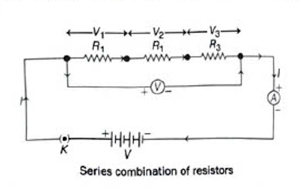
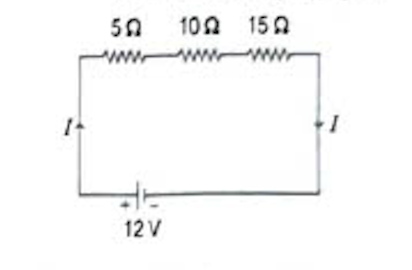
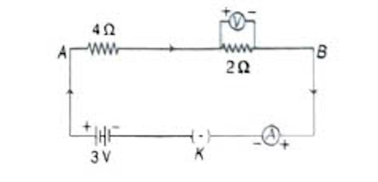

# 11.6 Resistance of a System of Resistors

Two or more resistors can be connected with each other by different combinational methods in order to achieve the desired equivalent resistance in a particular circuit.

There are two methods of joining the resistors together which are as given below.

---

## Resistors in Series

When <b>two or more resistors are connected end to end to each other</b>, then they are said to be <b>connected in series</b>. The following figure shows the connection of resistors in series.

Series combination of resistors

An applied potential $V$ produces current $I$ in the resistors $R_1$, $R_2$ and $R_3$ causing a potential drop $V_1$, $V_2$ and $V_3$ respectively, through each resistor.

<b>Total potential,</b> $V = V_1 + V_2 + V_3$

<b>By Ohm's law,</b> $V_1 = IR_1$, $V_2 = IR_2$ and $V_3 = IR_3$

Thus, $V = V_1 + V_2 + V_3 = IR_1 + IR_2 + IR_3$

$V = I(R_1 + R_2 + R_3)$

If $R$ is the equivalent resistance and $V = IR$.

Hence, $IR = I(R_1 + R_2 + R_3) \Rightarrow R = R_1 + R_2 + R_3$

<b>Important points regarding series combination of resistors:</b>
<ul>
<li>■ The equivalent resistance is equal to the sum of all individual resistances.</li>
<li>■ The equivalent resistance is thus greater than the resistance of either resistor. This is also known as <b>maximum effective resistance</b>.</li>
<li>■ The current through each resistor is the same.</li>
<li>■ The potential difference across each resistor is different.</li>
</ul>

### Disadvantages of Series Combination

(i) In this combination, if any of the component fails to work, then the circuit will break and none of the components will work.

(ii) It is not possible to connect a bulb and a heater in series simultaneously, because they need different values of current to operate properly.

---

## Resistors in Parallel

When <b>two or more resistors are connected simultaneously between two points</b> to each other, then they are said to be <b>connected in parallel combination</b>.

The following figure shows the connection of resistors in parallel:

<!-- Image placeholder for parallel circuit diagram -->

An applied potential difference $V$ produces current $I_1$ in $R_1$, $I_2$ in $R_2$ and $I_3$ in $R_3$.

<b>Total current,</b> $I = I_1 + I_2 + I_3$ ... (i)

<b>By Ohm's law,</b> $\displaystyle I_1 = \frac{V}{R_1}$, $\displaystyle I_2 = \frac{V}{R_2}$ and $\displaystyle I_3 = \frac{V}{R_3}$

If $R$ is the equivalent resistance, then $\displaystyle I = \frac{V}{R}$

$\displaystyle \frac{V}{R_p} = \frac{V}{R_1} + \frac{V}{R_2} + \frac{V}{R_3}$ [from Eq. (i)]
  
$\displaystyle \Rightarrow \frac{V}{R_p} = V\left(\frac{1}{R_1} + \frac{1}{R_2} + \frac{1}{R_3}\right)$
  
$\displaystyle \Rightarrow \frac{1}{R_p} = \frac{1}{R_1} + \frac{1}{R_2} + \frac{1}{R_3}$

<b>Important points regarding parallel combination of resistors:</b>
<ul>
<li>■ The reciprocal of equivalent resistance is equal to the sum of the reciprocal of individual resistances.</li>
<li>■ The equivalent resistance is less than the resistance of either resistor. This is also known as <b>minimum effective resistance</b>.</li>
<li>■ The current from the source is greater than the current through either resistor.</li>
<li>■ The potential difference across each resistor is same.</li>
</ul>

---

## Applications of Parallel Combination in Daily Life

- <b>Parallel combination of resistances is highly useful</b> in circuits used in daily life, as the circuits used have components of different components requiring different amounts of current.

- <b>Parallel combination in a circuit divides the current</b> among the components (electrical gadgets), so that they can have necessary amount of current to operate properly.

This is the reason of connecting electrical appliances in parallel combination in household circuit.

---

## Solved Examples - Series Combination

Example 9. Three resistors of $5\Omega$, $10\Omega$ and $15\Omega$ are connected in series with a 12 V power supply. Calculate their combined resistance, the current that flows in the circuit and in each resistor and the potential difference across each resistor.
  
<b>Sol.</b> Given, $R_1 = 5\Omega$, $R_2 = 10\Omega$, $R_3 = 15\Omega$, $V = 12$ V
  
$R = ?$, $I = ?$ and $V_1, V_2, V_3 = ?$
  

  
According to question, three resistors are connected in series combination, then equivalent resistance,
  
$R = R_1 + R_2 + R_3 = 5 + 10 + 15 = $ <b>30 Ω</b>
  
$\therefore$ The current flowing through the circuit ($I$)
  
$\displaystyle = \frac{\text{Potential of power supply } (V)}{\text{Total resistance of the circuit } (R)} = \frac{12}{30} = \frac{2}{5} = $ <b>0.4 A</b>
  
In series combination, the current flowing through each resistor is equal to total current flowing through the circuit. Therefore, current flowing through each resistor is <b>0.4 A</b>.
  
$\therefore$ Potential difference across first resistor,
  
$V_1 = IR_1 = 0.4 \times 5 = $ <b>2 V</b>
  
Potential difference across second resistor,
  
$V_2 = IR_2 = 0.4 \times 10 = $ <b>4 V</b>
  
and potential difference across third resistor,
  
$V_3 = IR_3 = 0.4 \times 15 = $ <b>6 V</b>

Example 10. Study the following electric circuit. Find the readings of (i) the ammeter and (ii) the voltmeter.
  

  
<b>Sol.</b> In the given circuit, the resistance of $4\Omega$ and bulb resistance of $2\Omega$ are connected in series, so equivalent resistance of the circuit,
  
$R = R_1 + R_2 = 4\Omega + 2\Omega = 6\Omega$
  
<b>(i)</b> The ammeter reading (current in the circuit):
  
$\displaystyle I = \frac{V}{R} = \frac{3}{6} = $ <b>0.5 A</b>
  
<b>(ii)</b> The voltmeter is connected across the $4\Omega$ resistor.
  
$V = IR = 0.5 \times 4 = $ <b>2 V</b>

---

## Solved Examples - Parallel Combination

Example 11. Two $40\Omega$ resistors and a $20\Omega$ resistor are all connected in parallel with a 12 V power supply. Calculate their effective resistance and the current flowing through the supply.
  
<b>Sol.</b> Given, $R_1 = 40\Omega$, $R_2 = 40\Omega$, $R_3 = 20\Omega$, $V = 12$ V, $R = ?$, $I, I_1, I_2, I_3 = ?$
  
<!-- Image placeholder for Example 11 circuit -->
  
According to circuit, the three resistors are connected in parallel combination, then effective resistance,
  
$\displaystyle \frac{1}{R} = \frac{1}{R_1} + \frac{1}{R_2} + \frac{1}{R_3} = \frac{1}{40} + \frac{1}{40} + \frac{1}{20}$
  
$\displaystyle = \frac{1+1+2}{40} = \frac{4}{40} = \frac{1}{10}$
  
$\Rightarrow R = 10\Omega$
  
So, the three resistors together have an effective resistance of <b>10 Ω</b>. Each resistor has a potential difference of 12 V across it.
  
We know that,
  
$\displaystyle \text{Current } (I) = \frac{\text{Potential difference } (V)}{\text{Resistance } (R)}$
  
We get the following results for the current:
  
Current through $40\Omega$ resistor, $\displaystyle I_1 = \frac{12}{40} = 0.3$ A
  
Also, $I_2 = 0.3$ A
  
Current through $20\Omega$ resistor, $\displaystyle I_3 = \frac{12}{20} = 0.6$ A
  
$\therefore$ Current, $I = I_1 + I_2 + I_3 = 0.3 + 0.3 + 0.6 = $ <b>1.2 A</b>

---

## Problem Based on Combination of Resistors (Series and Parallel Both)

In this combination, circuit has some resistances connected in <b>series combination</b> and some in <b>parallel combination</b>. This type of combination is also called <b>complex circuit</b>.

The following are some examples which will help you to solve questions on combination of resistances in series and parallel both.

Example 12. In the given figure, $R_1 = 5\Omega$, $R_2 = 10\Omega$, $R_3 = 15\Omega$, $R_4 = 20\Omega$, $R_5 = 25\Omega$ and a 15V battery is connected to the arrangement. Calculate
  
(i) the total resistance in the circuit, and
 (ii) the total current flowing in the circuit.
  
<!-- Image placeholder for Example 12 circuit -->
  
<b>Sol.</b> Resistors $R_1$ and $R_2$ are in parallel.
  
So, $\displaystyle \frac{1}{R'} = \frac{1}{R_1} + \frac{1}{R_2} = \frac{1}{5} + \frac{1}{10} \Rightarrow R' = \frac{10}{3}\Omega$
  
Similarly, $R_3$, $R_4$ and $R_5$ are in parallel.
  
$\displaystyle \Rightarrow \frac{1}{R''} = \frac{1}{R_3} + \frac{1}{R_4} + \frac{1}{R_5} = \frac{1}{15} + \frac{1}{20} + \frac{1}{25}$
  
$\displaystyle \frac{1}{R''} = \frac{20 + 15 + 12}{300} = \frac{47}{300} \Rightarrow R'' = \frac{300}{47}\Omega$
  
Thus, the total resistance,
  
$\displaystyle R = R' + R'' = \frac{10}{3} + \frac{300}{47} = 3.33 + 6.38 = $ <b>9.71 Ω</b>
  
The total current, $\displaystyle I = \frac{V}{R} = \frac{15}{9.71} = $ <b>1.54 A</b>

Example 13. Consider the circuit diagram as given below. If $R_1 = R_2 = R_3 = R_4 = R_5 = 3\Omega$, then find the equivalent resistance of the circuit.
  
<!-- Image placeholder for Example 13 circuit -->
  
<b>Sol.</b> From the combination, it can be observed that $R_2$ and $R_3$ are in series order.
  
As current through $R_2$ and $R_3$ is same, so their equivalent resistance, $R' = R_2 + R_3 = 3\Omega + 3\Omega = 6\Omega$
  
Now, the given circuit can be redrawn as shown below:
  
<!-- Image placeholder for redrawn circuit -->
  
Now, it can be seen that, $R_4$ and $R'$ are in parallel combination. As, currents through $R_4$ and $R'$ are different. So, their equivalent resistance can be calculated as below
  
$\displaystyle \frac{1}{R''} = \frac{1}{R'} + \frac{1}{R_4} = \frac{1}{6} + \frac{1}{3} = \frac{1+2}{6} = \frac{3}{6} = \frac{1}{2}$
  
$\therefore R'' = 2\Omega$
  
Now, the given circuit can be redrawn as shown below:
  
<!-- Image placeholder for final circuit -->
  
Now, it is clear from the above circuit that, all the resistances $R_5$, $R''$ and $R_1$ are in series combination. As, current through $R_1$, $R''$ and $R_5$ is same.
  
$\therefore$ Equivalent resistance of the circuit,
  
$R = R_5 + R'' + R_1 = 3\Omega + 2\Omega + 3\Omega = $ <b>8 Ω</b>

Example 14. Find the equivalent resistance of the following circuit. Also, find the current and potential at each resistor.
  
<!-- Image placeholder for Example 14 circuit with R1=1Ω, R2=2Ω, R3=2Ω, R4=3Ω, R5=2Ω at 9V -->
  
<b>Sol.</b> In the given circuit, $R_2$, $R_3$ and $R_4$ are in parallel combination. As, currents through $R_2$, $R_3$ and $R_4$ are different. So, their equivalent resistance $R'$,
  
$\displaystyle \frac{1}{R'} = \frac{1}{R_2} + \frac{1}{R_3} + \frac{1}{R_4} = \frac{1}{1} + \frac{1}{2} + \frac{1}{3} = \frac{6+3+2}{6} = \frac{11}{6}$
  
$\displaystyle \Rightarrow R' = \frac{6}{11}\Omega$
  
Now, the given circuit can be redrawn as shown below:
  
<!-- Image placeholder for redrawn circuit -->
  
Now, $R_1$, $R'$ and $R_5$ are in series combination. As, current through $R_1$, $R'$ and $R_5$ is same.
  
So, equivalent resistance of the whole circuit,
  
$\displaystyle R = R_1 + R' + R_5 = 2 + \frac{6}{11} + 2 = \frac{22+6+22}{11} = \frac{50}{11}\Omega$
  
Now, total current flowing through the circuit,
  
$\displaystyle I = \frac{V}{R} = \frac{9}{\frac{50}{11}} = \frac{99}{50} \approx $ <b>2 A</b>
  
Current through $R_1$ and $R_5$ will be same as these are in series combination and will be equal to the total current flowing through the circuit.
  
$\therefore I = I_1 = I_5 = 2$ A
  
Potential drop at $R_1$, $V_1 = I_1 R_1 = 2 \times 2 = 4$ V
  
Potential drop at $R_5$, $V_5 = I_5 R_5 = 2 \times 2 = 4$ V
  
Now, potential drop at $R'$, $V'$ can be calculated as
  
$V = V_1 + V_5 + V'$
  
$\Rightarrow 9 = 4 + 4 + V'$
  
$\Rightarrow V' = 1$ V
  
As $R_2$, $R_3$ and $R_4$ are in parallel combination, so potential drop at all resistances will be same as 1 V.
  
$V_2 = V_3 = V_4 = V' = 1$ V
  
Current through $R_2$, $\displaystyle I_2 = \frac{V_2}{R_2} = \frac{1}{1} = $ <b>1 A</b>
  
Similarly, $\displaystyle I_3 = \frac{V_3}{R_3} = \frac{1}{2} = $ <b>0.5 A</b>
  
and $\displaystyle I_4 = \frac{V_4}{R_4} = \frac{1}{3} = $ <b>0.33 A</b>

---

Try These 11.3
  
<b>1.</b> Mark the True and False for the following statements
  
&nbsp;&nbsp;&nbsp;&nbsp;(i) In parallel combination of resistors, the equivalent resistance is less than the resistance of either resistor.
  
&nbsp;&nbsp;&nbsp;&nbsp;(ii) The potential difference across each resistor in parallel combination is same.
  
<b>2.</b> Which type of combination of electric devices is preferred in our home?
  
<b>3.</b> If different resistors have same value of electric potential across them, in which way are they connected to each other?
  
<b>4.</b> In the circuit shown below, calculate the net resistance of the circuit. <b>[Ans. 12.5 Ω]</b>
  
<!-- Image placeholder for Try These Q4 circuit: 10Ω, 15Ω in parallel with 20Ω, 5Ω in series, 45V supply -->

