# NCERT Exercises - Electricity

#### Q.12 Draw a schematic diagram of a circuit consisting of a battery of three cells of 2 V each, a 5 Ω resistor, a 8 Ω resistor and a 12 Ω resistor, and a plug key, all connected in series.

**Sol.** 

  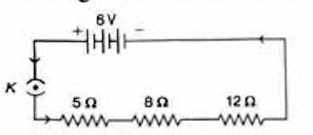

Equivalent resistance: $$R = R_1 + R_2 + R_3 = 5 + 8 + 12 = 25\Omega$$

Current in each resistor: $$I = \frac{V}{R} = \frac{6}{25} = 0.24\text{ A}$$

**Ammeter reading = 0.24 A**

---

#### Q.13 Redraw the above circuit, putting in an ammeter to measure the current through the resistors and a voltmeter to measure the potential difference across the 12 Ω resistor. What would be the readings in ammeter and voltmeter?

**Sol.** 

  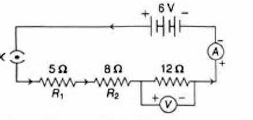

Equivalent resistance: $$R = 5 + 8 + 12 = 25\Omega$$

Current: $$I = \frac{V}{R} = \frac{6}{25} = 0.24\text{ A}$$

**Ammeter reading = 0.24 A**

Potential difference across 12Ω: $$V = IR = 0.24 \times 12 = 2.88\text{ V}$$

**Voltmeter reading = 2.88 V**

---

#### q.17 How can three resistors of resistances 2Ω, 3Ω and 6Ω be connected to give a total resistance of: (i) 4Ω (ii) 1Ω

**Sol.** 

**(i) To get 4Ω:**

Connect 3Ω and 6Ω in parallel, then connect this combination in series with 2Ω.

  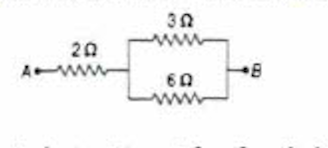

Parallel combination of 3Ω and 6Ω:
$$R_p = \frac{1}{\frac{1}{3} + \frac{1}{6}} = \frac{1}{\frac{3}{6}} = 2\Omega$$

Total resistance in series:
$$R_{total} = 2\Omega + 2\Omega = 4\Omega$$

**(ii) To get 1Ω:**

Connect all three resistors (2Ω, 3Ω, and 6Ω) in parallel.

  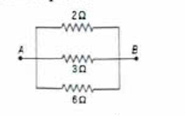

$$\frac{1}{R} = \frac{1}{2} + \frac{1}{3} + \frac{1}{6} = \frac{3 + 2 + 1}{6} = \frac{6}{6} = 1$$

$$\therefore R = 1\Omega$$

---

#### Q.18 What is (i) the highest and (ii) the lowest total resistance which can be secured by combinations of four coils of resistances 4Ω, 8Ω, 12Ω and 24Ω?

**Sol.** 

**(i) Highest resistance** - when resistors are connected in series:

$$R_{max} = 4 + 8 + 12 + 24 = 48\Omega$$

**(ii) Lowest resistance** - when resistors are connected in parallel:

  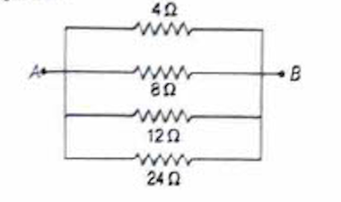

$$R_{min} = \frac{1}{\frac{1}{4} + \frac{1}{8} + \frac{1}{12} + \frac{1}{24}} = \frac{1}{\frac{6+3+2+1}{24}} = \frac{24}{12} = 2\Omega$$

---

#### Q.19 Why does the cord of an electric heater not glow while heating element does?

**Sol.** The cord of an electric heater has **lesser resistance** than its heating element, so more heat is produced in the heating element than the cord and it glows.

---

#### Q.20 Compute the heat generated while transferring 96000 C of charge in 1 h through a potential difference of 50 V.

**Sol.** Given: charge, q = 96000 C; time, t = 1 h = 3600 s; potential difference, V = 50 V

Heat generated: $$H = VIt = \frac{Vq t}{t} = Vq$$

$$= 50 \times 96000 = 4800000\text{ J} = 4800\text{ kJ}$$

**4800 kJ is generated while transferring 96000 C of charge.**

---

#### Q.21 An electric iron of resistance 20Ω takes a current 5 A. Calculate the heat developed in 30 s.

**Sol.** Given: resistance, R = 20Ω; current, I = 5 A; time, t = 30 s

Heat developed: $$H = I^2Rt$$

$$= (5)^2 \times 20 \times 30 = 5 \times 5 \times 20 \times 30 = 15000\text{ J} = 15\text{ kJ}$$

**15 kJ heat is developed in 30 s.**

---

#### Q.22 What determines the rate at which energy is delivered by a current?

**Sol.** **Electric power** determines the rate at which energy is delivered by a current.

---

#### Q.23 An electric motor takes 5 A from a 220 V line. Determine the power of the motor and energy consumed in 2 h.

**Sol.** Given: I = 5 A, V = 220 V, t = 2 h

Power of motor: $$P = VI = 220 \times 5 = 1100\text{ W} = 1.1\text{ kW}$$

Energy consumed: $$P = \frac{H}{t} \Rightarrow H = Pt = 1.1 \times 2 = 2.2\text{ kW-h}$$

**Thus, the power of the motor is 1.1 kW and energy consumed is 2.2 kW-h.**

---

## Exercise

#### Q.1 A piece of wire of resistance R is cut into five equal parts. These parts are connected in parallel. If equivalent resistance of this combination is R', then find the ratio of R/R'.

(a) 1/25  
(b) 1/5  
(c) 5  
(d) 25

**Sol.** (d) Resistance of complete wire is R. If it is cut into 5 equal parts, then resistance of each part will be R/5.

Five parts of resistance R/5 each are connected in parallel as shown in the figure.

  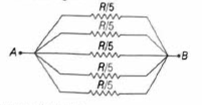

Equivalent resistance:

$$R' = \frac{1}{\frac{1}{R/5} + \frac{1}{R/5} + \frac{1}{R/5} + \frac{1}{R/5} + \frac{1}{R/5}} = \frac{1}{\frac{25}{R}} = \frac{R}{25}$$

∴ Ratio: $$\frac{R}{R'} = \frac{R}{\frac{R}{25}} = 25$$

---

#### Q.2 Which of the following terms does not represent electric power in a circuit?

(a) I²R  
(b) IR²  
(c) VI  
(d) V²/R

**Sol.** (b) Electric power = VI = IR × I = I²R

$$= \left(\frac{V}{R}\right) \times R = \frac{V^2}{R} \quad [∵ I = \frac{V}{R}]$$

So, IR² does not represent electric power.

---

#### Q.3 An electric bulb is rated 220 V and 100 W. When it is operated on 110 V, the power consumed will be

(a) 100 W  
(b) 75 W  
(c) 50 W  
(d) 25 W

**Sol.** (d) Given: V = 220V, P = 100W

∴ Resistance of bulb: $$R = \frac{V^2}{P} = \frac{220 \times 220}{100} = 484\Omega$$

Now, when V = 110 V, then power consumed:

$$P = \frac{V^2}{R} = \frac{110 \times 110}{484} = 25\text{ W}$$

---

#### Q.4 Two conducting wires of same material and of equal lengths and equal diameters are first connected in series and then parallel in a circuit across the same potential difference, the ratio of heat produced in series and parallel combinations would be

(a) 1:2  
(b) 2:1  
(c) 1:4  
(d) 4:1

**Sol.** (c) Let R be the resistance of each wire. The resistance of both the wires will be same because they are of same material and have same length and same cross-sectional area.

Equivalent resistance in series: $$R_s = R + R = 2R$$

Heat produced: $$H_s = \frac{V^2t}{R_s} = \frac{V^2t}{2R}$$

Equivalent resistance in parallel: $$R_p = \frac{R}{2}$$

Heat produced: $$H_p = \frac{V^2t}{R_p} = \frac{2V^2t}{R}$$

∴ Ratio of heat produced:

$$\frac{H_s}{H_p} = \frac{\frac{V^2t}{2R}}{\frac{2V^2t}{R}} = \frac{1}{4}$$

Thus, the ratio of H_s and H_p is 1:4.

---

#### Q.5 How is a voltmeter connected in circuit to measure the potential difference between the two points?

**Sol.** A voltmeter is always connected in parallel in the circuit to measure the potential difference between two points.

---

#### Q.6 A copper wire has diameter 0.5 mm and resistivity ρ = 1.6 × 10⁻⁸ Ω-m. What will be the length of its wire to make its resistance 10 Ω? How much does the resistance change, if diameter is doubled?

**Sol.** Given: radius of wire, r = diameter/2 = 0.5/2 = 0.25 mm = 0.25 × 10⁻³ m

ρ = 1.6 × 10⁻⁸ Ω-m and R = 10Ω

(i) We know that, resistance: $$R = \frac{\rho l}{A} = \frac{\rho l}{\pi r^2} \quad [∵ A = \pi r^2]$$

$$\text{or } l = \frac{R\pi r^2}{\rho} = \frac{10 \times 3.14 \times 0.25 \times 0.25 \times 10^{-6}}{1.6 \times 10^{-8}} = 122.66\text{ m}$$

(ii) Resistance: $$R \propto \frac{1}{r^2}$$

If diameter is doubled, then resistance becomes one-fourth of its original value.

---

#### Q.7 The values of current I flowing in a given resistor for the corresponding values of potential difference V across the resistor are as given below:

| I (amperes) | 0.5 | 1.0 | 2.0 | 3.0 | 4.0 |
|-------------|-----|-----|-----|-----|-----|
| V (volts)   | 1.6 | 3.4 | 6.7 | 10.2| 13.2|

Plot a graph between V and I and also calculate the resistance of that resistor.

**Sol.** 

  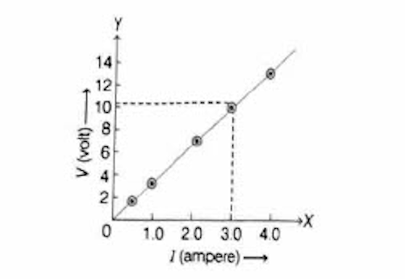

The graph is linear showing Ohm's law is obeyed. The resistance R = slope = V/I ≈ 3.3Ω

---

#### Q.8 When a 12 V battery is connected across an unknown resistor, there is a current of 2.5 mA in the circuit. Find the value of resistance of resistor.

**Sol.** Given: V = 12 V, I = 2.5 mA = 2.5 × 10⁻³ A, R = ?

∴ Resistance: $$R = \frac{V}{I}$$ [by Ohm's law]

$$\Rightarrow R = \frac{12}{2.5 \times 10^{-3}} = 4.8 \times 10^3 \Omega$$

---

#### Q.9 A battery of 9 V is connected in series with resistors of 0.2 Ω, 0.3 Ω, 0.4 Ω, 0.5 Ω and 12 Ω, respectively. How much current would flow through the 12 Ω resistor?

**Sol.** The circuit diagram for the given system of resistors can be drawn as below

  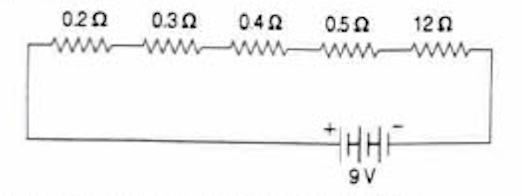

∴ Total resistance: $$R = R_1 + R_2 + R_3 + R_4 + R_5$$

$$= 0.2 \Omega + 0.3 \Omega + 0.4 \Omega + 0.5 \Omega + 12 \Omega = 13.4 \Omega$$

Current through all resistors in series is the same.

∴ Current through 12 Ω resistor: $$= \frac{V}{R} = \frac{9 \text{ V}}{13.4 \Omega} = 0.67 \text{ A}$$

---

#### Q.10 How many 176 Ω resistors (in parallel) are required to carry 5 A on a 220 V line?

**Sol.** Given: V = 220 V, I = 5 A

∴ Resistance of the wire: $$R = \frac{V}{I} = \frac{220}{5} = 44\Omega$$

The net resistance 44 Ω is less than the individual resistance 176 Ω, so individual resistances are to be connected in parallel order.

In parallel connection, equivalent resistance:

$$R' = \frac{1}{\frac{1}{R} + \frac{1}{R} + \frac{1}{R}} = \frac{1}{\frac{n}{R}} = \frac{R}{n}$$

$$\therefore 44 \Omega = \frac{176 \Omega}{n} \text{ or } n = \frac{176}{44} = 4 \text{ resistors}$$

---

#### Q.11 Show how would you connect three resistors, each of resistance 6 Ω, so that the combination has a resistance of (i) 9 Ω and (ii) 4 Ω?

**Sol.** 

**(i)** If two 6 Ω resistors are connected in parallel, then the equivalent resistance is $$\left(\frac{6}{2}\right) = 3\Omega$$

  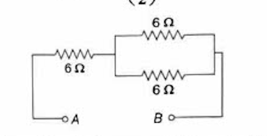

This combination is connected in series with a 6 Ω resistor to get overall equivalent resistance of (6 + 3) = 9 Ω.

**(ii)** Equivalent resistance of two 6 Ω resistances connected in series, R' = 6 + 6 = 12 Ω. Now, 12 Ω and 6 Ω resistors are connected in parallel.

  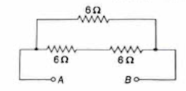

Equivalent resistance: $$R_{eq} = \frac{12 \times 6}{12 + 6} = \frac{72}{18} = 4\Omega$$

---

#### Q.12 Several electric bulbs designed to be used on a 220 V electric supply line are rated at 10 W. How many bulbs are connected in parallel with each other across two wires 220 V line, if the maximum allowable current is 5 A?

**Sol.** Given: potential difference, V = 220 V; Power, P = 10 W; current, I = 5 A

∴ Resistance of bulb: $$R' = \frac{V^2}{P} = \frac{220 \times 220}{10} = 4840\Omega$$

Since bulbs are connected in parallel, equivalent resistance (R):

$$= \frac{\text{Individual resistance } (R')}{\text{Number of bulbs } (n)}$$

$$\Rightarrow R = \frac{4840}{n}\Omega, \quad V = IR$$

$$\Rightarrow 220 = \frac{5 \times 4840}{n}$$

$$\Rightarrow n = \frac{5 \times 4840}{220} = 110 \text{ bulbs}$$

---

#### Q.13 A hot plate of an electric oven connected to a 220 V line has two resistance coils A and B, each of 24 Ω resistance, which may be used separately, in series, or in parallel. What are the currents in three cases?

**Sol.** Given: V = 220 V, $R_A = R_B = 24\Omega$

**(i) Current in plates when used separately:**

$$I = \frac{V}{R_A} = \frac{V}{R_B} = \frac{220}{24} = 9.16 \text{ A}$$

**(ii) Current in plates when connected in series:**

Equivalent resistance in series:

$$R = R_A + R_B = 24 + 24 = 48\Omega$$

∴ Current flowing:

$$I = \frac{V}{R} = \frac{220}{48} = 4.58 \text{ A}$$

**(iii) Current in plates when connected in parallel:**

Equivalent resistance in parallel:

$$R = \frac{R_A R_B}{R_A + R_B} = \frac{24 \times 24}{48} = 12\Omega$$

∴ Current flowing: $$I = \frac{V}{R} = \frac{220}{12} = 18.32 \text{ A}$$

---

#### Q.14 Compare the power used in 2 Ω resistor in each of the following circuits: (i) A 6 V battery in series with 1 Ω and 2 Ω resistors, (ii) a 4 V battery in parallel with 12 Ω and 2 Ω resistors

**Sol.** 

**(i)** The circuit shown to the right has resistance connected in series combination:

  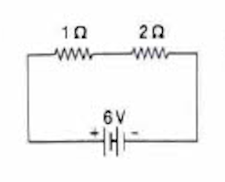

Current in the circuit:

$$I = \frac{V}{R_1 + R_2} = \frac{6}{3} = 2 \text{ A}$$

$$\therefore \text{ Power} = I^2R = 2^2 \times 2 = 2 \times 2 \times 2 = 8 \text{ W}$$

**(ii)** The circuit is shown to the right has resistance connected in parallel combination.

  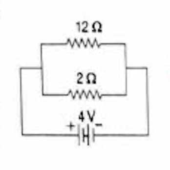

In parallel combination, potential across each resistor is same and equal to the potential applied to the circuit.

Potential across 2 Ω resistor:

$$V = 4 \text{ V}$$

$$\text{Power} = \frac{V^2}{R} = \frac{4 \times 4}{2} = 8 \text{ W}$$

**Power used in both the cases is same.**

---

#### Q.15 Two lamps, one rated 100 W-220 V and other 60 W-220 V are connected in parallel to electric mains supply. What current is drawn from the line, if supply voltage is 220 V?

**Sol.** Given: potential, V = 220 V; Power, $P_1$ = 100 W; Power, $P_2$ = 60 W

∴ Current: $$I_1 = \frac{P_1}{V} = \frac{100}{220} = 0.45 \text{ A}$$

Current: $$I_2 = \frac{P_2}{V} = \frac{60}{220} = 0.27 \text{ A}$$

∴ Total current drawn:

$$I = I_1 + I_2 = 0.45 + 0.27 = 0.72 \text{ A}$$

---

#### Q.16 Which uses more energy, a 250 W TV set in 1 h or a 1200 W toaster in 10 min?

**Sol.** Given: $P_1$ = 250 W, $P_2$ = 1200 W, $t_1$ = 1 h = 3600 s, $t_2$ = 10 min = 600 s

∴ Energy:

$$Q_1 = P_1 t_1 = 250 \times 3600 = 900000 \text{ J} = 900 \text{ kJ}$$

and 

$$Q_2 = P_2 t_2 = 1200 \times 600 = 720000 \text{ J} = 720 \text{ kJ}$$

**Thus, TV set uses more energy.**

---

#### Q.17 An electric heater of resistance 8 Ω draws 15 A from the mains for 2 h. Calculate the rate at which heat is developed in the heater.

**Sol.** Given: resistance, R = 8 Ω; current, I = 15 A; Time, t = 2 h = 7200 s

∴ Heat developed: $$H = I^2Rt = (15 \times 15 \times 8 \times 7200) \text{ J}$$

∴ Rate of heat developed:

$$P = \frac{H}{t} = \frac{15 \times 15 \times 8 \times 7200}{7200} = 1800 \text{ W or } 1800 \text{ J/s}$$

**Thus, the rate at which heat is developed in the heater is 1800 joule per second.**

---

#### Q.18 Explain the following questions

(i) Why is tungsten used almost exclusively for filament of electric lamps?

(ii) Why are the conductors of electric heating devices such as bread toasters and electric irons made of alloys rather than pure metals?

(iii) Why is the series arrangement not used for domestic circuits?

(iv) How does the resistance of a wire vary with its area of cross-section?

**Sol.** 

**(i)** Tungsten has a high melting point (3380°C). It does not melt at high temperature. It retains as much of heat generated, so that it becomes very hot and emits light. That is the reason why tungsten is used as filament of electric lamps.

**(ii)** Conductors of electric heating devices are made of alloys because alloys do not oxidise (burn) readily at high temperature unlike metals. Also, alloys have a greater resistivity (generally) as compared to their constituent pure metals.

**(iii)** There are 2 reasons for not using series connections for domestic circuits:
- (a) Devices of different current ratings cannot be connected as the current is constant in the series circuit.
- (b) If one device fails, the circuit is broken and all devices stop working.

**(iv)** Resistance is inversely proportional to the area of cross-section of the wire. Thus, if the wire is thick (large area of cross-section), then resistance is less. If the wire is thin (less area of cross-section), then resistance is large.

