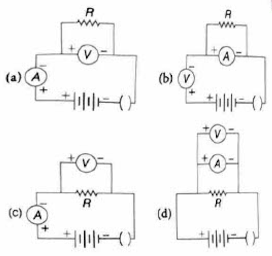
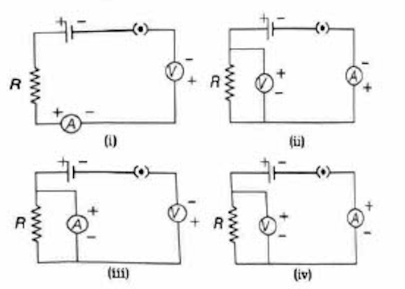
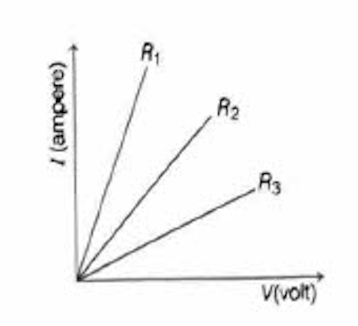
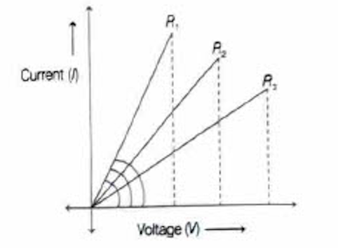
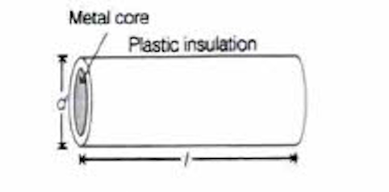
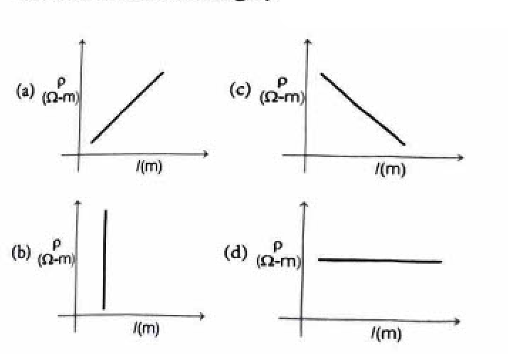

# Review Exercise - Electricity

## Competency Based Questions

### Competency Focused (Objective) Questions

#### Multiple Choice Questions (1 Mark Each)

---

#### Q.1 A current of 4.8 A is flowing in a conductor. The number of electrons passing per second through the conductor will be

(a) $3 \times 10^{20}$  
(b) $76.8 \times 10^{20}$  
(c) $7.68 \times 10^{-19}$  
(d) $3 \times 10^{19}$

**Sol.** (d) Given: current, $I = 4.8$ A, $e = 1.6 \times 10^{-19}$ C

We know that: $$I = \frac{q}{t} = \frac{ne}{t}$$

$$\therefore \frac{n}{t} = \frac{I}{e} = \frac{4.8}{1.6 \times 10^{-19}} = 3 \times 10^{19}$$

---

#### Q.2 A current of 1 A is drawn by a filament of an electric bulb. Number of electrons passing through a cross-section of the filament in 16 s would be roughly Competency Based Que.

(a) $10^{20}$  
(b) $10^{16}$  
(c) $10^{18}$  
(d) $10^{23}$

**Sol.** (a) Given: current (I) drawn by the filament is 1 A.

We know that: $Q = ne$ and $Q = It$

$$\therefore ne = It$$

On substituting the values, we get:

$$n = \frac{It}{e} = \frac{1 \times 16}{1.6 \times 10^{-19}} = 10^{20} \text{ electrons}$$

---

#### Q.3 The expressions that relate (i) Q, I and t and (ii) Q, V and W respectively are (Here, the symbols have their usual meanings) CBSE 2023

(a) (i) $I = \frac{Q}{t}$ (ii) $W = \frac{V}{Q}$  
(b) (i) $Q = I \times t$ (ii) $W = V \times Q$  
(c) (i) $Q = \frac{I}{t}$ (ii) $V = \frac{W}{Q}$  
(d) (i) $I = \frac{Q}{t}$ (ii) $Q = \frac{V}{W}$

**Sol.** (b)

(i) The formula between these three quantities, i.e. electric charge, time and electric current is:

Electric charge = Electric current × Time

$$Q = I \times t$$

(ii) The formula between these three quantities W, V and Q is:

Work done = Potential difference × Electric charge

$$W = V \times Q$$

---

#### Q.4 Which one of the following is the correct set-up for studying the dependence of the current on the potential difference across a resistor and why? CBSE 2019

  

(a) [Circuit diagram option a]  
(b) [Circuit diagram option b]  
(c) [Circuit diagram option c]  
(d) [Circuit diagram option d]

**Sol.** (c) Option (c) represents correct set-up for studying the dependence of the current on the potential difference across a resistor because ammeter A is connected in series while voltmeter V is connected across parallel to resistor R.

---

#### Q.5 Identify the circuit in which the electrical components have been properly connected. Competency Based Que.

  

**Sol.** (b) While identifying the circuit, the following conditions must be satisfied:
- I. An ammeter is always connected in series.
- II. Voltmeter should be connected in parallel.
- III. The positive terminals of voltmeter and ammeter should be joined to positive terminal of the cell and their negative terminals should be joined to the negative terminal of the cell.

Thus, the above conditions are satisfied in case (ii).

---

#### Q.6 A student carries out an experiment and plots the V-I graph of three samples of nichrome wire with resistances $R_1$, $R_2$ and $R_3$ respectively as shown in figure. Which of the following is true? NCERT Exemplar

  

(a) $R_1 = R_2 = R_3$  
(b) $R_1 > R_2 > R_3$  
(c) $R_3 > R_2 > R_1$  
(d) $R_2 > R_3 > R_1$

**Sol.** (c) We know that, slope of V and I tells about the resistance and (slope of V and I) $\propto \frac{1}{\text{Resistance}}$

  

So: $$R_3 > R_2 > R_1$$

---

#### Q.7 Plastic insulation surrounds a wire having diameter d and length l as shown above. A decrease in the resistance of the wire would be produced by an increase in the Competency Based Que.

  

(a) length l of the wire  
(b) diameter d of the wire  
(c) temperature of the wire  
(d) thickness of the plastic insulation

**Sol.** (b) The resistance R of a wire having length l and area of cross-section A is given by:

$$R = \rho \frac{l}{A} = \rho \frac{l}{\frac{\pi}{4}d^2} = \rho \cdot \frac{4l}{\pi d^2}$$

where $\rho$ = resistivity of wire.

$$\therefore R \propto \frac{1}{d^2}$$

Hence, as diameter increases, the resistance of a wire decreases.

---

#### Q.8 A cylindrical conductor of length l and uniform area of cross-section A has resistance R. Another conductor of length 2.5l and resistance 0.5R of the same material has area of cross-section CBSE 2020

(a) 5A  
(b) 2.5A  
(c) 0.5A  
(d) $\frac{1}{5}A$

**Sol.** (a) As resistance of a conductor:

$$R = \rho \frac{l}{A} \Rightarrow A = \rho \frac{l}{R} \quad ...(i)$$

Given, conductor of length 2.5l and resistance 0.5R:

$$0.5R = \rho \frac{2.5l}{A'} \Rightarrow A' = \rho \frac{2.5l}{0.5R} \quad ...(ii)$$

From Eqs. (i) and (ii), we get:

$$\frac{A'}{A} = \frac{\rho\left(\frac{2.5l}{0.5R}\right)}{\rho\left(\frac{l}{R}\right)} \Rightarrow A' = 5A$$

---

#### Q.9 In case of four wires of same material, the resistance will be minimum, if the diameter and length of the wire respectively are CBSE 2024

(a) D/2 and L/4  
(b) D/4 and 4L  
(c) 2D and L  
(d) 4D and 2L

**Sol.** (d) 4D and 2L

Resistance of a given wire is:

$$R = \frac{\rho L}{A}$$

where $\rho$ → Resistivity of the material, L → Length of wire, A → Cross-section area of wire.

$$R = \rho \frac{L}{\pi\left(\frac{D}{2}\right)^2} \Rightarrow R \propto \frac{L}{D^2}$$

For values of diameter 4D and length 2L of wire:

$$R = \frac{2L}{(4D)^2} = \frac{2L}{16D^2} = \frac{1}{8}\left(\frac{L}{D^2}\right)$$

This is minimum among the other cases.

---

#### Q.10 A cylindrical conductor of length l and uniform area of cross section A has resistance R. The area of cross-section of another conductor of same material and same resistance but of length 2l is CBSE 2020

(a) A/2  
(b) 3A/2  
(c) 2A  
(d) 3A

**Sol.** (c) As resistance of a conductor:

$$R = \rho \frac{l}{A} \Rightarrow A = \rho \frac{l}{R} \quad ...(i)$$

Given, another conductor of $R' = R$, $l' = 2l$ and $\rho' = \rho$

Then: $$R' = \rho' \frac{l'}{A'}$$

$$\Rightarrow R = \rho \frac{2l}{A'} \Rightarrow A' = \rho \frac{2l}{R} \quad ...(ii)$$

From Eqs. (i) and (ii), we get:

$$\frac{A'}{A} = \frac{\rho \frac{2l}{R}}{\rho \frac{l}{R}} \Rightarrow A' = 2A$$

---

#### Q.11 A complete circuit is left on for several minutes, causing the connecting copper wire to become hot. As the temperature of the wire increases, the electrical resistance of the wire CBSE SQP 2022-23

(a) decreases  
(b) remains the same  
(c) increases  
(d) increases for sometime and then decreases

**Sol.** (c) The resistance of a conductor is directly proportional to temperature. So, as the wire becomes hot, its temperature increases and hence resistance also increases.

---

#### Q.12 Raman wants to draw a graph to show how the resistivity (ρ) of a wire changes with the length (l) of the wire. What should his graph look like? Competency Based Que.

  

**Sol.** (d) The resistivity of a material does not depend on its length but depends on its nature and temperature.

---

#### Q.13 Two LED bulbs of 10 W and 5 W are connected in series. If the current flowing through 5 W bulb is 0.005 A, the current flowing through 10 W bulb is CBSE 2023

(a) 0.02 A  
(b) 0.01 A  
(c) 0.005 A  
(d) 0.0025 A

**Sol.** (c) As we know, in series combination, current has same value. So, 10 W LED bulb has same current as in 5 W which is 0.005 A.

---

#### Q.14 The maximum resistance which can be made using four resistors, each of resistance $\frac{1}{2} \Omega$ is CBSE 2020

(a) $2 \Omega$  
(b) $1 \Omega$  
(c) $2.5 \Omega$  
(d) $8 \Omega$

**Sol.** (a) Given, four resistors, each of resistance $(1/2) \Omega$

As, we know, equivalent resistance in series,

$$\begin{aligned}
R_{eq_1} & = R_1 + R_2 + R_3 + R_4 \\
& = \frac{1}{2} + \frac{1}{2} + \frac{1}{2} + \frac{1}{2} = 2 \Omega
\end{aligned}$$

and in parallel, 

$$\frac{1}{R_{eq_2}} = \frac{1}{R_1} + \frac{1}{R_2} + \frac{1}{R_3} + \frac{1}{R_4}$$

$$= \frac{1}{\frac{1}{2}} + \frac{1}{\frac{1}{2}} + \frac{1}{\frac{1}{2}} + \frac{1}{\frac{1}{2}}$$

$$\Rightarrow R_{eq_2} = \frac{1}{8} \text{ or } 0.125 \Omega$$

Hence, maximum resistance is $2 \Omega$, when all four resistors are connected in series.

---

#### Q.15 In the given circuit the total resistance between X and Y is CBSE 2024

(a) $12 \Omega$  
(b) $4 \Omega$  
(c) $6 \Omega$  
(d) $1 \Omega$

**Sol.** (d) $1 \Omega$

Given circuit can be redrawn in a simple way.

The above simple circuit consist of three resistors in parallel. So, equivalent resistance of three resistors is given by

$$\frac{1}{R_{eq}} = \frac{1}{R_1} + \frac{1}{R_2} + \frac{1}{R_3}$$

$$\begin{aligned}
\frac{1}{R_{eq}} & = \frac{1}{2} + \frac{1}{3} + \frac{1}{6} \\
& = \frac{3 + 2 + 1}{6} = \frac{6}{6} = 1 \\
R_{eq} & = 1 \Omega
\end{aligned}$$

---

#### Q.16 What is the maximum resistance which can be made using five resistors each of $(1/5) \Omega$? NCERT Exemplar

(a) $(1/5) \Omega$  
(b) $10 \Omega$  
(c) $5 \Omega$  
(d) $1 \Omega$

**Sol.** (d) The maximum resistance is obtained when resistors are connected in series combination. Thus, equivalent resistance, $R_s = n \times R = 5 \times \frac{1}{5} = 1 \Omega$

where, $R_s =$ equivalent resistance for series combination.

---

#### Q.17 If four identical resistors, of resistance $8 \Omega$, are first connected in series so as to give an effective resistance $R_s$ and then connected in parallel so as to give an effective resistance $R_p$, then the ratio of $\frac{R_s}{R_p}$ is CBSE 2023

(a) 32  
(b) 2  
(c) 0.5  
(d) 16

**Sol.** (d) Given, four identical resistance of resistors $= 8 \Omega$

$$\begin{aligned}
R_s & = 8 \Omega + 8 \Omega + 8 \Omega + 8 \Omega = 32 \Omega \\
\frac{1}{R_p} & = \frac{1}{8} + \frac{1}{8} + \frac{1}{8} + \frac{1}{8} = \frac{1}{2} \Rightarrow R_p = 2 \Omega
\end{aligned}$$

So, $\frac{R_s}{R_p} = \frac{32}{2} = 16$

---

#### Q.18 The proper representation of series combination of cells obtaining maximum potential is NCERT Exemplar

(a) $-\mathrm{H}-\mathrm{H}-\mathrm{H}$  
(b) $-||||| |$  
(c) $-\mathrm{H}-\mathrm{H}-$  
(d) $-|11| 11 |-$

**Sol.** (a) In series combination of cells, the negative terminal of the first cell should be joined to the positive terminal of the second cell and the negative terminal of the second cell should be joined to the positive terminal of third cell and so on.

---

#### Q.19 The resistance of a resistor is reduced to half of its initial value. If other parameters of the electrical circuit remain unaltered, the amount of heat produced in the resistor will become

(a) four times  
(b) two times  
(c) half  
(d) one-fourth

**Sol.** (b) Heat due to the resistor, $H = \frac{V^2 t}{R}$, where $V$ is the voltage and $R$ is the resistance.

As we know, heat is inversely proportional to the resistance, so if the resistance is reduced to half, the heat will be increased two times.

---

#### Q.20 In an electrical circuit, two resistors of $2 \Omega$ and $4 \Omega$ are connected in series to a 6 V battery. Find the heat dissipated by the $4 \Omega$ resistor in 5 s. NCERT Exemplar

(a) 5 J  
(b) 10 J  
(c) 20 J  
(d) 30 J

**Sol.** (c) Given, $R_1 = 2 \Omega$, $R_2 = 4 \Omega$, $t = 5$ s, $V = 6$ V

∴ Net resistance, $R = R_1 + R_2 = 2 \Omega + 4 \Omega = 6 \Omega$

∴ Current, $I = \frac{V}{R} = \frac{6 \text{ V}}{6 \Omega} = 1$ A

In series, same 1 A current passes through both resistors.

∴ Heat dissipated, $H = I^2 R_2 \times t = (1)^2 \times 4 \times 5 = 20$ J

---

#### Q.21 In the following circuits, heat produced in the resistor or combination of resistors connected to a 12 V battery will be NCERT Exemplar

(a) same in all the cases  
(b) maximum in Case (i)  
(c) maximum in Case (ii)  
(d) maximum in Case (iii)

**Sol.** (d) In Case (i), $R = 2 \Omega$

Case (ii), $R = 2 + 2 = 4 \Omega$

Case (iii), $\frac{1}{R} = \frac{1}{2} + \frac{1}{2} = 1 \Rightarrow R = 1 \Omega$

Since, $H = \frac{V^2}{R} \times t$

As voltage in the three cases for equivalent resistance is same, so $H \propto \frac{1}{R}$. Hence, heat produced is maximum in Case (iii).

---

#### Q.22 100 J of heat is produced each second in a $4 \Omega$ resistance. The potential difference across the resistor is

(a) 20 V  
(b) 10 V  
(c) 5 V  
(d) 15 V

**Sol.** (a) Given, heat, $H = 100$ J

Resistance, $R = 4 \Omega$

Time, $t = 1$ s

We know that, $H = I^2 R t$

$$I = \sqrt{\frac{H}{R t}} = \sqrt{\frac{100}{4 \times 1}} = 5 \text{ A}$$

Potential difference across the resistor,

$$V = I R = 5 \times 4 = 20 \text{ V}$$

---

#### Q.23 An electric kettle consumes 1 kW of electric power when operated at 220 V. The minimum rating of the fuse wire to be used for it is CBSE 2023

(a) 1 A  
(b) 2 A  
(c) 4 A  
(d) 5 A

**Sol.** (d) Given, electric power $= 1$ kW $= 1000$ W

Voltage, $V = 220$ V

Power, $P = V \times I$

or $1000 = 220 \times I$

or $$\begin{aligned}
I & = \frac{1000}{220} = 4.5 \text{ A} \\
& \approx 5 \text{ A}
\end{aligned}$$

Hence, the minimum rating of fuse wire to be used for it will be 5 A.

---

#### Q.24 In domestic electric circuits, the wiring with 15 A current rating is for the electric devices which have CBSE 2023

(a) higher power ratings such as geyser  
(b) lower power ratings such as fan  
(c) metallic bodies and low power ratings  
(d) non-metallic bodies and low power ratings

**Sol.** (a) 15 A current rating circuits are used for higher power consumption sources that have a high power rating. It includes an air conditioner, geysers, etc.

---

#### Q.25 If the current through a resistor is increased by 100% (assume that temperature remains unchanged), the increase in power dissipated will be NCERT Exemplar

(a) $100\%$  
(b) $200\%$  
(c) $300\%$  
(d) $400\%$

**Sol.** (c) Power,

$$\begin{aligned}
P & = I^2 R \\
P_1 & = I^2 R \\
P_2 & = (2I)^2 R = 4I^2 R
\end{aligned}$$

[$\therefore 100\%$ increase in current means that current becomes 2I]

$$\begin{aligned}
\therefore \text{ Increase in power dissipated } & = P_2 - P_1 \\
& = 4I^2 R - I^2 R \\
& = 3I^2 R \quad [\because I^2 R = P_1] \\
& = 3P_1
\end{aligned}$$

Percentage increase in power dissipated $= \frac{3P_1}{P_1} \times 100 = 300\%$

---

