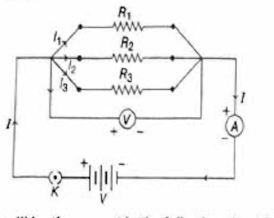
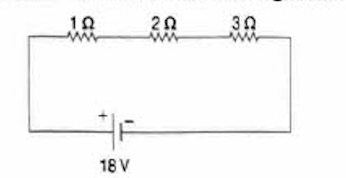
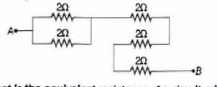
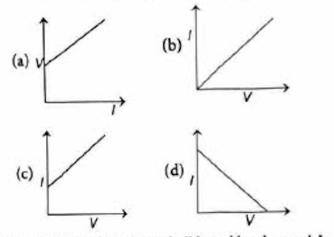
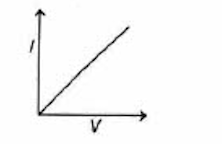

# Case Study Questions - Electricity

## Case Based Questions

**Direction:** Answer the questions on the basis of your understanding of the following case studies and related concepts.

---

### Case Study 1: Resistor Combinations

Two or more resistors can be connected with each other by different combinational methods in order to achieve the desired equivalent resistance in a particular circuit.

When two or more resistors are connected end to end to each other, then they are said to be connected in series. The following figure shows the connection of resistors in series.

When two or more resistors are connected simultaneously between two points to each other, then they are said to be connected in parallel combination.

The following figure shows the connection of resistors in parallel.

---

#### Q.1(i) What will be the current in the following circuit?

  

**Sol.** Given, $R_{eq} = 1 \Omega + 2 \Omega + 3 \Omega = 6 \Omega$, $V = 18$ V

We know that, $I = \frac{V}{R} = \frac{18}{6} = 3$ A

Therefore, the current in the given circuit is 3 A.

---

#### Q.1(ii) Find the equivalent resistance between A and B in the following circuit.

  

**Sol.** First two resistors are in parallel, so

$$\begin{aligned}
\frac{1}{R} & = \frac{1}{2} + \frac{1}{2} = 1 \\
R & = 1 \Omega
\end{aligned}$$

and $R_{eq} = R + 2 \Omega + 2 \Omega + 2 \Omega = 1 + 2 + 2 + 2 = 7 \Omega$

Therefore, the equivalent resistance is $7 \Omega$.

---

#### Q.1(iii) What is the equivalent resistance of a circuit, when three resistors each of resistance $R \Omega$ are connected in series?

  

**Sol.** When resistors are connected in series, then equivalent resistance is

$$\begin{aligned}
R_{eq} & = R_1 + R_2 + R_3 + \ldots \\
R_{eq} & = R + R + R = 3R \Omega
\end{aligned}$$

Therefore, the equivalent resistance is $3R \Omega$.

---

### Case Study 2: Ohm's Law and V-I Relationships

The relationship between potential difference and current was first established by George Simon Ohm, named after him called Ohm's law. This law states that the current through a metallic conductor is proportional to the potential difference applied between its two ends, provided the temperature remains constant. i.e. Current $(I) \propto$ voltage $(V)$ or $V = IR$, where $R$ is constant for the conductor and it is called resistance of the conductor.

Although Ohm's law has been found valid over a large class of materials, there do exist materials and devices used in electric circuits, where the proportionality of $V$ and $I$ does not hold.

---

#### i) If both the potential difference and the resistance in a circuit are tripled, then

(a) current remains same  
(b) current is tripled  
(c) current is halved  
(d) current is doubled

**Sol.** (a) Current is given by, $I = \frac{V}{R}$

If both $V$ and $R$ are tripled then, $I' = \frac{3V}{3R} = \frac{V}{R} = I$

i.e., current remains same.

---

#### (ii) For a conductor, the graph between V and I is shown. Which one of them is correct?

  

**Sol.** (b) From Ohm's law, $V \propto I \Rightarrow V = IR$

The graph is a straight line passing through the origin with slope equal to resistance.

---

#### (iii) The slope of V-I graph (V on X-axis and I on Y-axis) gives

(a) resistance  
(b) reciprocal of resistance  
(c) charge  
(d) reciprocal of charge

**Sol.** (b) The slope of V-I graph when V on X-axis and I on Y-axis is

$$\text{slope} = \frac{I}{V} = \frac{1}{R}$$

i.e., reciprocal of resistance.

---

#### (iv) When battery of 9 V is connected across a conductor and the current that flows is 0.1 A, the resistance is

  

(a) $9 \Omega$  
(b) $0.9 \Omega$  
(c) $900 \Omega$  
(d) $90 \Omega$

**Sol.** (d) $V = 9$ V and $I = 0.1$ A

Then resistance is given as 

$$R = \frac{V}{I} = \frac{9}{0.1} = 90 \Omega$$

---

