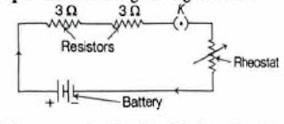
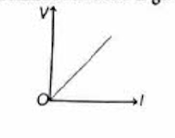
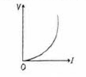
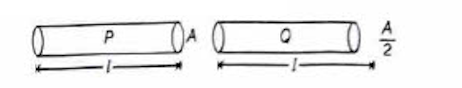
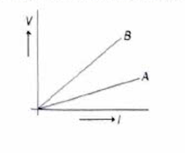

# Constructed Response Questions - Electricity

## Very Short Answer Type Questions

#### Q.1 Name and define the SI unit of current.

CBSE 2019

**Sol.** The SI unit of electric current is ampere. 1 ampere is the electric current which flows through any part of a conductor, when 1 coulomb of charge flows through it in 1 second.

$$1 \text{ ampere} = \frac{1 \text{ coulomb}}{1 \text{ second}}$$

---

#### Q.2 Some work is done to move a charge $Q$ from infinity to a point $A$ in space. The potential of the point $A$ is given as $V$. What is the work done to move this charge from infinity in terms of $Q$ and $V$?

**Sol.** Work done to move charge $Q$ from infinity to a point $A$ in space is given by

Work done = Charge × Potential of point $A$

i.e.

$$W = QV$$

---

#### Q.3 When two ends of a metallic wire are connected across the terminals of a cell, then some potential difference is set up between its ends. In which direction are electrons flowing through the conductors?

Competency Based Que.

**Sol.** Electrons are flowing through the conductors from its higher potential end to its lower potential end, where positive terminal is at higher potential end and negative terminal is at lower potential end.

---

#### Q.4 Draw a circuit diagram using a battery of two cells, two resistors of $3 \Omega$ each connected in series, a plug key and a rheostat.

**Sol.** The required circuit diagram is given below:

  

---

#### Q.5 What do you understand by the term fuse in an electric circuit?

**Sol.** Fuse is a safety device connected in series in an electric circuit which melts when the circuit gets overloaded or short circuited.

---

#### Q.6 Draw the V-I graph for ohmic and non-ohmic conductors.

**Sol.** V-I graph for ohmic conductor is given as below:

  

V-I graph for non-ohmic conductor is given as below:

  

---

#### Q.7 Define resistance. Give its SI unit.

CBSE 2019

**Sol.** Resistance is the property of a conductor to resist the flow of current through it. Its SI unit is ohm and it is represented by $\Omega$.

---

#### Q.8 Out of the two wires $P$ and $Q$ shown below, which one has greater resistance? Justify it.

  

**Sol.** Smaller the area of cross-section, greater will be the resistance

$$R \propto \frac{1}{A} \quad \text{[since, lengths are same]}$$

So, wire $Q$ has greater resistance.

---

#### Q.9 Nichrome is used to make the element of electric heater. Why?

**Sol.** Nichrome is used to make the element of electric heater because it is an alloy with high resistivity and high melting point.

---

#### Q.10 Two unequal resistances are connected in parallel. If you are not provided with any other parameters (e.g. numerical values of I and R), what can be said about the voltage drop across the two resistors?

CBSE SQP 2020-21

**Sol.** In parallel combination of resistors, the voltage drop across each resistor is same. So, for the two unequal resistances connected in parallel, the voltage drop across both the resistors will be same.

---

## Short Answer Type Questions

#### Q.1 V-I graph for two conducting wires $A$ and $B$ are as shown. If both wires are of the same length and same diameter, which of the two is made of a material of high resistivity? Give reasons to justify your answer.

CBSE 2023

  

**Sol.** [Solution to be added]

---

