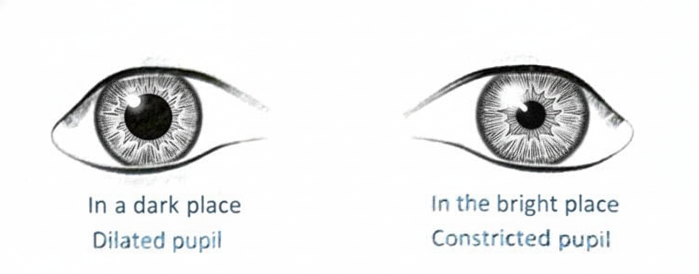
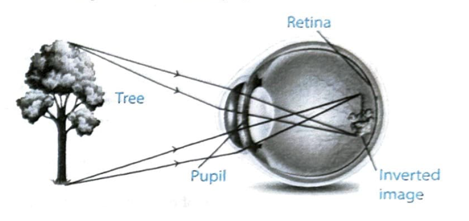
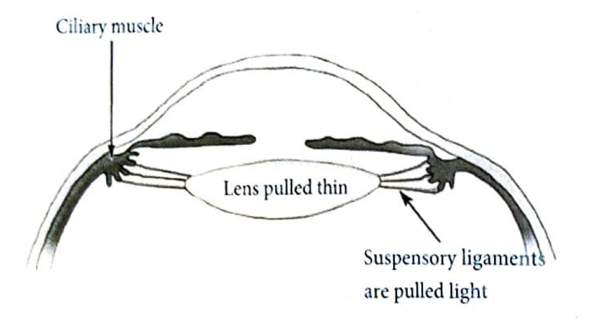
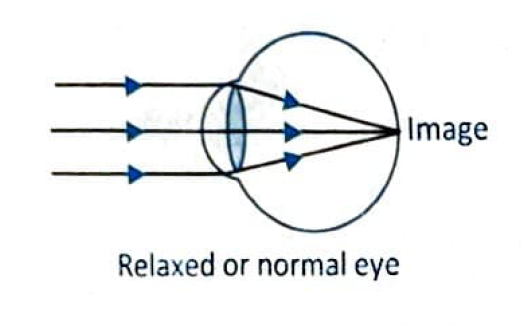
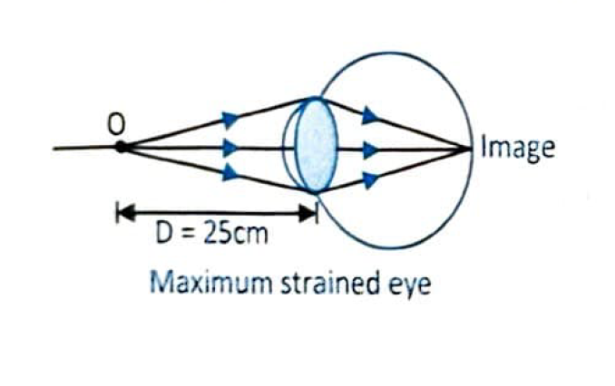
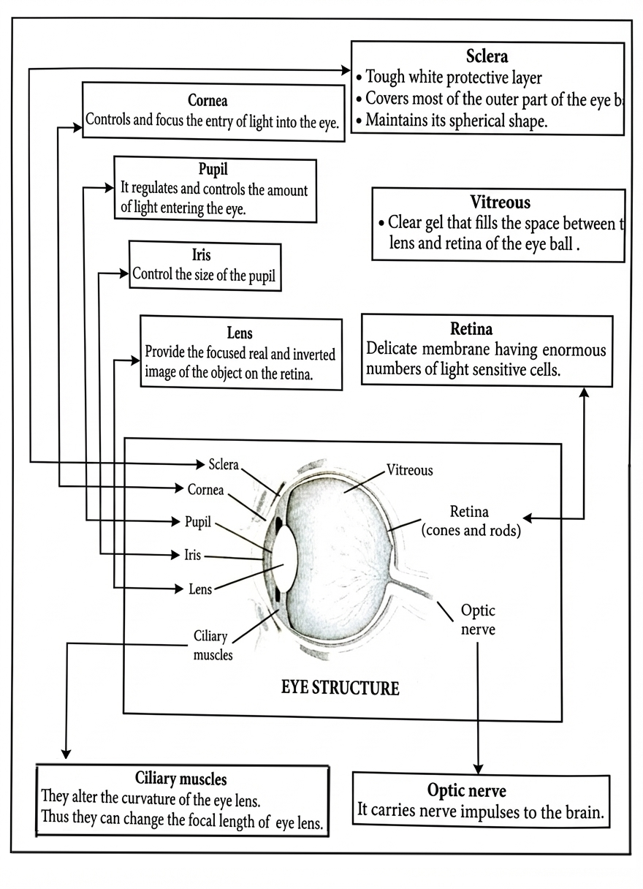
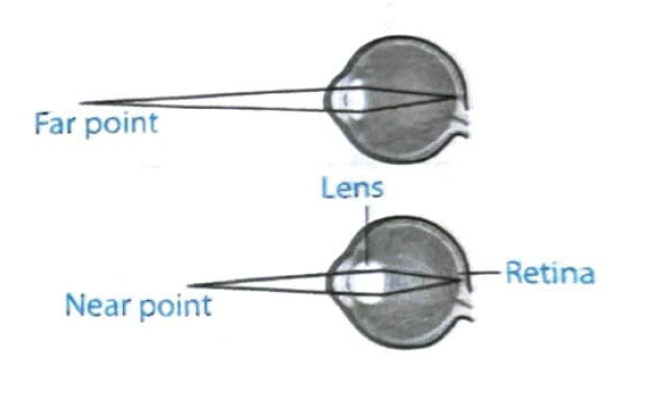

# Concept: The Human Eye

---

## Introduction

One of the most valuable and sensitive sense organs in our body is our eye. It enables us to see the beautiful and colorful world around us. The optical behavior of the eye is similar to that of a camera. The **eyeball** is nearly spherical and about **2.3 cm in diameter**. The essential parts of the human eye, considered as an optical system are shown in the figure.

  

---

## 1.1 Parts of the Human Eye

<table style="width:100%; border-collapse: collapse;">
  <thead>
    <tr style="background-color: #e8f4f8;">
      <th style="border: 1px solid #ddd; padding: 12px; text-align: left; width: 20%;">Part</th>
      <th style="border: 1px solid #ddd; padding: 12px; text-align: left;">Function/Description</th>
    </tr>
  </thead>
  <tbody>
    <tr>
      <td style="border: 1px solid #ddd; padding: 10px;"><strong>1. Sclera</strong></td>
      <td style="border: 1px solid #ddd; padding: 10px;">Tough white protective layer covering most of the outer eyeball, maintains spherical shape.</td>
    </tr>
    <tr>
      <td style="border: 1px solid #ddd; padding: 10px;"><strong>2. Cornea</strong></td>
      <td style="border: 1px solid #ddd; padding: 10px;">Transparent protective thin membrane covering one-sixth of the front portion of eyeball.</td>
    </tr>
    <tr>
      <td style="border: 1px solid #ddd; padding: 10px;"><strong>3. Iris</strong></td>
      <td style="border: 1px solid #ddd; padding: 10px;">Dark circular muscular diaphragm controlling the pupil size. Expands pupil in low light, contracts in bright light.</td>
    </tr>
    <tr>
      <td colspan="2" style="border: 1px solid #ddd; padding: 10px; text-align: center;">
        
      </td>
    </tr>
    <tr>
      <td style="border: 1px solid #ddd; padding: 10px;"><strong>4. Pupil</strong></td>
      <td style="border: 1px solid #ddd; padding: 10px;">Small opening at the centre of iris. Appears black as light entering goes into the eye.</td>
    </tr>
    <tr>
      <td style="border: 1px solid #ddd; padding: 10px;"><strong>5. Eye Lens</strong> (Crystalline lens)</td>
      <td style="border: 1px solid #ddd; padding: 10px;">Transparent biconvex lens with adjustable focal length, made of fibrous jelly-like material.</td>
    </tr>
    <tr>
      <td style="border: 1px solid #ddd; padding: 10px;"><strong>6. Retina</strong></td>
      <td style="border: 1px solid #ddd; padding: 10px;">Delicate membrane where real and inverted images form. Contains millions of rods (respond to brightness) and cones (respond to colors) connected to optic nerve fibers.</td>
    </tr>
    <tr>
      <td colspan="2" style="border: 1px solid #ddd; padding: 10px; text-align: center;">
        
      </td>
    </tr>
    <tr>
      <td style="border: 1px solid #ddd; padding: 10px;"><strong>7. Ciliary Muscles</strong></td>
      <td style="border: 1px solid #ddd; padding: 10px;">Alter the curvature and focal length of eye lens.</td>
    </tr>
    <tr>
      <td style="border: 1px solid #ddd; padding: 10px;"><strong>8. Optic Nerve</strong></td>
      <td style="border: 1px solid #ddd; padding: 10px;">Carries nerve impulses to the brain.</td>
    </tr>
    <tr>
      <td style="border: 1px solid #ddd; padding: 10px;"><strong>9. Blind Spot</strong></td>
      <td style="border: 1px solid #ddd; padding: 10px;">Area of zero vision with no rods and cones. Images formed here are not sensed.</td>
    </tr>
    <tr>
      <td style="border: 1px solid #ddd; padding: 10px;"><strong>10. Yellow Spot</strong></td>
      <td style="border: 1px solid #ddd; padding: 10px;">Small yellowish area opposite to cornea center. Most sensitive to light with maximum concentration of light-sensitive cells.</td>
    </tr>
    <tr>
      <td style="border: 1px solid #ddd; padding: 10px;"><strong>11. Aqueous Humour</strong></td>
      <td style="border: 1px solid #ddd; padding: 10px;">Fluid filling space between cornea and eye lens.</td>
    </tr>
    <tr>
      <td style="border: 1px solid #ddd; padding: 10px;"><strong>12. Vitreous Humour</strong></td>
      <td style="border: 1px solid #ddd; padding: 10px;">Jelly-like material filling space between eye lens and retina.</td>
    </tr>
  </tbody>
</table>

---

## 1.2 Working of Ciliary Muscles

Ciliary muscles are tiny muscles in the eye that control the shape of lens for focusing. They change the shape of the eyelens, making it thicker to see nearby thing and thinner to see faraway things.

<table style="width:100%; border-collapse: collapse; margin-bottom: 20px;">
  <thead>
    <tr style="background-color: #e8f4f8;">
      <th style="border: 1px solid #ddd; padding: 12px; text-align: center;">Aspect</th>
      <th style="border: 1px solid #ddd; padding: 12px; text-align: center;">For Distant Objects</th>
      <th style="border: 1px solid #ddd; padding: 12px; text-align: center;">For Nearby Objects</th>
    </tr>
  </thead>
  <tbody>
    <tr>
      <td style="border: 1px solid #ddd; padding: 10px;"><strong>Ciliary Muscles</strong></td>
      <td style="border: 1px solid #ddd; padding: 10px; text-align: center;">Relax</td>
      <td style="border: 1px solid #ddd; padding: 10px; text-align: center;">Contract</td>
    </tr>
    <tr>
      <td style="border: 1px solid #ddd; padding: 10px;"><strong>Suspensory Ligaments</strong></td>
      <td style="border: 1px solid #ddd; padding: 10px; text-align: center;">Pulled tight (stretched)</td>
      <td style="border: 1px solid #ddd; padding: 10px; text-align: center;">Slack (slackened)</td>
    </tr>
    <tr>
      <td style="border: 1px solid #ddd; padding: 10px;"><strong>Lens Shape</strong></td>
      <td style="border: 1px solid #ddd; padding: 10px; text-align: center;">Pulled thin (less curved)</td>
      <td style="border: 1px solid #ddd; padding: 10px; text-align: center;">Bulges (thicker, more curved)</td>
    </tr>
    <tr>
      <td style="border: 1px solid #ddd; padding: 10px;"><strong>Focal Length</strong></td>
      <td style="border: 1px solid #ddd; padding: 10px; text-align: center;">Increases</td>
      <td style="border: 1px solid #ddd; padding: 10px; text-align: center;">Decreases</td>
    </tr>
    <tr>
      <td style="border: 1px solid #ddd; padding: 10px;"><strong>Muscle Tension</strong></td>
      <td style="border: 1px solid #ddd; padding: 10px; text-align: center;">High</td>
      <td style="border: 1px solid #ddd; padding: 10px; text-align: center;">Low</td>
    </tr>
    <tr>
      <td style="border: 1px solid #ddd; padding: 10px;"><strong>Final Lens Shape</strong></td>
      <td style="border: 1px solid #ddd; padding: 10px; text-align: center;">Thin</td>
      <td style="border: 1px solid #ddd; padding: 10px; text-align: center;">Thick</td>
    </tr>
  </tbody>
</table>

  

**Normal eye at rest (viewing distant objects):**

If an object is at infinity, parallel beam of light enters the eye and in this condition eye is **least strained** and said to be 'relaxed' or 'unstrained'. In this case, eyelens is thin at its center as shown in figure below:

  

**Maximum strained eye (viewing near objects):**

If an object is at least distance of distinct vision (near point), eye is under **maximum strain**. In this case, eyelens is thick and bulge at its center as shown in the given figure.

  

When the eye is relaxed and the interior lens is the least rounded, the lens has its **maximum focal length** suitable for distant viewing. As the muscle tension around the ring of muscle is increased and the supporting fibres are loosened, the interior lens rounds out to its minimum focal length.

---

## 1.3 Power of Accommodation

The ability of the eye lens to change its shape so as to focus near and distant objects clearly is called **power of accommodation**.

The power of accommodation refers to the eye's ability to change its focal length to focus on objects at varying distances. This ability is primarily due to the adjustments in the shape of the lens facilitated by the ciliary muscles and suspensory ligaments.

  
<strong>Near Point Accommodation:</strong> To focus on near objects, the ciliary muscles contract, the lens becomes thicker and more rounded, and the focal length decreases. This increases the power of the lens, allowing the eye to focus on close-up objects.

  
<strong>Distance Point Accommodation:</strong> To focus on distant objects, the ciliary muscles relax, the lens becomes thinner, and the focal length increases. This reduces the power of the lens, allowing the eye to focus on distant objects.

### Measurement

The power of accommodation is measured in **diopters (D)** and is calculated as the reciprocal of the focal length in meters.

**Example:** A lens with a focal length of 0.5 meters has a power of **2 diopters (1/0.5)**.

The total accommodation power of the eye is the range of power changes it can make from the **farthest to the nearest point** of clear vision.

  

---

## Range of Vision

The minimum distance, at which objects can be seen most distinctly without strain, is called the **least distance of distinct vision**. It is also called the **near point (N.P)** of the eye.

- **Near point:** For a young adult with normal vision, the near point is about **25 cm**.

The farthest point up to which the eye can see objects clearly is called the **far point (F.P)** of the eye.

- **Far point:** It is **infinity** for a normal eye. Thus a normal human eye can see object clearly that are between 25 cm and infinity.

  

---

## Important Insights

  <ul style="margin: 0; padding-left: 20px;">
    <li style="padding: 5px 0;">Iris is the pigment which gives colour to the eye.</li>
    <li style="padding: 5px 0;">The major function of iris is to control the diameter of pupil.</li>
    <li style="padding: 5px 0;">The yellow is the most stimulating colour to the eye.</li>
    <li style="padding: 5px 0;">The eyes are most color sensitive at cones.</li>
    <li style="padding: 5px 0;">Retina is most sensitive at fovea centralis.</li>
    <li style="padding: 5px 0;">When light enters the human eye, most of the refraction take place while passing through cornea.</li>
    <li style="padding: 5px 0;">Retina sense the optical image of an object through optical nerves and convert it into electrical pulses then send it to the brain.</li>
  </ul>

---

## Test Yourself

  <ol style="margin: 0; padding-left: 20px;">
    <li style="padding: 8px 0;">What is the function of iris in human eye?</li>
    <li style="padding: 8px 0;">What is benefit of having two eyes?</li>
  </ol>

---

  <a href="00-chapter-overview.html" style="text-decoration: none; background-color: #2196f3; color: white; padding: 10px 20px; border-radius: 5px; font-weight: bold;">← Previous: Overview</a>
  <a href="02-concept-defects-vision.html" style="text-decoration: none; background-color: #4caf50; color: white; padding: 10px 20px; border-radius: 5px; font-weight: bold;">Next: Defects of Vision →</a>

