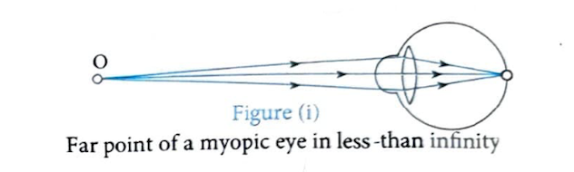
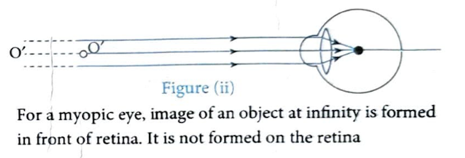
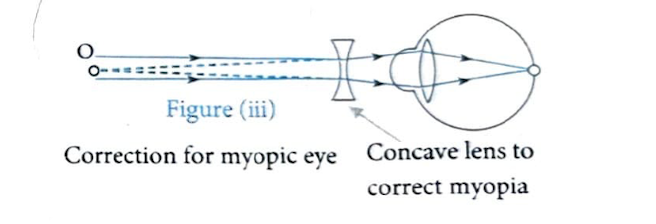
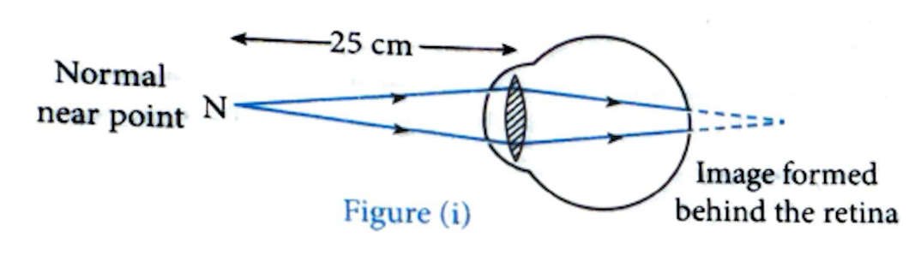
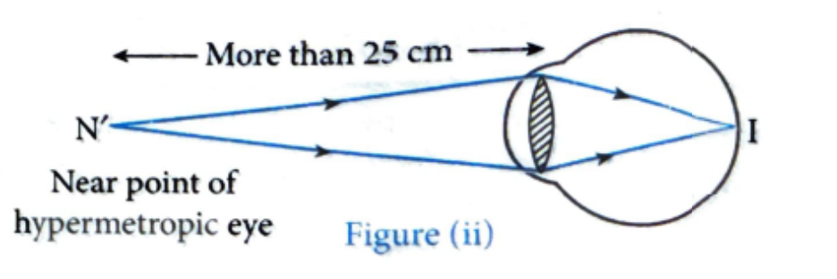
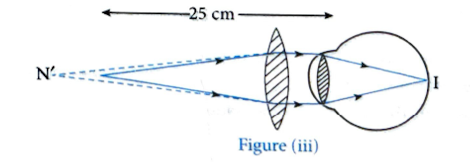

# Concept: Defects of Vision

---

## Introduction

Defects occurs when a person is not able to see the objects distinctly and comfortably without strain on eyes. It is due to the optical defects of the eye. The common refractive defects of vision include myopia, hypermetropia and presbyopia.

---

## 2.1 Myopia (Short-sightedness or Near-sightedness)

In this defects, a person is not able to see the distant objects clearly, however he can see the nearby objects clearly.

### Characteristics

- The far point of a person with this defect becomes closer than infinity.
- This defect arises due to increase in the curvature of the eye lens or decrease in the focal length of the eye lens or elongation of the eyeball.
- In this defect, the image of the distant object is formed in front of the retina.

  
  
<em>Figure (i): Far point of a myopic eye in less than infinity</em>

  
  
<em>Figure (ii): For a myopic eye, image of an object at infinity is formed in front of retina. It is not formed on the retina</em>

### Correction

This defect can be corrected by using a spectacles having diverging (concave) lens of suitable power. Purpose of using this lens is to shift the object at far point of the eye.

  
  
<em>Figure (iii): Correction for myopic eye - Concave lens to correct myopia</em>

### Power of Corrective Lens

The power (P) of the lens needed to correct this defects is:

$$P = \frac{-1}{F}$$ 

[Here, F is the far point in metre]

**Proof:**

Here, \\(u = -\infty\\), \\(v = -F\\) and \\(f_{lens} = f\\)

$$\frac{1}{v} - \frac{1}{u} = \frac{1}{f} \Rightarrow \frac{1}{f} = \frac{1}{-F} - \frac{1}{-\infty} \Rightarrow \frac{1}{f} = \frac{1}{-F} \Rightarrow P = \frac{-1}{F}$$

---

## 2.2 Hypermetropia or Hyperopia (Long-sightedness or Far-sightedness)

In this defect, a person is not able to see the nearby objects clearly, however he can see the distant objects clearly.

### Characteristics

- In this defect, the light rays from the nearby objects are focused at a point behind the retina of the eye.
- The near point of a person with this defect becomes greater than the normal near point (i.e. 25 cm).
- This defects arises due to decrease in the curvature of the eye lens or increase in focal length of the eye lens or the eyeball has become too small.

  
  
<em>Figure (i): Image formed behind the retina</em>

  
  
<em>Figure (ii): Near point of hypermetropic eye (More than 25 cm)</em>

### Correction

This defect can be corrected by using a spectacles having converging (convex) lens of suitable power. Purpose of using this lens is to shift the object at the near point of the eye.

  
  
<em>Figure (iii): Correction for hypermetropic eye using convex lens</em>

### Power of Corrective Lens

Power of the lens needed to correct the defect is:

$$P = \frac{1}{f} = \left[\frac{1}{0.25} - \frac{1}{N.P}\right]$$

or 

$$P = \left[4 - \frac{1}{N.P}\right]$$

N.P = near point

[Here, N.P. (Near point) should be in meter]

**Proof:**

Here, \\(u\\) = Near point for normal eye = \\(-0.25\\) m, \\(v\\) = Near point of hypermetropic eye = \\(-N.P\\)

and \\(f_{lens} = f\\)

$$\text{As } \frac{1}{v} - \frac{1}{u} = \frac{1}{f} \Rightarrow \frac{1}{-N.P} - \frac{1}{-0.25} = \frac{1}{f} \Rightarrow P = \left[4 - \frac{1}{N.P}\right]$$

---

## 2.3 Presbyopia

The power of accommodation of the eye usually decreases with ageing. For most people, the near point gradually recedes away. This defects is also called as old sightedness (far-sightedness of old person).

### Characteristics

- Presbyopic person finds it difficult to see the nearby objects comfortably and distinctly.
- This defect usually occurs in old age because of gradual weakening of the ciliary muscles and diminishing flexibility of the eye lens and thereby ciliary muscles lose their elasticity and so cannot change the focal length of the eye lens effectively.

### Correction

Sometimes, a person may suffer from both myopia and hypermetropia. In such case, the defect can be corrected by using the spectacles having bifocal lenses such that the lower portion of the bifocal lens is a convex lens to focus the nearby objects and the upper portion of the bifocal lens is a concave lens so as to focus the distant objects.

---

## 2.4 Astigmatism

In this defect, the vision of a person becomes blurred because he is not able to focus on both horizontal as well as vertical lines simultaneously.

### Characteristics

- This defect occurs due to the irregular shape of cornea or the imperfect spherical nature of the eye lens and this is why the focal length of the eye lens in two perpendicular directions becomes different.

### Correction

- The defect can be corrected by using spectacles having cylindrical lens.

---

## 2.5 Cataract

### Characteristics

- In this defect, vision of eye gradually decreases and is ultimately lost.
- In this defect, the eye lens of a person loses its transparency and becomes opaque.
- It occurs because of formation of membrane over the eye lens.
- It can be corrected by cataract surgery.
- It is more common in older people but it can occur at any age.

---

## Important Insights

  
Our two eyes give us a wider field of view of about 180°. So we are three-dimensional. If we had only one eye then the field of view would have been 15° we would be two dimensional.

---

## Examples

### Example 1

**Problem:** A man who wears the corrective lenses of power + 3D, has to hold a newspaper at 25 cm away to see the print clearly. How far away would the newspaper have to be, if he took off the corrective lenses and still, wanted a clear vision?

**Solution:**

Here, \\(u = -25\\) cm; \\(P = +3D\\); \\(v = ?\\)

The corrective lenses have the focal length \\(f = \frac{1}{P} = \frac{1}{3}\\) m = \\(\frac{100}{3}\\) cm

And the lens formula gives \\(\frac{1}{v} - \frac{1}{u} = \frac{1}{f}\\)

$$\Rightarrow \frac{1}{v} = \frac{1}{-25} = \frac{1}{100/3} \Rightarrow v = \frac{3}{100} = \frac{1}{25} \Rightarrow v = -100 \text{ cm}$$

which means that the corrective used by man form the clear images at 100 cm of the objects placed at 25 cm, i.e., the near point of man is at 100 cm. Therefore, without wearing the correctivelenses the man must hold the newspaper at 100cm for the clear vision.

---

### Example 2

**Problem:** What should be the focal length of corrective lenses required by a person for reading a book, if his near point is at 90 cm?

**Solution:**

The book is kept at the least distance of distance vision D =25 cm, i.e, \\(u = -25\\) cm and corrective lenses used to form the clear images at 90 cm, which is the near point of person, i.e., \\(v = -90\\) cm. Therefore, according to the lens formula,

We have

$$\frac{1}{v} - \frac{1}{u} = \frac{1}{f}$$

$$\Rightarrow \frac{1}{-90} - \frac{1}{-25} = \frac{1}{f}$$

$$\Rightarrow \frac{1}{f} = \frac{-5+18}{18 \times 25} \Rightarrow f = 34.6 \text{cm}$$

---

### Example 3

**Problem:** What must be the nature of the lens used in spectacles of a person suffering from myopia?

**Solution:**

Concave lens.

---

## Test Yourself

  <ol start="3" style="margin: 0; padding-left: 20px;">
    <li style="padding: 8px 0;">How do we see the object?</li>
    <li style="padding: 8px 0;">How can we cure myopia and hypermetropia?</li>
  </ol>

---

## Navigation

[← Previous: Human Eye](01-concept-human-eye.html) | [Next: Persistence of Vision →](03-concept-persistence-vision.html)

---

  
  
<em>Figure: Vision defects</em>

