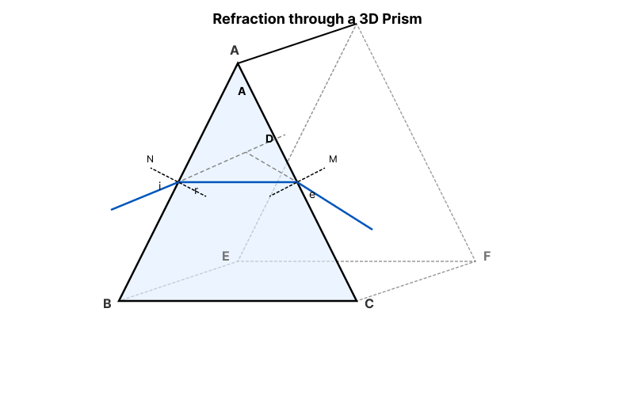
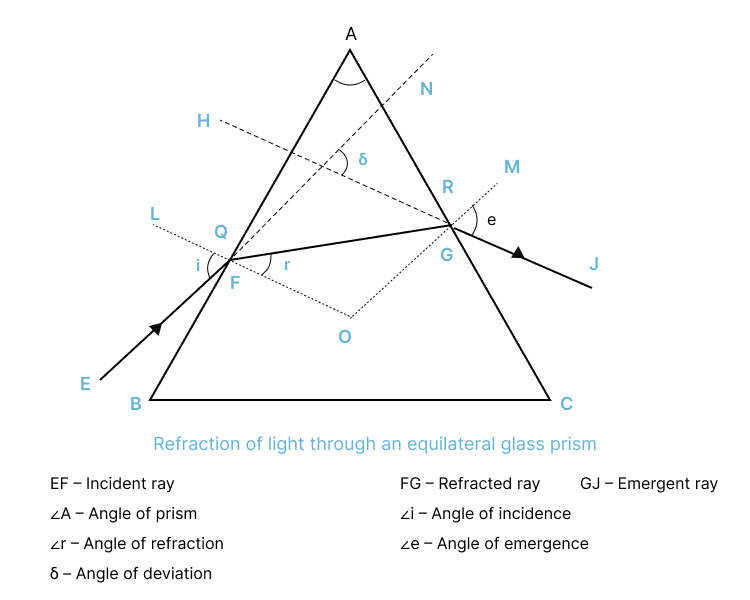
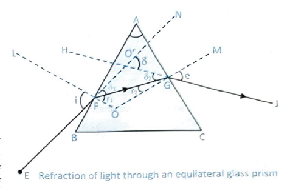
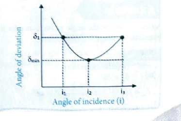

# Concept: Refraction of Light Through a Prism

---

## 4. REFRACTION OF LIGHT THROUGH A PRISM

Prism is a piece of glass or any other transparent material, bounded by two triangular and three rectangular surfaces. The rectangular surfaces are known as refracting surfaces. The angle between the two given refracting surfaces is called refracting angle or angle of prism. The line along which the two refracting surfaces meet is called the refracting edge. Any section of the prism, which is perpendicular to refracting edge is called principal section of prism.

In figure, ABC is the principal section of the prism. For drawing ray diagrams only principal section is used. Refraction of light through an equilateral glass prism is shown below:

  
  
<em>Figure: Refraction of light through a prism</em>

  
  
<em>Figure: Refraction of light through a prism</em>

### Ray Notation and Angles

- **EF** - Incident ray
- **FG** - Refracted ray
- **GJ** - Emergent ray
- $\angle A$ - Angle of prism
- $\angle i$ - Angle of incidence
- $\angle r$ - Angle of refraction
- $\angle e$ - Angle of emergence
- $\delta$ - Angle of deviation

---

## Important Definitions

### (i) Angle of Deviation

The angle between the incident ray and emergent ray is called angle of deviation.

### (ii) Angle of Prism

The angle of a prism or the refracting angle of a prism is the angle between the plane on which light is incident and the plane from which light emerges.

### (iii) Angle of Incidence

It is the angle that incident ray makes with the normal to the plane where the ray first enters the prism.

### (iv) Angle of Emergence

It is the angle made between the emergent ray and the normal to the plane from which light emerges out.

---

## INSIGHTS

  <ul style="margin: 0;">
    <li>Any two non-parallel refracting surfaces is called prism.</li>
    <li>It may be of any shape.</li>
  </ul>

---

## The Prism Equation

Let ABC be the principal section of the prism with BC as the base and A as the angle of the prism as shown in figure.

The incident ray EF after suffering refraction at a front face $AB$ goes along $FG$, and finally emerges on the second refracting surface $AC$ along $GJ$. In this process the light ray deviates from its original path by an angle $\delta$.

Let $i, r_1, \delta_1$ be the angle of incident, angle of refraction and angle of deviation respectively at the first face AB. Let $e, r_2$ and $\delta_2$ be the angle of emergence, angle of incidence and angle of deviation respectively at the second face.

  
  
<em>Figure: Derivation of prism equation</em>

From $\Delta O'GF$, $\delta = \delta_1 + \delta_2$

$$
\begin{aligned}
& \delta=(i-r_1)+(e-r_2) \\
& \delta=i+e-(r_1+r_2) \quad \text{...(i)}
\end{aligned}
$$

From $\triangle AFG$

$$
\begin{aligned}
& A+(90-r_1)+(90-r_2)=180^{\circ} \\
& A=r_1+r_2 \quad \text{...(ii)}
\end{aligned}
$$

Substituting this value in equation (i),

$$
\begin{aligned}
& \delta=i+e-A \\
& A+\delta=i+e \\
& i+e=A+\delta \quad \text{...(iii)}
\end{aligned}
$$

This is the **prism equation**.

---

## Angle of Minimum Deviation

The angle $e$ is determined by the angle of incidence $i$. Thus, the angle of deviation $\delta$ is also determined by $i$. For a particular value of angle of incidence, the angle of deviation is minimum. In this situation, the ray passes parallel to the base of the isosceles or equilateral prism.

For minimum deviation $i=e$ and if $i=e$, we can get $r_1=r_2=r$

From eqn. (iii), we have

$$
\begin{aligned}
& \delta_{\mathrm{m}}=i+i-A \\
& i=\left(\frac{A+\delta_m}{2}\right)
\end{aligned}
$$

From eqn. (ii), we have

$$
A=r+r \Rightarrow r=\frac{A}{2}
$$

---

  
  
<em>Figure: Angle of minimum deviation</em>

### Refractive Index Using Minimum Deviation

Using Snell's law,

$$
\mu=\frac{\sin i}{\sin r}=\frac{\sin \left(\frac{A+\delta_m}{2}\right)}{\sin \left(\frac{A}{2}\right)}
$$

---

## Thin Prism

Prisms having very small angle between its refracting surfaces are known as thin prism. Here $A$ is small, So $r_1$ and $r_2$ are small, and so $i$ and $e$ are small.

### Deviation Produced by a Thin Prism

According to the prism equation,

$$
\begin{aligned}
& A+\delta=i+e \\
& \delta=i+e-A \quad \text{...(vii)}
\end{aligned}
$$

Using Snell's law at face AB

$$
\mu=\frac{\sin i}{\sin r}=\frac{i}{r_1} \quad \therefore i=\mu r_1 \quad \text{[for small } \theta, \sin \theta \approx \theta \text{]}
$$

Similarly, $e=\mu r_2$

Substituting these value in eqn. (vii)

$$
\begin{aligned}
& \delta=\mu r_1+\mu r_2-A \\
& \delta=\mu(r_1+r_2)-A \\
& \delta=\mu A-A \\
& \delta=(\mu-1) A
\end{aligned}
$$

Hence, deviation produced by a thin prism is **independent of the angle of incidence**.

---

## Examples

### Example 4

**Problem:** A ray of light incident at an angle $48^{\circ}$ on a prism of refracting angle $60^{\circ}$ suffers minimum deviation. Calculate the angle of minimum deviation.

**Solution:**

$$
\begin{aligned}
& i=48^{\circ}, A=60^{\circ} \\
& \delta_m=2i-A \Rightarrow \delta_m=2 \times 48-60=36^{\circ}
\end{aligned}
$$

---

### Example 5

**Problem:** What should be the angle of incidence for a ray of light, which suffers a minimum deviation of $36^{\circ}$ through an equilateral prism?

**Solution:**

$A=60^{\circ}$ (equilateral prism)

$i=?$ $\quad$ $\delta_m=36^{\circ}$

$$\therefore \delta_m=2i-A \quad \therefore i=\frac{A+\delta_m}{2}=48^{\circ}$$

---

## INSIGHTS: Key Points

  
### A. Factors affecting angle of deviation

- The angle of incidence ($i$)
- The material of prism ($\mu$)
- The angle of prism ($A$)
- The wavelength ($\lambda$) of light

### B. Angle of deviation

$$\delta=(i+e)-A$$

Where:
- $i$ = angle of incidence
- $e$ = angle of emergence
- $A$ = Angle of prism

### C. For minimum deviation

- Refracted ray becomes parallel to the base of prism
- $i=e$ and $r_1=r_2$

$$
\begin{aligned}
& \therefore \delta_m=i+i-A \\
& \delta_m=2i-A
\end{aligned}
$$

---

## Navigation

[← Previous: Persistence of Vision](03-concept-persistence-vision.html) | [Next: Dispersion of Light →](05-concept-dispersion.html)
