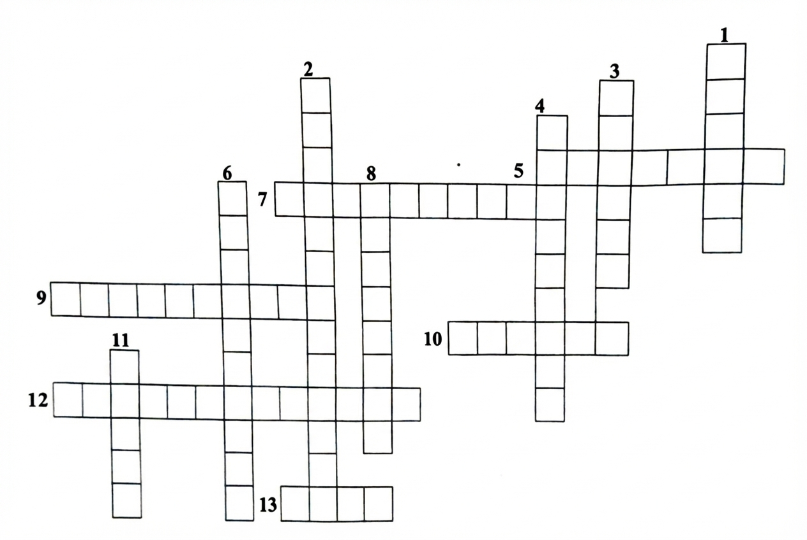

# Concept Application Exercise 1

**Topics Covered:** Human Eye, Defects of Vision, Accommodation

[View Solutions →](13-concept-application-solutions.html#exercise-1)

---

## Questions

### Question 1

A person needs a lens of power -5.5 diopters for correcting his distant vision. For correcting his near vision, he needs a lens of power +1.5 diopters. What is the focal length of the lens required for correcting?

**(i)** Distant vision, **(ii)** Near vision
1. -17 cm, 60 cm
2. -15 cm, 40 cm
3. -18.18 cm, 66.6 cm
4. -10 cm, 42 cm

---

### Question 2

To correct myopic defect, the focal length of the concave lens should be

1. Equal to the distance of far point
2. Less than the distance of far point
3. Less than the distance of near point
4. Equal to the distance of near point

---

### Question 3

A far sighted person cannot focus clearly on object that are less than 145 cm from his eyes. To correct this problem, the person wear eyeglass that are located 2 cm in front of his eyes. Determine the focal length of lens that will permit this person to read a newspaper at a distance of 32.0 cm from his eyes.

1. 38 cm
2. 28 cm
3. 30 cm
4. 10 cm

---

### Question 4

The change in the focal length of the eye lens is caused by the action of the ______.

1. Pupil
2. Retina
3. Ciliary muscles
4. Iris

---

### Question 5

The least distance of distinct vision for an adult man/woman is ______.

1. 25 cm
2. 2.5 m
3. 25 m
4. 25 mm

---

### Question 6

The human eye can focus objects at different distances by adjusting the focal length of the eye lens. This is known as

1. Presbyopia
2. Accommodation
3. Myopia
4. Astigmatism

---

### Question 7

Hypermetropia is the defect of vision due to which a person finds difficulty in seeing the

1. Distant objects
2. Nearby objects
3. Object at all distances
4. Colours

---

### Question 8

A person is suffering from the defect of astigmatism, its main reason is

1. Decrease in the focal length of the eye lens
2. Power of accommodation of the eye is decreased
3. Irregular shape of cornea or the imperfect spherical nature of the eye lens
4. Increase in the focal length of the eye lens

---

## Solve the following riddles:

### Question 9

**Riddle:** I'm a part of you that lets you see,
Colors and shapes, as clear as can be.
I'm sensitive to light, day and night,
Without me, the world would be quite a sight.
What am I?

---

### Question 10

**Riddle:** In the daylight, I'm open wide,
Letting light in with joy and pride.
In the dark, I'll constrict and shrink,
Helping you adjust to what you think.
What am I?

---

### Question 11

**Riddle:** With cones and rods, I perceive the view,
Translating light into images true.
I help you distinguish what's near and far,
Whether under the sun or the twinkling star.
What am I?

---

### Question 12

**Riddle:** I'm a lens that bends and focuses light,
Helping you see clearly, day and night.
From distant landscapes to pages of a book,
I aid your vision with a careful look.
What am I?

---

### Question 13

**Riddle:** I see what's close, with clarity grand,
But distant scenes slip from my hand.
Eyeglasses aid my sight's chase,
What am I, in a visual embrace?

---

### Question 14

**Solve the following crossword puzzle:**

  

**Across:**
- **5.** Biconvex lens present in eyes.
- **7.** It is a defect of human eye, due to which an old person cannot read and write comfortably.
- **9.** Lens which converge the entire parallel light beam.
- **10.** Screen on which the image is formed in eye.
- **12.** The space between cornea and lens filled with the liquid that is called.
- **13.** It is a circular diaphragm present behind the cornea with a hole in its centre.

**Down:**
- **1.** The front transparent part of the eye.
- **2.** The space between eye lens and retina is filled with a jelly like material known as.
- **3.** Part of human eye that act like a shutter.
- **4.** The minimum distance at which the object can see clearly without causing any strain.
- **6.** A small region situated at the centre of the retina is most sensitive for light is called the yellow spot.
- **8.** The band of coloured component of a light beam.
- **11.** It is a hole present at the centre of the iris and controls the amount of the light to be entered in the eye.

---

## Navigation

[← Previous: Colors](09-concept-colours-objects.html) | [Next: Exercise 2 →](11-concept-application-exercise-2.html)
