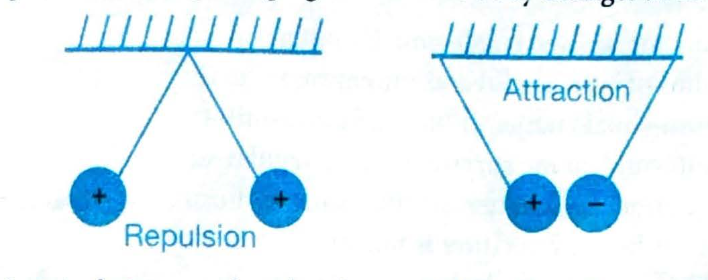
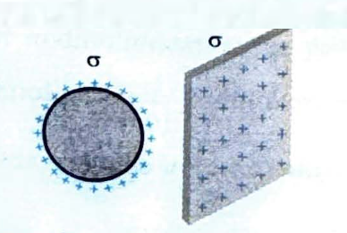
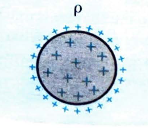

# 01. Electric Charge

## OVERVIEW

**Charge** is the basis of all electrical phenomena and is measured in **coulombs (C)**, which is the SI unit.

* **Matter Composition:** Matter is composed of **protons**, **electrons**, and **neutrons**.
  * **Protons** carry a positive charge of $1.6 \times 10^{-19}$ C
  * **Electrons** carry an equal negative charge
  * **Neutrons** have no net charge

* **Electrical Neutrality:** Normally, a body is electrically neutral with an equal number of protons and electrons. This balance can be disturbed, leading to an object becoming charged.

* **Example:** When a glass rod is rubbed with a silk cloth, electrons transfer from the glass rod to the silk. The silk becomes **negatively charged** (gains electrons), and the glass rod becomes **positively charged** (loses electrons, thus having more protons).

* **Interaction Between Charges:** Like charges repel, and unlike charges attract.

* **Electric Current:** The flow of charged particles (like electrons) in a particular direction, requiring a potential difference to flow.

* **Electricity** is a widely used form of energy.

* **Examples of Static Electricity:** Lightning and the shock from shaking hands.

* **Biological Effects:** Electricity affects muscle cells (e.g., heart contraction). An **electrocardiogram (ECG)** machine measures heart electricity.

***

## 1. ELECTRIC CHARGE

**Charge** is the property of matter that produces and experiences electrical and magnetic effects.

### Types of Charges

* **Positive Charge:** Occurs when an atom or object has more protons than electrons, resulting in an overall positive charge (e.g., an atom losing electrons).

* **Negative Charge:** Occurs when an atom or object has more electrons than protons, resulting in an overall negative charge (e.g., an atom gaining electrons).

**Summary:**
* **Positive charge:** More protons than electrons.
* **Negative charge:** More electrons than protons.

---

***

## 1.1 Properties of Electric Charge

It is known that every atom is electrically neutral containing as many electrons as the number of protons in the nucleus.

Charged particles are created by disturbing an atom's neutrality. Losing electrons results in a positive charge ($n_p > n_e$). The mass of the body changes during charging.

**Fundamental Principle:**
* Charges with the same electrical sign repel each other, and charges with opposite electrical signs attract each other.
* A charged body may attract a neutral body or a positively charged body, but it always repels a body having similar charges.
* **Repulsion is the surest test of electrification.**

### Key Properties

* **Quantization of charge:** The elementary unit of charge is that of an electron ($e = 1.6 \times 10^{-19}$ C). Any charge $Q$ on a body is an integral multiple of $e$, i.e., $Q = \pm ne$, where $n = 1, 2, 3...$ (natural numbers). This is because charge is acquired by gaining or losing electrons only.

* **Transferable:** Charge can be transferred from one body to another.

* **Associated with mass:** Charge cannot exist without mass; however, mass can exist without charge.

* **Conserved:** Charge can neither be created nor be destroyed (law of conservation of charge).

* **Invariant:** Charge is independent of the velocity of the charged particle.

* **Electric charge produces electric field ($\vec{E}$), magnetic field ($\vec{B}$), and electromagnetic radiations.**

**Field Production Based on Motion:**
* A stationary positive charge ($\vec{v} = 0$) produces "$\vec{E}$ only".
* A positive charge moving at constant velocity ($\vec{v} = \text{constant}$) produces "$\vec{E}$ and $\vec{B}$".
* A positive charge with non-constant velocity ($\vec{v} \neq \text{constant}$) produces "$\vec{E}, \vec{B}$ and radiates energy (EM waves)".

### Unit and Dimensional Formula

* **SI unit of charge:** ampere $\times$ s = coulomb (C).

* **Smaller unit:** $\mu$C (microcoulomb), $1 \mu$C = $10^{-6}$ C.

* **CGS unit of charge:** statcoulomb or electrostatic unit (esu).

* **Conversion:** $1 \text{ C} = 3 \times 10^9 \text{ stat coulomb} = \frac{1}{10} \text{ ab coulomb (absolute coulomb; abC)}$.

* **Electromagnetic unit (emu) of charge:** abC.

* **Conversion:** $1 \text{ abC} = 10 \text{ C}$.

***

## 1.2 Point Charge

If the separation between charges is much larger than their dimension, they can be considered as point charges.

A finite-sized body may behave like a point charge if it produces an inverse square electric field.

**Example:** An isolated charged sphere behaves like a point charge at a very large distance as well as at a very small distance close to its surface.

***

## 1.3 Charge on a Conductor

Charge on a conductor always resides on its **outer surface**. Both solid and hollow conducting spheres will hold maximum equal charge on their outer radius.

* For **uniform surfaces**, charge distributes uniformly.
* For **irregular surfaces**, charge distribution (charge density) is not uniform.
* Charge density is maximum where the radius of curvature is minimum, and vice versa.

**Formula:**
$$
\sigma \propto \frac{1}{R^2}
$$

This principle explains why charge leaks from sharp points.

***

## 1.4 Charge Distribution

Charge distribution can be either **continuous** or **discrete**.

### (i) Discrete distribution of charge

**Definition:** A system consisting of ultimate individual charges.

**Example:** A system with charges $Q_1, Q_2, Q_3, Q_4, Q_5$ at different points.

### (ii) Continuous distribution of charge

**Definition:** An amount of charge distributed uniformly or non-uniformly on a body. It is of following three types:

#### (a) Linear charge distribution

Charge distributed evenly or unevenly along a line (e.g., a charged straight wire or circular ring), denoted by lambda ($\lambda$).

**Formula:**
$$
\lambda = \frac{\text{Charge}}{\text{Length}} = \text{Linear charge density}
$$

**S.I. unit:** C/m

#### (b) Surface charge distribution

Charge distributed over a surface (e.g., a plane sheet of charge, a conducting sphere's surface, or a conducting cylinder's surface), denoted by sigma ($\sigma$).

**Formula:**
$$
\sigma = \frac{\text{Charge}}{\text{Area}} = \text{Surface charge density}
$$

**S.I. unit:** C/m²

#### (c) Volume charge density

Charge distributed throughout the volume of a body (e.g., a dielectric sphere), denoted by rho ($\rho$).

**Formula:**
$$
\rho = \frac{\text{Charge}}{\text{Volume}} = \text{Volume charge density}
$$

**S.I. unit:** C/m³

---

## TEST YOURSELF

**Question 1:** If two charges having equal radius of 2 cm are separated by 5 cm, will they be considered as a pair of point charges?

**Question 2:** Why does increasing negative charge on a body increase its mass?
