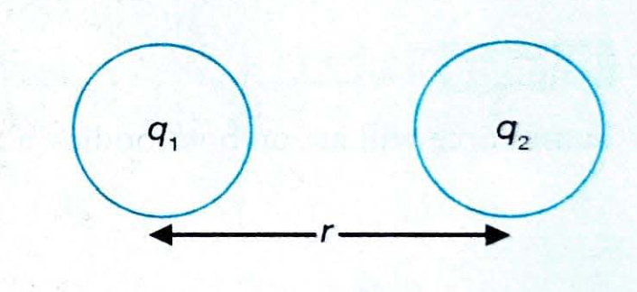
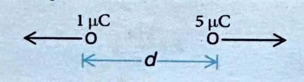

# 02. Coulomb's Law

## 2. COULOMB'S LAW

**Coulomb's Law:** The force between two point charges is directly proportional to the product of two charges and inversely proportional to the square of the distance between them.

If two point charges $q_1$ and $q_2$ are separated by a distance $r$ in medium, the magnitude of the force between them is given by

$$
F \propto q_1 q_2
$$

$$
F \propto \frac{1}{r^2}
$$

$$
F = \frac{k |q_1 q_2|}{\epsilon_r r^2}
$$

or

$$
F = \frac{1}{4 \pi \epsilon_0 \epsilon_r} \frac{|q_1 q_2|}{r^2}
$$

where $\epsilon_0$ is called the **permittivity of free space**.

**Value of $\epsilon_0$:**
$$
\epsilon_0 = 8.854 \times 10^{-12} \text{ C}^2 \text{ N}^{-1} \text{ m}^{-2}
$$

and $k = \frac{1}{4 \pi \epsilon_0} = 9 \times 10^9 \text{ Nm}^2/\text{C}^2$ (in vacuum).

$\epsilon_r$ = **Dielectric constant of medium**

### Key Characteristics of Coulomb's Force

* **(i)** This force is directed along the line joining the two charges.

* **(ii)** For like charges, it is repulsive (positive in sign); for unlike charges, it is attractive (negative in sign).

* **(iii)** Coulomb's force is analogous to the gravitational force. Both forces vary inversely as the square of the distance between two particles.

***

## Examples

### Example 1

**Problem:** From the given set of charges, which charge(s) is/are not possible?

(a) $0.8 \times 10^{-16}$ C

(b) $3.2 \times 10^{-20}$ C

**Solution:**

**(a)** Given charge: $0.8 \times 10^{-16}$ C

Using $Q = ne$, where $e = 1.6 \times 10^{-19}$ C

$$
n = \frac{0.8 \times 10^{-16}}{1.6 \times 10^{-19}} = 500
$$

500 is an integer; so, it is possible.

**(b)** Given charge: $3.2 \times 10^{-20}$ C

Using $Q = ne$

$$
n = \frac{3.2 \times 10^{-20}}{1.6 \times 10^{-19}} = \frac{1}{5}
$$

$\frac{1}{5}$ is a fraction; so, it is not possible.

---

### Example 2

**Problem:** There are two charges +1 µC and +5 µC separated by some distance. The ratio of the forces acting on them be

(1) 1:5

(2) 1:1

(3) 5:1

(4) 1:25

**Solution:** (2)

**Explanation:** Same force will act on both bodies, although their directions will be different.

---

### Example 3

**Problem:** According to Coulomb's law, which of the following is correct for the attraction?

(1) $q_1 q_2 < 0$

(2) $q_1 q_2 > 0$

(3) $q_1 q_2 = 0$

(4) $q_1 q_2 > 100$ C

**Solution:** (1)

**Explanation:** For attraction, one charge should be positive, and other should be negative. So, their product of magnitude is negative.

---

### Example 4

**Problem:** A charge $q$ is placed at the centre of the line joining two equal charges $Q$, the system of the three charges will be in equilibrium, if $q$ is equal to

(1) $-Q/2$

(2) $-Q/4$

(3) $+Q/4$

(4) $+Q/2$

**Solution:** (2)

**Explanation:** For equilibrium, net force on $q$, $Q$ and $Q$ should be zero.

For net force on $Q$ being zero: $(F_{\text{net}})_Q = 0$

$$
\frac{kQQ}{(2x)^2} + \frac{kQq}{x^2} = 0
$$

$$
\frac{Q}{4} + q = 0
$$

$$
q = -\frac{Q}{4}
$$

---

### Example 5

**Problem:** Two point charges +3 µC and +8 µC repel each other with a force of 40 N. If a charge of -5 µC is added to each of them, then force between them will become _____

**Solution:**

Redistribution of charges takes place.

**Initial charges:**
* Charge $q_1 = 3$ µC
* Charge $q_2 = 8$ µC

**When charge $q_3 = -5$ µC is added to each:**
* $q_1 = 3 - 5 = -2$ µC
* $q_2 = 8 - 5 = 3$ µC

**Calculations:**

Initially, $40 = \frac{1}{4\pi\epsilon_0} \cdot \frac{3 \times 8}{r^2}$

Finally, $F = \frac{1}{4\pi\epsilon_0} \cdot \frac{(-2) \times 3}{r^2}$

So, $\frac{F}{40} = \frac{(-2) \times 3}{3 \times 8}$

$F = -10$ N

The negative sign indicates attraction.
