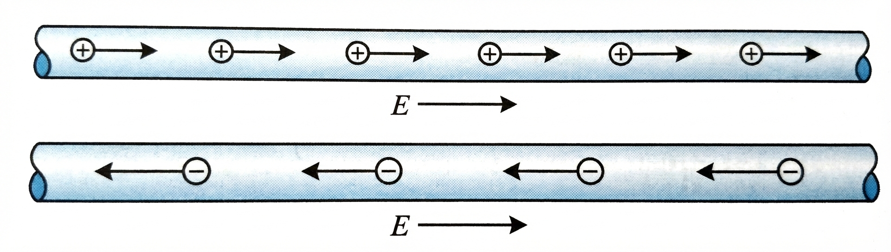
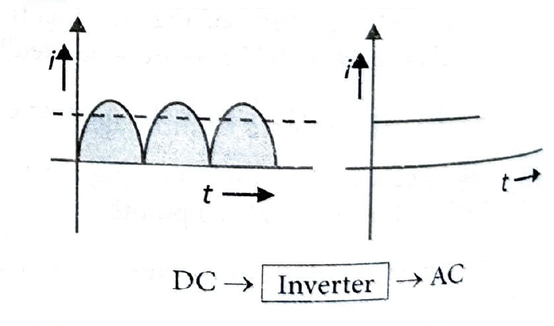
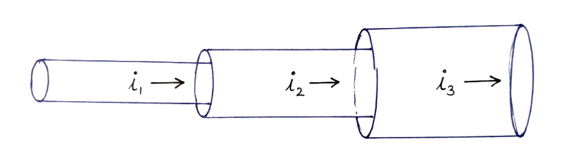

# 07. Electric Current

## Definition of Current

The time rate of flow of charge through any cross section in a particular direction is called current:

$$i = \lim_{\Delta t \to 0} \frac{\Delta Q}{\Delta t}$$

If flow is uniform, then:

$$i = \frac{Q}{t}$$

Current is a scalar quantity.

**Units:**
* Its SI unit is ampere (A)
* CGS unit is emu called Biot (Bi)
* $1 \text{ A} = \frac{1}{10} \text{ Bi}$

---

## Conventional Direction of Current

The conventional direction of current is taken to be the direction of flow of positive charge, i.e., in the direction of electric field, and is opposite to the direction of flow of negative charge as shown below.

*Figure: Conventional direction of current - horizontal cylindrical conductor showing positive charges flowing right, negative charges flowing left, with current and electric field directions*

**Key Points:**
* The net charge in a current-carrying conductor is zero.
* Conventional current flows in the direction of positive charge movement
* Actual electron flow is opposite to conventional current direction

---

## Definition of 1 Ampere of Current

1 ampere is the electric current flowing through a conducting wire when 1 coulomb charge flows through it in 1 second.

$$1 \text{ ampere} = \frac{1 \text{ coulomb}}{1 \text{ sec}} = 1 \text{ Cs}^{-1}$$

**Alternative Definition:** 1 ampere of current means the flow of $6.25 \times 10^{18}$ electrons/sec through any cross section of the conductor.

---

## 7.1 Two Types of Current

Current is of two types: (i) direct current (DC), and (ii) alternating current (AC).

### Difference between AC and DC

**Alternating Current (AC):**
* **(i)** Direction of current changes after regular interval.
* **(ii)** Shows only heating effect.
* **(iv)** Symbol: ~ (wavy line)

*Figure: Alternating Current (AC) waveforms - sine wave and square wave patterns*

**Direct Current (DC):**
* **(i)** Direction of current do not change with time.
* **(iii)** Shows heating effect, chemical effect, and magnetic effect of current.
* **(iv)** Symbol: — (long line) and — (short line), representing positive and negative terminals

*Figure: Direct Current (DC) waveforms - rectified sine wave and constant current*

**Note:** AC → Rectifier → DC (rectifier converts AC to DC)  
**Note:** DC → Inverter → AC (inverter converts DC to AC)

---

## Current in Conductors

For a given conductor, the current does not change with changes in cross-sectional areas.

*Figure: Current remains constant through conductor segments with varying cross-sectional areas (i₁ = i₂ = i₃)*

**Formulas for Current:**

* If $n$ particles each having a charge $q$ pass through a given area in time $t$, then:
  $$i = \frac{nq}{t}$$

* If $n$ particles each having a charge $q$ pass per second per unit area, then the current associated with the cross-sectional area $A$ is:
  $$i = nqA$$

* If there are $n$ particles per unit volume each having a charge $q$ and moving with velocity $v$, then the current through the cross-sectional area $A$ is:
  $$i = nqvA$$

---

## Current Carriers

The charged particles, whose flow is in a definite direction, constitute the electric current and are called current carriers. In different situations, current carriers are different.

*Figure: Current carriers - diagram showing different charge carriers (electrons, ions, holes) in various conducting media*

* **(i) Solids:** In solid conductors like metals, current carriers are free electrons.
* **(ii) Liquids:** In liquids, current carriers are positive and negative ions.
* **(iii) Gases:** In gases, current carriers are positive ions and free electrons.
* **(iv) Semiconductor:** In semiconductors, current carriers are holes and free electrons.

---

## INSIGHTS

**Skin Effect:** DC flows uniformly throughout the cross section of conductor, whereas AC mainly flows through the outer surface area of the conductor. This is known as SKIN EFFECT.

---

## Examples

See worked examples: [Electric Current - Worked Examples](07-electric-current-examples.html)

