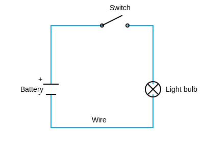
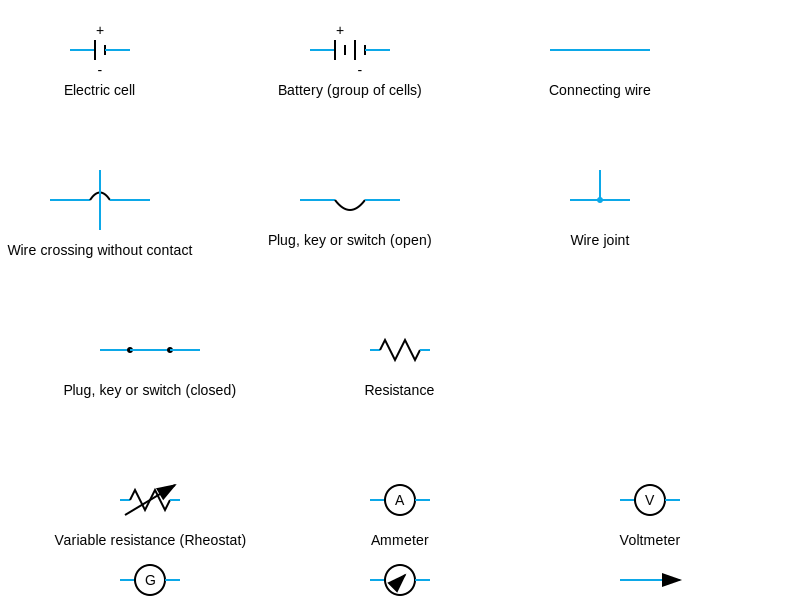

# 09. Electrical Circuits

## Definition

**Electric Circuit:** A continuous and closed path of an electric current. An electric circuit is a combination of some active and passive elements forming a closed loop.

**Active Elements:** Elements of a circuit which provide electrical energy to the circuit are called the active elements, i.e., cell, battery, generator, etc.

**Passive Elements:** Elements of a circuit which consume or store the electrical energy from the circuit are called passive elements, i.e., resistance, capacitor, inductor, etc.

**Circuit Diagram:** A schematic diagram in which different components (or elements) of a circuit are represented by symbols.

---

## Basic Circuit Example

---

## Circuit Symbols

The various conventional electrical symbols used to represent some of the most commonly used electrical components in an electrical circuit diagram are as follows:

**Common Symbols:**
* **Electric cell:** Long thin line and short thick line
* **Battery (group of cells):** Multiple cell symbols connected
* **Connecting wire:** Simple horizontal line
* **Wire joint (junction):** Two wires crossing with a dot at intersection
* **Wire crossing without contact:** Two wires crossing with semicircular hump
* **Resistance:** Zigzag line
* **Plug, key or switch (open):** Two dots with gap between them
* **Plug, key or switch (closed):** Two dots connected or toggle switch symbol
* **Variable resistance (Rheostat):** Zigzag line with arrow
* **Ammeter:** Circle with letter 'A'
* **Voltmeter:** Circle with letter 'V'
* **Galvanometer:** Circle with letter 'G' or needle
* **Arrow shows direction of current:** Simple arrow pointing right

