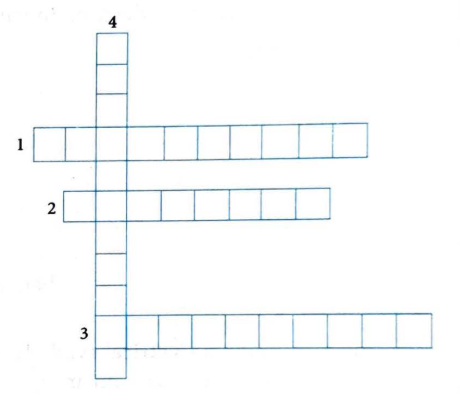

# Concept Application Exercise 2

**Note:** This exercise covers concepts from sections 07-08: Electric Current and Ohm's Law.

[View Solutions →](concept-application-exercise-2-solutions.html)

---

**Problem 1:** One ampere-hour is equal to

(1) 3600 C

(2) 3600 A

(3) 36000 J

(4) 3600

---

**Problem 2:** If the electric current through an electric bulb is 3.2 A, the number of electrons that flow through it is

(1) $3 \times 10^9$

(2) $2 \times 10^{19}$

(3) $3.2 \times 10^9$

(4) $1.6 \times 10^{19}$

---

**Problem 3:** Calculate the resistance of a copper wire of length 1 m and area of cross section 2 mm². Resistivity of copper is $1.7 \times 10^{-8}$ Ωm.

(1) $8.5 \times 10^{-5}$ Ω

(2) $7.5 \times 10^{-3}$ Ω

(3) $9.5 \times 10^{-3}$ Ω

(4) $8.5 \times 10^{-3}$ Ω

---

**Problem 4:** A wire 50-cm long and 1 mm² in cross section carries a current of 4 A when connected to 2-V battery. The resistivity of the wire is

(1) $2 \times 10^{-1}$ Ωm

(2) $5 \times 10^{-7}$ Ωm

(3) $4 \times 10^{-6}$ Ωm

(4) $1 \times 10^{-6}$ Ωm

---

**Problem 5:** Two copper wires, one of length 1 m and the other of length 9 m, have the same resistance. Their diameters are in the ratio

(1) 3:1

(2) 1:3

(3) 9:1

(4) 1:9

---

**Problem 6:** The electric resistance of a certain wire of iron is R. If its length and radius are both doubled, then

(1) The resistance will be doubled, and the specific resistance will be halved

(2) The resistance will be halved, and the specific resistance will remain unchanged

(3) The resistance will be halved, and the specific resistance will be doubled

(4) Both the resistance and the specific resistance will remain unchanged

---

**Problem 7:** Two wires A and B of equal masses and of the same metal are taken. The diameter of wire A is half of the diameter of wire B. If the resistance of wire A is 24 Ω, then the resistance of wire B will be

(1) 3 Ω

(2) 1.5 Ω

(3) 4.5 Ω

(4) 6 Ω

---

**Problem 8:** A current of 0.5 A is drawn by a filament of an electric bulb for 10 minutes. Find the amount of electric charge that flows through the circuit.

---

**Problem 9:** Name a device that helps to maintain a potential difference across a conductor.

---

**Problem 10:** What is the commercial unit of electrical energy? Represent it in terms of joules.

---

**Problem 11:** A wire of length 3 m and area of cross section $1.7 \times 10^{-6}$ m² has a resistance $3 \times 10^{-2}$ ohm.

**(a)** What is the formula for resistivity of the wire, and what is its unit?

**(b)** Calculate the resistivity of the wire.

---

**Problem 12:** The table given below shows the resistivity of three materials X, Y and Z:

**(a)** Arrange the samples in increasing order of conductivity.

**(b)** Which of these is the best conductor?

**(c)** Which of these is the best insulator?

---

**Problem 13:** Solve the following crossword puzzle:

**Clues:**

**Across:**
1. The materials that allow electricity to pass
2. Thin wire of electric bulb
3. Materials that do not allow electricity to pass

**Down:**
4. When the circuit is incomplete

---

**Problem 14:** Solve the following riddles:

**Riddle 1:** I flow through conductors, carrying charge with speed. I make devices come alive when in a closed loop I lead. What am I?

**Riddle 2:** I measure electric force, quantified in Volts I'm known. I power devices with my strength, when through circuits I'm shown. What am I?

**Riddle 3:** I'm a path for current, held by metal wires true. Without me, circuits can't complete, I'm essential through and through. What am I?

**Riddle 4:** I'm tiny, passive, limit current flow. In lights and appliances, I'm found below. With useful resistance, I'm defined. What am I?

---

[View Solutions →](concept-application-exercise-2-solutions.html)

