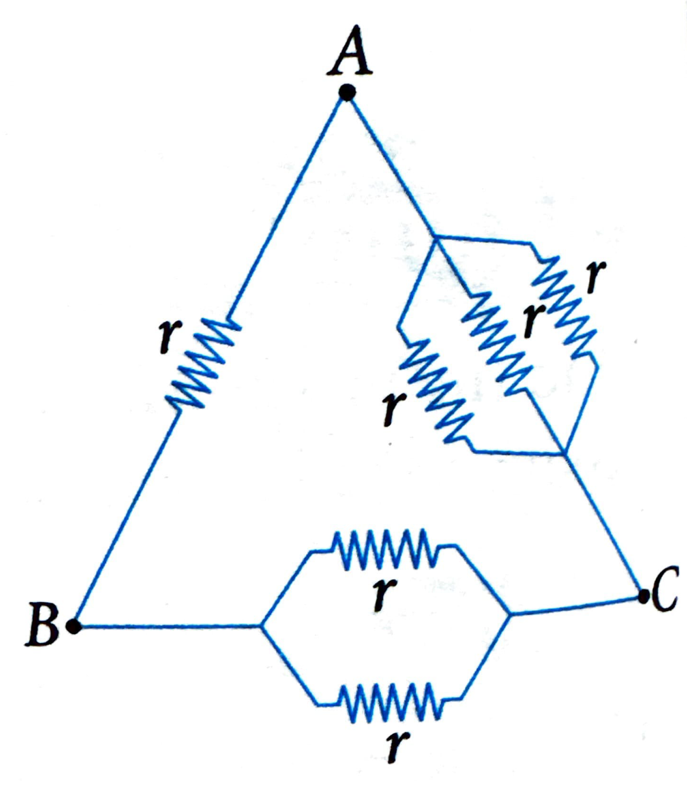
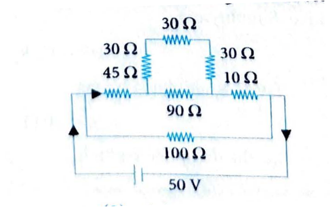
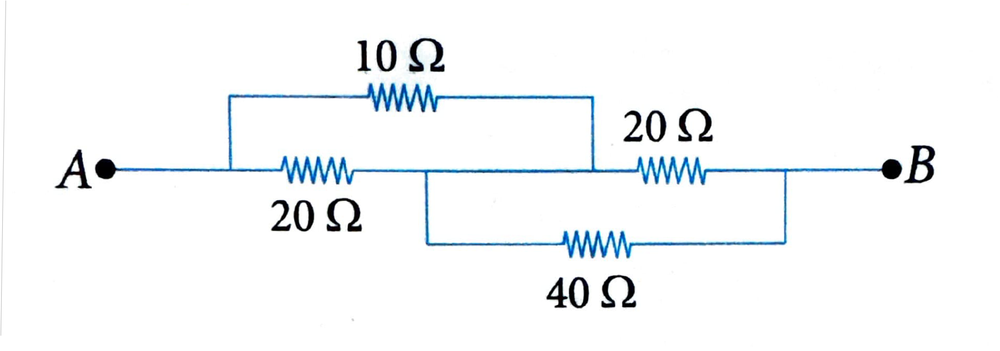
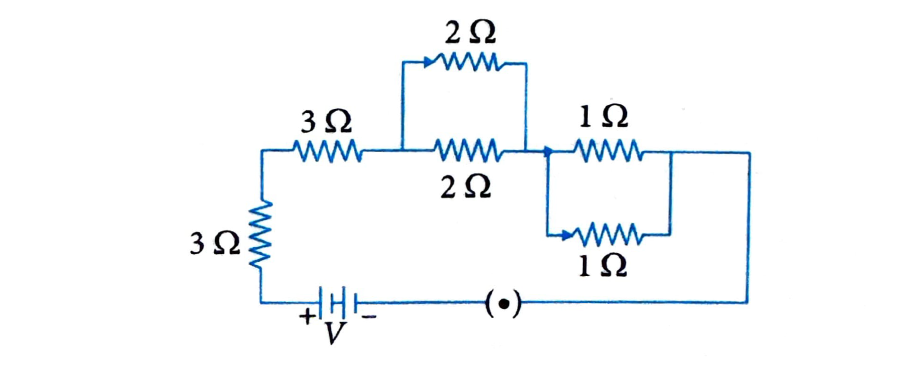
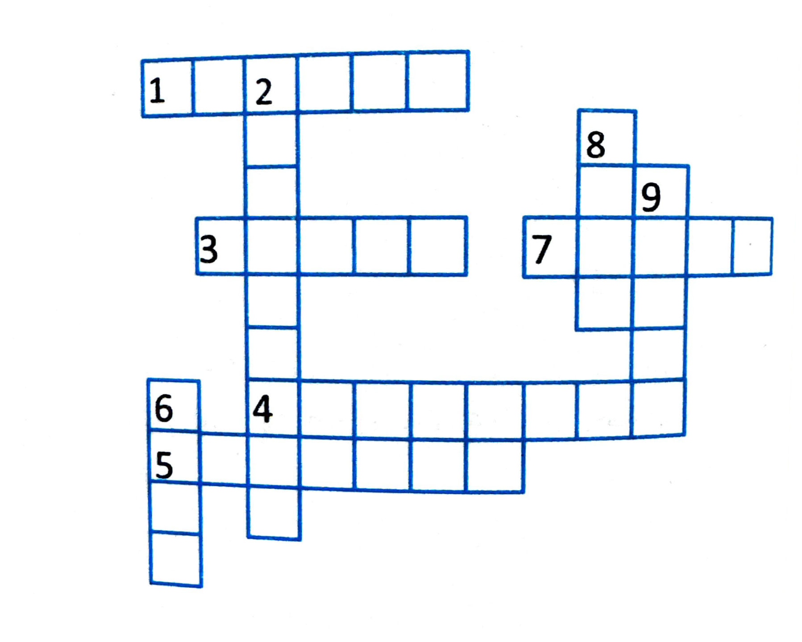

# Concept Application Exercise 3

**Note:** This exercise covers concepts from section 10: Combination of Resistors.

[View Solutions →](concept-application-exercise-3-solutions.html)

---

**Problem 1:** The equivalent resistance of two resistors connected in series is 6 Ω and their parallel equivalent resistance is $\frac{4}{3} \Omega$. What are the values of resistances?

(1) 4 Ω, 2 Ω  
(2) 4 Ω, 6 Ω  
(3) 6 Ω, 2 Ω  
(4) 8 Ω, 1 Ω

---

**Problem 2:** Four resistances 10 Ω, 5 Ω, 7 Ω, and 3 Ω are connected so that they form the sides of a rectangle AB, BC, CD, and DA, respectively. Another resistance of 10 Ω is connected across the diagonal AC. The equivalent resistance between A and B is:

(1) 2 Ω  
(2) 5 Ω  
(3) 7 Ω  
(4) 10 Ω

---

**Problem 3:** Six resistances each of value $r = 6 \Omega$ are connected between points A, B, and C as shown in the figure. If $R_1$, $R_2$, and $R_3$ are the net resistances between A and B, between B and C, and between A and C, respectively, then $R_1 : R_2 : R_3$ will be equal to:

(1) 6:3:2  
(2) 1:2:3  
(3) 5:4:3  
(4) 4:3:2

---

**Problem 4:** In the circuit given below, the current through 100 Ω resistor is:

(1) 0.5 A  
(2) 1 A  
(3) 0.25 A  
(4) 2 A

---
**Problem 5:** Find the equal resistance between points $A$ and $B$.

---
**Problem 6:** When a wire of uniform cross-section $a$, length $\ell$, and resistance $R$ is bent into a complete circle, resistance between any two of diametrically opposite points will be:

(1) $\frac{R}{2}$  
(2) $\frac{R}{4}$  
(3) $4R$  
(4) $\frac{R}{8}$

---

**Problem 7:** Find the equivalent resistance of the following circuit.

(1) 5.5 Ω  
(2) 7.5 Ω  
(3) 6.5 Ω  
(4) 8.5 Ω

---

**Problem 8:** If a wire 50 cm is stretched to make it 0.1% longer, its resistance will:

(1) Increase by 0.05%  
(2) Increase by 0.2%  
(3) Decrease by 0.2%  
(4) Decrease by 0.05%

---

**Problem 9:** Write the advantages of connecting electrical appliances in parallel and disadvantages of connecting them in series in a household circuit.

---

**Problem 10:** There are $m$ resistors each of resistance $R$. First, they all are connected in series and equivalent resistance is $X$. Now they are connected in parallel and equivalent resistance is $Y$. What is the ratio of $X$ and $Y$?

---

**Problem 11:** We have four resistors A, B, C, and D of resistance 4 Ω, 8 Ω, 12 Ω, and 24 Ω, respectively. Find:

**(a)** Lowest resistance which can be obtained by combining these four resistors.

**(b)** Highest resistance which can be obtained by combining these four resistors.

---

**Problem 12:** Complete the following formulas:

**Formulas:**

- **Ohm's law:** $V = IR$

- **Resistance in terms of length, area, resistivity:** $R = \frac{\rho \ell}{A}$

- **Relationship of resistance and voltage:** $V = IR$

- **Equivalent resistance for resistors in series:** $R_{\text{eq}} = R_1 + R_2 + R_3 + \ldots$

- **Equivalent resistance for resistors in parallel:** $\frac{1}{R_{\text{eq}}} = \frac{1}{R_1} + \frac{1}{R_2} + \frac{1}{R_3} + \ldots$

---

**Problem 13:** Solve the following crossword puzzle:

**Clues:**

**Across:**
1. Makes and breaks the circuit
2. Material that does not conduct electricity
3. A bulb with a broken filament
4. A source of electricity
5. The closed path that allows the flow of current
6. An inert gas

**Down:**
3. A source of electricity
4. The material of the filament of a bulb
5. An insulator
7. Lights up on getting electrical energy from a cell

---

## Concept Map

[View Concept Map →](./images/10-fig23.png)

---

[View Solutions →](concept-application-exercise-3-solutions.html)

