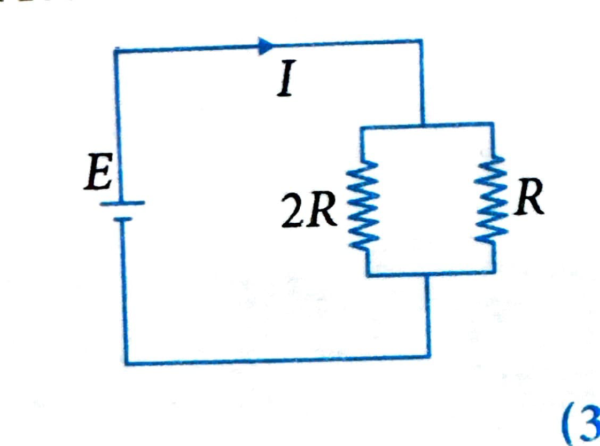
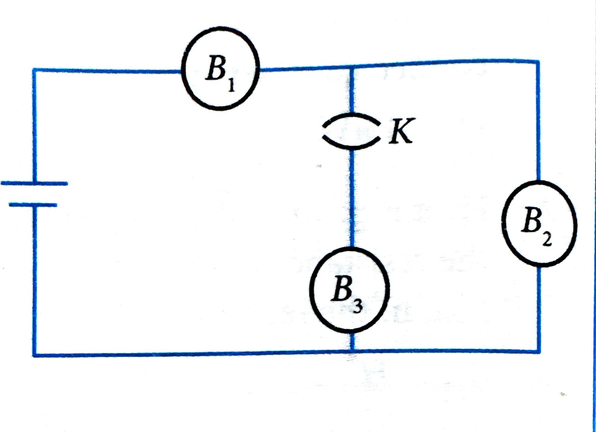
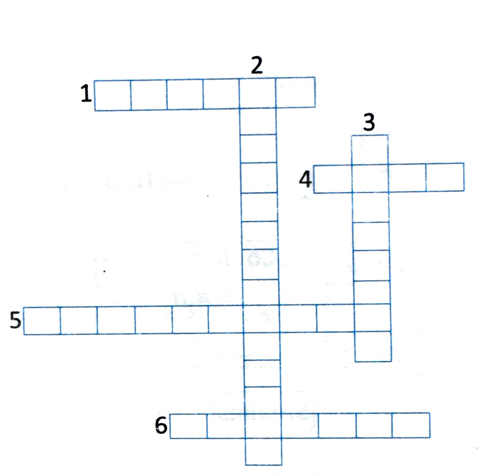
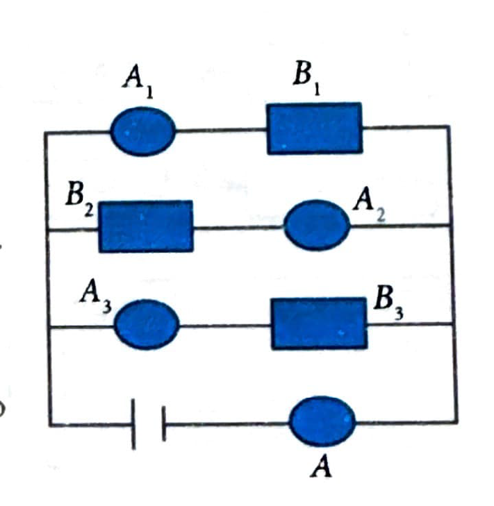

# Concept Application Exercise 4

**Note:** This exercise covers concepts from sections 11-12: Measuring Instruments and Heating Effect of Current.

[View Solutions →](concept-application-exercise-4-solutions.html)

---

**Problem 1:** Two bulbs when connected in parallel to a source take 60 W each. The total power consumed, when they are connected in series with the same source is:

(1) 15 W  
(2) 30 W  
(3) 60 W  
(4) 120 W

---

**Problem 2:** Heat is produced at a rate given by $H$ in a resistor when it is connected across a supply voltage $V$. If now the resistance of the resistor is doubled and the supply voltage is made $V/3$, then the rate of production of heat in the resistor will be:

(1) $\frac{H}{9}$  
(2) $\frac{2H}{9}$  
(3) $6H$  
(4) $18H$

---

**Problem 3:** Two bulbs of 500 W and 300 W are manufactured to operate on a 200 V line. If their resistances are $R_1$ and $R_2$ respectively, then value of $R_1/R_2$ is:

(1) $\frac{5}{3}$  
(2) $\frac{3}{5}$  
(3) $\frac{25}{9}$  
(4) $\frac{9}{25}$

---

**Problem 4:** Three bulbs rating 60 W each are joined in series and then connected to the mains. The power consumed by the bulbs will be:

(1) 180 W  
(2) 60 W  
(3) 20 W  
(4) 10 W

---

**Problem 5:** Two identical heaters rated 220 V, 1000 W are placed in parallel with each other across a 200-V line. Then total power consumed is:

(1) 1000 W  
(2) 2000 W  
(3) 1652.9 W  
(4) 4000 W

---

**Problem 6:** Two electric bulbs marked 25 W, 220 V and 100 W, 220 V are connected in series to a 440-V supply. Which of the bulbs will fuse?

(1) 100 W  
(2) 25 W  
(3) Neither  
(4) Both

---

**Problem 7:** Two bulbs 40 W and 60 W and rated voltage 240 V are connected in series across a potential difference of 420 V. Which bulb will work at 420 V source voltage?

(1) 40 W  
(2) 60 W  
(3) Both (1) and (2)  
(4) None of the bulbs

---

**Problem 8:** A 1-m-long wire of diameter of 0.31 mm has a resistance of 4.2 Ω. If it is replaced by another wire of the same material of length 1.5 m and diameter of 0.155 mm, the resistance of wire is:

(1) 25.2 Ω  
(2) 0.62 Ω  
(3) 26.7 Ω  
(4) 0.89 Ω

---

**Problem 9:** What is the ratio of heat generated in $R$ and $2R$?

(1) 2:1  
(2) 1:2  
(3) 4:1  
(4) 1:4

---

**Problem 10:** $B_1$, $B_2$, and $B_3$ are the three identical bulbs connected to a battery of steady emf with key $K$ closed. What happens to the brightness of the bulbs $B_1$ and $B_2$ when the key is opened?

(1) Brightness of the bulb $B_1$ increases and that of $B_2$ decreases.  
(2) Brightness of the bulbs $B_1$ and $B_2$ increases.  
(3) Brightness of the bulb $B_1$ decreases and that of $B_2$ increases.  
(4) Brightness of the bulbs $B_1$ and $B_2$ decreases.

---

**Problem 11:** What is the resistance of an ammeter and a voltmeter?

---

**Problem 12:** How does the use of fuse wire protect electrical appliances?

---

**Problem 13:** Why does the connecting rod of an electric heater not glow while the heating element does?

---

**Problem 14:** Alloys are used in electrical heating devices rather than pure metals. Give the reason.

---

**Problem 15:** Ammeter burns out when connected in parallel. Give the reason.

---

**Problem 16:** An electric heater of resistance 8 Ω draws 15 A from the service mains for 2 h. Calculate the rate at which heat is developed in the heater.

---

**Problem 17:** Two wires of same material and same length have radii $r_1$ and $r_2$. Compare their resistances.

---

**Problem 18:** $A_1$, $A_2$, $A_3$, and $A$ are ammeters connected in circuit and $B_1$, $B_2$, and $B_3$ are three identical bulbs. They all are connected to voltage source as shown in figure. When the three bulbs are working good and glowing, the current recorded in ammeter $A$ is 6 A.

**(a)** Same amount of current will go through each bulb, and the value is 2 A.

- True  
- False

**(b)** If the bulb $B_3$ is blown away, bulbs $B_1$ and $B_2$ will start glowing more.

- True  
- False

**(c)** What will happen to all ammeter readings if bulb $B_1$ is blown away?

**(d)** The current shown in the ammeter $A$ remains same even if any bulb goes down.

- True  
- False

---

**Problem 19:** Solve the following crossword puzzle:

**Across:**
1. A metal having minimum electrical resistance
4. Melts and breaks circuit
5. Hindrance to the flow of electric current
6. Cell connected in series

**Down:**
2. Used for the magnetic separation of iron ore
3. Filament of a bulb

---

**Problem 20:** It's a stormy day, and the power's out. You are trapped in a room and have one minute to choose between two doors. Behind one door is an electric chair that will shock you to death. Behind the other door is a murderer who killed many people on Halloween in 2016. Which door do you choose, and why?

---

**Problem 21:** If an electric train is going east at 60 miles an hour and there is a strong westerly wind, which way does the smoke from the train drift?

---

## Concept Map

[View Concept Map →](./images/10-fig32.png)

---

[View Solutions →](concept-application-exercise-4-solutions.html)

