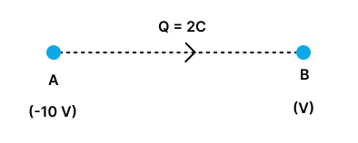

# 05. Electric Potential, Potential Difference and Electric Potential Energy

## Electric Potential Difference

**Electric potential difference** is a scalar quantity, and its SI unit is volt (V), named after Alessandro Volta (1745-1827), an Italian physicist.

**One volt** is the potential difference between two points when one joule of work is done to move a charge of one coulomb from one point to the other. Thus,

$$
1 \text{ volt} = \frac{1 \text{ joule}}{1 \text{ coulomb}}
$$

***

## Examples

### Example 6

**Problem:** The work done in moving a charge of 2 C across two points having a potential difference of 12 V is

(1) 42 J

(2) 24 J

(3) 12 J

(4) 20 J

**Solution:** (2)

**Calculation:**

$$
\Delta V = \frac{W}{Q}
$$

$$
12 = \frac{W}{2}
$$

$$
W = 24 \text{ J}
$$

---

### Example 7

**Problem:** The potential at a point 0.1 m from an isolated point charge is +100 V. The nature of the point charge is

(1) Positive

(2) Negative

(3) Zero

(4) Either negative or zero

**Solution:** (1)

**Explanation:** Potential of positive charge is always positive.

---

### Example 8

**Problem:** If 50 J of work must be done to move an electric charge of 2 C from a point where potential is -10 V to another where potential is V volt, then the value of V is

(1) 5 V

(2) -15 V

(3) +15 V

(4) +10 V

**Solution:** (3)

**Given Values:**
* $W = 50$ J
* $Q = 2$ C

**Calculation:**

$$
V_B - V_A = \frac{W}{Q}
$$

$$
V - (-10) = \frac{50}{2}
$$

$$
V + 10 = 25
$$

$$
V = 15 \text{ V}
$$

---

### Example 9

**Problem:** Two charged spheres of radii 10 cm and 15 cm are connected by a thin wire. No charge will flow if they have

(1) the same charge on each

(2) the same potential

(3) the same energy

(4) the same field on the surface

**Solution:** (2)

**Explanation:** Because current flows from higher potential to lower potential.

***

## 5.4 Electric Potential Energy

**Electric potential energy** is the energy stored in a charged object due to its position in an electric field.

It is the work done to move a charge from a reference point (usually infinity) to its current position against electric forces, without acceleration or change in kinetic energy.

**Formula:** The work done in moving a +1 unit charge from infinity to a given point in an electric field is $V$ (electric potential).

The electric potential energy ($U$) of a charge ($q$) at a point with electric potential ($V$) is given by:

$$
U = q \cdot V
$$

where $V$ is the electric potential at the charge's location.

### Nature of Electric Potential Energy

* If charge $q$ is **positive**, electric potential energy increases with electric potential.
* If charge $q$ is **negative**, electric potential energy decreases as electric potential increases.

### Example

When a positive charge $q$ is placed near another positive charge, work is done to bring them closer due to repulsion. This work is stored as electric potential energy. If released, this stored energy converts to kinetic energy as charges move apart.

### Factors Affecting Electric Potential Energy

**1. Magnitude of the Charge ($q$):** The greater the charge, the more potential energy it will have.

**2. Electric Potential ($V$):** The potential energy depends directly on the electric potential at the location of the charge. Higher electric potential corresponds to higher potential energy for a positive charge.

**3. Distance from Other Charges:** In a system of charges, the electric potential energy depends on the distance between charges. For example, closer charges will have higher potential energy due to stronger interactions.
