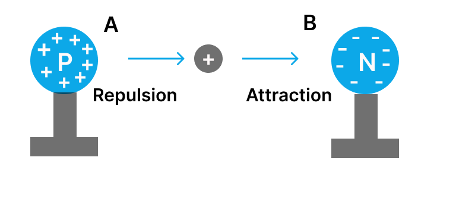
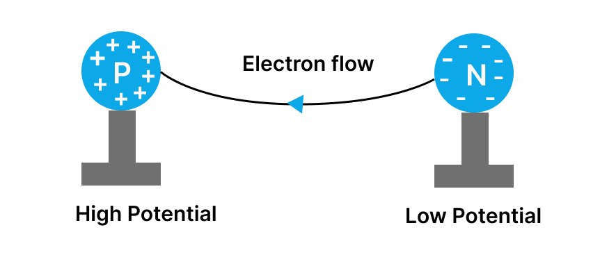
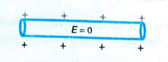
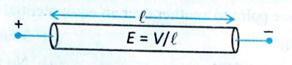

# 06. Flow of Charge

## TEST YOURSELF

**Question 5:** Can we define electric potential in terms of unit negative charge? If yes, then what is the reference point and what is the new path in which unit negative charge should move?

**Question 6:** What is the relation between an electric potential energy and electric potential?

***

## 6. FLOW OF CHARGE

There are three methods of charge transfer:

* **By Friction:** Two objects rubbed against each other, charge transfer takes place in which one gains electrons and loses electrons.

* **By Conduction:** Connecting one body to another body by connecting both with a conducting wire. Charge from higher potential to lower potential.

* **Charging by Induction:** Bringing a charged body near to an uncharged body which induces charge in the other.

***

## 6.1 Potential Difference and Flow of Charges

Consider two identical metallic spheres P and N, carrying equal amounts of positive and negative charges, respectively. A positive charge taken from point B to point A is attracted by sphere N (negative) and repelled by sphere P (positive), requiring work to move it towards A, making the potential difference $V_A - V_B$ positive. Moving towards P increases potential, and moving towards N decreases it, implying P has higher potential than N. Generally, a positively charged body has higher potential than a negatively charged body.

**Key Principle:**
* A positive charge will move towards the negatively charged sphere.
* A negative charge will move towards the positively charged sphere.
* Thus, a free positive charge moves towards the lower potential, and a free negative charge moves towards the higher potential.

When two charged spheres, M and N, are connected by a metal wire, electrons from the negatively charged sphere (at a lower potential) will flow towards the positively charged sphere (at a higher potential). This flow continues until the charges on the spheres become balanced, they no longer carry a net charge, and have equal potential, at which point the electron flow stops.

**Conclusion:** We can thus say that a potential difference causes charges to flow.

***

## INSIGHTS

**Insight 1:** Electric field inside a charged conductor is zero.

**Insight 2:** Electric field is non-zero inside a current-carrying conductor, which is given by $E = \frac{V}{l}$, where $V$ is the potential difference across the conductor and $l$ is the length of the conductor.

**Insight 3:** Electric field is perpendicular to equipotential surfaces, therefore work done in moving a charge on equipotential surface is zero.
