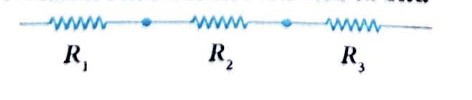
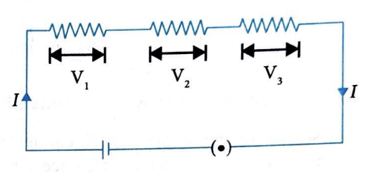
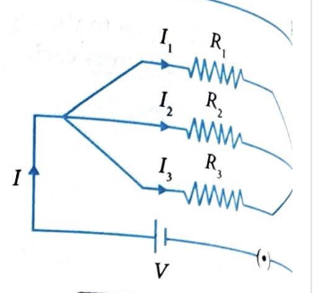

# 10. Combination of Resistors

## 10.1 Series Combination

### Characteristics of Series Combination

**(i) Resistors are connected end to end**

**(ii) Same current flows through each resistor**

The current flowing through each resistor in series is the same: $I_1 = I_2 = I_3 = I$

**(iii) Combined (equivalent) resistance**

The equivalent resistance in series combination is:

$$R_{\text{eff}} = R_1 + R_2 + R_3 + \ldots$$

---

### Applied Voltage and Potential Differences

**(iv) Applied voltage is equal to the algebraic sum of the potential differences across each resistor:**

$$V = V_1 + V_2 + V_3 + \ldots$$

**(v) If $V$ is the applied voltage across the combination of $n$ resistors, then:**

$$V_i = \frac{R_i}{R_1 + R_2 + R_3 + \ldots + R_n} \times V$$

where $V_i$ is voltage across $R_i$ resistor.

---

### Expression for Effective Resistance in Series Combination

Consider three resistors $R_1$, $R_2$, and $R_3$ connected in series with a battery of $V$ volts applied. The potential differences across these resistors are $V_1$, $V_2$, and $V_3$, respectively.

**Derivation:**

Sum of the potential difference across the three resistors should be equal to the applied voltage. Thus,

$$V = V_1 + V_2 + V_3 \quad \text{...(i)}$$

Let the effective resistance of the combination be $R$, and the current flowing through the circuit is $I$. Then according to Ohm's law,

$$V = IR \quad \text{...(ii)}$$

For individual resistors:
$$V_1 = IR_1, \quad V_2 = IR_2, \quad V_3 = IR_3$$

Substituting into equation (i):
$$V = IR_1 + IR_2 + IR_3 = I(R_1 + R_2 + R_3) \quad \text{...(iii)}$$

From equations (ii) and (iii), we get:
$$IR = I(R_1 + R_2 + R_3)$$

Therefore:
$$R = R_1 + R_2 + R_3$$

where $R$ is the effective or equivalent or net or total resistance in series combination.

---

### INSIGHTS

**When several resistors are connected in series, then:**

**(i)** The sum of potential difference across all the resistors is equal to the applied voltage.

**(ii)** The same current flows through each resistor, which is equal to the current flowing in the whole circuit.

**(iii)** The equivalent resistance of the series combination will always be greater than the value of the largest resistor in the series combination.

**(iv)** The equivalent resistance of the parallel combination will always be less than the value of the least resistance in the parallel combination (which is discussed later in the chapter).

---

## 10.2 Parallel Combination

### Characteristics of Parallel Combination

**(i) The resistors are connected between the same two points as shown in the figure.**

**(ii) The potential difference across each resistor is the same.**

The voltage across each resistor in parallel is the same: $V_1 = V_2 = V_3 = V$

**(iii) The combined (equivalent) resistance $R_{\text{eff}}$ is given by:**

$$\frac{1}{R_{\text{eff}}} = \frac{1}{R_1} + \frac{1}{R_2} + \frac{1}{R_3} + \ldots$$

**(iv) The sum of currents flowing through each resistor is equal to the total current entering in combination:**

$$I = I_1 + I_2 + I_3 + \ldots$$

**(v) If $I$ is the total current entering in parallel combination, then:**

$$I_i = \frac{R_{\text{eff}}}{R_i} \times I$$

---

### Expression for Effective Resistance in Parallel Combination

Consider three resistors $R_1$, $R_2$, $R_3$ connected in parallel with a battery as shown in the figure. The potential difference across each of the resistor is same as the applied voltage, but the value of current across each resistor is different.

Let $I_1$, $I_2$, and $I_3$ be the current flowing through $R_1$, $R_2$, and $R_3$, respectively. Therefore,

$$I = I_1 + I_2 + I_3 \quad \text{...(i)}$$

Let the effective resistance of this parallel combination be $R_p$, then using Ohm's law:

$$I = \frac{V}{R_p} \quad \text{...(ii)}$$

As $V$ is same for all resistors:

$$I_1 = \frac{V}{R_1}, \quad I_2 = \frac{V}{R_2}, \quad I_3 = \frac{V}{R_3} \quad \text{...(iii)}$$

Hence, from equations (i), (ii), and (iii), we get:

$$\frac{V}{R_p} = \frac{V}{R_1} + \frac{V}{R_2} + \frac{V}{R_3}$$

$$\frac{V}{R_p} = V\left(\frac{1}{R_1} + \frac{1}{R_2} + \frac{1}{R_3}\right)$$

$$\frac{1}{R_p} = \frac{1}{R_1} + \frac{1}{R_2} + \frac{1}{R_3}$$

**Conclusion:** Thus, the reciprocal of effective resistance in parallel combination is equal to the sum of reciprocals of all the individual resistances.

---

### Comparison or Advantage of Parallel Combination over Series Combination

**(i)** In parallel combination, we can operate each device with its individual switch which is not possible in series combination.

**(ii)** All equipment work at the same voltage.

**(iii)** As different equipment have different current ratings, they need different current and this is possible only in parallel combination.

