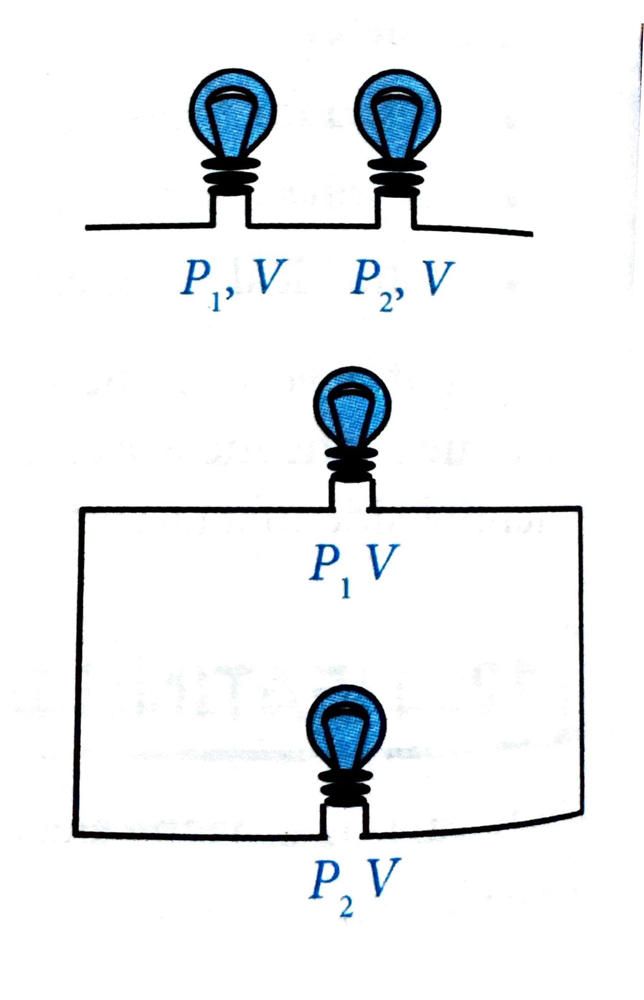
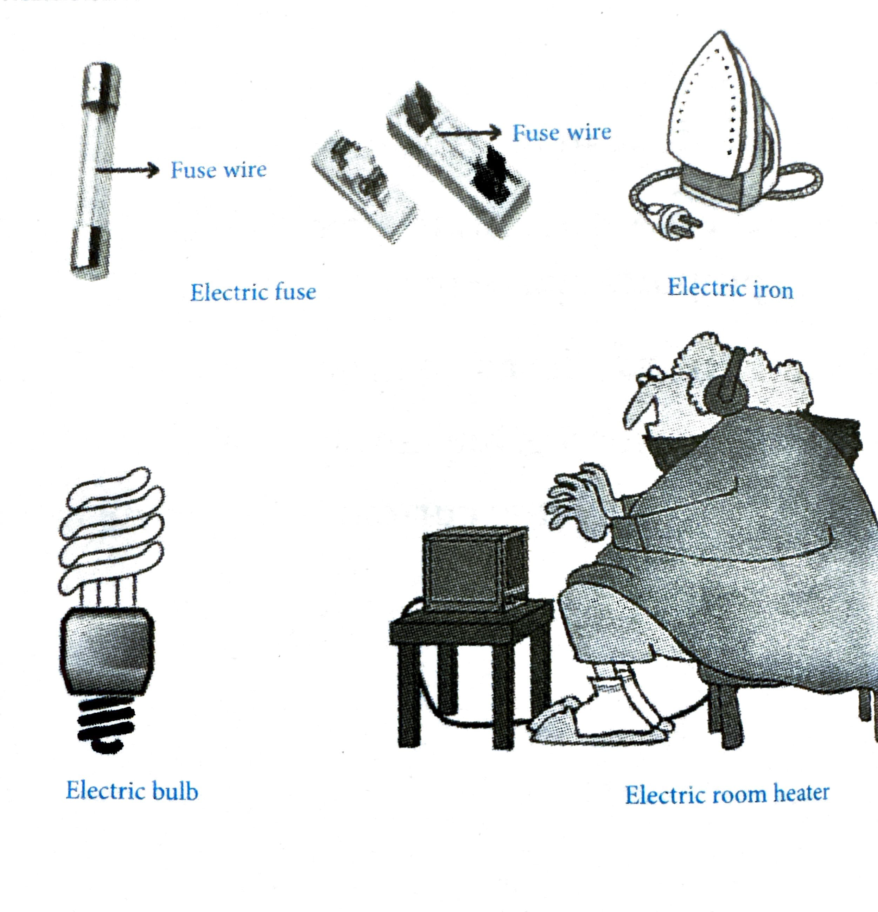
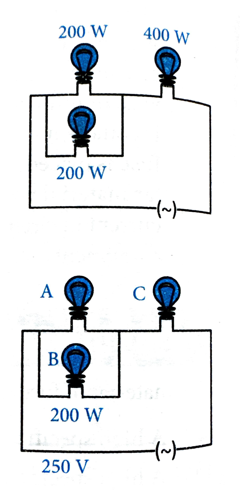
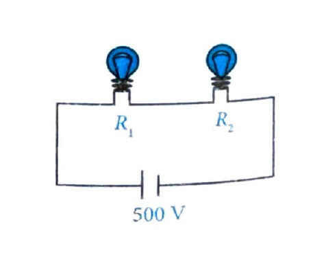
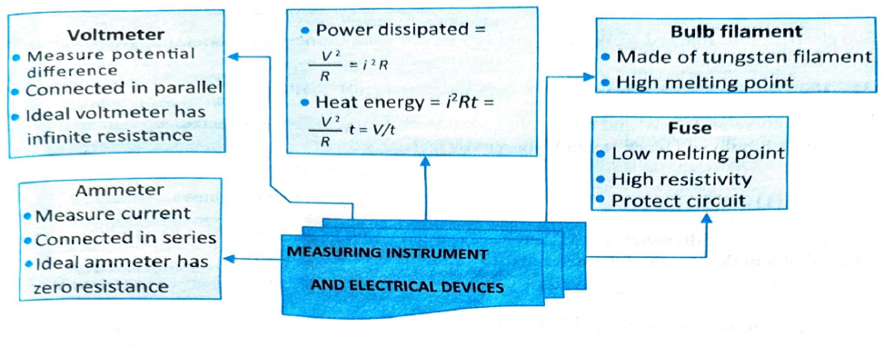

# 12. Heating Effect of Current

## 12.1 Electrical Power

**Electrical power** is the electrical work done per unit time or the rate at which electric energy is dissipated or consumed in an electric circuit.

$$P = \frac{\text{Work done } W}{\text{Time taken } t}$$

The unit of power is **watt (W)**.

If current $I$ flows for time $t$ under a potential difference $V$, then work done is given as:

$$W = VIt \quad [W = QV \text{ and } Q = It]$$

$$P = \frac{W}{t} = VI \quad \text{or} \quad P = VI = I^2R \quad \text{(Using Ohm's law)}$$

## 12.2 Heating Effect

It is seen that when electric current passes through a resistor, it becomes hot because the electric energy spent or work done in moving the charges is converted into heat energy.

## 12.3 Joule's Law

The law on heating effect of current is known as **Joule's law**, which states that the heat produced in a resistor is:

1. **Proportional to the square** of the electric current that flows through the given resistor, i.e., $H \propto I^2$.
2. **Proportional to the resistance** for a given current that flows through the resistor, i.e., $H \propto R$.
3. **Proportional to the time** for which the current flows through the resistor, i.e., $H \propto t$.

From this law, we get:

$$H = I^2Rt$$

$$H = I^2Rt = VIt = \frac{V^2t}{R} \quad \text{(Using Ohm's law)}$$

Heat or energy is measured in **joule**.

$$H = P \times t = VIt$$

---

## 12.4 Commercial Unit of Electric Energy

**Commercial unit of electric energy = Kilowatt-hour (kWh)**

1 kWh means 1 kW energy is consumed in 1 hour.

$$1 \text{ kWh} = 3.6 \times 10^6 \text{ J}$$

---

## 12.5 Power Rating of Electrical Appliances

Every electrical appliance has a power rating, which tells us how much power it consumes at a particular voltage. It is denoted as $(P, V)$, where $P$ is the power consumed by an appliance at voltage $V$.

### Power Consumption in Different Configurations

**(i)** If two bulbs $B_1(P_1, V)$, $B_2(P_2, V)$ are connected in series, then:

$$P_{\text{total}} = \frac{P_1 P_2}{P_1 + P_2}$$

**(ii)** If two bulbs $B_1(P_1, V)$, $B_2(P_2, V)$ are connected in parallel, then:

$$P_{\text{total}} = P_1 + P_2$$

**(iii)** If two resistors are connected in series, the ratio of the power consumed is:

$$\frac{P_1}{P_2} = \frac{R_1}{R_2}$$

**(iv)** If two resistors are connected in parallel, then the ratio of the power consumed is:

$$\frac{P_1}{P_2} = \frac{R_2}{R_1}$$

**(v)** If a bulb with rating $(P_1, V_1)$ is connected with a source of $V_2$ voltage, then the power $(P)$ consumed is:

$$P = \frac{V_2^2}{V_1^2} \times P_1$$

---

## 12.6 Practical Application of the Heating Effect of Electric Current

**(i) Electrical Heating Appliances**

The heating effect of current is utilized in the electrical heating appliances such as electric iron, room heaters, water heaters, etc. All these heating appliances contain coils of high resistance wire made of nichrome alloy. When these appliances are connected to the power supply by insulated copper wires, then a large amount of heat is produced in the heating coils, because they have high resistance, but a negligible heat is produced in the connecting wires because the wires have low resistance.

**(ii) Electric Bulb**

The electric heating is also used to produce light as in an electric bulb. Here the filament must retain as much of the heat generated as is possible, so that it gets very hot and emits light. It must not melt at such a high temperature. A strong metal with high melting point such as tungsten (melting point 3380°C) is used for making bulb filaments. The filament should be thermally isolated as much as possible.

**(iii) Electric Fuse**

Electric fuse is a safety device used in electric circuits to protect electrical appliances from damage due to excessive current flow.

The most common application of Joule's heating is the fuse, which is used in electric circuits. It protects the electrical equipment and prevents the flow of any unduly high electric current. A fuse is a short piece of wire of small cross-sectional area and high resistance made up of material having low melting point. It is normally made up of an alloy of tin and lead because their melting point is low and resistivity is high. The fuse wire is usually encased in a cartridge of porcelain or similar material with metal caps for domestic purposes. Fuses are rated as 1A, 2A, 3A, 5A, 10A, etc. When current in circuit rises above the rated range of fuse, it melts and breaks the circuit and thus protects the electrical equipment.

**Properties of fuse wire material:**
- High specific resistance
- Low melting point

**Question:** The material of fuse wire should have:

(1) High specific resistance and high melting point  
(2) Low specific resistance and low melting point  
(3) High specific resistance and low melting point  
(4) Low specific resistance and a high melting point

**Answer:** Option (3) - High specific resistance and low melting point

---

## 12.7 Examples

### Example 34

Three identical bulbs are connected in series, and these together dissipate a power $P$. If now the bulbs are connected in parallel, then the power dissipated will be:

(1) $\frac{P}{3}$  
(2) $3P$  
(3) $9P$  
(4) $\frac{P}{9}$

**Solution:**

When bulbs are connected in series, $P = \frac{V^2}{3R}$ and when bulbs are connected in parallel, $P' = \frac{V^2}{R/3} = \frac{3V^2}{R}$.

Therefore, $P' = 9P$.

Hence option (3) is correct.

---

### Example 35

If the voltage applied across an electric bulb changes by 1%, then power will change by:

(1) 1%  
(2) 2%  
(3) 4%  
(4) $\frac{1}{2}\%$

**Solution:**

Since $P = \frac{V^2}{R}$, we have:

$$\frac{\Delta P}{P} = 2 \times \frac{\Delta V}{V} = 2 \times 1\% = 2\%$$

Hence option (2) is correct.

---

### Example 36

Three electric bulbs of 200 W, 200 W, and 400 W are shown in figure. The resultant power of the combination is:

(1) 800 W  
(2) 400 W  
(3) 200 W  
(4) 600 W

**Solution:**

Bulbs A and B are in parallel; their effective power is $P' = P_1 + P_2 = 200 \text{ W} + 200 \text{ W} = 400 \text{ W}$.

$P'$ and bulb C are in series, the resultant power of the combination is:

$$P_r = \frac{P' \times P_C}{P' + P_C} = \frac{400 \text{ W} \times 400 \text{ W}}{400 \text{ W} + 400 \text{ W}} = 200 \text{ W}$$

Hence option (3) is correct.

---

### Example 37

Two bulbs of rating 100 W, 250 V and 200 W, 250 V are connected in series across a 500 V line, then:

(1) 100 W bulb will be fused  
(2) 200 W bulb will be fused  
(3) Both bulbs will be fused  
(4) No bulb will be fused

**Solution:**

Resistance of bulb 1:

$$R_1 = \frac{V_1^2}{P_1} = \frac{(250 \text{ V})^2}{100 \text{ W}} = 625 \Omega$$

Resistance of bulb 2:

$$R_2 = \frac{V_2^2}{P_2} = \frac{(250 \text{ V})^2}{200 \text{ W}} = 312.5 \Omega$$

Now, the bulbs are connected as shown in the figure.

Current in the circuit:

$$I = \frac{V_s}{R_1 + R_2} = \frac{500 \text{ V}}{625 \Omega + 312.5 \Omega} = \frac{500}{937.5} = 0.53 \text{ A}$$

Potential difference across bulb 1 = $IR_1 = 0.53 \times 625 \Omega = 333.33 \text{ V}$

Potential difference across bulb 2 = $IR_2 = 0.53 \times 312.5 \Omega = 166.25 \text{ V}$

Since potential difference across bulb 1, i.e., 333.33 V, is more than the rated voltage (250 V), it will fuse.

Hence option (1) is correct.

---

### Example 38

An electric bulb rated 50 W, 200 V is connected to a 100 V supply. The power consumed by the bulb is:

(1) 50 W  
(2) 25 W  
(3) 12.5 W  
(4) 10 W

**Solution:**

$$P_{\text{consumed}} = \left(\frac{V_{\text{supply}}}{V_{\text{rated}}}\right)^2 \times P_{\text{rated}} = \left(\frac{100}{200}\right)^2 \times 50 \text{ W} = \frac{1}{4} \times 50 = 12.5 \text{ W}$$

**Alternative method:**

$$R = \frac{V_{\text{rated}}^2}{P_{\text{rated}}} = \frac{(200 \text{ V})^2}{50 \text{ W}} = 800 \Omega$$

$$I = \frac{V_{\text{supply}}}{R} = \frac{100 \text{ V}}{800 \Omega} = 0.125 \text{ A}$$

$$P_{\text{consumed}} = I^2R = (0.125)^2 \times 800 = 12.5 \text{ W}$$

Hence option (3) is correct.

---

### Example 39

Two bulbs rated 200 W, 220 V and 100 W, 220 V are connected in series. Combination is connected to 220 V supply. Power consumed by the circuit is:

(1) 80 W  
(2) 67 W  
(3) 76 W  
(4) 65 W

**Solution:**

Resistance of bulb 1:

$$R_1 = \frac{V^2}{P_1} = \frac{(220 \text{ V})^2}{200 \text{ W}} = 242 \Omega$$

Resistance of bulb 2:

$$R_2 = \frac{V^2}{P_2} = \frac{(220 \text{ V})^2}{100 \text{ W}} = 484 \Omega$$

Equivalent resistance:

$$R_{\text{eq}} = R_1 + R_2 = 242 \Omega + 484 \Omega = 726 \Omega$$

Power consumed:

$$P = \frac{V^2}{R_{\text{eq}}} = \frac{(220 \text{ V})^2}{726 \Omega} = \frac{48400}{726} = 66.67 \text{ W} \approx 67 \text{ W}$$

Hence option (2) is correct.

---

### Example 40

The tungsten filament of two electric bulbs is of the same length. If one of them gives 25 W power and the other gives 60 W power, then:

(1) Both the filaments are of same thickness  
(2) 25 W bulb has thicker filament  
(3) 60 W bulb has thicker filament  
(4) Both the filaments have same cross-section area

**Solution:**

Let $R_1$ and $R_2$ be the resistances of 25 W and 60 W bulbs, respectively. For the same voltage, same length, and same material:

$$R = \frac{\rho \ell}{A}$$

Since $P = \frac{V^2}{R}$, for the same voltage:

$$P \propto \frac{1}{R} \quad \text{or} \quad R \propto \frac{1}{P}$$

Therefore:

$$\frac{R_1}{R_2} = \frac{P_2}{P_1} = \frac{60}{25} = \frac{12}{5}$$

So $R_1 > R_2$.

Since $R = \frac{\rho \ell}{A}$ and $\ell$ is same:

$$\frac{R_1}{R_2} = \frac{A_2}{A_1} = \frac{12}{5}$$

Therefore $A_2 > A_1$, which means the 60 W bulb has thicker filament.

Hence option (3) is correct.

---

### Example 41

An electric bulb rated 220 V, 100 W is connected in series with another bulb rated 220 V, 60 W. If the voltage of the combination is 220 V, the power consumed by the 100 W bulb will be about:

(1) 25 W  
(2) 14 W  
(3) 100 W  
(4) 50 W

**Solution:**

Resistance of bulb 1:

$$R_1 = \frac{V^2}{P_1} = \frac{(220 \text{ V})^2}{100 \text{ W}} = 484 \Omega$$

Resistance of bulb 2:

$$R_2 = \frac{V^2}{P_2} = \frac{(220 \text{ V})^2}{60 \text{ W}} = 806.67 \Omega$$

Equivalent resistance:

$$R_{\text{eq}} = R_1 + R_2 = 484 \Omega + 806.67 \Omega = 1290.67 \Omega$$

Current flowing:

$$I = \frac{V}{R_{\text{eq}}} = \frac{220 \text{ V}}{1290.67 \Omega} = 0.170 \text{ A}$$

Power consumed by 100 W bulb:

$$P = I^2R_1 = (0.170)^2 \times 484 = 14.06 \text{ W} \approx 14 \text{ W}$$

Hence option (2) is correct.

---

### Example 42

If resistance is halved (keeping all other parameters same), the heat produced per second across resistor becomes:

(1) Double  
(2) Quadruple  
(3) Halved  
(4) No change

**Solution:**

For a given applied voltage, $P = \frac{V^2}{R}$. If $R$ is halved, power becomes double. The heat produced per second is also double.

Hence option (1) is correct.

---

## 12.8 INSIGHTS

**1.** If after stretching the length of a conductor increases by $X\%$, then resistance will increase by $2X\%$ (valid only if $X < 10\%$).

**2.** If $n$ identical resistances are first connected in series and then in parallel, the ratio of the equivalent resistance is given by:

$$\frac{R_{\text{series}}}{R_{\text{parallel}}} = n^2$$

**3.** If a wire of resistance $R$ is cut into $n$ equal parts and then these parts are connected to form a bundle, the resistance of combination will be $R/n^2$.

---

