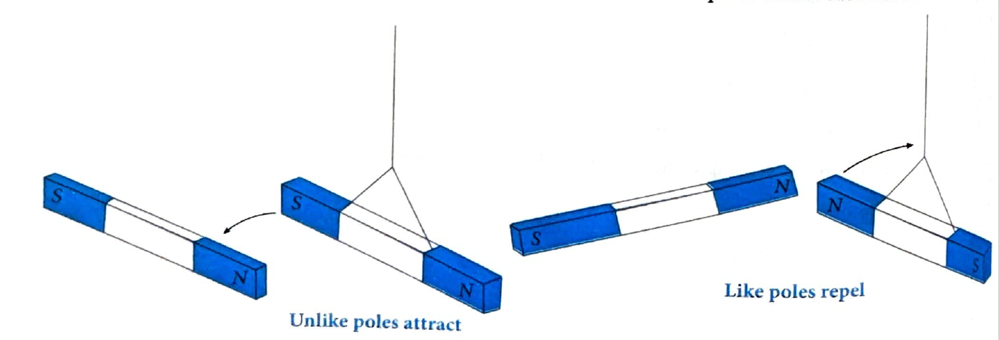

# 01. Magnet and Magnetism

## Introduction

It was found that magnetism and electricity are related to each other. This means that electric current can produce magnetic effects and this is called electromagnetism. Similarly, changing magnetic field can produce electricity, this is called electromagnetic induction.

Magnetism has been a source of curiosity for ages. Magnetism is the study of material that has the ability to physically attract or repel other substances. Magnets are commonly found in science laboratories, toys, and the magnetic stickers that we stick to refrigerators and steel almirahs. Magnets are substances that create a field around it and attracts pieces of iron, nickel and cobalt towards itself. A naturally occurring iron ore (black oxide — $\text{Fe}_3\text{O}_4$) having properties of attracting iron pieces, was found in magnesia in the upper part of ancient Greece. The name magnetism has been taken from the name of the place.

Magnets are found in various shapes and sizes. A bar magnet is a long rectangular bar of uniform cross-section which can attract pieces of iron, steel, cobalt and nickel. Magnet can be natural or artificial.

The earth itself acts as a magnet. Actually, magnets are all around us, since each electron, proton and neutron behaves as a tiny magnet. Magnetism has many uses — from the simple magnetic sticker to magnetic resonance imaging (MRI). MRI is a diagnostic technique in which the magnetism of the protons inside the human body is used to form images of tissues.

## 1.1 Magnet and Magnetism

**Magnetism:** It is a branch of physics which deals with the behavior and characteristics of a magnet.

A magnet is a material that produces a field that attracts or repels other such materials of magnetic nature. It can be natural or artificial. Lodestone is a naturally occurring magnet. It attracts materials like Iron, Nickel, Cobalt.

### Properties of Magnets

* A magnet is always bipolar, with poles named north and south poles.

* These two poles always exist together and cannot be separated.

* The north pole of a magnet is the side which points to the earth's geographic north when it is freely suspended.

* Similar to charges, poles attract and repel. Like poles repel while unlike poles attract each other.

**Like poles repel**  
**Unlike poles attract**

### Bar Magnet

A bar magnet is a rectangular object composed of iron, steel or any form of a ferromagnetic substance that shows permanent magnetic properties. It has two different poles, a north and a south pole. When suspended freely, the north pole aligns itself towards the geographic north pole of the earth.

