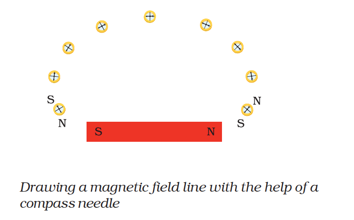

# 02. Magnetic Field

## 2.1 Magnetic Field

The region around a magnet or a current carrying conductor in which its influence can be felt by any magnetic material is called magnetic field. Magnetic field is represented by field lines. It is a path either straight or curved, the tangent to which at any point gives the direction of the magnetic field at that point.

### Units of Magnetic Field

* The unit of magnetic field intensity is **tesla (T)** or **Weber per square metre (Wb m⁻²)**.

* The CGS unit of magnetic field intensity is **gauss (G)** [1 T = 10⁴ gauss].

* Magnetic field is a **vector quantity**, because its complete specification needs both direction as well as magnitude.

The pattern of a magnetic field in a region can be shown with help of magnetic field lines.

The magnetic field lines with help of compass needle:

**Magnetic field lines around a bar magnet**

* The magnetic field perpendicular to the plane in upward direction is denoted by **⊙**. On the other hand, the magnetic field perpendicular to the plane in the downward direction is denoted by **⊗**.

---

## Test Yourself

1. The pattern of iron filling suggests that the magnetic field lines are...

2. Dissimilar poles of two magnets...

3. What happens to the magnet on heating?

