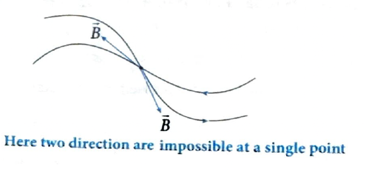
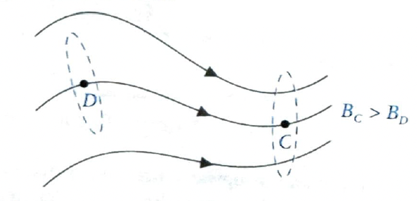
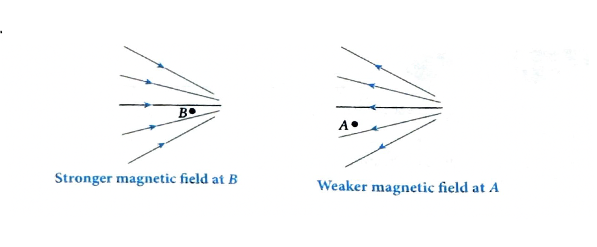

# 03. Magnetic Field Lines

## 3.1 Magnetic Field Lines

* Magnetic field lines are imaginary lines which represent the magnetic field. It is a path either straight or curved, the tangent to which at any point gives the direction of the magnetic field at that point.

## 3.2 Properties of Magnetic Field Lines

* Magnetic field lines always form closed loops.

  

* The lines point from north pole to south pole outside the magnet and from south pole to north pole inside the magnet.

* The magnetic field lines never intersect each other. If they do so, the point of intersection there will be two tangents which give two directions of magnetic field at the same point which is not possible.

  

* The density of the lines is proportional to the strength of the magnetic field, i.e., closer the lines, stronger the field.

   

* In the region of stronger field the lines converge and in the region of weaker field the lines diverge

