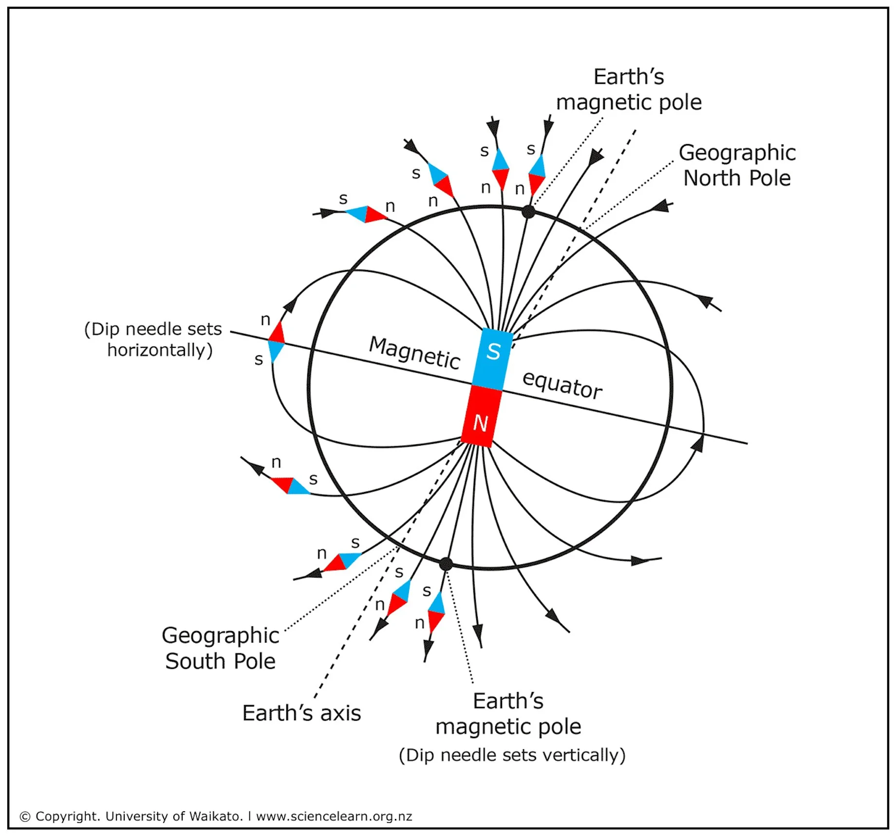
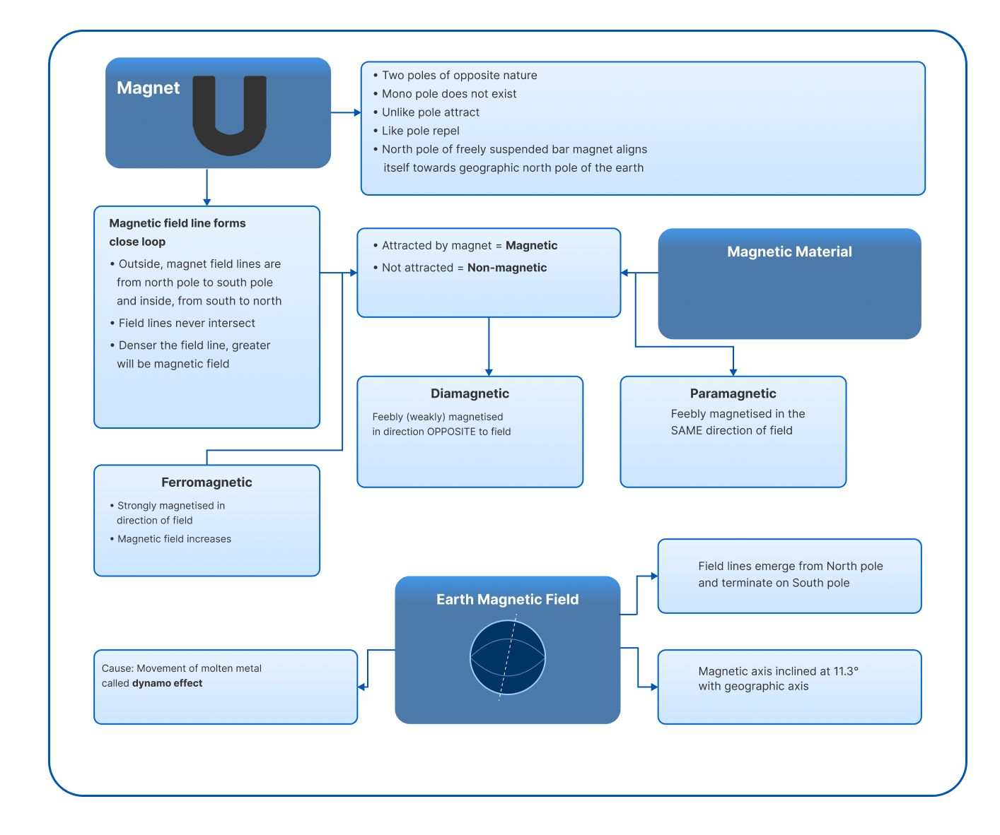

# 05. Earth's Magnetic Field

The earth itself behaves like a magnet, with a magnetic field similar to the magnetic field of a bar magnet.

## 5.1 Origin of the Earth's Magnetism

* The magnetic field is thought to arise due to electric currents produced by convection motion of metallic fluids (consisting mainly iron and nickel) in the outer core of earth. This is called dynamo effect. Also, rotation of earth helps in circulation to produce magnetic field. This is the most probable reason for the origin of magnetic field of earth. The magnetic field of earth is similar to one which would be obtained if a huge magnet is assumed to be buried deep inside the earth.

## 5.2 Features of Earth's Magnetic Field

**(1)** The magnetic axis of the Earth makes an angle of approximately 11.3° with geographic axis.

**(2)** Since the north pole of a compass needle is directed approximately towards the geographic north (N_g), the magnetic pole near geographical north pole (N) is denoted as magnetic south pole (S_m). Similarly, the magnetic pole near the geographic south pole (S) is denoted as magnetic north pole (N_m).

* Because the geographic north pole and the magnetic south pole are not in the same location, a compass needle generally does not point exactly to the geographic north pole. This difference is called the magnetic declination. The Earth's geographic axis and magnetic axis do not coincide.

---

## INSIGHTS

**Magnetic Field of the Earth:** It is believed that the magnetic field of the Earth is due to magnetic effect of current which is flowing in the liquid core at the centre of the Earth. Thus Earth is a huge electromagnet. That is why a freely suspended magnet always points in the north-south direction even in the absence of any other magnet.

The shape of Earth's magnetic field resembles that of a bar magnet of length $\frac{1}{5}$ th of Earth's diameter buried at its centre.

---

## TEST YOURSELF

4. What happens when the magnet is brought near the needle?

5. Define:
   (1) Magnetic field  
   (2) Magnetic field lines

6. Define:
   (1) Ferromagnetic substance  
   (2) Paramagnetic substance  
   (3) Diamagnetic substance

7. Cobalt is a $\_\_\_\_$ substance.

---

## Concept Map

[View Concept Map →](./images/m-fig10-concept-map.png)

