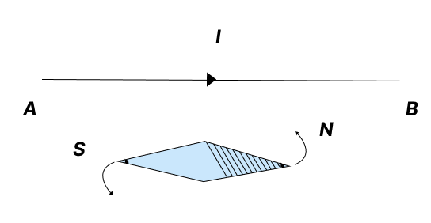
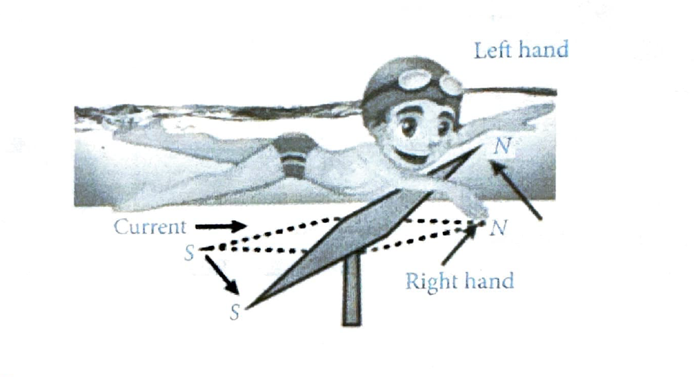
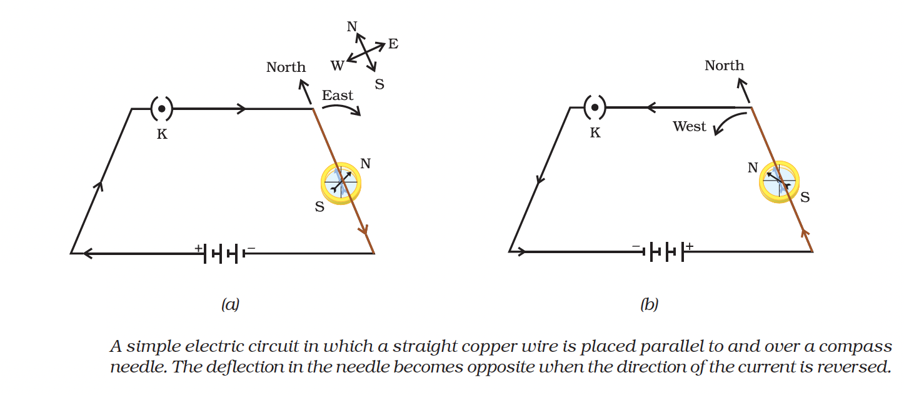
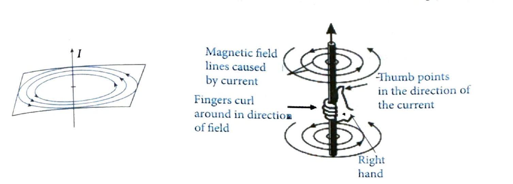
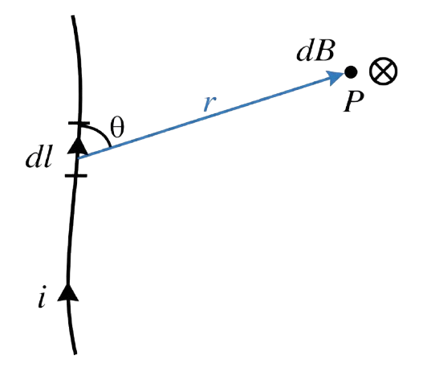
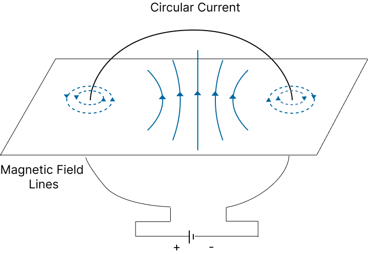
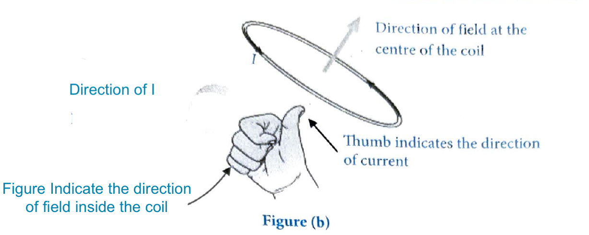
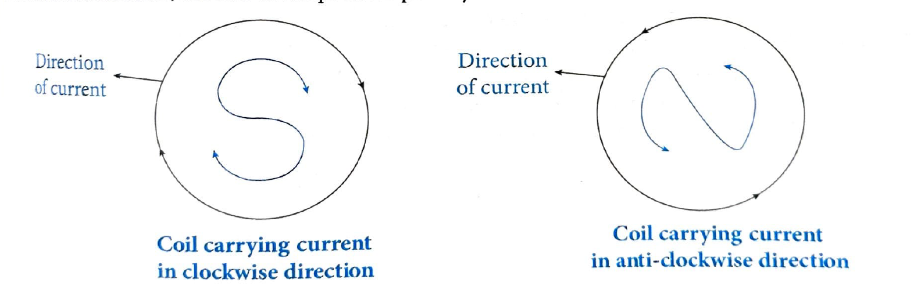

# 06. Magnetic Effect of Current

## 6.1 Introduction

The phenomenon of production of magnetic field around a conductor when current is flowing through it is called the magnetic effect of electric current.

* When current flows in a wire, it produces a magnetic field around it. This is the magnetic effect of current.
* The importance of magnetic effect of current lies in the fact that it gives rise to mechanical forces.
* Oersted was the first person who discovered the magnetic effect of electric current. Oersted's experiment utilizes the magnetic effect of electric current. He found that when a wire AB carrying current $i$ is held over and parallel to a compass needle, the north pole of the needle gets deflected towards the wire. On holding the same wire below the needle, the direction of deflection of the needle is reversed.

## 6.2 Ampere's Swimming Rule

The direction of magnetic field produced due to a current carrying wire may be determined using Ampere's Swimming Rule which states that: "Imagine a man swimming along the conductor in the direction of current, facing the magnetic compass kept near and below the conductor. Then, the north pole of the needle will be deflected towards his left hand."

## 6.3 Activity 1

* Take a long copper wire, two or three cells of 1.5 V each, and a plug key. Connect all of them in series as shown in figure.

* Place the straight wire parallel to and over a compass needle.

* Plug the key in the circuit.

* Note the direction of current (b). This would result in the change of the direction of current through the copper wire, that is, from south to north.

* Observe the change in the direction of deflection of the needle. You will see that now the needle deflects in opposite direction, that is, towards the west (b). This means that the direction of magnetic field produced by the electric current is also reversed.

## 6.4 Right Hand Thumb Rule

The direction of magnetic field due to straight current carrying wire can be obtained by Right Hand Thumb Rule.

**Right Hand Thumb Rule:** Imagine yourself grasping a current-carrying conductor with your right hand, so that the thumb lies along the conductor in the direction of the current, then the fingers of your hand will be encircling the conductor in the direction of the magnetic field lines caused by the current.

## 6.5 Magnitude of Magnetic Field

The magnitude of field at a point due to a long straight current carrying wire is directly proportional to:

**(i)** Current passing through the wire.

**(ii)** Reciprocal of the perpendicular distance of that point from the wire.

These two points, i.e., (i) and (ii) can be mathematically expressed as:

$$B = \frac{\mu_0 I}{2\pi r}$$

Here,
- $B$ = Magnetic field
- $\mu_0$ = Permeability of free space
- $I$ = Current in the wire
- $r$ = Perpendicular distance of the point from the wire

## 6.6 Biot-Savart Law

According to Biot-Savart's law, the magnitude of the magnetic field $dB$ is proportional to the current $I$, the element $dl$, and inversely proportional to the square of the distance $r$.

The magnetic field at point $P$ due to current-carrying wire is given by:

$$dB = \frac{\mu_0}{4\pi} \frac{I(dl \times r)}{r^3}$$

$$dB = \frac{\mu_0}{4\pi} \frac{Idl \sin\theta}{r^2}$$

- Where $\frac{\mu_0}{4 \pi}=10^{-7} \mathrm{Tm} / \mathrm{A}$ is called permeability of free space.

### Definition of Permeability

In electromagnetism, permeability is the measure of the ability to respond to an applied magnetic field by becoming magnetised.

Magnetic permeability is typically represented by the Greek letter $\mu$. The term was coined in September, 1885 by Oliver. In SI unit, permeability is measured in newton per ampere square (N/A²) or Tm/A (tesla meter per ampere) where tesla is the unit of magnetic field. The permeability constant ($\mu_0$), also known as the magnetic constant or the permeability of free space. The magnetic constant has the exact (defined) value:

$$\mu_0 = 4\pi \times 10^{-7} \text{ N/A}^2 \text{ or } \mu_0 = 4\pi \times 10^{-7} \text{ Tm/A}$$

- Magnetic field at point $P$ due to straight current carrying wire is given by

$$
B=\frac{\mu_0 i}{4 \pi r}(\sin \alpha+\sin \beta)
$$

(i) For an infinite long wire,

$$
\alpha=\beta=\frac{\pi}{2}, B=\frac{\mu_0 i}{2 \pi r}
$$

(ii) For semi-infinite long wire,

$$
\alpha=0^{\circ}, \beta=90^{\circ}, B=\frac{\mu_0 i}{4 \pi r}
$$

## 6.7 Magnetic Field Due to a Circular Coil Carrying Current

**(a)** Every point on the wire carrying current would give rise to the magnetic field, appearing as straight lines at the centre of the loop.

 

**(b)** The direction of magnetic field at the centre of a current carrying circular coil can be obtained by the right hand thumb rule. It appears as a straight line at the centre of the loop as shown in figure (a) and figure (b).

The right-hand thumb rule can be used to identify the direction of the magnetic field lines through the coil and thus the positions of the N-pole and the S-pole of the coil.

 

### Magnitude of Magnetic Field at the Center of a Circular Loop

The magnitude of the magnetic field at the centre of the coil is proportional to the:

**(i)** Current flowing in the coil

**(ii)** Reciprocal of the radius of the coil: $B \propto \frac{I}{r}$

So, the magnetic field at the center of a circular loop of radius $r$ carrying current $I$ is given by:

$$B = \frac{\mu_0 I}{2r}$$

Here,
- $B$ = Magnetic field
- $\mu_0$ = Permeability of free space
- $I$ = Current flowing in the coil
- $r$ = Radius of the coil

For a coil with $n$ turns, the magnetic field is:

$$B = \frac{\mu_0 n I}{2r}$$

### Polarity of Coils Based on Current Direction

Looking at a face of the coil, if current is flowing in clockwise direction, the face develops south polarity. If it is anti-clockwise direction, the face develops north polarity.

### NCERT PLUS - Magnetic Field at the Center of Current Carrying Loop

**Case I: If the loop is a full circle with N turns**

In this case $\Phi = 2\pi$, so:

$$B = \frac{\mu_0 2\pi Ni}{4\pi R} = \frac{\mu_0 Ni}{2R}$$

### Example

The radius of a circular loop is 0.4 m and the current is 12 A. What is the magnitude of magnetic field at the center of the loop?

**(1)** $6\pi \times 10^{-6}$ T  
**(2)** 20 T  
**(3)** Zero  
**(4)** $6\pi \times 10^{-7}$ T

**Solution:**

The magnetic field at the center of a circular loop is given by:

$$B = \frac{\mu_0 I}{2r}$$

Where:
- $\mu_0 = 4\pi \times 10^{-7}$ T·m/A
- $I = 12$ A
- $r = 0.4$ m

$$B = \frac{4\pi \times 10^{-7} \times 12}{2 \times 0.4} = \frac{48\pi \times 10^{-7}}{0.8} = 60\pi \times 10^{-7} = 6\pi \times 10^{-6} \text{ T}$$

**Answer:** (1) $6\pi \times 10^{-6}$ T

---

## 6.8 Magnetic Field Due to a Current in a Long Solenoid

A long cylindrical coil containing a large number of closely placed turns of insulated copper wire is called a solenoid.

The magnetic field produced by a current carrying solenoid is similar to the magnetic field produced by a bar magnet.

Observation of the figure shows that field lines are nearly straight lines inside the solenoid. It means, the magnetic field is nearly uniform (almost same at all points) inside the solenoid.

The pattern of the field lines around a solenoid is very similar to the pattern of field lines around a bar magnet.

### Strength of Magnetic Field Inside a Solenoid

The strength of magnetic field inside a current carrying solenoid is proportional to:

**(i)** Number of turns per unit length in the solenoid ($B \propto n$)

**(ii)** Magnitude of current in the solenoid ($B \propto i$)

So, $B = \mu_0 n i$

Where:
- $B$ = Magnetic field
- $n$ = Number of turns per unit length
- $i$ = Current
- $\mu_0$ = Permeability of free space

### INSIGHTS

If core material other than vacuum or air is used then $B = \mu n i$, where $\mu$ = permeability of the core.

Magnetic field at the ends of solenoid is given by:

$$B = \frac{\mu_0 n i}{2}$$

---

### TEST YOURSELF

1. State Maxwell's right hand grip rule.

2. A straight conductor carrying current from north to south deflects magnetic needle placed parallel and above it towards \_\_\_\_\_\_\_\_\_.

3. State the nature of lines of force due to a circular coil carrying current.

4. An electromagnet is a solenoid with an iron core.

5. A solenoid with an iron core acts as an electromagnet.

> **TODO:** Add diagrams showing:
> - Solenoid with field lines
> - Comparison with bar magnet field pattern
> - Field lines inside and outside solenoid
