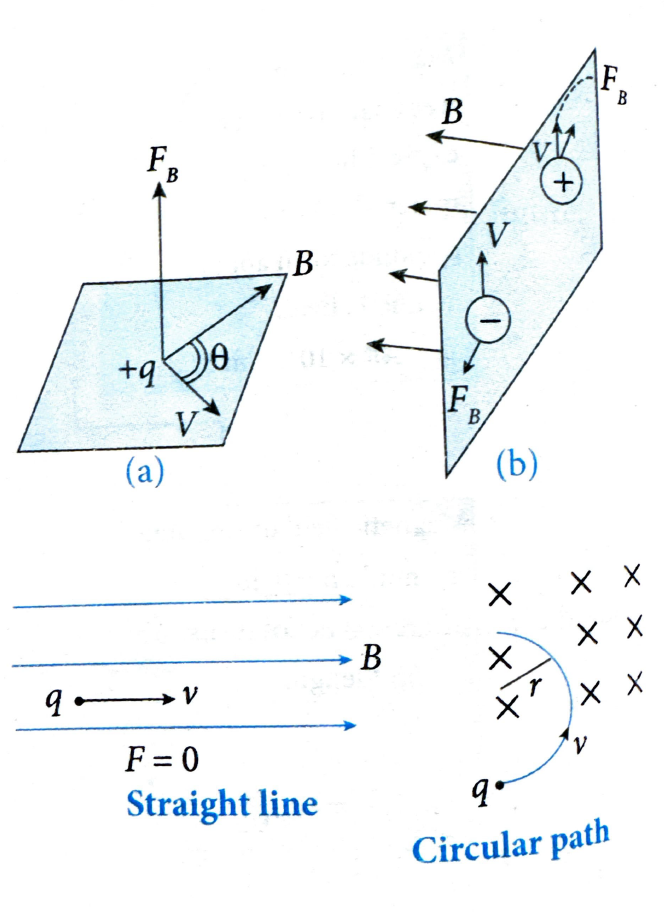

# 07. Force on a Moving Charge in a Magnetic Field

## Introduction

When a charged particle enters a magnetic field at an angle θ (not 0° or 180°), the magnetic force ($F_B$) acts perpendicular to both the velocity ($\vec{v}$) and the magnetic field ($\vec{B}$). The force $F_B$ is perpendicular to the plane containing $\vec{v}$ and $\vec{B}$, as shown in figure (a).

Oppositely directed magnetic forces are exerted on two oppositely charged particles moving at the same velocity in a magnetic field, as shown in figure (b).

## Magnitude of Magnetic Force

The magnitude of the magnetic force $F_B$ is proportional to:
- $q$ (charge on particle)
- $v$ (velocity of particle)
- $B$ (intensity of magnetic field)

The magnetic force is given by:

$$F_B = q(\vec{v} \times \vec{B}) = qvB \sin \theta$$

The magnitude is:

$$F_B = |q| vB \sin \theta$$

## Direction of Magnetic Force

The direction of $F_B$ depends on:
- The direction of the velocity of the charged particle
- The direction of the magnetic field $\vec{B}$

**Important points:**
- If a charged particle moves parallel (either in the same or opposite direction) to the magnetic field, the magnetic force acting on it is **zero**.
- The magnetic force exerted on a positive charge is in the **opposite direction** to the force exerted on a negative charge moving in the same direction.

## Special Cases

### Case 1: θ = 0° or 180° (Parallel Motion)

If θ = 0° or 180°, the charged particle experiences **no force** ($F = 0$) and continues in a **straight line**.

### Case 2: θ = 90° (Perpendicular Motion)

If θ = 90°, the particle experiences **maximum force** and follows a **circular path**. In this case, the necessary centripetal force is provided by the magnetic force.

> **TODO:** Add m-fig25.png - Diagram showing charge q moving in a circular path in a magnetic field (X symbols), with tangential velocity vector v and "Circular path" label

For circular motion:

$$F_{\text{max}} = \frac{mv^2}{r} = qvB$$

where:
- $m$ is the mass of the particle
- $v$ is the velocity
- $r$ is the radius of the circular path
- $q$ is the charge
- $B$ is the magnetic field strength

### Radius of Circular Path

From the above equation, the radius of the circular path is:

$$r = \frac{mv}{qB} = \frac{P}{qB} = \frac{\sqrt{2mKE}}{qB}$$

where:
- $P = mv$ is the momentum
- $KE = \frac{1}{2}mv^2$ is the kinetic energy

**Derivation:**
- $KE = \frac{1}{2}mv^2$
- $m \cdot KE = \frac{1}{2}m^2v^2$
- $2mKE = P^2$
- $P = \sqrt{2mKE}$

### Time Period of Circular Motion

The time period ($T$) for one complete revolution is:

$$T = \frac{2\pi r}{v} = \frac{2\pi m}{Bq}$$

## Work Done by Magnetic Force

A magnetic field can alter the **direction** of a charged particle's velocity but **cannot change its speed or kinetic energy**. This is because $F_B$ always acts perpendicular to the particle's velocity, thus doing **zero work** on it.

## Fleming's Left Hand Rule

By John Ambrose Fleming (1849-1945), suggested a rule for finding the direction of the force experienced by a current-carrying wire placed in a magnetic field that is perpendicular to the current in the wire.

If the forefinger, the second finger and the thumb of the left hand are stretched at right angles to each other, the forefinger pointing in the direction of the field and the second finger in the direction of the current then thumb indicates the direction of the force. It is called Fleming's left-hand rule.

