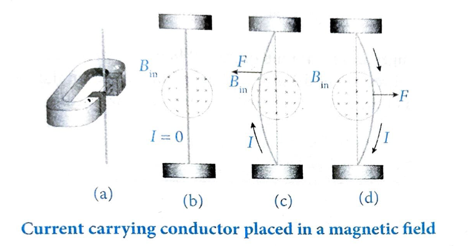
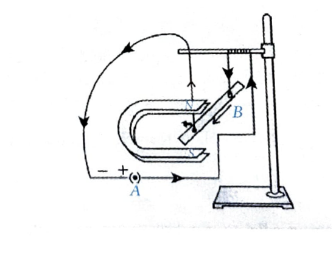
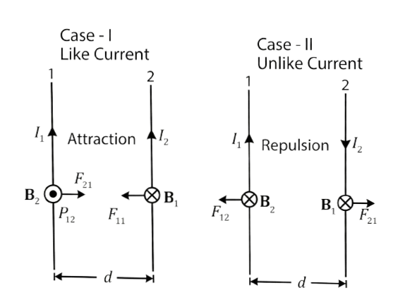
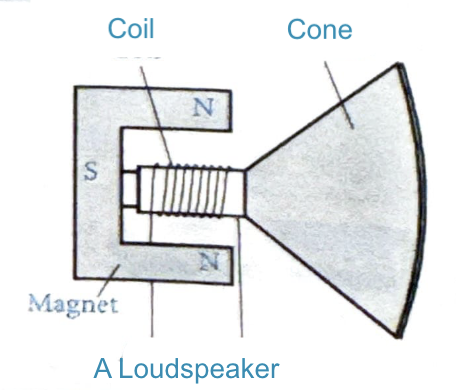
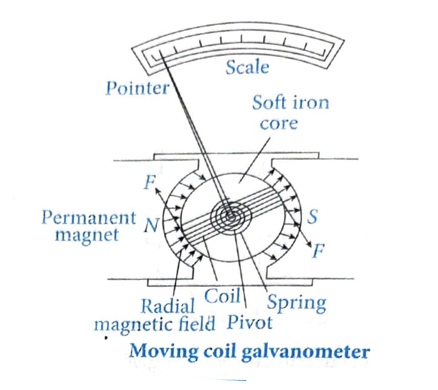
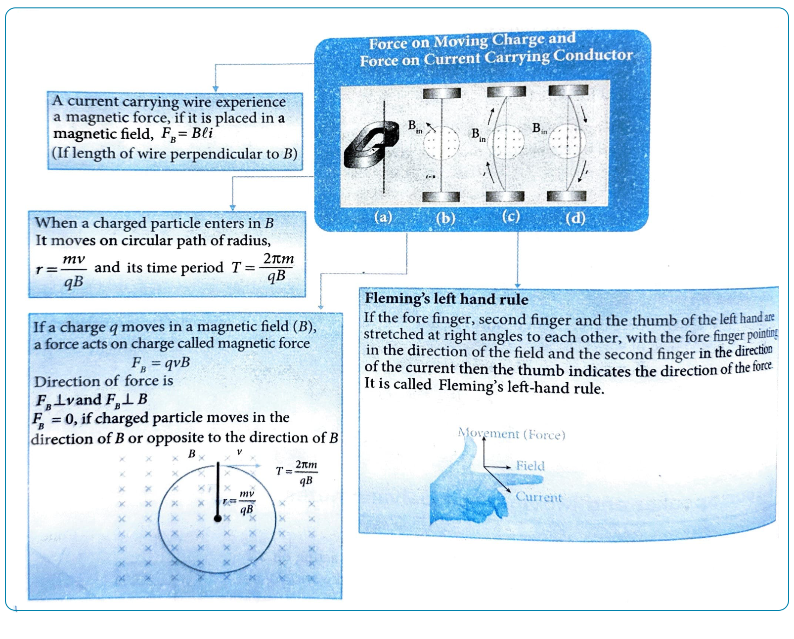

# 08. Force on a Current Carrying Conductor

## Introduction

A current-carrying wire is essentially a collection of moving charged particles. When such a wire is placed in a magnetic field, each charged particle experiences a magnetic force. The sum of all these individual forces is the total force on the wire. This force is transmitted to the wire through collisions of the charged particles with the atoms of the wire.

## Experimental Observation

A wire suspended vertically between the poles of a magnet demonstrates the force on a current-carrying conductor:

**Caption:** Current carrying conductor placed in a magnetic field

**Experimental Setup:**
1. A wire is suspended vertically between the poles of a magnet.
2. In the setup shown above, looking at the south pole of the magnet, so that the magnetic field (crosses) is directed into the page. When there is no current in the wire, it remains vertical.
3. When the current is upward, the wire deflects to the left.
4. When the current is downward, the wire deflects to the right.

## Magnitude of Magnetic Force

For a straight wire of length $L$ carrying current $I$ placed in a uniform magnetic field $B$, the magnitude of the magnetic force is:

$$F = BIL \sin \theta$$

where:
- $B$ is the magnitude of the magnetic field
- $I$ is the current flowing in the wire
- $L$ is the length of the wire
- $\theta$ is the angle between the direction of current and the magnetic field

## Key Points

1. **Direction of Force**: The direction of force $\vec{F}$ is perpendicular to the plane formed by $\vec{L}$ (direction of current) and $\vec{B}$ (magnetic field). This direction is determined by **Fleming's left-hand rule**.

2. **No Force Condition**: If $\theta = 0°$ or $180°$ (wire parallel or antiparallel to the magnetic field), then $F = 0$, meaning **no force** acts on the conductor.

3. **Maximum Force**: The force $F$ is **maximum** when $\theta = 90°$:

$$F_{\text{max}} = ILB$$

4. **General Formula**: For a straight wire of length $L$ in a uniform magnetic field $B$:

$$F = ILB \sin \theta$$

## Fleming's Left Hand Rule

The direction of the force on a current-carrying conductor in a magnetic field can be determined using Fleming's Left Hand Rule:

**The Rule**: If the forefinger, the second finger, and the thumb of the left hand are stretched at right angles to each other:
- **Forefinger** points in the direction of the **magnetic field** ($\vec{B}$)
- **Second finger** points in the direction of the **current** ($\vec{I}$)
- **Thumb** indicates the direction of the **force** ($\vec{F}$)

The direction of force $\vec{F}$ is perpendicular to the plane formed by $\vec{L}$ (direction of current) and $\vec{B}$ (magnetic field), as governed by Fleming's left-hand rule.

## Activity 3: Force on a Current Carrying Conductor Placed in Magnetic Field

**Materials Required:**
- Small aluminium rod AB (about 5 cm)
- Two connecting wires
- Stand
- Strong horse-shoe magnet
- Battery
- Key
- Rheostat

**Procedure:**
1. Take a small aluminium rod AB (of about 5 cm). Using two connecting wires, suspend it horizontally from a stand, as shown in the figure.
2. Place a strong horse-shoe magnet in such a way that the rod lies between the two poles with the magnetic field directed upwards. For this, put the north pole of the magnet vertically below and south pole vertically above the aluminum rod.
3. Connect the aluminum rod in series with a battery, a key, and a rheostat.
4. Now pass a current through the aluminum rod from end B to end A.

**Observation:** It is observed that the rod is displaced towards the left.

## Magnetic Force Between Two Long Parallel Current Carrying Conductors

The net magnetic force acting on a current-carrying wire due to its own field is zero. So consider two infinite long parallel wires separated by distance $d$ carrying currents $I_1$ and $I_2$.

### Case I: Like Currents (Attraction)

When both wires carry current in the **same direction**, they **attract** each other.

**Magnetic field at each point on wire (2) due to current $I_1$:**

$$B_1 = \frac{\mu_0 I_1}{2\pi d} \quad \text{[Uniform field for wire (2)]}$$

**Magnetic field at each point on wire (1) due to current $I_2$:**

$$B_2 = \frac{\mu_0 I_2}{2\pi d} \quad \text{[Uniform field for wire (1)]}$$

### Case II: Unlike Currents (Repulsion)

When the wires carry current in **opposite directions**, they **repel** each other.

### Magnetic Force on Each Wire

**Magnetic force experienced by elements of each wire (length $l$):**

$$F_{12} = B_2 I_1 l = \left(\frac{\mu_0 I_2}{2\pi d}\right) I_1 l \quad \text{(Where } I_1 l \perp B_2 \text{)}$$

$$F_{21} = B_1 I_2 l = \left(\frac{\mu_0 I_1}{2\pi d}\right) I_2 l \quad \text{(Where } I_2 l \perp B_1 \text{)}$$

where:
- $F_{12}$ is magnetic force on element of wire (1), due to field of wire (2)
- $F_{21}$ is magnetic force on element of wire (2), due to field of wire (1)

**Magnetic force per unit length of each wire:**

$$f = \frac{F_{12}}{l} = \frac{F_{21}}{l} = \frac{\mu_0 I_1 I_2}{2\pi d}$$

In SI units:

$$f = \frac{\mu_0 I_1 I_2}{2\pi d} \text{ N/m}$$

## Applications

### Loud Speaker

The loudspeakers in most sound systems use a magnetic force acting on a current-carrying conductor in a magnetic field to produce sound waves.

> **TODO:** Add diagram showing loudspeaker with C-shaped magnet (N and S poles), coil, and cone

**Working Principle:**
- A coil is placed in the magnetic field of a permanent magnet
- When an alternating current passes through the coil, it experiences a force
- This force causes the coil to vibrate
- The coil is attached to a cone, which amplifies the vibrations to produce sound

### Moving Coil Galvanometer

A galvanometer is a delicate device used to measure the magnitude and direction of small electric currents. It works on the principle that when a current-carrying coil is placed in an external magnetic field, it experiences a force.

**Working Principle:**
- A coil is suspended in a magnetic field
- When current flows through the coil, it experiences a torque
- The coil rotates, and the deflection is proportional to the current
- A pointer attached to the coil indicates the current magnitude

---

## Examples

### Example 3

**Problem:** A straight conductor of length 0.5 meters is placed in a uniform magnetic field of 0.2 T. The conductor carries a current of 4 A and is oriented perpendicular to the magnetic field. Calculate the magnitude of the force acting on the conductor.

**Solution:**

**Given:**
- Length, $L = 0.5$ m
- Magnetic field, $B = 0.2$ T
- Current, $I = 4$ A
- Angle, $\theta = 90°$ (perpendicular to magnetic field)

**Formula:**
$$F = BIL \sin \theta$$

**Calculation:**
$$F = 0.2 \times 4 \times 0.5 \times \sin 90°$$
$$F = 0.2 \times 4 \times 0.5 \times 1$$
$$F = 0.4 \text{ N}$$

**Answer:** The magnitude of the force acting on the conductor is **0.4 N**.

---

### Example 4

**Problem:** An electron having mass $9 \times 10^{-31}$ kg, charge $1.6 \times 10^{-19}$ C and moving with a velocity of $10^6$ m/s enters a region where magnetic field exists. If it describes a circle of radius 0.10 m, the intensity of magnetic field must be

**(1)** $1.8 \times 10^{-4}$ T  
**(2)** $5.6 \times 10^{-5}$ T  
**(3)** $14.4 \times 10^{-5}$ T  
**(4)** $1.3 \times 10^{-6}$ T

**Solution:**

**Given:**
- Mass, $m = 9 \times 10^{-31}$ kg
- Charge, $q = 1.6 \times 10^{-19}$ C
- Velocity, $v = 10^6$ m/s
- Radius, $r = 0.10$ m

**Formula:**
For a charged particle moving in a circular path in a magnetic field, the centripetal force is provided by the magnetic force:

$$qvB = \frac{mv^2}{r}$$

Rearranging to find $B$:

$$B = \frac{mv}{qr}$$

**Calculation:**
$$B = \frac{(9 \times 10^{-31}) \times (10^6)}{(1.6 \times 10^{-19}) \times 0.1}$$
$$B = \frac{9 \times 10^{-25}}{0.16 \times 10^{-19}}$$
$$B = \frac{9 \times 10^{-25}}{1.6 \times 10^{-20}}$$
$$B = 5.625 \times 10^{-5} \text{ T}$$

**Answer:** The intensity of magnetic field is approximately **$5.6 \times 10^{-5}$ T**, which corresponds to option **(2)**.

---

### Example 5

**Problem:** Two parallel wires carrying currents 10 A and 15 A in the same direction are 30 cm apart. The force acting over a unit length of the wire is

**(1)** $5 \times 10^{-4}$ N, (attractive)  
**(2)** $1 \times 10^{-4}$ N, (attractive)  
**(3)** $5 \times 10^{-4}$ N, (repulsive)  
**(4)** $1 \times 10^{-4}$ N, (repulsive)

**Solution:**

**Given:**
- Current in wire 1, $I_1 = 10$ A
- Current in wire 2, $I_2 = 15$ A
- Distance between wires, $d = 30$ cm $= 30 \times 10^{-2}$ m $= 0.30$ m
- Both currents are in the same direction (attractive force)

**Formula:**
The force per unit length between two parallel current-carrying wires is:

$$f = \frac{F}{l} = \frac{\mu_0 I_1 I_2}{2\pi d}$$

**Calculation:**
$$f = \frac{\mu_0 I_1 I_2}{2\pi d}$$
$$f = \frac{4\pi \times 10^{-7} \times 10 \times 15}{2\pi \times 30 \times 10^{-2}}$$
$$f = \frac{4\pi \times 10^{-7} \times 150}{2\pi \times 0.30}$$
$$f = \frac{600\pi \times 10^{-7}}{0.60\pi}$$
$$f = \frac{600 \times 10^{-7}}{0.60}$$
$$f = 1000 \times 10^{-7}$$
$$f = 1 \times 10^{-4} \text{ N}$$

Since both currents are in the same direction, the force is **attractive**.

**Answer:** The force acting over a unit length of the wire is **$1 \times 10^{-4}$ N (attractive)**, which corresponds to option **(2)**.

