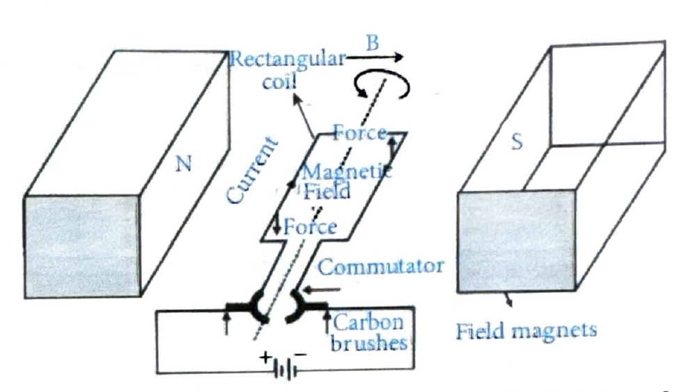

# 09. Electric Motor

## Introduction

An **electric motor** is a device that converts **electrical energy** into **mechanical energy**. Electric motors are widely used in various applications including:
- Fans
- Washing machines
- Refrigerators
- Mixers
- Computers
- Electric cars
- Power tools
- Drills
- Remote-controlled toys

Commonly used motors are **DC motors** (Direct Current motors).

## 9.1 Principle of Electric Motor

An electric motor works on the principle that a **rectangular coil** placed in a **magnetic field**, when current is passed through it, experiences **two equal and opposite forces** that cause it to **rotate continuously**.

## 9.2 Working of a DC Motor

### Components

1. **Armature (Rotor):** A rectangular insulated copper wire wound on a soft iron core that rotates about its axis.
2. **Field Magnets:** Two strong permanent magnets (or electromagnets) placed with opposite poles facing each other.
3. **Commutator:** A split-ring device connected to the ends of the coil that reverses the current direction every time the coil passes the vertical position.
4. **Carbon Brushes:** Two carbon brushes that maintain contact with the rotating commutator rings, supplying current from a battery.

> **TODO:** Add schematic diagram of DC motor showing all components

### Working Mechanism

**Step 1: Initial Position**
- The rectangular coil is placed between the poles of a permanent magnet.
- Current flows through the coil via carbon brushes and commutator.
- The two vertical sides of the coil experience forces in opposite directions (due to Fleming's Left Hand Rule).
- These forces create a **torque** that causes the coil to rotate.

**Step 2: Rotation (0° to 90°)**
- As the coil rotates, the forces continue to act perpendicular to the sides of the coil.
- The coil rotates from its initial position.

**Step 3: At 90° Position**
- When the coil reaches the vertical position (90°), each brush is momentarily in contact with both commutator segments.
- At this instant, current through the coil is zero ($I = 0$).
- The coil continues rotating due to inertia.

**Step 4: At 180° Position**
- The brushes are again aligned with the commutator segments.
- The current direction in the coil is **reversed** (due to commutator action).
- The side that was previously experiencing force in one direction now experiences force in the opposite direction.
- This ensures **continuous rotation in the same direction**.

**Step 5: Continuous Rotation**
- The process repeats, and the coil continues to rotate in the same direction.
- The commutator ensures that the current direction reverses every half rotation, maintaining unidirectional rotation.

### Key Points

- The **commutator** is essential for continuous rotation in one direction.
- Without the commutator, the coil would oscillate back and forth instead of rotating continuously.
- The **carbon brushes** provide a sliding contact with the rotating commutator.
- The **armature** (coil) rotates due to the torque produced by the interaction between the current-carrying coil and the magnetic field.

## Improvements to Electric Motor

To improve the performance of an electric motor:

1. **Use an electromagnet** instead of a permanent magnet - This provides a stronger magnetic field and allows control of the field strength.
2. **Use a large number of turns** in the current-carrying coil - This increases the torque and makes the motor more powerful.

## Applications

Electric motors are used in:
- **Household appliances:** Fans, washing machines, refrigerators, mixers
- **Transportation:** Electric cars, trains
- **Industrial equipment:** Power tools, drills, conveyor belts
- **Electronics:** Computer hard drives, CD/DVD players
- **Toys:** Remote-controlled cars, robots

---

## Related Concepts

### Electric Motor vs. Electric Generator

- **Electric Motor:** Converts electrical energy → mechanical energy
- **Electric Generator:** Converts mechanical energy → electrical energy

The construction is similar, but the working principle is opposite.
