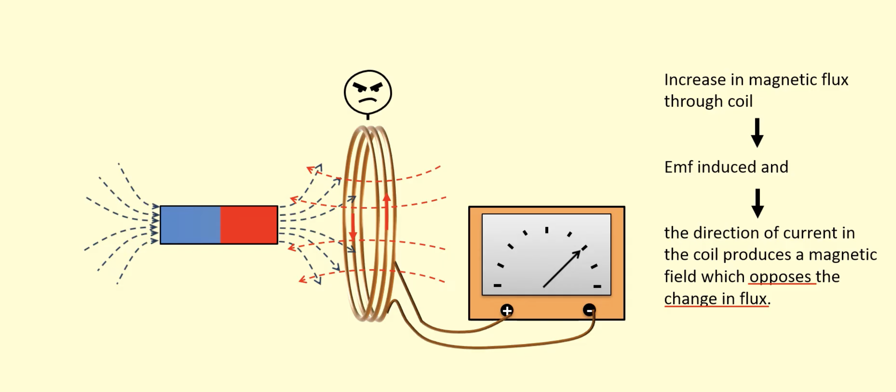
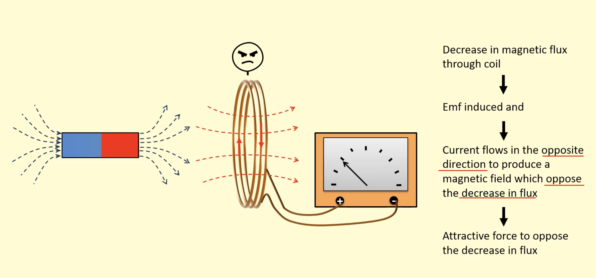

# 10. Electromagnetic Induction

## Introduction

When a conductor is moved in a magnetic field or the magnetic field associated with a coil changes, then an **emf (electromotive force)** is produced. This emf is called **induced emf** and the electric current is called **induced current**.

The phenomenon of production of emf or current in a conductor by continuously changing the magnetic field associated with it is called **electromagnetic induction**.

### Key Concepts

- **Induced EMF:** The electromotive force produced in a conductor due to changing magnetic field
- **Induced Current:** The electric current that flows due to the induced emf
- **Electromagnetic Induction:** The process of generating electricity from magnetism

### Conditions for Electromagnetic Induction

Electromagnetic induction occurs when:
1. A conductor moves in a magnetic field, or
2. The magnetic field associated with a coil changes (increases or decreases)

---

## Fleming's Right-Hand Rule

Fleming's right-hand rule gives the direction of the induced current when a section of conducting loop passes through a magnetic field perpendicular to it.

**Fleming's Right-Hand Rule**: If the forefinger, second finger and thumb of the right hand are stretched at right angles to each other, with the forefinger in the direction of the field and the thumb in the direction of the motion of the wire, then the induced current in the wire is in the direction of the second finger.

## Lenz's Law

Lenz's law was given by Russian physicist Heinrich Lenz in 1834. Lenz's law states that the direction of the induced current is such that it opposes the cause that produces it. It implies it opposes the change in magnetic flux that causes it.

**Example**: When the north pole of a magnet moves towards the loop, a current is induced in the loop such that it opposes the motion, i.e., the current is induced in an anti-clockwise direction (as seen from the side of the magnet). When the north pole of the magnet is moved away from the loop, a current is induced in the loop in such a way that it opposes the motion, i.e., attracts the magnet towards it. The current is induced in a clockwise direction in the coil (as seen from the magnet).

When a conducting loop is subjected to an increasing or decreasing magnetic field $B$, the current induced in the loop has a direction such that the current's magnetic field opposes the change in the magnetic field of the external source.

---

## Examples

### Example 6

**Problem:** Two circular coils A and B are placed close to each other. If the current in the coil A is changed, will some current be induced in the coil B? Give reason.

> **TODO:** Add diagram showing two circular coils A and B side-by-side, with coil A having current I (clockwise) and coil B connected to galvanometer G

**Solution:**

Consider two coils A and B are held close to each other as shown in the figure. Whenever the current in the coil A changes, the **magnetic flux** (or magnetic field of A) associated with the coil B changes, and coil B will oppose the change, which means **current will be induced in the coil B**.

**Explanation:**
- When current in coil A changes, the magnetic field produced by coil A changes
- This changing magnetic field links with coil B, changing the magnetic flux through coil B
- According to Faraday's law of electromagnetic induction, a changing magnetic flux induces an emf and current in coil B
- According to Lenz's law, the induced current in coil B opposes the change in magnetic flux

---

### Example 7

**Problem:** If a coil of metal wire is kept stationary in a uniform magnetic field, then

**(1)** An emf is induced in the coil  
**(2)** A current is induced in the coil  
**(3)** Neither emf nor current is induced  
**(4)** Both emf and current is induced

**Solution:**

**Answer: (3) Neither emf nor current is induced**

**Explanation:**

For electromagnetic induction to occur, there must be a **change in magnetic flux** linked with the coil. 

In this case:
- The coil is **stationary** (not moving)
- The magnetic field is **uniform** (constant in magnitude and direction)
- Therefore, the **magnetic flux** through the coil **remains constant** (no change)

Since there is no change in magnetic flux, **no emf and no current** are induced in the coil.

**Key Point:** Emf and current are only induced when the flux linked with the coil **changes**.

---

### Example 8

**Problem:** In the diagram shown, if a bar magnet is moved along the common axis of two single turn coils A and B in the direction of arrow.

> **TODO:** Add diagram showing two circular coils A and B placed along horizontal axis, with bar magnet (N on left, S on right) moving from left to right (from coil A towards coil B)

**(1)** Current is induced only in A and not in B  
**(2)** Induced currents in A and B are in the same direction  
**(3)** Current is induced only in B and not in A  
**(4)** Induced currents in A and B are in opposite direction

**Solution:**

**Answer: (2) Induced currents in A and B are in the same direction**

**Explanation:**

When the bar magnet moves from left to right (towards coil B):
- The **magnetic flux** through both coils **changes**
- As the magnet approaches coil B, the flux through coil B **increases**
- As the magnet moves away from coil A, the flux through coil A **decreases**
- According to Lenz's law, both coils will induce currents that **oppose the change in flux**
- The induced currents in both coils A and B will be in the **same direction** (clockwise, as seen from the side of the magnet)

**Key Point:** Both coils experience changing magnetic flux, so both have induced currents. The direction of induced current in both coils is the same (clockwise).

---

### Example 9

**Problem:** A coil experiences a change in magnetic flux of 0.5 weber in 2 seconds. What is the magnitude of the induced emf according to Faraday's second law?

**(1)** 0.1 V  
**(2)** 0.25 V  
**(3)** 1.0 V  
**(4)** 2.5 V

**Solution:**

**Given:**
- Change in magnetic flux, $\Delta \Phi = 0.5$ Wb
- Time taken, $\Delta t = 2$ s

**Formula (Faraday's Second Law):**
The magnitude of induced emf is given by:

$$\text{emf} = \frac{\Delta \Phi}{\Delta t}$$

**Calculation:**
$$\text{emf} = \frac{0.5}{2} = 0.25 \text{ V}$$

**Answer: (2) 0.25 V**

**Explanation:**
According to Faraday's second law of electromagnetic induction, the magnitude of the induced emf is equal to the rate of change of magnetic flux linked with the coil. The faster the change in magnetic flux, the greater the induced emf.

---

## Methods of Electromagnetic Induction

EMF or current can be induced by the following methods:

### 1. Moving a Conductor in Magnetic Field

When a conductor moves in a magnetic field, cutting the magnetic field lines, an emf is induced in the conductor.

> **TODO:** Add diagram showing vertical conductor 'ab' moving to the right with velocity v through magnetic field (X symbols, field into page), with arrow 'i' showing induced current direction

**Example:** A straight wire moving perpendicular to a magnetic field.

### 2. Changing Current in a Coil

When the current in a coil changes, the magnetic field produced by the coil changes, which can induce emf in a nearby coil.

> **TODO:** Add diagram showing helical coil with arrow labeled 'i' indicating increase/decrease of current, implying changing magnetic field

**Example:** Two coils placed close together - changing current in one coil induces current in the other.

### 3. Changing Magnetic Field

When the magnetic field through a coil changes (increases or decreases), an emf is induced in the coil.

> **TODO:** Add diagram showing circular dotted line (coil) within magnetic field (X symbols), with 'B' indicating magnetic field and arrows suggesting the field is changing

**Example:** A coil placed in a region where the magnetic field strength is changing.

### 4. Rotating a Coil in Magnetic Field

When a coil rotates in a magnetic field, the magnetic flux through the coil changes continuously, inducing an alternating emf.

> **TODO:** Add diagram showing rectangular coil rotating within magnetic field (X symbols, field into page), with arrow 'ω' indicating angular velocity of rotation and 'B' denoting magnetic field

**Example:** AC generator - a coil rotating in a uniform magnetic field.

### 5. Moving a Magnet Along the Axis of a Coil

EMF can be induced in a coil by moving a magnet to and fro along the axis of the coil.

> **TODO:** Add diagram showing bar magnet (N and S poles labeled) moving towards helical coil, with magnetic field lines shown emanating from North pole and passing through the coil

**Example:** Moving a bar magnet in and out of a coil induces alternating current.

---

## Direction of Induced Current

The direction of induced current is given by **Fleming's Right Hand Rule**.

> **TODO:** Add diagram showing right hand with thumb, forefinger, and middle finger extended perpendicularly: thumb labeled 'Movement of conductor', forefinger 'Magnetic field', middle finger 'Current induced in a conductor'

**Fleming's Right Hand Rule:**
- **Thumb:** Direction of movement of conductor
- **Forefinger:** Direction of magnetic field
- **Middle finger:** Direction of induced current in the conductor

---

## Concept Map: Electromagnetic Induction

> **TODO:** Add concept map diagram showing:
> - Central box: "Electromagnetic Induction"
> - Connected boxes showing all methods (moving conductor, changing current, changing field, rotating coil, moving magnet)
> - Box showing Fleming's Right Hand Rule
> - Diagrams for each method

---

## TEST YOURSELF

**Question 13:** What is magnetic induction?

**Question 14:** Explain working of an electromagnet.

**Question 15:** What is the nature of lines of force due to a straight current carrying conductor?

