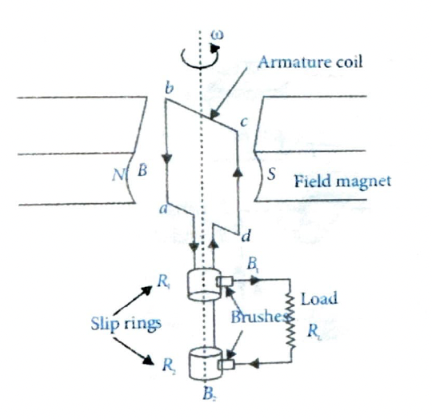

# 11. Electric Generator

An electric generator is a machine which generates alternating emf and converts mechanical energy into electrical energy. It is also called an alternator or dynamo.

## 11.1 Principle

An AC generator works on the principle of electromagnetic induction. According to Faraday's law of EMI, whenever magnetic flux linked with a coil is changed, an emf is generated. In an AC generator, a coil is rotated in a uniform magnetic field in a manner such that magnetic flux linked with the coil changes continuously. Due to the change in magnetic flux, an emf is generated.

## 11.2 Construction

The main components of an AC generator are:

### Armature

The armature coil ($abcd$) consists of a large number of turns of insulated copper wire wound over a soft iron cylindrical core. The soft iron core concentrates the magnetic field lines around the armature, thereby increasing the magnetic flux linked with it. The core is laminated to minimize losses due to eddy currents.

### Field Magnet

In a small AC generator, the field magnet is a permanent magnet of the horse-shoe shape, and in a large generator, it is a powerful electromagnet. The field magnet produces an almost uniform magnetic field in the region between its pole-pieces. The armature coil rotates between the pole pieces of the field magnet. The uniform magnetic field provided by the field magnet is perpendicular to the axis of rotation of the coil.

### Slip Rings

The two ends of the armature coil are connected to two brass slip rings $R_1$ and $R_2$. The rings are rigidly fixed to the shaft which is used to rotate the coil such that these rings rotate along with the armature coil. In addition to this, slip rings are insulated from each other as well as from the shaft.

### Brushes

Two carbon (graphite) brushes ($B_1$ and $B_2$) are pressed against the slip rings. The brushes are fixed while maintaining sliding contact with slip rings $R_1$ and $R_2$ rotating along with the armature. These brushes supply the current induced in the coil to the external circuit.

## 11.3 Working

The armature coil is rotated about its axis with the help of some external mechanical source of energy. Whenever magnetic flux linked with the coil changes, an induced emf is set up in the coil. The direction of induced emf or the current in the coil is determined by Fleming's right-hand rule. For every half rotation, the direction of current supplied to the load reverses. This process is repeated. Therefore, emf produced is of alternating nature.

There are two types of electric generator:

### (i) AC generator

### (ii) DC generator

The principle, construction and working of a DC generator is same as that of AC generator except in place of slip-rings, we use a split-ring (commutator). The current in the load always flows in the same direction due to the split-ring. Therefore, induced current is unidirectional i.e., direct current (DC).

