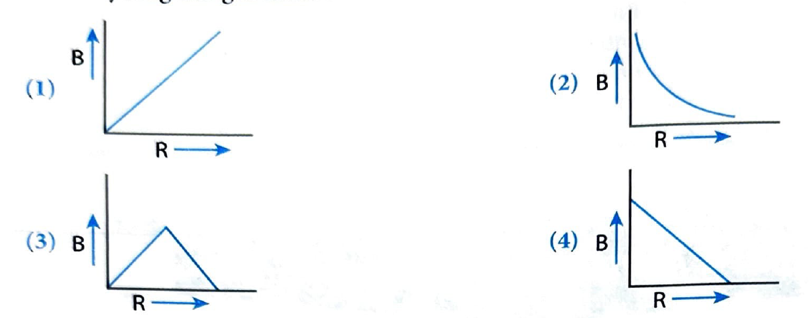
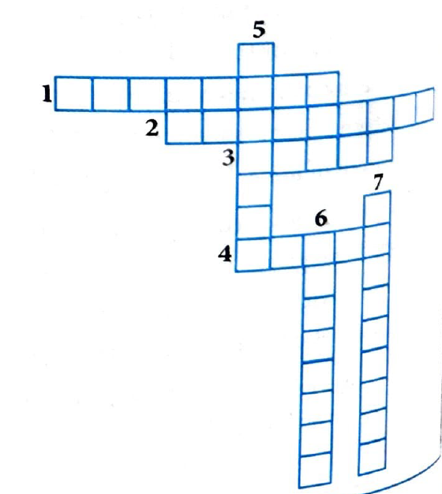
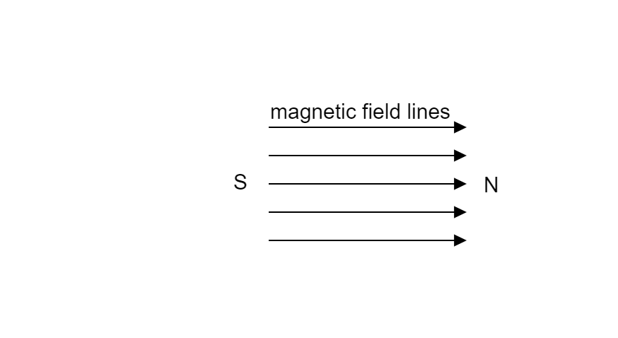

# Concept Application Exercise 1 - Solutions

[← Back to Exercise](concept-application-exercise-1.html)

---

## Problem 1

**Question:** What is a magnet?

**Solution:** A magnet is a material that produces a magnetic field around it. It can attract materials like iron, nickel, and cobalt. A magnet has two poles - north and south poles - which always exist together and cannot be separated.

---

## Problem 2

**Question:** Can the poles of a bar magnet be separated?

**Solution:** **No**, the poles of a bar magnet cannot be separated. If a bar magnet is broken into pieces, each piece will have both north and south poles. The two poles always exist together as a pair.

---

## Problem 3

**Question:** What do you mean by magnetic lines of force?

**Solution:** Magnetic lines of force (also called magnetic field lines) are imaginary lines that represent the magnetic field. The tangent to a magnetic field line at any point gives the direction of the magnetic field at that point. They are continuous closed curves that emerge from the north pole and enter the south pole.

---

## Problem 4

**Question:** Solve the following riddles:

**Riddle 1:** I'm not alive, but I pull Iron and steel objects, I make them full. A force unseen, but it's clearly there, What am I, found in every hardware store?

**Riddle 2:** I make needles point to the northern star, My influence extends both near and far. Without me, birds might lose their way, What natural feature am I, can you say?

**Riddle 3:** I dance and weave, never at rest, Invisible threads, put to the test. Around a bar, or through a wire, I shape my path, never tire. What am I in this magnetic scene?

**Solution:**

**Riddle 1:** **Magnet**

**Riddle 2:** **Earth's magnetic field**

**Riddle 3:** **Magnetic field lines**

---

## Problem 5

**Question:** Lines of force, both strong and keen. Ampere's rule guides my creation, A right hand grip, a simple equation. Wires, a coil takes shape, Magnetic influence, none can escape. What am I?

**Solution:** **Magnetic field** (produced by a current-carrying coil)

---

## Problem 6

**Question:** The radius of a circular loop is 0.4 m and the current is 12 A. What is the magnitude of magnetic field at the center of the loop?

**(1)** $6\pi \times 10^{-6}$ T  
**(2)** 20 T  
**(3)** Zero  
**(4)** $6\pi \times 10^{-7}$ T

**Solution:**

The magnetic field at the center of a circular loop is given by:

$$B = \frac{\mu_0 I}{2r}$$

Where:
- $\mu_0 = 4\pi \times 10^{-7}$ T·m/A
- $I = 12$ A
- $r = 0.4$ m

$$B = \frac{4\pi \times 10^{-7} \times 12}{2 \times 0.4} = \frac{48\pi \times 10^{-7}}{0.8} = 60\pi \times 10^{-7} = 6\pi \times 10^{-6} \text{ T}$$

**Answer:** **(1)** $6\pi \times 10^{-6}$ T

---

## Problem 7

**Question:** Which of the following graphs represent the variation of magnetic field (B) with distance (R) from an infinitely long straight conductor?

**Solution:** For an infinitely long straight conductor, the magnetic field is inversely proportional to the distance: $B = \frac{\mu_0 I}{2\pi R}$. Therefore, $B \propto \frac{1}{R}$.

The graph should show a hyperbola where B decreases as R increases.

> **TODO:** Add graph images showing the correct B vs R relationship (four graph options)

---

## Problem 8

**Question:** Find the ratio of magnetic field at point A and point B inside a long solenoid as shown in the given figure.

> **TODO:** Add figure showing points A and B inside a long solenoid with labeled points

**(1)** 1:1  
**(2)** 1:2  
**(3)** 3:1  
**(4)** 2:1

**Solution:** Inside a long solenoid, the magnetic field is uniform (constant) throughout. Therefore, the magnetic field at point A and point B will be the same.

**Answer:** **(1)** 1:1

---

## Problem 9

**Question:** An electric current passes through a long straight wire. At a distance 5 cm from the wire, the magnetic field is B. The field at 20 cm from the wire would be

**(1)** $\frac{B}{4}$  
**(2)** $\frac{B}{2}$  
**(3)** $3B$  
**(4)** $\frac{B}{3}$

**Solution:**

For a long straight wire, $B = \frac{\mu_0 I}{2\pi r}$, so $B \propto \frac{1}{r}$.

If $B_1 = B$ at $r_1 = 5$ cm, then at $r_2 = 20$ cm:

$$\frac{B_2}{B_1} = \frac{r_1}{r_2} = \frac{5}{20} = \frac{1}{4}$$

Therefore, $B_2 = \frac{B}{4}$

**Answer:** **(1)** $\frac{B}{4}$

---

## Problem 10

**Question:** A long solenoid carrying a current produce a magnetic field B along its axis. If the current is doubled and the number of turns per cm is halved, the new value of the magnetic field is

**(1)** $B$  
**(2)** $2B$  
**(3)** $4B$  
**(4)** $\frac{B}{2}$

**Solution:**

For a solenoid, $B = \mu_0 n I$, where $n$ is the number of turns per unit length.

Initially: $B = \mu_0 n I$

After changes:
- Current: $I' = 2I$
- Turns per cm: $n' = \frac{n}{2}$

New magnetic field: $B' = \mu_0 n' I' = \mu_0 \left(\frac{n}{2}\right)(2I) = \mu_0 n I = B$

**Answer:** **(1)** $B$

---

## Problem 11

**Question:** Solve the following crossword puzzle:

**Across:**
1. Substance which are attracted by a magnet.
2. Magnetic field lines do not \_\_\_\_\_\_\_ each other.
3. Like poles \_\_\_\_\_\_\_ each other.
4. An SI unit of magnetic field.
5. North and South pole will \_\_\_\_\_\_\_ each other.
6. Long cylindrical coil consisting a large number of turns.
7. Study of behavior and characteristic of a magnet.

**Solution:**

1. **Magnetic** (substances)
2. **Intersect**
3. **Repel**
4. **Tesla**
5. **Attract**
6. **Solenoid**
7. **Magnetism**

---

## Very Short Answer Type Questions - Solutions

## Problem 12

**Question:** The north pole of a magnet is placed near a stationary negatively charged body. Will the pole experience any force?

**Solution:** **Yes**. The stationary charge produces an electric field which induces charges on the magnet (electrostatic induction), causing an electrostatic force of attraction. However, the pole will **not** experience any magnetic force because a stationary charge does not produce a magnetic field.

---

## Problem 13

**Question:** When a charged particle is moving along the direction of magnetic field. How much force is experienced by the charged particle?

**Solution:** $F = qvB \sin(0^\circ) = 0$. Since the particle moves along the magnetic field, the angle is zero.

---

## Problem 14

**Question:** Name one device which works on the magnetic effect of current.

**Solution:** Electric motor, Loudspeaker.

---

## Problem 15

**Question:** What is the nature of magnetic field lines due to current in a long straight conductor?

**Solution:** Concentric circles centered on the wire.

---

## Problem 16

**Question:** Which rule will give the direction of force experienced by a current carrying linear conductor placed perpendicular to the magnetic field?

**Solution:** Fleming's Left-Hand Rule.

---

## Problem 17

**Question:** What type of force acts between two parallel wires carrying current in the same direction? What happens if one of the current is reversed?

**Solution:** Attractive force. If one current is reversed, the force becomes repulsive.

---

## Problem 18

**Question:** Write the formula for magnetic force per unit length between two parallel current carrying long conductors separated by a distance $r$.

**Solution:** $F = \frac{\mu_0 I_1 I_2}{2\pi r}$

---

## Problem 19

**Question:** What is the basic principle of an electric motor?

**Solution:** A current-carrying coil placed in a magnetic field experiences a torque (force) which causes it to rotate.

---

## Problem 20

**Question:** State the principle of an electric generator.

**Solution:** Electromagnetic Induction: When a conductor is placed in a changing magnetic field, an induced current is produced in it.

---

## Problem 21

**Question:** Name some sources of direct current.

**Solution:** Solar cells, Batteries (Chemical cells), DC Generators.

---

## Problem 22

**Question:** Draw magnetic field lines around a bar magnet.

> **TODO:** Add diagram showing magnetic field lines around a bar magnet (field lines emerging from north pole and entering south pole)

**Solution:** Field lines emerge from North pole and merge at South pole externally; S to N internally.

---

## Problem 23

**Question:** A positively-charged particle (alpha-particle) projected towards west is deflected towards north by a magnetic field. What will be the direction of magnetic field?

**Solution:** Vertically Upward. (Using Fleming's Left-Hand Rule: Motion (Current) = West, Force = North $\implies$ Field = Upward).

---

## Problem 24

**Question:** A rectangular coil of copper wires is rotated in a magnetic field. How many times the direction of the induced current changes in one revolution?

**Solution:** Twice. The direction of induced current changes every half revolution. Fleming's Right-Hand Rule is applied.

---

## Short Answer Type Questions - Solutions

## Problem 25

**Question:** What is the nature of magnetic field produced by a current flowing in a circular coil? Name the rule to find the direction of the magnetic field.

**Solution:** Concentric circles centered on the wire. Right-Hand Thumb Rule.

---

## Problem 26

**Question:** Does a constant magnetic field exert a force on a stationary charge? Explain.

**Solution:** No, it does not exert a force on a stationary charge. A magnetic field exerts a force on a moving charge.

---

## Problem 27

**Question:** Why two magnetic field lines do not intersect each other?

**Solution:** Because they represent direction of the magnetic field at each point, and a magnetic field cannot have two different directions at the same point.

---

## Problem 28

**Question:** A solenoid of length 50 cm, having 100 turns carries a current of 2.5 A. Find the magnetic field inside the interior of the solenoid.

**Solution:** $B = \mu_0 n I$. Here $n = \frac{N}{L} = \frac{100}{0.5} = 200 \text{ turns/m}$.

$$B = 4\pi \times 10^{-7} \times 200 \times 2.5 = 2\pi \times 10^{-4} \text{ T} \approx 6.28 \times 10^{-4} \text{ T}$$

---

## Problem 29

**Question:** A horizontal overhead power line carries a current of 90 A in east to west direction. What is magnitude and direction of the magnetic field due to this current at a point 1.5 m below the line?

**Solution:** $B = \frac{\mu_0 I}{2\pi r}$.

$$B = \frac{4\pi \times 10^{-7} \times 90}{2\pi \times 1.5} = \frac{2 \times 10^{-7} \times 90}{1.5} = 1.2 \times 10^{-5} \text{ T}$$

Direction: Using Right-Hand Thumb Rule, current is East to West. At a point below, the field is towards South.

---

## Problem 30

**Question:** State Faraday's law of electromagnetic induction?

**Solution:** Faraday's law of electromagnetic induction states that the rate of change of magnetic flux through a closed loop is equal to the induced emf in the loop. Mathematically, it can be expressed as:

$$\text{emf} = -\frac{d\Phi_B}{dt}$$

where $\Phi_B$ is the magnetic flux through the loop and $t$ is time. The negative sign indicates that the induced emf opposes the change in magnetic flux, a principle known as Lenz's law.

---

## Problem 31

**Question:** What precautions one should take in the working with electricity?

**Solution:** (i) Use insulated tools. (ii) Ensure proper earthing. (iii) Use fuse/MCB of appropriate rating.

---

## Problem 32

**Question:** A current through a horizontal overhead power line flows in east-west direction. What is the direction of magnetic field lines at a point just above the line?

**Solution:** Downward (Towards North).

---

## Problem 33

**Question:** What is the role of the split ring in an electric motor?

**Solution:** To reverse the direction of current in the coil every half rotation to maintain unidirectional torque.

---

## Problem 34

**Question:** Imagine that you are sitting in a chamber with your back to one wall. An electron beam, moving horizontally from back wall towards the front wall is deflected by a strong magnetic field to your right side. What is the direction of magnetic field?

**Solution:** Vertically Downward. (Fleming's Left-Hand Rule: Motion (opposite to electron) = Front to Back, Force = Right $\implies$ Field = Downward).

---

## Problem 35

**Question:** List the properties of magnetic lines of force.

**Solution:** (i) They originate from North pole and end at South pole outside the magnet. (ii) They are continuous closed curves. (iii) They never intersect each other. (iv) Crowded lines indicate strong field.

---

## Problem 36

**Question:** Draw a diagram to represent uniform magnetic field.

> **TODO:** Add diagram showing uniform magnetic field (parallel, equidistant field lines)

**Solution:** 

---

## Long Answer Type Questions - Solutions

## Problem 37

**Question:** What is electromagnetic induction? On what factors does the value of induced current produced in a circuit depend? Name and state the rules used for determination of direction of induced current. State one application of this phenomenon in everyday life.

**Solution:** Electromagnetic induction is the process of inducing an electric current in a conductor by changing the magnetic flux through it. The value of the induced current depends on the following factors:

(i) The strength of the magnetic field  
(ii) The rate of change of the magnetic field  
(iii) The number of turns in the coil  
(iv) The resistance of the coil

The direction of the induced current is determined by Lenz's law, which states that the induced current always opposes the change in magnetic flux that produced it.

**Application:** Electric generators, transformers, induction cooktops.

---

## Problem 38

**Question:** Draw a labelled diagram of $AC$ generator. Explain the principle and working of AC generator.

> **TODO:** Add labelled diagram of AC generator showing all components (armature, slip rings, brushes, magnetic field, etc.)

**Solution:** *Content to be completed*

---

## Problem 39

**Question:** What is an electromagnet and what are its uses?

**(i)** Draw a labelled diagram to show how an electromagnet is made.

> **TODO:** Add labelled diagram showing how an electromagnet is made (solenoid with iron core, battery, switch)

**(ii)** What is the purpose of soft iron core used in making an electromagnet?

**(iii)** Draw and label diagram showing magnetic field lines due to a
- Circular coil carrying current
- Long straight solenoid carrying current.
- Bar magnet

> **TODO:** Add three separate diagrams:
> - Diagram 1: Magnetic field lines due to circular coil carrying current
> - Diagram 2: Magnetic field lines due to long straight solenoid carrying current
> - Diagram 3: Magnetic field lines due to bar magnet

**Solution:** *Content to be completed*

---

[← Back to Exercise](concept-application-exercise-1.html)

