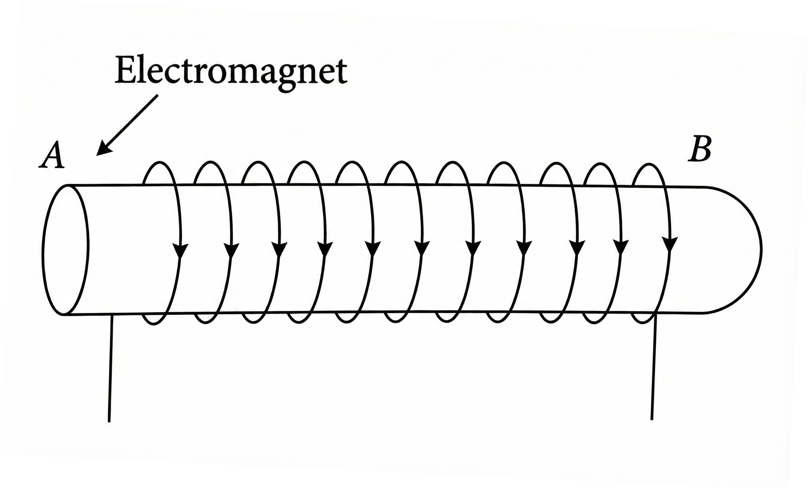

# Section A: NCERT Corner

**Note:** This section contains NCERT-style questions covering all topics from Magnetic Effects of Electric Current.

---

## Very Short Answer Type Questions

**Question 1:** The north pole of a magnet is placed near a stationary negatively charged body. Will the pole experience any force?

---

**Question 2:** When a charged particle is moving along the direction of magnetic field. How much force is experienced by the charged particle?

---

**Question 3:** Name one device which works on the magnetic effect of current.

---

**Question 4:** What is the nature of magnetic field lines due to current in a long straight conductor?

---

**Question 5:** Which rule will give the direction of force experienced by a current carrying linear conductor placed perpendicular to the magnetic field?

---

**Question 6:** What type of force acts between two parallel wires carrying current in the same direction? What happens if one of the current is reversed?

---

**Question 7:** Write the formula for magnetic force per unit length between two parallel current carrying long conductors separated by a distance $r$.

---

**Question 8:** What is the basic principle of an electric motor?

---

**Question 9:** State the principle of an electric generator.

---

**Question 10:** Name some sources of direct current.

---

**Question 11:** Draw magnetic field lines around a bar magnet.

> **TODO:** Add diagram showing magnetic field lines around a bar magnet with N and S poles labeled

---

**Question 12:** A positively-charged particle (alpha-particle) projected towards west is deflected towards north by a magnetic field. What will be the direction of magnetic field?

---

**Question 13:** A rectangular coil of copper wires is rotated in a magnetic field. How many times the direction of the induced current changes in one revolution?

---

## Short Answer Type Questions

**Question 14:** What is the nature of magnetic field produced by a current flowing in a circular coil? Name the rule to find the direction of the magnetic field.

---

**Question 15:** Does a constant magnetic field exert a force on a stationary charge? Explain.

---

**Question 16:** Why two magnetic field lines do not intersect each other?

---

**Question 17:** A solenoid of length 50 cm, having 100 turns, carries a current of 2.5 A. Find the magnetic field in the interior of the solenoid.

---

**Question 18:** A horizontal overhead power line carries a current of 90 A in east to west direction. What is the magnitude and direction of the magnetic field due to this current at a point 1.5 m below the line?

---

**Question 19:** What are Faraday's law of electromagnetic induction?

---

**Question 20:** What precautions one should take in the use of electricity?

---

**Question 21:** A current through a horizontal overhead power line flows in east-west direction. What is the direction of magnetic field lines at a point just above the line?

---

**Question 22:** What is the role of the split ring in an electric motor?

---

**Question 23:** Imagine that you are sitting in a chamber with your back to one wall. An electron beam, moving horizontally from back wall towards the front wall, is deflected by a strong magnetic field to your right side. What is the direction of magnetic field?

---

**Question 24:** List the properties of magnetic lines of force.

---

**Question 25:** Draw a diagram to represent uniform magnetic field.

---

## Long Answer Type Questions

**Question 26:** What is electromagnetic induction? On what factors does the value of induced current produced in a circuit depend? Name and state the rule used for determination of direction of induced current. State one application of this phenomenon in everyday life.

---

**Question 27:** Draw a labelled diagram of AC generator. Explain the principle and working of AC generator.

> **TODO:** Add labelled diagram of AC generator showing all components

---

## Additional Questions

**Question:** What is an electromagnet and what are its uses?

**(i)** Draw a labelled diagram to show how an electromagnet is made.

**(ii)** What is the purpose of soft iron core used in making an electromagnet?

---

**Question:** Draw magnetic field lines due to a

**(i)** Circular coil carrying current

**(ii)** Long straight solenoid carrying current

**(iii)** Bar magnet

> **TODO:** Add diagrams showing magnetic field lines for (i) circular coil, (ii) solenoid, and (iii) bar magnet

---

**Question:** Give reasons

**(i)** A freely suspended magnet stays at north south direction.

**(ii)** Current is induced in a coil rotating in a uniform magnetic field.

**(iii)** When two circular coils are placed close to each other and current in one of the coil is changed, some current is induced in the other coil.

**(iv)** Earth wire is used in electrical appliances.

---

**Question 1:** How does a solenoid behave like a magnet? Can you determine the north and south poles of a current-carrying solenoid with the help of a bar magnet? Explain.

---

## HOTS Questions (Higher Order Thinking Skills)

**Question 31:** A region A has magnetic field lines relatively closer than another region B. Which region has stronger magnetic field? Give reason to support your answer.

---

**Question 33:** What does the divergence of magnetic field lines near the ends of a current-carrying straight solenoid indicate?

---

**Question 34:** A magnetic compass shows a deflection when placed near a current-carrying wire. How will the deflection of the compass get affected if the current in the wire is increased? Support your answer with a reason.

---

**Question 35:** What happens to the direction of magnetic field around a current-carrying wire if the direction of current is reversed and why?

---

**Question 36:** The front face of a circular wire carrying current behaves like a North pole. Identify the direction of current in face of the circular wire.

---

**Question 37:** State the conclusions that can be drawn from the observation that a current-carrying wire deflects a magnetic needle placed near it.

---

**Question 38:** Identify the region where the magnetic field around a current-carrying solenoid is uniform.

---

**Question 39:** What name is given to the device which automatically cut-off the electrical supply during short circuiting in household wiring?

---

**Question 40:** The diagram shows a coil of wire wound on a soft iron core forming an electromagnet. A current is passed through the coil in the direction indicated by the arrows. Mark the N and S-poles produced in the iron core.

---

**Question 41:** With the help of a labelled circuit diagram illustrate the pattern of field lines of the magnetic field around a long current carrying straight conducting wire. How is the right-hand thumb rule useful to find direction of magnetic field associated with a current carrying conductor?

> **TODO:** Add labelled diagram showing magnetic field lines around a straight current-carrying wire with right-hand thumb rule illustration

---

