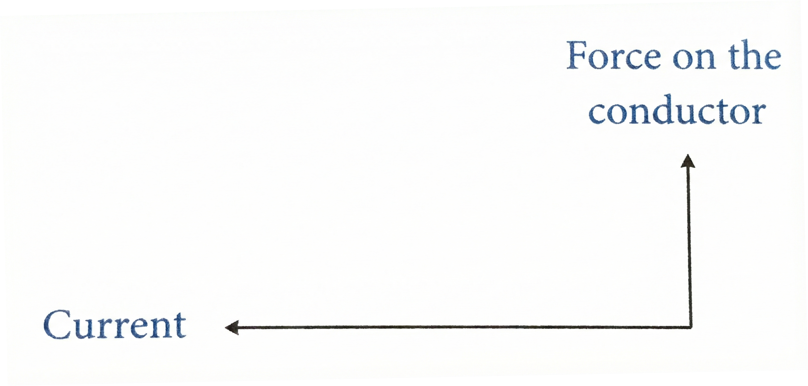
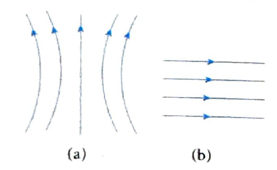
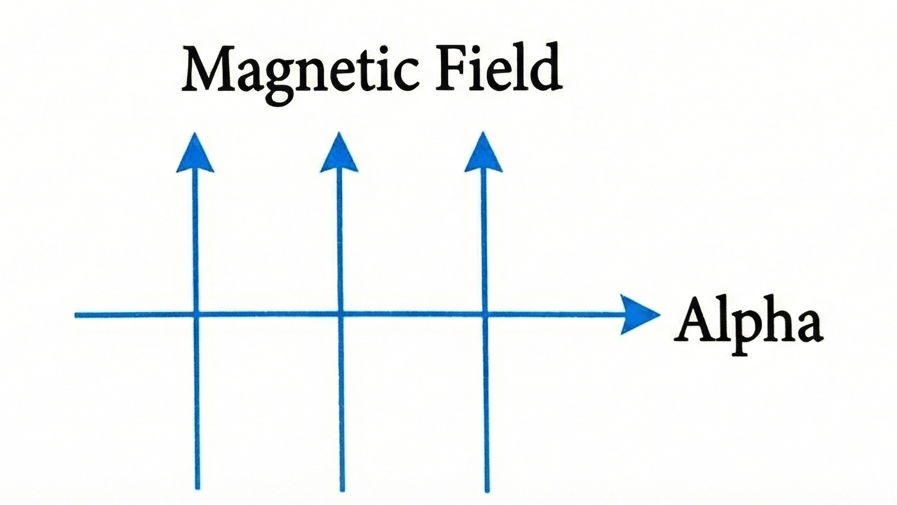
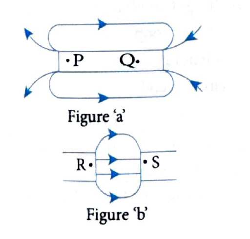
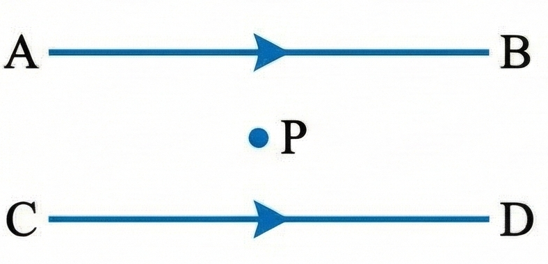

# Section B: Board Previous Year Questions (PYQ)

**Note:** This section contains previous year questions from various board examinations covering all topics from Magnetic Effects of Electric Current.

[View Solutions →](sectionB-board-pyq-solutions.html)

---

## Question 1

CBSE 2011

Why does a current-carrying conductor experience force when placed in a magnetic field? State Fleming's left-hand rule.

---

## Question 2

(All India) CBSE 2011

Give reasons for the following:

**(a)** Magnetic field lines are crowded near the ends of a current-carrying solenoid.

**(b)** A freely suspended current-carrying solenoid rests in a particular direction.

---

## Question 3

CBSE 2011

What is the frequency of an alternating current if its direction changes after every 0.01 s?

---

## Question 4

CBSE 2014

State the direction of the magnetic field in the following case:

---

## Question 5

CBSE 2014

Identify the type of magnetic field produced by the following diagrams and name the conductors that produce them:

---

## Question 6

CBSE 2015

What is an electric fuse? What is its role? Should an electric fuse be placed on a neutral wire or a live wire? Justify your answer.

---

## Question 7

CBSE 2016

What is the shape of magnetic field lines around a current-carrying straight conductor?

---

## Question 8

CBSE 2011

**(a)** State Fleming's left-hand rule.

**(b)** Write the principle of working of an electric motor.

**(c)** Explain the function of the following parts of an electric motor:
- **(i)** Armature
- **(ii)** Brushes
- **(iii)** Split ring

---

## Question 9

CBSE 2011

An alpha particle enters a magnetic field at right angles to it. Explain the direction of force acting on the alpha particle using a relevant rule.

---

## Question 10

CBSE 2011

What is the function of a galvanometer in a circuit?

---

## Question 11

CBSE 2014

Two parallel straight conductors X and Y carry the same current. Copy the diagram and draw the pattern of magnetic field lines around them. Indicate the direction of magnetic field lines. What will be the magnitude of the magnetic field at an equidistant point X? Justify your answer.

> **TODO:** Add diagram showing two parallel conductors X and Y with current, and point X equidistant from both

---

## Question 12

CBSE 2019

State the right-hand thumb rule to determine the direction of the magnetic field inside and outside a circular loop carrying current in clockwise direction.

---

## Question 13

CBSE 2019

**(a)** What is a solenoid?

**(b)** Draw magnetic field lines for:
- **(i)** A current-carrying solenoid
- **(ii)** A bar magnet

**(c)** List two distinguishing features between the magnetic field of a solenoid and that of a bar magnet.

> **TODO:** Add diagrams showing magnetic field lines for (i) current-carrying solenoid and (ii) bar magnet

---

## Question 14

CBSE 2019

**(a)** What is an electromagnet? List two uses of an electromagnet.

**(b)** Draw a labeled diagram showing how an electromagnet is made.

> **TODO:** Add labeled diagram showing electromagnet construction with soft iron core, coil, battery, and switch

---

## Question 15

CBSE 2020

**(i)** State the purpose of soft iron core used in making an electromagnet.

**(ii)** List two ways of increasing the strength of an electromagnet if the material of electromagnet is fixed.

---

## Question 16

CBSE 2021

Although electric kettle and electric toaster were used simultaneously in the kitchen to prepare breakfast for the family, yet the two devices could work efficiently due to 'fuse' used in the electric circuit.

**(i)** What is a fuse? Write the material used in fuse wires. How is a fuse connected in an electric circuit?

**(ii)** State the ratings of fuse used in electric circuits.

**(iii)** What is the function of a fuse? How does it perform its function?

**(iv)** A device uses 1 kW electric power when operated at 220 V. Calculate the rating of the fuse to be used.

---

## Question 17

CBSE 2022

**(i)** Name the poles $P$, $Q$, $R$ and $S$ of magnets in the figure (a) and (b):

**(ii)** State the inference drawn about the direction of the lines on the basis of these diagrams.

---

## Question 18

CBSE 2022

When is the force experienced by a current carrying straight conductor placed in a uniform magnetic field:

**(i)** Maximum

**(ii)** Minimum

**(iii)** Name and state the rule to determine the direction of force experienced by a current carrying straight conductor placed in a uniform magnetic field which is perpendicular to it.

**(iv)** An alpha particle while passing through a magnetic field gets projected towards north. In which direction will an electron project when it passes through the same magnetic field?

---

## Question 19

CBSE 2022

Draw the pattern of magnetic field lines of the magnetic field produced by a solenoid through which a steady current flows.

---

## Question 20

CBSE 2022

A student fixes a sheet of white paper on a drawing board using some adhesive materials. She places a bar magnet in the centre of it and sprinkles some iron filings uniformly around the bar magnet using a salt-sprinkler. On tapping the board gently, she observes that the iron filings have arranged themselves in a particular pattern.

**(a)** Draw a diagram to show this pattern of iron filings.

**(b)** What does this pattern of iron filings demonstrate?

**(c)** How is the direction of magnetic field at a point determined using the field lines? Why do two magnetic field lines do not cross each other?

---

## Question 21

CBSE 2022

How are the magnetic field lines of a bar magnet drawn using a small compass needle? Draw one magnetic field line each on both sides of the magnet.

---

## Question 22

CBSE 2023

The resultant magnetic field at point '$P$' situated midway between two parallel wires (placed horizontally) each carrying a steady current $I$ is:

**(1)** in the same direction as the current in the wires.

**(2)** in the vertically upward direction.

**(3)** zero

**(4)** in the vertically downward direction.

---

## Question 23

CBSE 2023

There are two statements: Assertion(A) and Reason (R). Answer these questions selecting the appropriate option given below.

**Assertion (A):** The strength of the magnetic field produced at the center of a current carrying circular coil increases on increasing the number of turns in it.

**Reason (R):** The current in each circular turn has the same direction and the magnetic field due to each turn then just adds up.

**(1)** Both (A) and (R) are true and (R) is the correct explanation of (A).

**(2)** Both (A) and (R) are true, but (R) is not the correct explanation of (A).

**(3)** (A) is true, but (R) is false.

**(4)** (A) is false, but (R) is true.

---

## Question 24

CBSE 2023

**(i)** State the rule used to find the force acting on a current carrying conductor placed in a magnetic field.

**(ii)** Given below are three diagrams showing entry of an electron in a magnetic field. Identify the case in which the force will be (1) maximum and (2) minimum respectively.

Give reason for your answer.

---

## Question 25

CBSE 2023

**(i)** Draw the pattern of magnetic field lines of:

**(1)** a current carrying solenoid

**(2)** a bar magnet

**(ii)** List two distinguishing features between the two fields.

---

## Question 26

CBSE 2023

A uniform magnetic field exists in the plane of paper as shown in the diagram. In the field, an electron ($e$) and a positron ($p+$) enter as shown. The electron and positron experience forces:

**(1)** both pointing into the plane of the paper.

**(2)** both pointing out of the plane of the paper.

**(3)** pointing into the plane of the paper and out of the plane of the paper respectively.

**(4)** pointing out of the plane of the paper and into the plane of the paper respectively.

---

## Question 27

CBSE 2023

The current carrying device which produces a magnetic field similar to that of a bar magnet is:

**(1)** A straight conductor

**(2)** A circular loop

**(3)** A solenoid

**(4)** A circular coil

---

## Question 28

CBSE 2023

What is the shape of the magnetic field produced by a current carrying straight conductor? State the rule to find the direction of this field.

---

## Question 29

CBSE 2023

Define the term solenoid. Draw the pattern of magnetic field lines around a current carrying solenoid. State how this magnetic field can be used to magnetise a piece of magnetic material like soft iron.

---

[View Solutions →](sectionB-board-pyq-solutions.html)

