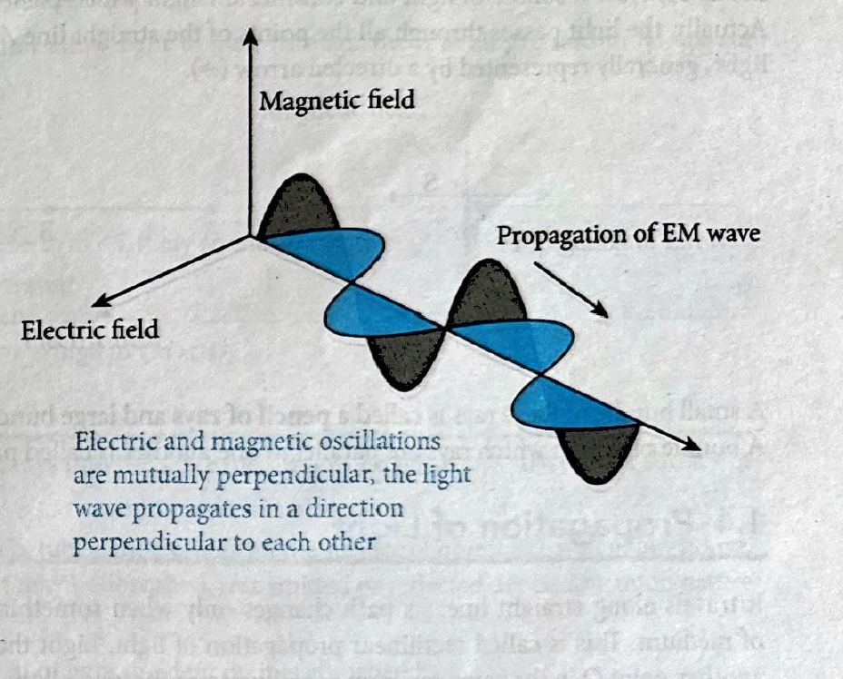

# 1. Light and Its Nature
Light is a form of **electromagnetic radiation** that produces the sensation of sight. It is composed of tiny particles called **photons** that travel in waves.

* **Wave Characteristics:** Light is a **transverse wave** (oscillations are perpendicular to the direction of the wave). It is an **electromagnetic wave** and travels without needing a physical medium to propagate, moving through a vacuum. It is a combination of electric and magnetic oscillations in **mutually perpendicular directions** 

* **Particle Characteristics (Photons):** Light also acts like a stream of particles called photons. The impact of a photon can split electrons out of atoms, a process used in exposing camera film.

***

### 1.1 Theories about Nature of Light
| Theory | Concept | Details |
| :--- | :--- | :--- |
| **Particle Nature** (Newton's Corpuscular Theory) | Light travels as a stream of very small particles called **corpuscles**. | This theory failed to explain interference and diffraction. |
| **Wave Nature** | Light waves are **electromagnetic waves**. | The speed of these waves in air or vacuum is maximum, $3 \times 10^8 \text{ m/s}$.|
| **Quantum Theory** | Light consists of **Photons** with energy sufficient to eject photo-electrons from metals (**Photo-electric effect**). | This explained why classical wave theory failed to account for light frequency being the factor for ejecting electrons. |

***

### 1.2 Properties of Light
* **Speed:** Maximum speed is $300,000 \text{ km/s}$. Light from the sun takes about **8 minutes 20 seconds** to reach Earth.
* **Wavelength:** Visible light (the light we can see) lies in the range of **380-700 nm**.

### 1.3 Ray and Beam of Light
* **Ray of Light:** The straight-line path of light, typically represented by a **directed arrow ($\to$)** 

[Image of ray of light]
.
* **Beam of Light:** A large bundle of rays. A bundle where rays are parallel is called a **parallel beam of light**.

### 1.4 Source of Light
* **Luminous Source:** Objects that **emit light themselves**. (e.g., Sun, electric lamps).
* **Non-Luminous Source:** Objects that **do not emit light** but become visible only when light falls on them. (e.g., Moon, planets).

### 1.5 Medium of Light
A substance through which light propagates is the medium.
* **Transparent:** Allows light to **pass fully through**. (e.g., ordinary glass, water, air).
* **Translucent:** Transmits **only a part of the light** to pass through. (e.g., frosted glass, greased paper).
* **Opaque:** **Does not allow light** to pass through at all. (e.g., chair, desk).