## 2. Reflection of Light

**Reflection** is defined as the **bouncing back of light rays into the same medium** when those rays strike a surface or a boundary separating two media. When light falls on an object, it may be absorbed, transmitted, or reflected, depending on the nature of the medium.

* **Reflecting Surfaces:** Some surfaces reflect most of the incident light, such as a polished silver mirror.

### Key Terms and Definitions

* **Incident Ray:** The ray of light which strikes a surface.
* **Point of Incidence (O):** The point at which the incident ray falls on the reflecting surface.
* **Reflected Ray:** The ray of light which is bounced back by the reflecting surface.
* **Normal (ON):** A line drawn **perpendicular** to the reflecting surface at the point of incidence.
* **Angle of Incidence ($i$):** The angle made by the incident ray with the normal, always measured with respect to the normal.
* **Angle of Reflection ($r$):** The angle made by the reflected ray with the normal, always measured with respect to the normal.
* **Object:** Anything that gives out light, either by itself or after reflection.
    * **Real Image:** Formed by the **actual intersection** of light rays and **can be obtained on a screen** (e.g., image on a cinema screen).
    * **Virtual Image:** Formed when the rays of light **appear to meet** at some point, but do not actually intersect. It **cannot be obtained on a screen** (e.g., image in a plane mirror of a real object).
* **Plane Mirror:** A plane glass sheet with a silvered surface protected by paint.

---

## 2.1 Laws of Reflection

Reflection takes place according to definite laws:

1.  **First Law of Reflection:** The incident ray, the reflected ray, and the normal drawn to the reflecting surface at the point of incidence, **all lie in the same plane**.
2.  **Second Law of Reflection:** The **angle of incidence is equal to the angle of reflection** ($i=r$).

    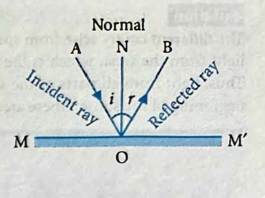

### Types of Reflection
* **Regular Reflection:** When a parallel beam of light is incident on a **plane, highly polished surface**, the reflected beam remains **parallel**, reflecting light in a definite direction.
* **Irregular (Diffuse) Reflection:** When a parallel beam of light is incident on a **rough or irregular surface**, the rays are reflected in **all directions**, spreading the light over a wide area.

---

## 2.2 Concepts

### Example 1 (Laws of Reflection)
**Problem:** Which diagram correctly shows two different rays being reflected from the same mirror point?  

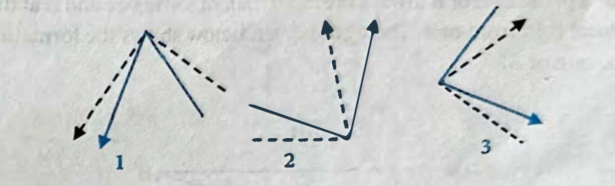

**Solution:** Only Diagram 1 is correct, because the law of reflection ($\angle i = \angle r$) must hold true for **every single ray** reflected from the surface.

### Example 2 (Types of Reflection)
**Observation:** Smooth areas of a lake appear pink (sunset light), while rippled areas appear blue (sky light).     
**Solution:**
* The **smooth areas** show **specular reflection** (regular), reflecting the direct pink light of the sunset.
* The **rippled areas** show **diffuse reflection** (irregular), scattering light from all parts of the sky. Since most of the sky is blue, these areas appear blue.

### NCERT PLUS: Reflection at Plane Surfaces
* **Image Characteristics:** The image formed by a plane mirror is always **erect, virtual, of the same size**, and is at the **same distance behind the mirror** as the object is in front of it.
      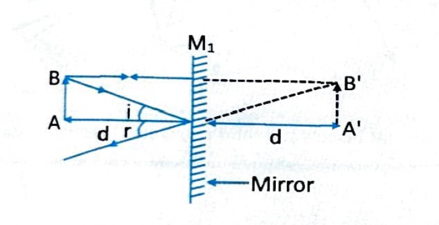

* **Lateral Inversion:** The image is a front-back reversal of the object (left appears right).
* **Angle of Deviation ($\delta$):** The deviation of the reflected ray with respect to the incident ray is given by the formula:
  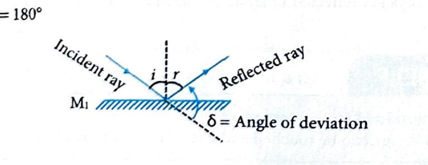

    $
    \delta = 180^{\circ} - 2i
    $
* For **normal incidence** ($\angle i = 0$), the deviation is **maximum** ($180^{\circ}$), as the ray is reflected back along the same path.
    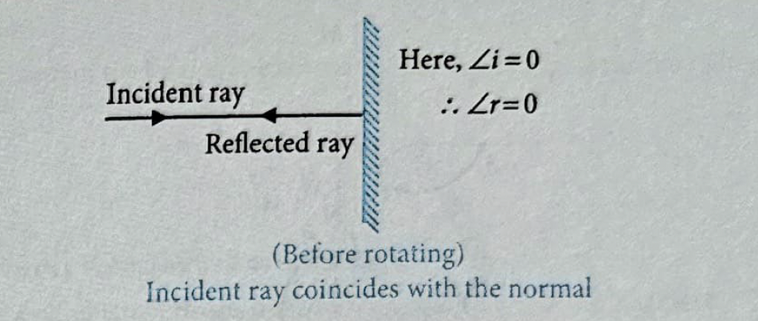

* **Effect of mirror rotation**: 
    * when the mirror is rotated through an angle $\mathbf{\theta}$, the **normal to the mirror rotates through an angle $\mathbf{\theta}$** from the initial position.
    * the angle of incidence changes to $\theta$.
    * the **reflected ray** makes an angle $\mathbf{2 \theta}$ with the original reflected ray.
  
    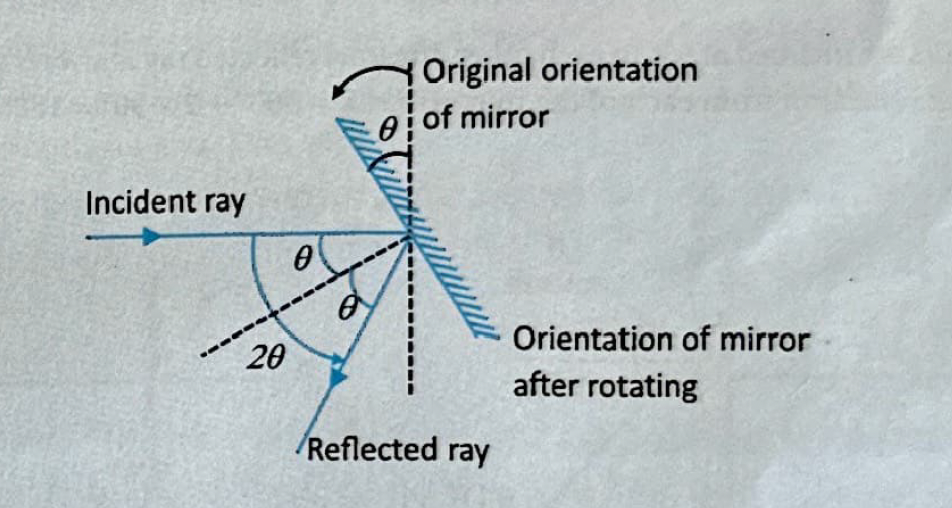

* **Image formation by a plane mirror**

    * the line joining the object and the image formed by a plane mirror is always **perpendicular to the surface of the mirror**.
    * though every part of a mirror forms a complete image of an object, we usually see only that part of it from which light after reflection from the mirror reaches our eye.

   

* **Deviation by two inclined mirrors**

    * if two mirrors are inclined at an angle $\mathbf{\theta}$ with each other, a ray suffers a **net deviation** $\mathbf{\delta}$.
    * the formula for the net deviation is: $\mathbf{\delta=360^{\circ}-2 \theta}$.
    * the deviation produced by the $1^{\text{st }}$ mirror is $\delta_1=180^{\circ}-2 \alpha$.
    * the deviation produced by the $2^{\text{nd }}$ mirror is $\delta_2=180^{\circ}-2 \beta$.
  
  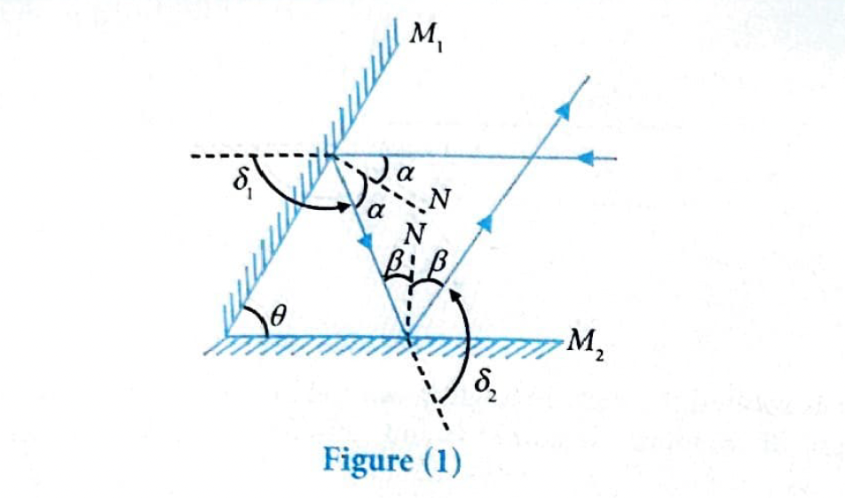

* **Derivation of net deviation $\mathbf{\delta}$:**
    * net deviation $\delta = \delta_1+\delta_2$
    * $\delta = 360^{\circ}-2(\alpha+\beta)$
    * since $\mathbf{\theta=\alpha+\beta}$ (from the geometry of the inclined mirrors)
    * $\therefore \text { net deviation } \mathbf{\delta} = \mathbf{360^{\circ}-2 \theta}$
  
  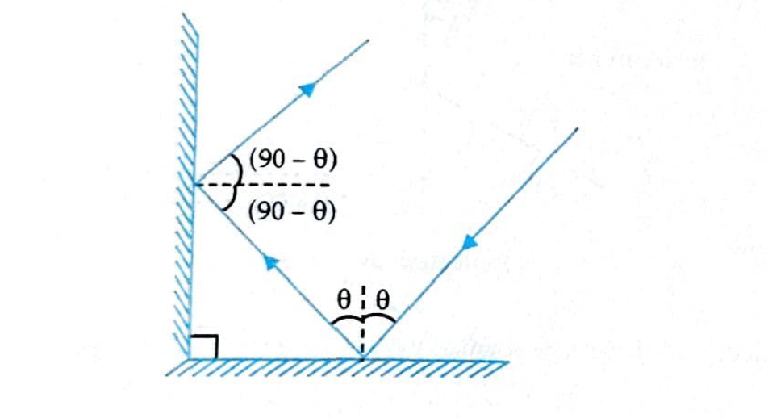

* If two plane mirrors are inclined at $90^{\circ}$ to each other, the final reflected ray is always antiparallel to incident ray if it suffers one reflection from each of the mirrors i.e. $\delta=360^{\circ}-2 \times 90^{\circ}=180^{\circ}$

  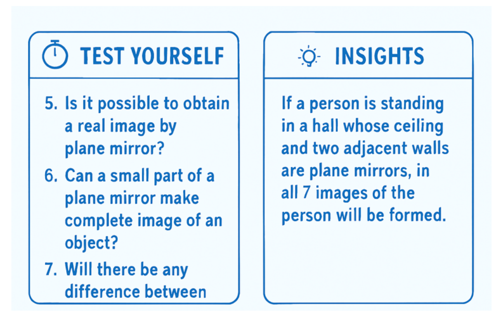

### Example 3 (Two Inclined Mirrors)
**Problem:** Two mirrors are inclined at $120^{\circ}$. A ray is incident on $M_1$ at $65^{\circ}$ to the normal. Find the direction of the ray after reflection from $M_2$.
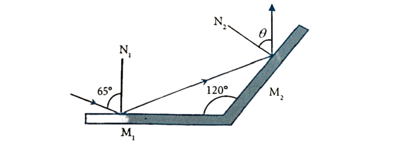

**Solution :** Applying the law of reflection at $M_1$ ($65^{\circ}$ reflection) and using the $120^{\circ}$ mirror angle for geometric calculation, the final reflected ray makes an angle of $\mathbf{55^{\circ}}$ with the normal to $M_2$.

### Example 4 (Two Inclined Mirrors)
**Problem:** Two mirrors are inclined at $70^{\circ}$. A ray $PO$ incident on $M_1$ is reflected parallel to $M_1$ after reflection from $M_2$. Find the angle of incidence $\angle i$ on $M_1$.

  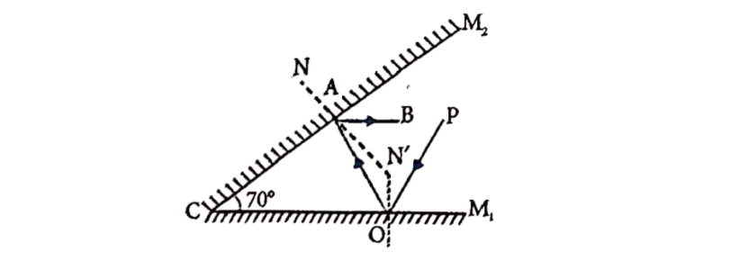

**Solution :** By using the condition that the final reflected ray is parallel to the first mirror ($M_1$), and applying the properties of reflection within the $70^{\circ}$ triangle, the required angle of incidence $\angle i$ on $M_1$ is $\mathbf{50^{\circ}}$.

### Example 5 (Rotating Mirror)
**Problem:** A plane mirror is inclined at angle $\theta$ with the horizontal. A ray incident at $10^{\circ}$ above horizontal becomes **vertical** after reflection. Find $\theta$.

  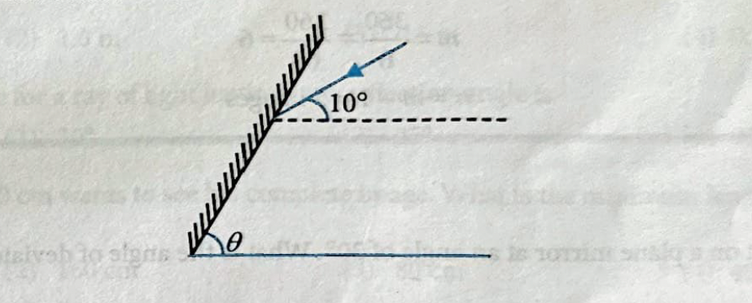

**Solution:** 

  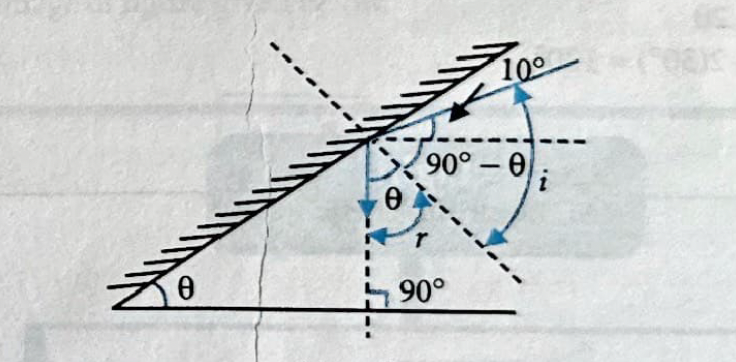

By setting up the geometric relationship between the incident ray ($10^{\circ}$), the reflected ray ($90^{\circ}$ vertical), and the angle of the mirror ($\theta$) such that $\angle i = \angle r$, the resulting angle of mirror inclination is $\mathbf{\theta = 50^{\circ}}$.

Here are the details for **Example 7** and **Example 8** from the Reflection section.

***

### Example 7 (Number of Images Formed)

**Problem:** The number of images formed of a bulb placed between two plane mirrors inclined at an angle of $60^{\circ}$ will be?

**Solution:**
1.  Calculate the factor $m$:
    $$
    m = \frac{360^{\circ}}{\theta} = \frac{360^{\circ}}{60^{\circ}} = 6
    $$
2.  Since $m$ is an **even integer** (6), the number of images ($n$) is found by:
    $$
    n = m - 1 = 6 - 1 = \mathbf{5} \text{ images}
    $$

***

### Example 8 (Angle of Deviation)

**Problem:** A ray of light is incident on a plane mirror at an angle of $30^{\circ}$. What is the angle of deviation of this ray?

**Solution:**
1.  The angle of deviation ($\delta$) for a single reflection from a plane surface is given by the formula:
    $$
    \delta = 180^{\circ} - 2i
    $$
2.  Substitute the angle of incidence ($i = 30^{\circ}$):
    $$
    \delta = 180^{\circ} - 2(30^{\circ}) = 180^{\circ} - 60^{\circ} = \mathbf{120^{\circ}}
    $$

---

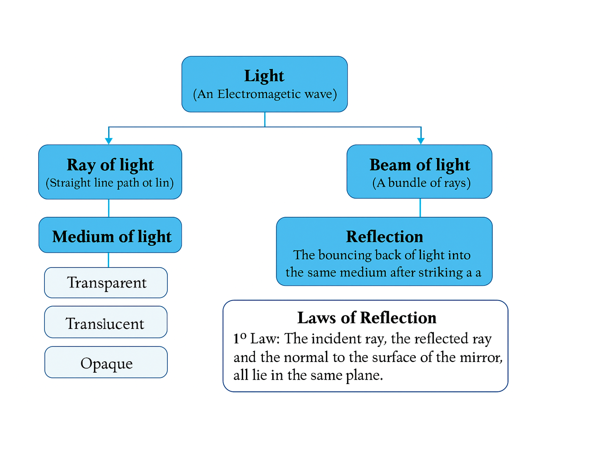

## **CONCEPT APPLICATION EXERCISE 1**

---

**1. An object is placed between two plane mirrors inclined at $\mathbf{30^{\circ}}$ to each other. The maximum number of images seen of an object placed between them, will be**   
(1) 8   
(2) 12   
(3) 11   
(4) 16   

**2. An object is placed between two plane mirrors inclined at $\mathbf{60^{\circ}}$ to each other. The maximum number of images seen of an object placed between them, will be**   
(1) 10   
(2) 5   
(3) 12   
(4) infinite   

**3. An object is placed at a distance of $\mathbf{0.25\ m}$ in front of a plane mirror. The distance between the object and image will be**   
(1) 0.25 m   
(2) 1.0 m   
(3) 0.5 m   
(4) 0.125 m   

**4. The angle of incidence for a ray of light having zero reflection angle is**   
(1) 0   
(2) $30^{\circ}$   
(3) $45^{\circ}$   
(4) $90^{\circ}$   

**5. A person of height $\mathbf{160\ cm}$ wants to see his complete image. What is the minimum length of plane mirror is required.**   
(1) 100 cm   
(2) 160 cm   
(3) 80 cm   
(4) 40 cm   

**6. Choose the correct mirror-image of figure given below.**   
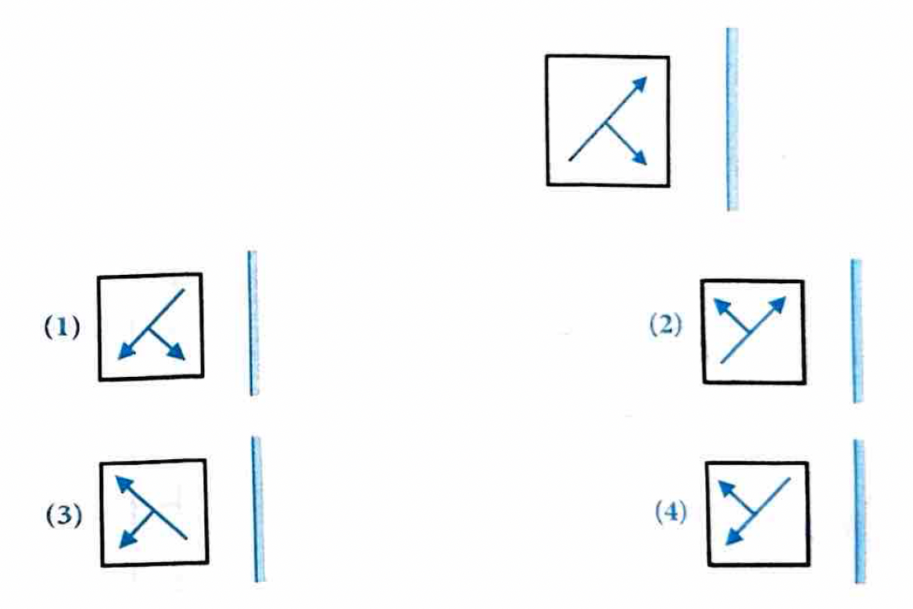

(1)   
(2)   
(3)      
(4)

**7. Ray optics is valid when characteristic dimensions are**
[NEET 2001]   

(1) Of the same order as the wavelength of light   
(2) Much smaller than the wavelength of light   
(3) Of the order of one millimeter   
(4) Much larger than the wavelength of light   

**8. An object is at a distance of $0.5 \text{ m}$ in front of a plane mirror. Distance between the object and image is** [NEET 2002]

(1) $0.5 \text{ m}$

(2) $1 \text{ m}$

(3) $0.25 \text{ m}$

(4) $1.5 \text{ m}$

**9. When a plane mirror is placed horizontally on a level ground at a distance of $60 \text{ m}$ from the foot of a tower, the top of the tower and its image in the mirror subtend an angle of $90^{\circ}$ at the eye. The height of the tower will be** [NEET 2006]

(1) $30 \text{ m}$

(2) $60 \text{ m}$

(3) $90 \text{ m}$

(4) $120 \text{ m}$

**Solve the following riddles:**

**10. Riddle: I'm the reason you see your face,**

**On a shiny surface, in a certain place. I bounce right back, just like a ball, when light hits me, I stand tall. What reflection phenomenon am i?**

**11. Riddle: I am the rule that governs light,**

**When it strikes a surface, pure and bright. The angle you send in, I will reflect with flair, Equal and opposite, it's a balanced affair. What am i?**

**12. Riddle: I'm a surface that's smooth and sleek,**

**Light bounces off me, it's quite unique. I create a clear image, as if by art, what am I that plays a part?**

**13. Solve the given cross word puzzle:**

(1) Straight line path of light.

(2) Wooden Board is an example of this type of material.

(3) It creates a sense of vision to us

(4) A medium that allows light to fully pass through it.

(5) The bouncing back of light into the same medium after striking a surface.

(6) A medium/object that allows a portion of light pass through it.

(7) Device that reflects light to form an image.

**14. A tall man, of height $6 \text{ feet}$, wants to see his full image?** (Minimum mirror height required)

**15. Write four uses of mirrors.**

**16. What are the three medium of propagation of light?**