# Spherical Mirrors

Spherical mirrors are curved mirrors in which the surface of the mirror is part of a sphere. The rear-view mirrors in cars, scooters, and other vehicles are spherical mirrors. A spherical mirror can be thought of as a portion cut off from a hollow glass sphere, which has two dissimilar surfaces.

## Structure and Surfaces

The hollow surface that is on the same side as the centre of the original sphere is called the **concave surface**. The other surface, which bulges out, is called the **convex surface**.

- **Convex mirror**: Created when the convex surface is polished and the concave surface is silvered
- **Concave mirror**: Created when the concave surface is polished and the convex surface is silvered

Light falling on the smooth surface of a spherical mirror enters the glass and is reflected at the opaque silvered surface. Since we neglect the thickness of the glass, we represent the spherical mirror by a single curved surface.

## Types of Spherical Mirrors

There are two main types of spherical mirrors: concave and convex mirrors.

## Uses of Concave Mirrors

Concave mirrors are used in various applications:

- **Makeup and shaving mirrors**: When you place your face between the mirror and its focal point, you see an enlarged virtual image of yourself
- **Speed display mirrors**: Used in a new method for displaying the speed of a car
- **Dentist mirrors**: For dental examinations
- **Floodlights**: For focusing and directing light

## Uses of Convex Mirrors

Convex mirrors are primarily used as rear-view mirrors because they provide a wide field of view:

- **Vehicle side-view mirrors**: The outside mirror on the passenger side is often a convex mirror
- **Wide viewing range**: Allows drivers to see a larger area behind and around the vehicle

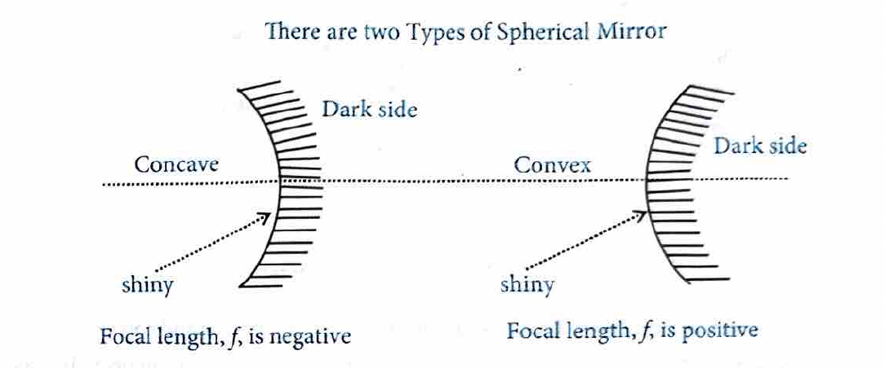

### Important Warning

Convex mirrors typically display the warning: **"Vehicles in mirror are closer than they appear."** This warning is necessary because the virtual image produced by a convex mirror is reduced in size and therefore appears smaller, just as a distant object would appear in a plane mirror. An unwary driver who mistakes a convex mirror for a plane mirror might incorrectly judge the distance of other vehicles, creating a potential safety hazard.

#### Terms Related to Spherical Mirrors

- **Centre of Curvature (C)**: It is the centre of the sphere of which the mirror is a part.

- **Radius of Curvature (R)**: It is the radius of the sphere of which the mirror is a part.

- **Pole (P)**: It is the geometrical center of the spherical reflecting surface.

- **Principal Axis**: It is the straight line joining the center of curvature to the pole.

- **Focus (F)**: When a narrow beam of light, parallel to the principal axis and close to it (known as paraxial rays), is incident on the surface of a mirror, the reflected beam is found to converge (concave mirror) or appear to diverge (convex mirror) from a point on the principal axis. This point is called the focus.

- **Focal Length (f)**: It is the distance between the pole and the principal focus. For spherical mirrors:

$f = \frac{R}{2}$

## Reflection at Spherical Mirrors (Laws of Image Formation)

In the case of reflection at spherical surfaces such as spherical mirrors (concave mirror and convex mirror), the following laws apply:

### Law 1: Ray Parallel to Principal Axis

A ray initially parallel to the principal axis and close to it, after reflection, passes or appears to pass through the principal focus (from the law of reflection, i.e., $\angle i = \angle r$, and by definition of focus).

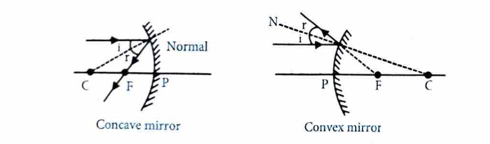

**Concave mirror**: The reflected ray passes through the focus.

**Convex mirror**: The reflected ray appears to diverge from the focus.

### Law 2: Ray Passing Through Principal Focus

A ray initially passing or appearing to pass through the principal focus, after reflection, becomes parallel to the principal axis (by the principle of reversibility—after any number of reflections, if the direction of light is reversed, it retraces its whole path).

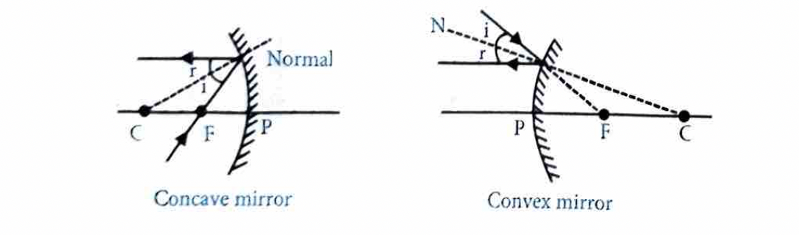

**Concave mirror**: The reflected ray becomes parallel to the principal axis.

**Convex mirror**: The reflected ray appears to come from a direction parallel to the principal axis.

### Law 3: Ray Passing Through Centre of Curvature

A ray initially passing or appearing to pass through the centre of curvature, after reflection, retraces its path.

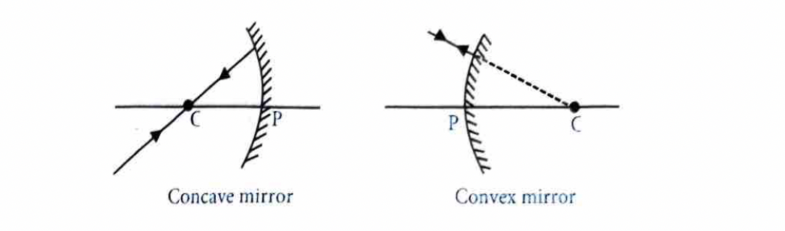

**Concave mirror**: The ray reflects back along its original path.

**Convex mirror**: The ray reflects back along its original path (appearing to come from the center of curvature).

## 3.2 Image Formation by a Concave Mirror

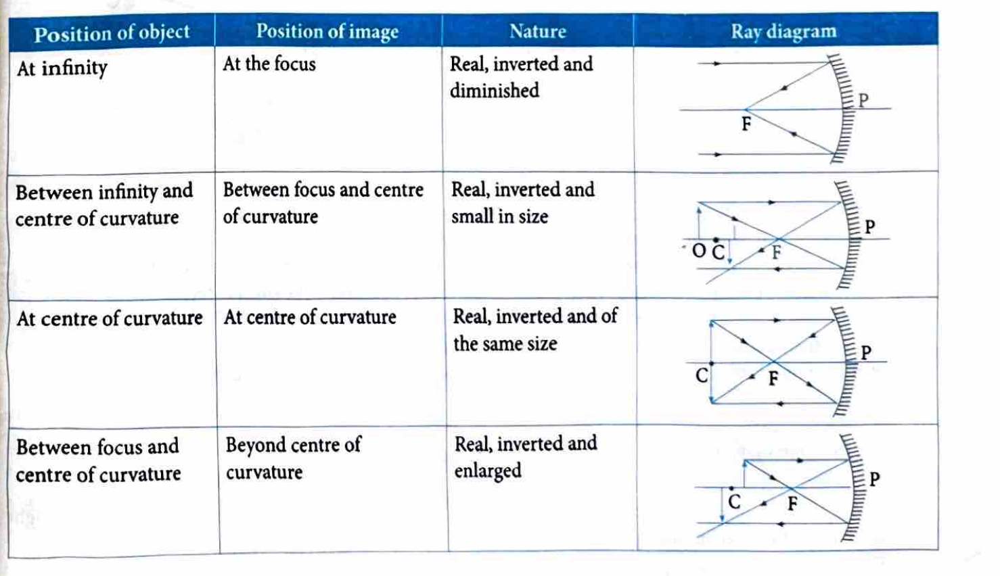

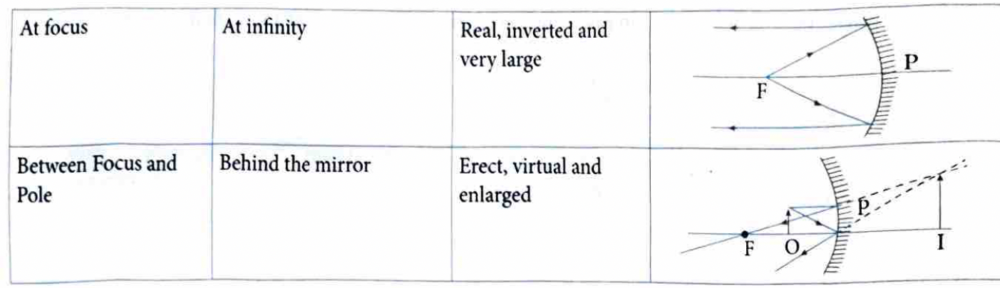

## 3.3 Image Formation by a Convex Mirror

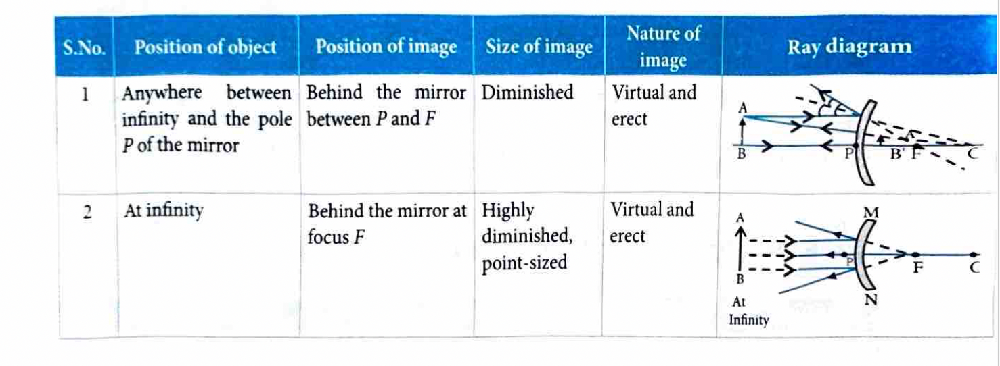

## Sign Convention for Reflection by Spherical Mirrors

- **Object placement**: The object (such as object AB in the figure) is always placed opposite to the mirror, which implies that the light from the object falls on the mirror.

- **Distances along the principal axis**: All distances parallel to the principal axis are measured from the pole.

- **Distances along the direction of incident rays**: The distances measured along the direction of incident rays are taken as positive, and those measured opposite to the direction of incident rays are taken as negative, as shown in the figure.
  
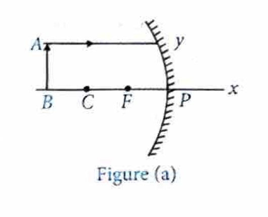

- **Distances perpendicular to the principal axis**: 

  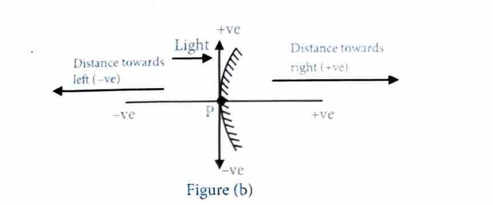 
 
All distances measured perpendicular to and above the principal axis are taken as positive, and those below the principal axis are taken as negative, as shown in the figure.

## Relation Between $f$ and $R$ of a Spherical Mirror

Let us consider a concave mirror of small aperture, on which a ray is incident parallel and close to the principal axis. It passes through focus $F$ after reflection. Join $CB$, where $CB$ is normal to the mirror at $B$.

   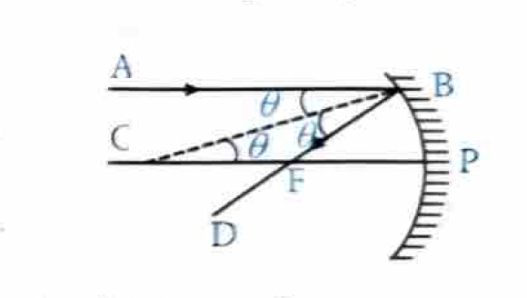

$\angle ABC = \angle FBC \quad (\therefore \angle i = \angle r)$

$\angle ABC = \angle BCP \quad \text{(Alternate interior angles between two parallel lines are equal)}$

$\angle FBC = \angle BCP \quad \text{(From (i) and (ii))}$

$\text{or} \quad \angle FBC = \angle BCF$

$\therefore \quad FC = FB \quad \text{(Sides opposite to equal angles of a triangle are equal)}$

$\Rightarrow \quad FB = PF \quad$

$\text{(As the aperture of mirror is very small, point } B \text{ is very close to } P \text{)}$

$\Rightarrow \quad PC = PF + FC = 2PF \quad \text{(Using (iii) and (iv))}$

$\text{or} \quad PF = \frac{PC}{2}$

This gives: $f = \frac{R}{2}$

where $f = PF$ is the focal length and $R = PC$ is the radius of curvature of the mirror. This relation is applicable for both concave and convex mirrors.

## Mirror Formula

The distance of the object from the pole of a spherical mirror is called the **object distance (u)** and the distance of the image from the pole of the mirror is called the **image distance (v)**.

The relationship between object distance (u), image distance (v), and focal length (f) is known as the **mirror formula**.

### Setup and Notation

The figure shows:

- **AB**: An object placed beyond the centre of curvature
- **A'B'**: Image of the object AB
- **PB = u**: Distance of the object from pole (P)
- **PB' = v**: Distance of the image from pole (P)
- **PF = f**: Focal length of the concave mirror

### Mirror Formula Derivation

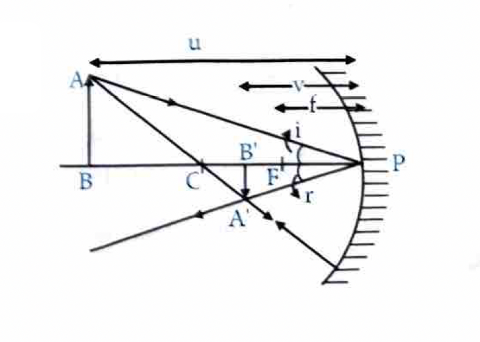

In triangles ABP and A'B'P:

$\angle APB = \angle A'PB' \quad (\angle i = \angle r)$

$\angle ABP = \angle A'B'P \quad \text{(Each } 90°\text{)}$

$\triangle ABP \sim \triangle A'B'P \quad \text{(AA corollary of AAA similarity theorem)}$

Therefore:

$\frac{AB}{A'B'} = \frac{PB}{PB'}$

Similarly, $\triangle ABC \sim \triangle A'B'C$:

$\frac{AB}{A'B'} = \frac{BC}{B'C}$

From equations (i) and (ii):

$\frac{PB}{PB'} = \frac{BC}{B'C}$

By sign convention: $PB = -u$, $PB' = -v$, $BC = PB - PC$, $B'C = PC - PB'$

$\Rightarrow \frac{u}{v} = \frac{u - 2f}{2f - v}$

$\Rightarrow 2fu - uv = uv - 2fv \Rightarrow -2uv = -2fu - 2fv \Rightarrow uv = fu + fv$

Dividing both sides by $uvf$:

$\frac{1}{f} = \frac{1}{v} + \frac{1}{u}$

This formula is called the **mirror formula** and is applicable for both concave and convex mirrors. It can also be applied for a plane mirror with $f = \infty$ (infinity):

$\frac{1}{\infty} = \frac{1}{u} + \frac{1}{v} \quad \text{or} \quad 0 = \frac{1}{u} + \frac{1}{v} \quad \text{or} \quad v = -u$

This means the image is formed as far behind the mirror as the object is in front of it.

 ## Magnification

Magnification $(m)$ of a spherical mirror is defined as the ratio of the height of the image to the height of the object. The magnitude indicates how many times the size of the image is compared to that of the object, and its sign indicates whether the image is erect or inverted. A positive sign indicates an erect image and a negative sign indicates an inverted image.

### Definition

Magnification is given by:

$m = \frac{A'B'}{AB} = \frac{PB'}{PB}$

Using the sign convention where $A'B' = -h'$ and $AB = h$:

$\frac{-h'}{h} = \frac{-v}{-u}$

Therefore:

$m = \frac{h'}{h} = \frac{-v}{u}$

### General Formula for Magnification

$m = \frac{\text{height of the image}}{\text{height of the object}} = \frac{h'}{h} = -\frac{v}{u} = \frac{f-v}{f} = \frac{f}{f-u}$

### Proof

**For the relation $m = \frac{f-v}{f}$:**

From the mirror formula: $\frac{1}{f} = \frac{1}{u} + \frac{1}{v}$

Multiplying both sides by $v$:

$\frac{v}{f} = \frac{v}{u} + \frac{v}{v}$

$\frac{v}{f} = \frac{v}{u} + 1$

Therefore:

$m = -\frac{v}{u} = 1 - \frac{v}{f} = \frac{f-v}{f}$

**For the relation $m = \frac{f}{f-u}$:**

From the mirror formula: $\frac{1}{f} = \frac{1}{u} + \frac{1}{v}$

Multiplying both sides by $u$:

$\frac{u}{f} = \frac{u}{u} + \frac{u}{v}$

$\frac{u}{f} = 1 + \frac{u}{v}$

Therefore:

$\frac{1}{m} = \frac{f-u}{f}$

$m = \frac{f}{f-u}$

## Important Points About Spherical Mirrors

Keep the following important points in mind while dealing with spherical mirrors:

- **Object distance is always negative**: As an object is held in front of a spherical mirror, the distance of the object $(u)$ is always negative.

- **Real image distance is negative**: The real image is formed in front of the mirror. So its distance $(v)$ is taken as negative.

- **Virtual image distance is positive**: The virtual image is formed at the back of the mirror. So its distance $(v)$ is taken as positive.

- **Concave mirror focal length is negative**: Focal length of a concave mirror is considered as negative.

- **Convex mirror focal length is positive**: Focal length of a convex mirror is considered as positive.

- **Virtual erect images have positive magnification**: When the image formed is virtual and erect, magnification is positive.

- **Real inverted images have negative magnification**: When the image formed is real and inverted, magnification is negative.

- **Magnification and image size**: 
  - If $|m| > 1$, the image is enlarged
  - If $|m| = 1$, the image is of the same size
  - If $|m| < 1$, the image is reduced

### Example 9 (Focal Length of Spherical Mirror)

**Problem:** The radius of curvature of a spherical mirror is 20 cm. What is its focal length?

**Solution:**
As we know, focal length (f) of a mirror is half of the radius of curvature (R).

$f=\frac{R}{2}=\frac{20}{2}=10 \mathrm{~cm}$

---

### Example 10 (Image Formation by Convex Mirror)

**Problem:** An object is placed at a distance of 10 cm from a convex mirror of focal length 15 cm. Find the position and nature of the image.

**Solution:**
Given: $u=-10 \mathrm{~cm}, f=+15 \mathrm{~cm}, v=$ ?

Using the mirror formula, $\frac{1}{f}=\frac{1}{u}+\frac{1}{v}$, we have

$\frac{1}{\mathrm{v}}=\frac{1}{f}-\frac{1}{u}=\frac{1}{15}-\frac{1}{(-10)} \text { or } \frac{1}{\mathrm{v}}=\frac{1}{15}+\frac{1}{10}=\frac{2+3}{30}=\frac{5}{30} \text { or } \mathrm{v}=\frac{30}{5}=6 \mathrm{~cm}.$

Hence, the image is formed at a distance of 6 cm behind the mirror. The image is virtual and erect.

---

### Example 11 (Erect Image Formation by Concave Mirror)

**Problem:** We wish to obtain an erect image of an object, using a concave mirror of focal length 15 cm. What should be the range of distance of the object from the mirror? Is the image larger or smaller than the object? Draw a ray diagram to show the image formation in this case.

**Solution:**
Here, Focal length, $f=-15 \mathrm{~cm}$.

For getting an erect image using a concave mirror the object should be placed at a distance less than the focal length (i.e.) 15 cm from pole. Image will be virtual, enlarged and erect.

### Example 12 (Image Height in Concave Mirror)

**Problem:** A 2.0 cm high object is placed perpendicular to the principal axis of a concave mirror. The distance of the object from the mirror is 30 cm, and its image is formed 60 cm from the mirror, on the same side of the mirror as the object. Find the height of the image formed.

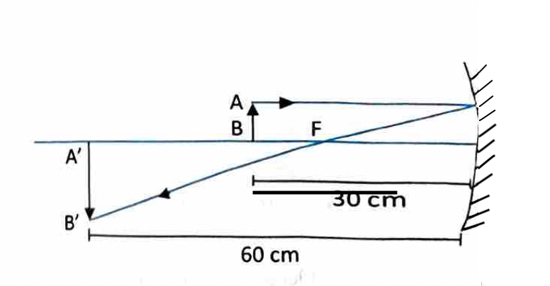

**Solution:**
The situation is shown in figure

We have, $u=-30 \mathrm{~cm}$ and $v=-60 \mathrm{~cm}$

Thus, $\frac{h_i}{h_0}=-\frac{v}{u}=-\frac{-60 \mathrm{~cm}}{-30 \mathrm{~cm}}=-2$ or $h_i=-2 h_0=-2 \times 2 \mathrm{~cm}=-4.0 \mathrm{~cm}$.

The height of the image is 4.0 cm. The minus sign shows that it is on the other side of principal axis, i.e. it is inverted.

---

### Example 13 (Focal Length and Image Position)

**Problem:** A 2 cm high object is placed at a distance of 32 cm from a concave mirror. The image is real, inverted and 3 cm high. Find the focal length of the mirror and the position of the image.

**Solution:**
We have, $m=-\frac{v}{u}=\frac{h_i}{h_0}$

From the question, $h_i=-3 \mathrm{~cm}$ and $h_0=2 \mathrm{~cm}$

$\therefore \quad m=\frac{h_i}{h_0}=\frac{-3 \mathrm{~cm}}{2 \mathrm{~cm}}=-1.5$ or $-\frac{v}{u}=-1.5$

or $\frac{v}{-32 \mathrm{~cm}}=1.5$

or $v=-48 \mathrm{~cm}$

We have, $\frac{1}{f}=\frac{1}{u}+\frac{1}{v}=\frac{1}{-32 \mathrm{~cm}}+\frac{1}{-48 \mathrm{~cm}}=\frac{-5}{96 \mathrm{~cm}}$ or $f=\frac{-96 \mathrm{~cm}}{5}=-19.2 \mathrm{~cm}$

#### Newton's Formula
This formula provides a relationship among the focal length ( $f$ ), the distance of the object from focus( $u$ ) and the distance of the image from focus ( $v$ ).
This can be expressed as $u v=f^2$
Here the object distance and the image distance are measured from the focus of the mirror not from the pole.

So, the focal length of the concave mirror is 19.2 cm , and the image is formed 48 cm in front of it.

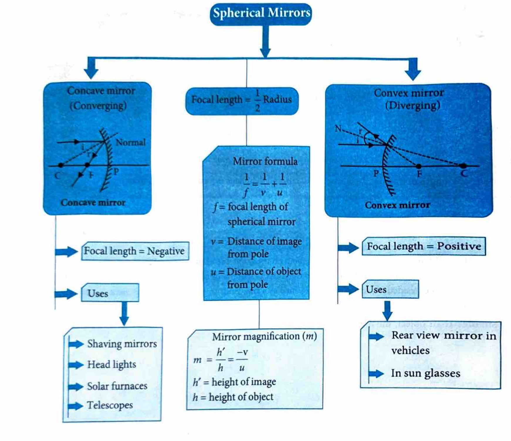
---

### Concept Application Exercise 2

1. For a real object, which of the following can produce a real image?
   1. Plane mirror
   2. Concave mirror
   3. Concave lens
   4. Convex mirror

2. Which of the following mirror is used by a dentist to examine a small cavity?
   1. Convex mirror
   2. Plane mirror
   3. Concave mirror
   4. Combination of convex and concave mirror

3. An object at a distance of 30 cm from a concave mirror gets its image at the same point. The focal length of the mirror is
   1. -30 cm
   2. 30 cm
   3. -15 cm
   4. +15 cm

4. An object at a distance of +15 cm is slowly moved towards the pole of a convex mirror. The image will get
   1. shortened and real
   2. enlarged and real
   3. enlarge and virtual
   4. diminished and virtual

5. A concave mirror of radius 30 cm is placed in water. It's focal length in air and water differ by
   1. 15 cm
   2. 20 cm
   3. 30 cm
   4. 0 cm

6. A concave mirror of focal length 20 cm forms an image having twice the size of object. The position of object will be at
   1. 25 cm
   2. 40 cm
   3. 10 cm
   4. At infinity

7. The image formed by concave mirror is real, inverted and of the same size as that of the object. The position of object should be
   1. at the focus
   2. at the centre of curvature
   3. between focus and centre of curvature
   4. beyond centre of curvature

8. The nature of the image formed by concave mirror when the object is placed between the focus $(f)$ and centre of curvature $(C)$ of the mirror observed by us is
   1. real, inverted and diminished
   2. real, inverted and enlarged
   3. virtual, erect and smaller in size
   4. virtual, upright and enlarged

9. The nature of image formed by a convex mirror when the object distance from the mirror is less than the distance between pole and focal point ( $f$ ) of the mirror would be
   1. real, inverted and diminished in size
   2. real, inverted and enlarged in size
   3. virtual, upright and diminished in size
   4. virtual, upright and enlarged in size

10. If a man's face is 25 cm in front of concave shaving mirror producing erect image 1.5 times the size of face, focal length of the mirror would be
    1. 75 cm
    2. 25 cm
    3. 15 cm
    4. 60 cm

11. Match the corresponding entries of column -1 with column-2 (Where $m$ is the magnification produced by the mirror)
[NEET - 2016]

  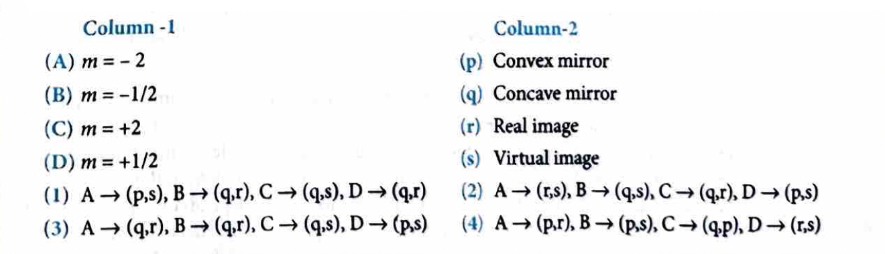

### Answer Key

| Question | Answer |
| :---: | :---: |
| 1 | (2) |
| 2 | (3) |
| 3 | (3) |
| 4 | (3) |
| 5 | (4) |
| 6 | (3) |
| 7 | (2) |
| 8 | (2) |
| 9 | (3) |
| 10 | (1) |

### Explanations

1.  **Answer: (2)**
    A concave mirror can form a real image when the object is placed beyond its focus. Plane mirrors, concave lenses, and convex mirrors always form virtual images for real objects.

2.  **Answer: (3)**
    A concave mirror is used by dentists because when a tooth is placed within the focus of the mirror, it produces an enlarged, erect, and virtual image, allowing for better examination.

3.  **Answer: (3)**
    When the image is formed at the same point as the object, the object is placed at the center of curvature ($C$).
    Thus, $R = 30$ cm.
    Focal length $f = \frac{R}{2} = \frac{30}{2} = 15$ cm.
    According to sign convention, for a concave mirror, $f = -15$ cm.

4.  **Answer: (3)**
    A convex mirror always forms a virtual, erect, and diminished image. As the object moves closer to the pole, the image also moves closer to the pole and increases in size (magnification increases towards 1), but it remains virtual.

5.  **Answer: (4)**
    The focal length of a spherical mirror is given by $f = \frac{R}{2}$. It depends only on the radius of curvature and is independent of the medium in which it is placed. Therefore, the change is 0 cm.

6.  **Answer: (3)**
    Given $f = -20$ cm and magnification $|m| = 2$.
    Since the image size is twice the object size, it could be real or virtual.
    Case 1 (Real Image, $m = -2$):
    $m = \frac{f}{f-u} \Rightarrow -2 = \frac{-20}{-20-u} \Rightarrow 40 + 2u = -20 \Rightarrow u = -30$ cm. (Not in options)
    Case 2 (Virtual Image, $m = +2$):
    $2 = \frac{-20}{-20-u} \Rightarrow -40 - 2u = -20 \Rightarrow -2u = 20 \Rightarrow u = -10$ cm.
    Thus, the object is at 10 cm.

7.  **Answer: (2)**
    A real, inverted image of the same size is formed by a concave mirror when the object is placed at the centre of curvature ($C$).

8.  **Answer: (2)**
    When an object is placed between the focus ($F$) and the centre of curvature ($C$) of a concave mirror, the image formed is beyond $C$, real, inverted, and enlarged.

9.  **Answer: (3)**
    A convex mirror always forms a virtual, erect (upright), and diminished image for any position of a real object in front of it.

10. **Answer: (1)**
    Given $u = -25$ cm and magnification $m = +1.5$ (erect image).
    Using $m = \frac{f}{f-u}$:
    $1.5 = \frac{f}{f - (-25)} \Rightarrow 1.5 = \frac{f}{f+25}$
    $1.5f + 37.5 = f \Rightarrow 0.5f = -37.5 \Rightarrow f = -75$ cm.
    Magnitude is 75 cm.
