# Refraction of Light

We know that light travels along straight lines. This is true as long as light travels in one medium, without encountering an obstacle. When light travelling in a medium (such as air) enters another medium (such as water), it generally bends at the surface separating the two media. But once it is in the second medium, it moves along a straight line. The phenomenon of bending of light at the surface separating two media is commonly known as refraction of light.

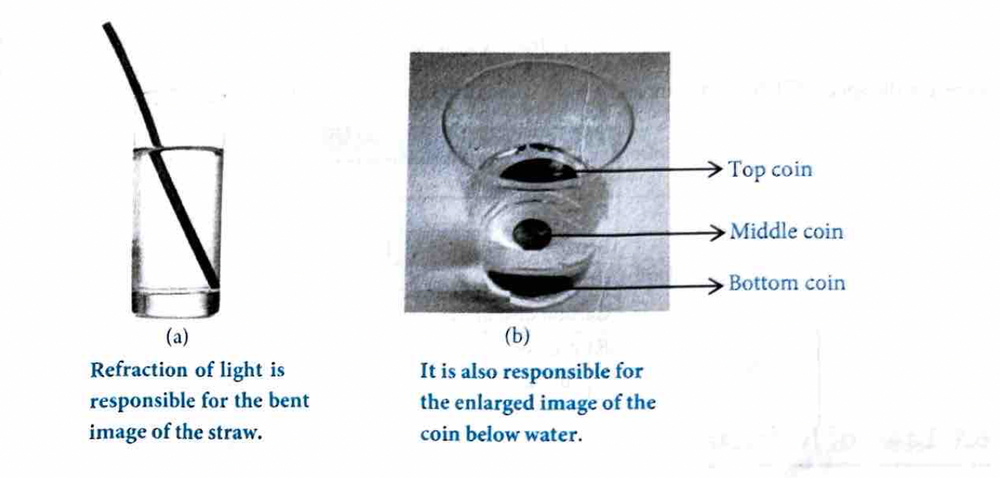

The surface separating the two media is also called the interface between them. Not all of the light incident on the interface between two media passes into the second medium after refraction. A small part of light gets reflected. For most of our discussions on refraction, we shall neglect the reflected part.

As you would expect, refraction or bending of light changes the way we see things. A very common example is that of a spoon dipped in water. The parts of the spoon in air and water appear disjointed. While standing in a clear pool of water, the bottom looks raised and our legs appear shorter. Similarly, the bottom of a glass tumbler filled with water appears raised when viewed from above. If you put pins or coins in this tumbler and look from the side, their images appear enlarged. All these effects are due to refraction of light. Our ability to see also depends on refraction. Our eyes contain several transparent liquids. When light from an object enters our eyes, it is refracted at the surfaces of these liquids to produce an image. Refraction is also responsible for such wonderful things as the twinkling of stars and the sparkling of diamonds.

## Refractive Index

Light travels at different speeds in different materials. Therefore, when it travels from one medium to another, it either speeds up or slows down. The amount by which its speed changes determines the amount by which it changes its direction.

You know that light travels at $299,792,458 \mathrm{~m} / \mathrm{s}$ in vacuum. (This speed is often taken approximately as $300,000,000 \mathrm{~m} / \mathrm{s}$ i.e., $300,000 \mathrm{~km} / \mathrm{s}$.) The speed of light in a transparent medium such as glass, water or clear plastic is less than this. The ratio of the speed of light in vacuum to the speed of light in a medium is called the refractive index of the medium. This ratio is denoted by $n$ or $\mu$. Thus,

$ \text{Refractive Index } \mu = \frac{c}{v} $

Here, $c$ is the speed of light in vacuum and $v$ is the speed of light in the medium.

| Medium | $\mu$ |
| :--- | :--- |
| Water | 1.33 |
| Kerosene | 1.41 |
| Benzene | 1.50 |
| Crown glass | 1.52 |
| Carbon disulphide | 1.63 |
| Flint glass | 1.65 |
| Diamond | 2.42 |

## Laws of Refraction

There are two laws of refraction:

1.  The incident ray, the refracted ray, and the normal to the refracting surface at the point of incidence are in the same plane.
2.  The ratio of sine of angle of incidence to the sine of angle of refraction is constant for a pair of media i.e., $\frac{\sin i}{\sin r} = \text{constant} (\mu_{21})$. Where $\mu_{21}$ is the refractive index of medium 2 w.r.t medium 1. This law is also known as Snell's law.

### Application of Snell's Law

When light passes from rarer to denser medium it bends towards the normal. Using Snell's law:

$ \mu_1 \sin \theta_1 = \mu_2 \sin \theta_2 \Rightarrow \frac{\sin \theta_1}{\sin \theta_2} = \frac{\mu_2}{\mu_1} $

Thus if $\mu_2 > \mu_1$ then $\theta_2 < \theta_1$.

When light passes from denser to rarer medium it bends away from the normal.
From Snell's law, $\frac{\sin \theta_1}{\sin \theta_2} = \frac{\mu_2}{\mu_1}$.

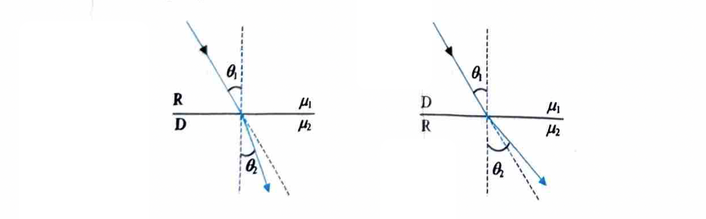

Thus, if $\mu_2 < \mu_1$, then $\theta_2 > \theta_1$.

When light propagates through a series of layers of different medium, then according to Snell's law:
$\mu_1 \sin \phi_1 = \mu_2 \sin \phi_2 = \mu_3 \sin \phi_3 = \dots = \text{constant}$

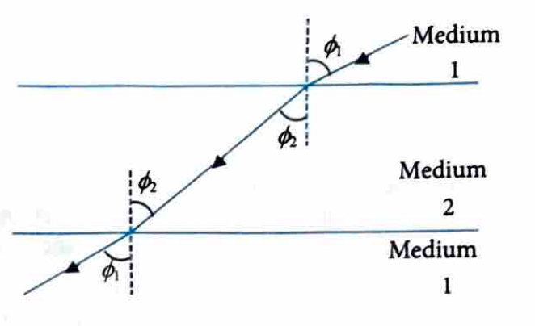

If ${ }_1 \mu_2$, ${ }_2 \mu_3$ and ${ }_3 \mu_1$ be refractive index of medium 2 w.r.t medium 1, refractive index of medium 3 w.r.t medium 2 and refractive index of 1 w.r.t 3 respectively then, ${ }_1 \mu_2 \times { }_2 \mu_3 \times { }_3 \mu_1 = 1$.

## Absolute Refractive Index (n)

Let us discuss more about refractive index of a medium.
- It is defined as the ratio of speed of light in air or vacuum to the speed of light in the medium.
- As for light in free space $c=f \lambda_0$ (here $f=$ frequency, and $\lambda_0 =$ wavelength of light in free space) and in a medium $v=f \lambda$ (here $f=$ frequency and $\lambda=$ wavelength of the light in the medium) so:

$ n=\frac{c}{v}=\frac{\lambda_0}{\lambda} $

Thus,
$ n =\frac{\text { speed of light in air or vacuum }(c)}{\text { speed of light in medium }(v)} $
$ = \frac{\text { wavelength of light in air or vacuum }\left(\lambda_0\right)}{\text { wavelength of light in medium }(\lambda)} $

- For a given light, denser is the medium, lesser will be the speed of light and so greater will be the refractive index.

as, $ n_{glass} > n_{water} $

>
> **Insights**
> - Greater the difference in speed of light in two media, greater will be the bending of refracted light.
> - Frequency of the light does not change when the light changes its medium of propagation, so color of light remains unchanged.
> - An optically denser medium may not possess greater mass density. For example, kerosene having higher refractive index is optically denser than water though it floats on water.
## Refractive Index of one Medium With Respect to Other (Relative Refractive Index)

Consider a ray of light travelling from medium 1 into medium 2, as shown in the given figure. If $v_1$ is the speed of light in medium 1 and $v_2$ is the speed of light in medium 2, then the refractive index of medium 1 with respect to medium 2 ($n_{21}$) is given by:

$ n_{21}=\frac{\text { speed of light in medium } 1\left(v_1\right)}{\text { speed of light in medium } 2\left(v_2\right)} $

And the refractive index of medium 2 with respect to medium 1 ($n_{12}$) is given by:

$ n_{12}=\frac{\text { speed of light in medium } 2\left(v_2\right)}{\text { speed of light in medium } 1\left(v_1\right)} $

It is clear from equation (i) and (ii), we have $n_{21}=\frac{1}{n_{12}}$.

If medium 1 is air or vacuum, and medium 2 is glass, then refractive index of glass w.r.t air ($n_{ag}$) is called absolute refractive index of glass.

$ n_{ga}=\frac{1}{n_{ag}} $

e.g. Refractive index of glass w.r.t air is 1.5, then refractive index of air w.r.t. glass is given by $n_{ga}$:

$ \Rightarrow n_{ag}=\frac{1}{n_{ga}}=\frac{1}{1.5}=0.66 $

> 
> **Insights**
> The absolute refractive index of any medium can never be smaller than 1, because if $n<1$, then $\frac{c}{v}<1$, which is impossible.

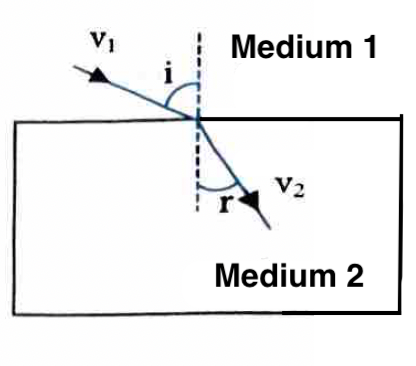

## Conditions for no Refraction

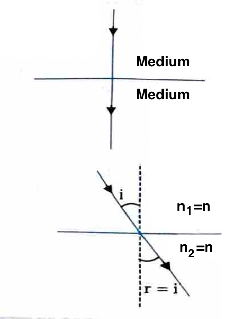

- If light is incident normally on a boundary ($\angle i=0$):

  From Snell's law:

  $$ \frac{\sin i}{\sin r} = n_{21} \Rightarrow \frac{\sin 0^{\circ}}{\sin r} = \frac{n_2}{n_1} $$

  $\Rightarrow n_1 \sin 0^{\circ} = n_2 \sin r$ or $\sin r = 0$ or $\angle r = 0^{\circ}$.
  So, light ray in the second medium will pass undeviated at the boundary.

- If the refractive indices of two media are equal ($n_1=n_2$):

  From Snell's law:
  $n_1 \sin i = n_2 \sin r$ (since $n_1=n_2$) $\Rightarrow \sin i = \sin r \Rightarrow \angle i = \angle r$.
  So, light ray in the second medium will pass undeviated at the boundary.

## Bending of Light Ray

According to Snell's law:

$
\begin{gathered}
n_{21} = \frac{\sin i}{\sin r} \Rightarrow \frac{n_2}{n_1} = \frac{\sin i}{\sin r} \\
n_1 \sin i = n_2 \sin r
\end{gathered}
$

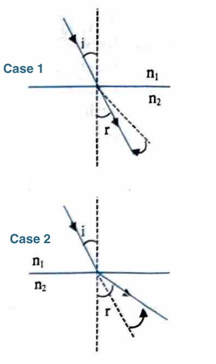

### Case 1: If light passes from rarer to denser medium (i.e., air to water or air to glass)

$ \frac{\sin i}{\sin r} = \frac{n_2}{n_1} > 1 \quad (\text{as } n_2 > n_1) $

So, $\sin i > \sin r$ or $\angle i > \angle r$.
So light ray bends towards the normal.

### Case 2: If light passes from denser to rarer medium (i.e. from water to air or glass to air)

$ \frac{\sin i}{\sin r} = \frac{n_2}{n_1} < 1 \quad (\text{as } n_1 > n_2) $

So, $\sin i < \sin r$ or $\angle i < \angle r$.
So, light ray bends away from the normal.

### Example 14

**Problem:** The refractive index of diamond is 2.42 and that of glass is 1.52. How much faster does light travel in glass than in diamond?

**Solution:**
We have, $n = \frac{c}{v}$
where,
$c$: Speed of light in air or vacuum
$v$: Speed of light in medium

Refractive index of diamond, $n_1 = 2.42$
Refractive index of glass, $n_2 = 1.52$
$v_1$ and $v_2$ are the speeds of light in diamond and glass respectively.

Then, $\frac{n_1}{n_2} = \frac{v_1}{\frac{c}{v_2}} = \frac{v_2}{v_1}$
or $\frac{v_2}{v_1} = \frac{2.42}{1.52} = 1.59 \approx 1.6$

Thus, $v_2 = 1.6$ times the speed of light in diamond.

### Example 15

**Problem:** Refractive index of water and glass are $\frac{4}{3}$ and $\frac{3}{2}$ respectively. Find the refractive index of glass w.r.t. water.

**Solution:**
Given that $n_{ag} = \frac{3}{2} = 1.5, n_{aw} = \frac{4}{3} = 1.33$
$\Rightarrow n_{wg} = \frac{n_{ag}}{n_{aw}} = \frac{1.5}{1.33} = 1.13$

### Example 16

**Problem:** A ray of light travelling in air falls on the surface of a transparent slab. The ray makes an angle of $45^{\circ}$ with the normal to the surface. Find the angle made by the refracted ray with the normal within the slab. Refractive index of the material of the slab is $\sqrt{2}$.

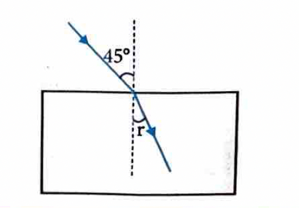

**Solution:**
We have, $\frac{\sin i}{\sin r} = n \Rightarrow \frac{\sin 45^{\circ}}{\sin r} = \sqrt{2}$

$ \Rightarrow \sin r = \frac{1}{\sqrt{2}} \times \sin 45^{\circ} = \frac{1}{\sqrt{2}} \times \frac{1}{\sqrt{2}} = \frac{1}{2} $

This gives $r = 30^{\circ}$.

## NCERT PLUS

### Real and Apparent Depths

When an object is seen from other medium, we don't see its actual depth or height. The depth we see is called apparent depth and the actual depth is called the real depth.

Let us consider an object $O$ placed in a medium of refractive index $\mu_1$. It is being observed by an observer in other medium of refractive index $\mu_2$.
Two rays $OA$ and $OB$ are made incident on the interface separating the two where they get refracted. $OA$ passes through second medium undeviated as it falls normally. When the $OB$ refracted rays are produced backward, they meet at $I$ producing virtual image of $O$ there. If $\mu_1 > \mu_2$ i.e, observer is in rarer medium, the image is formed at a distance less than the object from the observer. In other words, the image shifts towards the observer.
If $\mu_1 < \mu_2$ observer is in denser medium, the image is formed at a distance greater than the distance of the object from the observer. That is, the image shifts away from the observer.
Let us now calculate the shift, $OI = (\Delta t)$.

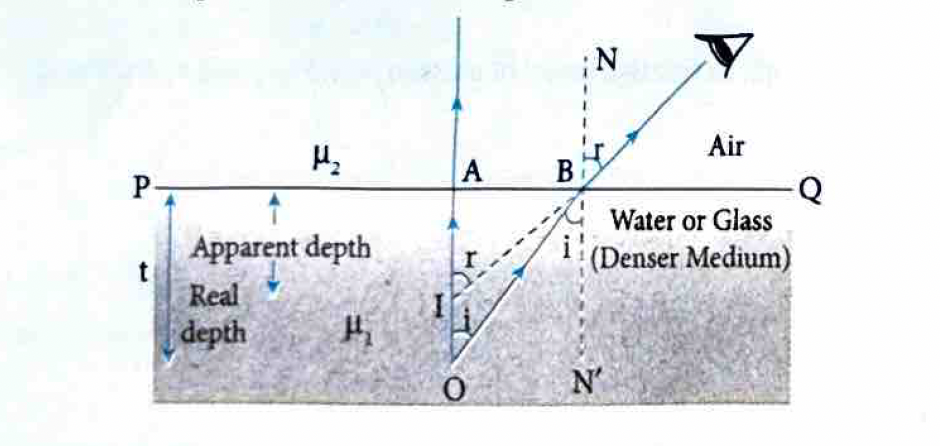

If $i$ and $r$ are small, $\sin i \approx \tan i = \frac{AB}{OA}$ and $\sin r \approx \tan r = \frac{AB}{IA}$.

By Snell's law,

$
\frac{\sin i}{\sin r} = \frac{\mu_2}{\mu_1} \Rightarrow \frac{AB}{OA} \times \frac{IA}{AB} = \frac{\mu_2}{\mu_1} \Rightarrow \frac{IA}{OA} = \frac{\mu_2}{\mu_1}
$

Clearly, $IA =$ Apparent depth of object
$OA =$ Real depth of object

$
\therefore \frac{\text{Apparent Depth}}{\text{Real Depth}} = \frac{\mu_2}{\mu_1}
$

**Case I:** If $\mu_1 = \mu$ and $\mu_2 = 1$ (for air), then

$ \frac{AI}{AO} = \frac{\text{Apparent Depth}}{\text{Real Depth}} = \frac{1}{\mu} $

$ \Rightarrow \mu = \frac{\text{Real Depth}}{\text{Apparent Depth}} $

Now, shifting in image $(\Delta t) = OI$

$ \Delta t = AO - AI = \left(\frac{AO - AI}{AO}\right) AO = \left(1 - \frac{AI}{AO}\right) AO $

or $\Delta t = \left(1 - \frac{1}{\mu}\right) t$, From eq. (i)
where $t = AO =$ thickness of the medium in which object is placed.

If the object is placed in a medium which consists of a number of refractive indices $\mu_1, \mu_2, \mu_3, \ldots$ and thickness $t_1, t_2, t_3, \ldots$ respectively, then:
Virtual depth $(AI) = \frac{t_1}{\mu_1} + \frac{t_2}{\mu_2} + \frac{t_3}{\mu_3} + \ldots$
Virtual displacement $(O) = t_1\left(1 - \frac{1}{\mu_1}\right) + t_2\left(1 - \frac{1}{\mu_2}\right) + t_3\left(1 - \frac{1}{\mu_3}\right) + \ldots$

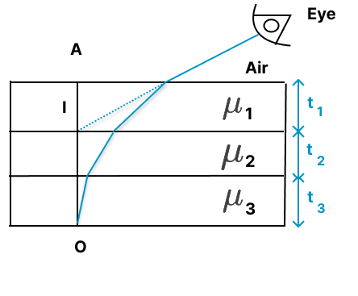

**Case II:** If $\mu_1 = 1$ (for air) and $\mu_2 = \mu$ then

$ \frac{AI}{AO} = \frac{\text{Apparent Depth}}{\text{Real Depth}} = \mu $

$\therefore$ Shift in image $= OI = AI - AO$

$
\begin{aligned}
& = \left(\frac{AI - AO}{AO}\right) AO = \left(\frac{AI}{AO} - 1\right) AO \\
& \Rightarrow \Delta t = (\mu - 1) t
\end{aligned}
$

**Case III:** When object and observer both are in rarer medium.

Let observer is in air and object is at a point $O$ in air, as shown in figure.
A glass is there in between observer and object. Image forms at point $I$.
Refractive index of glass is $\mu$.

Virtual displacement $= OI = \left(t - \frac{t}{\mu}\right) = t\left(1 - \frac{1}{\mu}\right)$

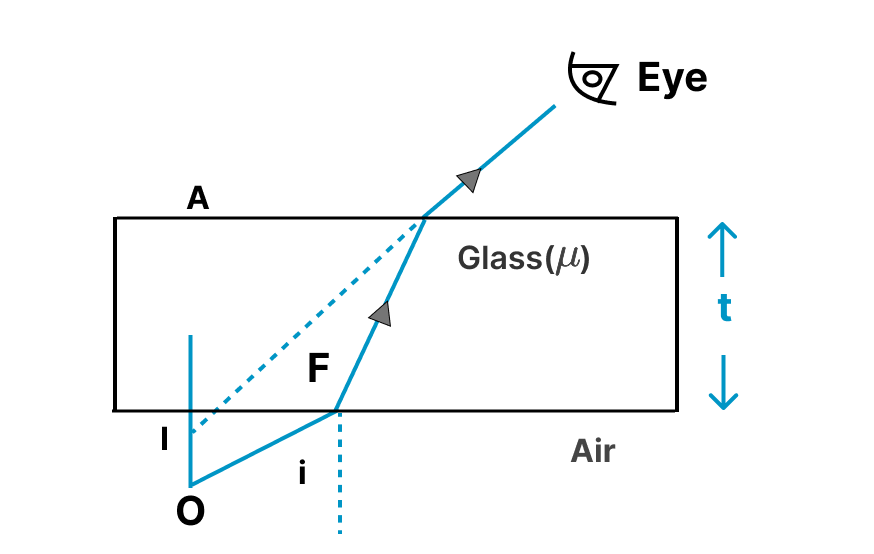

## Refraction Through a Rectangular Glass Slab

Let us consider a ray $RP$ travelling through air be incident on the upper surface of a rectangular glass slab at point $O$. After refraction, it moves along $OQ$ within the slab. On reaching the lower surface of the glass slab, it gets refracted again as it re-enters to air. Figure shows the cross section of the slab and ray's path.

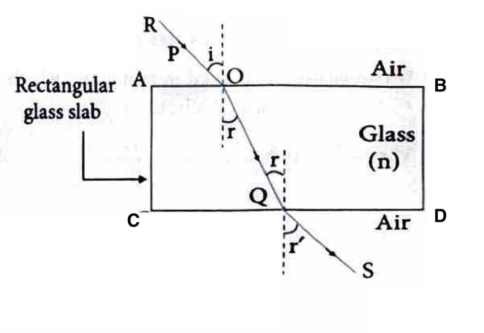

If refractive index of the material of the slab is $n$, then

$
\begin{aligned}
& \frac{\sin i}{\sin r} = n \\
& \Rightarrow \sin i = n \sin r \quad \dots(i)
\end{aligned}
$

(Applying Snell's law at interface $AB$)

For the surface $CD$, $OQ$ is the incident ray and $QS$ is the refracted ray.
$\therefore OQ$ makes an angle $r$ with the normal at $Q$ i.e. angle of incidence at $Q = r$. Let the angle of refraction be $r^{\prime}$.
Here, glass is the first medium and air is the second medium.

$
\therefore \frac{\sin r}{\sin r^{\prime}} = \frac{1}{n}
$

(Applying Snell's law at $C$)
or $\sin r^{\prime} = n \sin r \quad \dots(iii)$

From equations (i) and (iii), we get

$
\sin i = \sin r^{\prime} \quad \therefore i = r^{\prime}
$

$\Rightarrow$ The ray $QS$ is parallel to the ray $RP$.
When a light ray passes through a transparent slab with parallel faces, the ray is displaced parallel to itself.

### Lateral displacement (d)

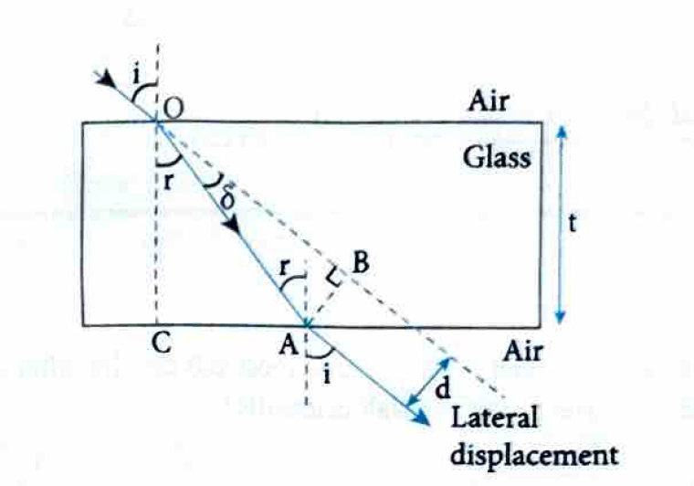

The lateral displacement of the ray is the perpendicular distance $(AB)$ between the incident and the emergent ray.

Let $\angle AOB = \delta =$ deviation on first refraction
In $\triangle AOB, \sin \delta = \frac{AB}{OA} \Rightarrow AB = OA \sin \delta$
Now, $\delta = i - r$

$
\therefore AB = OA \sin (i - r) \quad \dots(i)
$

In $\triangle OCA, \cos r = \frac{CO}{OA}$

$
\Rightarrow OA = \frac{CO}{\cos r} \quad \dots(ii)
$

Put (ii) in (i), we have

$
AB = \frac{CO \sin (i - r)}{\cos r}
$

But $CO = t =$ thickness of glass slab,

$
\Rightarrow AB = \frac{t \sin (i - r)}{\cos r} \Rightarrow d = \frac{t \sin (i - r)}{\cos r}
$

Lateral displacement depends on the following factors:
1. Refractive index of the medium, $d \propto \mu$
2. Thickness of the medium, $d \propto t$
3. Angle of incidence, $d \propto i$
4. Wavelength of light, $d \propto \frac{1}{\lambda}$

> [!NOTE]
> **NOTE**
> Lateral shift will be maximum if $i = 90^{\circ}$
> $\therefore$ Maximum lateral shift $= t$ (thickness of slab)

### Example 17

**Problem:** In a water vessel of depth 20 cm, a coin is put at the bottom. What will be its apparent depth if viewed from the top? (Take $n_w = \frac{4}{3}$)

**Solution:**
$ \text{Apparent depth in water} = \frac{\text{Actual depth of water}}{n_w} \Rightarrow d = \frac{20}{4/3} = 15 \text{ cm} $

### Example 18

**Problem:** A printed page is kept pressed by glass slab ($n=1.5$) of thickness 6.0 cm. By what amount will the printed letters appear to be shifted when viewed from the top of the slab normally?

**Solution:**
Thickness, $t = 6.0 \text{ cm}, n = 1.5$

$ \Rightarrow \Delta t = 6\left(1 - \frac{1}{1.5}\right) = 2.0 \text{ cm} $

### 7. Total Internal Reflection

When a ray of light travelling from optically denser medium to optically rarer medium is incident at an angle greater than critical angle, then the ray completely reflected back into the denser medium. This phenomenon is called total internal reflection. This is illustrated in the figure given below.

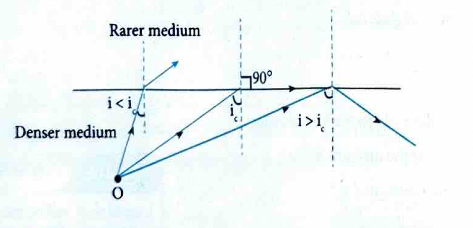

**Critical Angle**

If a ray is travelling from optically denser medium to optically rarer medium, then critical angle may be defined as the angle of incidence in the denser medium corresponding to which angle of refraction in the rarer medium is $90^{\circ}$.

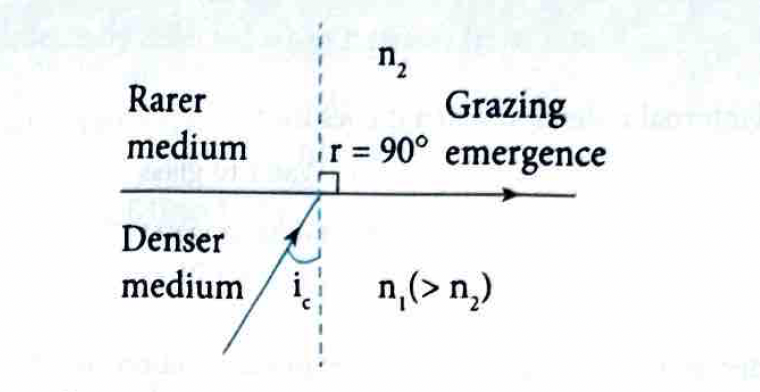

$\boldsymbol{n}_{\mathbf{2}} =$ refractive index of rarer medium
$n_1 =$ refractive index of denser medium and $i_c =$ critical angle

By Snell's law,

$ n_1 \sin i_c = n_2 \sin 90^{\circ} \Rightarrow \sin i_c = \frac{n_2}{n_1} $

### Example 19

**Problem:** A ray of light may suffer total internal reflection when it goes from
(1) Air to water
(2) Water to glass
(3) Air to glass
(4) Glass to water

**Solution:** (4)
The light should travel from denser to rarer medium for total internal reflection.

### Concept Application Exercise 3

1. When a glass slab is placed on a dot on a paper, it appears displaced by 4 cm, viewed normally. What is the thickness of slab if the refractive index is 1.5?
   (1) 10 cm
   (2) 12 cm
   (3) 15 cm
   (4) 11 cm

2. In the given figure, a ray of light falls obliquely on a vertical glass slab and after refraction from slab falls on a vertical plane mirror at angle $x$. The value of $x$ is
  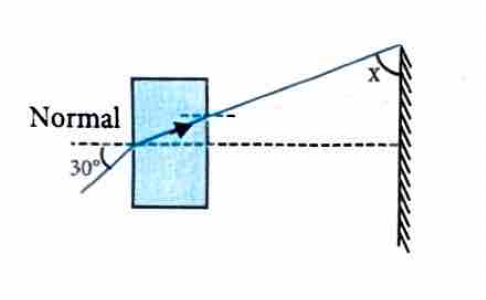

   (1) $30^{\circ}$
   (2) $60^{\circ}$
   (3) $45^{\circ}$
   (4) $70^{\circ}$

3. For an angle of incidence of $45^{\circ}$ at the top surface of a glass slab as shown in figure, what is the maximum refractive index of glass for total internal reflection? For water $\mu = \frac{4}{3}$

  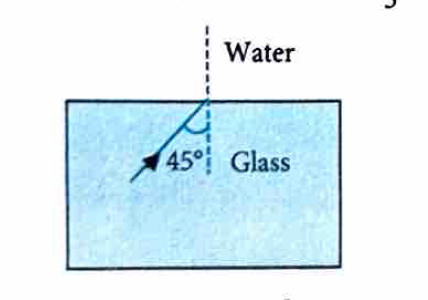

   (1) $\frac{4}{3 \sqrt{2}}$
   (2) $\frac{4 \sqrt{2}}{3}$
   (3) $\frac{3}{4 \sqrt{2}}$
   (4) $\frac{3 \sqrt{2}}{4}$

4. Material $A$ has critical angle $i_A$, material $B$ has critical angle $i_B (i_B > i_A)$. Then which of the following is true?
   (i) Light can be totally internally reflected when it passes from $B$ to $A$.
   (ii) Light can be totally internally reflected when it passes from $A$ to $B$.
   (iii) Critical angle between $A$ and $B$ is $\sin^{-1}\left(\frac{\sin \mu_B}{\sin \mu_A}\right)$
   (1) (i) and (ii)
   (2) (i), (ii) and (iii)
   (3) (i) and (iii)
   (4) (ii) and (iii)

5. If refractive index of glass is 1.50 and of water is 1.33, then critical angle is
   (1) $\sin^{-1}\left(\frac{8}{9}\right)$
   (2) $\sin^{-1}\left(\frac{2}{3}\right)$
   (3) $\cos^{-1}\left(\frac{8}{9}\right)$
   (4) $\cos^{-1}\left(\frac{2}{3}\right)$

6. Refractive index of water and glass are $\frac{4}{3}$ and $\frac{3}{2}$ respectively. A light ray travelling in water is incident on water glass interface at $30^{\circ}$. The sine of angle of refraction is
   (1) $4 / 9$
   (2) $8 / 9$
   (3) $9 / 16$
   (4) $2 / 3$

7. Which of the following rays, as shown in figure, represents the phenomenon of refraction correctly?

  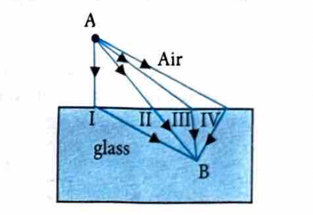

   (1) I
   (2) II
   (3) III
   (4) IV

8. A ray of light travelling in a transparent medium of refractive index $\mu$ falls on a surface separating the medium from air at an angle of incidence $45^{\circ}$. For which of the following value of $\mu$ the ray can undergo total internal reflection? [NEET 2010]
   (1) $\mu = 1.33$
   (2) $\mu = 1.40$
   (3) $\mu = 1.50$
   (4) $\mu = 1.25$

**Solve the following riddles:**

9. **Riddle:** I'm the bending of waves, a light ballet,
   Passing through substances, I change my display.
   I'm responsible for pencils looking bent,
   In a glass of water, my magic is sent.
   What phenomenon do I convey?

10. **Riddle:** I'm the reason behind a hallway's end,
    Creating optical illusions around the bend.
    Mirages dance in the desert's heat,
    As I play with light, making images fleet.
    What am I that makes these sights meet?

11. What is the concept of critical angle? How it is calculated?

12. How Snell's law help in calculating refractive index of a medium?

### Answer Key

1. (2)
2. (2)
3. (2)
4. (4)
5. (1)
6. (1)
7. (2)
8. (3)

### Solutions

1. **Answer (2)**
   Apparent shift $d = t(1 - \frac{1}{\mu})$
   $4 = t(1 - \frac{1}{1.5}) = t(1 - \frac{2}{3}) = \frac{t}{3}$
   $\therefore t = 12$ cm

2. **Answer (2)**
   From the geometry of similar problems, if the ray strikes the mirror at an angle such that it reflects back, the angle $x$ corresponds to $60^{\circ}$.

3. **Answer (2)**
   For TIR, $i > C \Rightarrow \sin i > \sin C$
   $\sin 45^{\circ} > \frac{\mu_w}{\mu_g}$
   $\frac{1}{\sqrt{2}} > \frac{4/3}{\mu_g} \Rightarrow \mu_g > \frac{4\sqrt{2}}{3}$
   For maximum refractive index for TIR to *just* occur (limiting case), $\mu_g = \frac{4\sqrt{2}}{3}$.

4. **Answer (4)**
   $i_B > i_A \Rightarrow \sin i_B > \sin i_A \Rightarrow \frac{1}{\mu_B} > \frac{1}{\mu_A} \Rightarrow \mu_A > \mu_B$.
   So A is denser, B is rarer.
   (ii) Light goes from A (denser) to B (rarer), so TIR is possible.
   (iii) $\sin C_{AB} = \frac{\mu_B}{\mu_A} = \frac{\sin i_A}{\sin i_B}$.
   Wait, the option says $\sin^{-1}\left(\frac{\sin \mu_B}{\sin \mu_A}\right)$. If we assume the question meant $\sin^{-1}\left(\frac{\mu_B}{\mu_A}\right)$ or derived from critical angles, (iii) is the intended correct statement alongside (ii).

5. **Answer (1)**
   $\sin C = \frac{\mu_w}{\mu_g} = \frac{1.33}{1.50} = \frac{4/3}{3/2} = \frac{8}{9}$
   $C = \sin^{-1}\left(\frac{8}{9}\right)$

6. **Answer (1)**
   $\mu_w \sin i = \mu_g \sin r$
   $\frac{4}{3} \sin 30^{\circ} = \frac{3}{2} \sin r$
   $\frac{4}{3} \times \frac{1}{2} = \frac{3}{2} \sin r \Rightarrow \frac{2}{3} = \frac{3}{2} \sin r \Rightarrow \sin r = \frac{4}{9}$

7. **Answer (2)**
   Ray travelling from rarer to denser medium bends towards the normal. Ray II represents this correctly.

8. **Answer (3)**
   For TIR, $i > C \Rightarrow \sin 45^{\circ} > \frac{1}{\mu}$
   $\frac{1}{\sqrt{2}} > \frac{1}{\mu} \Rightarrow \mu > \sqrt{2} \approx 1.414$
   Only $\mu = 1.50$ satisfies this.

9. **Refraction**

10. **Total Internal Reflection** (or Atmospheric Refraction)

11. **Critical Angle:** The angle of incidence in the denser medium for which the angle of refraction in the rarer medium is $90^{\circ}$.
    Formula: $\sin C = \frac{n_2}{n_1}$ where $n_1 > n_2$.

12. **Snell's Law:** It states that the ratio of sine of angle of incidence to the sine of angle of refraction is a constant for a given pair of media.
    $n_{21} = \frac{\sin i}{\sin r} = \frac{n_2}{n_1}$. Thus, it helps calculate the refractive index.

