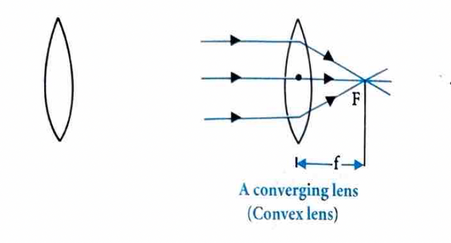
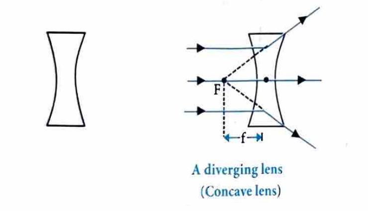
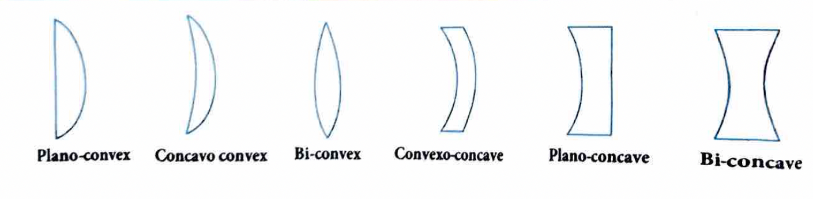
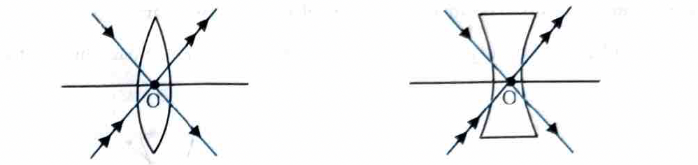
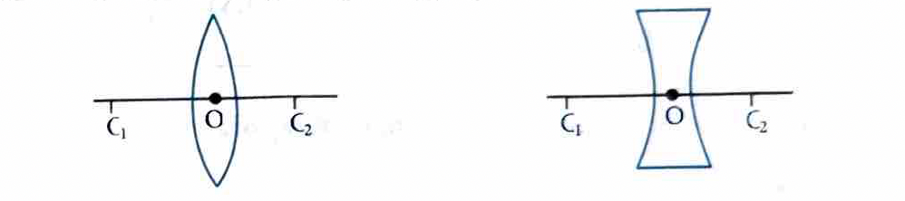
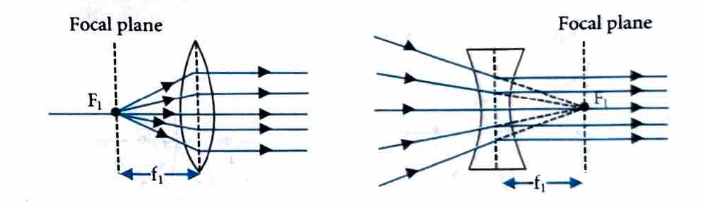
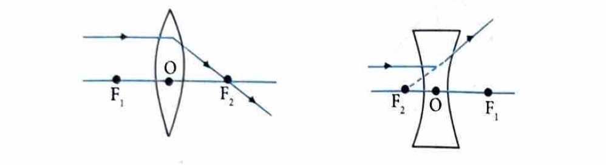
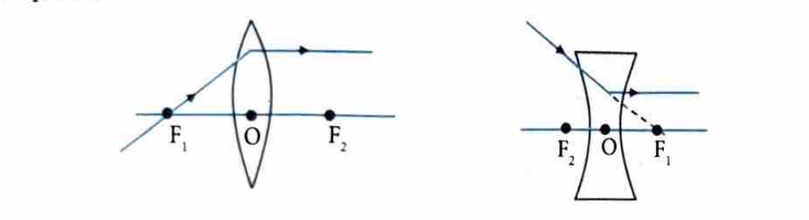
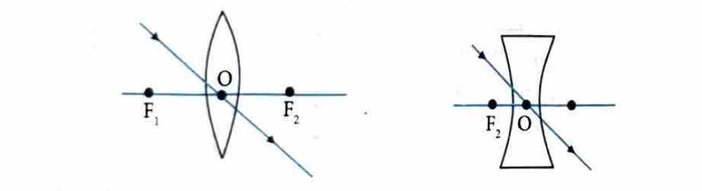

# 8. Spherical Lenses

## 8.1 Refraction by Spherical Lenses

A lens is a transparent material medium bounded by two surfaces, of which one or both surfaces are spherical. The function of a lens is to deviate light; it can either converge or diverge a parallel beam of light. Depending upon this property, lenses may be characterized into two categories: converging lens and diverging lens.

### A Converging Lens (Convex Lens)

If the spherical surfaces are bulging outwards, then the lens is called a double convex lens. A double convex lens is simply called a convex lens. It is thicker at the middle as compared to the edges. A convex lens converges light as shown in the figure below.

### A Diverging Lens (Concave Lens)

If the spherical surfaces are curved inwards, then the lens is called a double concave lens. A double concave lens is simply called a concave lens. It is thicker at the edges than at the middle. A concave lens diverges light rays as shown in the figure below.

## 8.2 Different Types of Lens

### Important Terms Related to Spherical Lenses

1.  **Optical Centre ($O$):** It is usually represented by the letter $O$. A ray of light passing through the optical centre passes undeviated.

  

2.  **Principal Axis:** The principal axis is a line passing through the optical centre and the centres of curvature of the curved surfaces.

  

3.  **Focus:** A lens has two foci. They are represented by $F_1$ and $F_2$, called the first and second focus of the lens respectively.

  

   **First Focus:** The rays starting from a fixed point on the principal axis of a lens, or appearing to meet at a fixed point on the axis, become parallel to the principal axis after refraction through the lens. This point is called the first focus of the lens.

   **Second Focus:** The rays parallel to the principal axis of the lens, after refraction through the lens, either meet at a fixed point on the axis or appear to come from a fixed point. This point is called the second focus or principal focus of the lens.

   **Focal Plane:** The plane passing through the focus of the lens and perpendicular to the principal axis is called the focal plane.

4.  **Focal Length ($f$):** The distance of the principal focus from the optical centre of a lens is called its focal length.
5.  **Aperture:** It is the effective diameter of the light-transmitting area (i.e., the diameter of the circular outline of a spherical lens). Intensity of image formed by a lens $\propto (\text{Aperture})^2$.

### 8.3 Laws of Image Formation by Spherical Lens

Graphically we can locate the position of image for a given object by drawing any two of the following three rays.

1. A ray, initially parallel to the principal axis of a lens, will pass or appear to pass through focus $\left(F_2\right)$ after pass, through the lens.

2. A ray which initially passes or appears to pass through the focus ( $F_1$ ) of a lens will emerge from the lens paral to the principal axis.

3. A ray passing through the optical centre of a lens goes undeviated.

