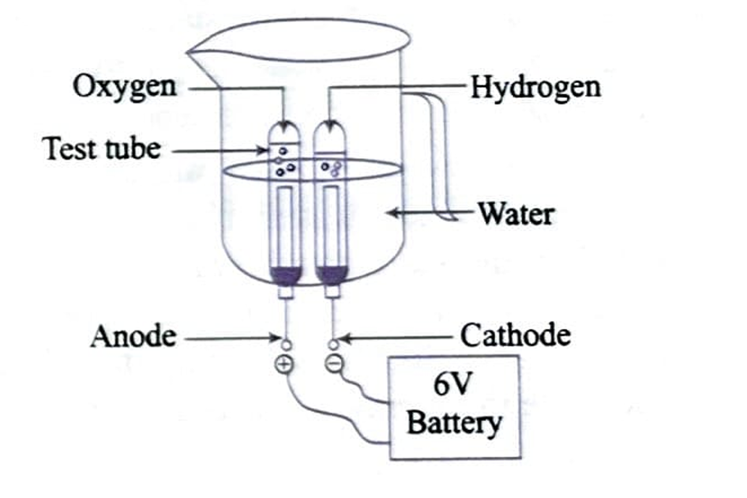

## Short Answer Type Questions
### Questions

11. What is an oxidation reaction? Give an example of oxidation reaction. Is oxidation an exothermic or an endothermic reaction?
12. Write chemical equation for the reactions taking place when
    (i) Magnesium reacts with dilute $\mathrm{HNO}_3$
    (ii) Sodium reacts with water.
    (iii) Zinc reacts with dilute hydrochloric acid
13. A metal salt $M X$, when exposed to light, splits up to form the metal $M$ and the gas $X_2$. Metal $M$ is used in making ornaments, whereas gas $X_2$ is used in making bleaching powder. The salt $M X$ is itself used in black and white photography.
    (i) Identify metal $M$ and gas $X_2$.

(ii) Mention the type of chemical reaction, involved when salt $M X$ is exposed to light?

14. Translate the following statements into chemical equations, and then balance the equations:
    (i) Phosphorus burns in oxygen to give phosphorus pentoxide.  
    (ii) Aluminium metal replaces iron from ferric oxide, $\mathrm{Fe}_2 \mathrm{O}_3$, giving aluminium oxide and iron.  
    (iii) Carbon disulphide burns in air to give carbon dioxide and sulphur dioxide.   
    (iv) Barium chloride reacts with zinc sulphate to give zinc chloride and barium sulphate.  

15. Study the figure given below and answer the following questions:

(a) Name the process depicted in the diagram.
(b) Write the gases released at anode and the cathode.
(c) Write the balanced chemical equation of the reaction taking place in this case.
16. Oil and fat containing food items are flushed with nitrogen. Why?

 ### Answers

11. Reaction in which oxygen atoms are gained or electrons are gained is called oxidation reaction. Oxidation is an exothermic reaction.

12. (i) $\mathrm{Mg}(\mathrm{s}) + 2\mathrm{HNO}_3(\mathrm{aq}) \rightarrow \mathrm{Mg}(\mathrm{NO}_3)_2(\mathrm{aq}) + \mathrm{H}_2(\mathrm{g})$

    (ii) $\mathrm{Na}(\mathrm{s}) + \mathrm{H}_2\mathrm{O}(\mathrm{aq}) \rightarrow \mathrm{NaOH}(\mathrm{aq}) + \mathrm{H}_2(\mathrm{g})$

    (iii) $\mathrm{Zn}(\mathrm{s}) + 2\mathrm{HCl}(\mathrm{aq}) \rightarrow \mathrm{ZnCl}_2(\mathrm{aq}) + \mathrm{H}_2(\mathrm{g})$

13. (i) 
    (a) Metal $M$ is silver ($\mathrm{Ag}$).
    (b) Gas $X_2$ is chlorine ($\mathrm{Cl}_2$).
    (c) Metal salt $MX$ is $\mathrm{AgCl}$.
    (d) Solution of sodium chloride and silver nitrate on mixing together can produce a precipitate of salt $MX$.
    (e) Decomposition reaction by light takes place.

    $ 2 \mathrm{AgCl}(\mathrm{s}) \rightarrow 2 \mathrm{Ag}(\mathrm{s})+\mathrm{Cl}_2(\mathrm{g}) $

14. Translate the following statements into chemical equations, and then balance the equations:
    (i) Phosphorus burns in oxygen to give phosphorus pentoxide.
    (ii) Aluminium metal replaces iron from ferric oxide, $\mathrm{Fe}_2 \mathrm{O}_3$, giving aluminium oxide and iron.
    (iii) Carbon disulphide burns in air to give carbon dioxide and sulphur dioxide.
    (iv) Barium chloride reacts with zinc sulphate to give zinc chloride and barium sulphate.

    **Answers:**.   
    (i) $ 4\mathrm{P}(\mathrm{s}) + 5\mathrm{O}_2(\mathrm{g}) \rightarrow 2\mathrm{P}_2\mathrm{O}_5(\mathrm{s}) $.   
    (ii) $ 2\mathrm{Al}(\mathrm{s}) + \mathrm{Fe}_2\mathrm{O}_3(\mathrm{s}) \rightarrow \mathrm{Al}_2\mathrm{O}_3(\mathrm{s}) + 2\mathrm{Fe}(\mathrm{s}) $.   
    (iii) $ \mathrm{CS}_2(\mathrm{l}) + 3\mathrm{O}_2(\mathrm{g}) \rightarrow \mathrm{CO}_2(\mathrm{g}) + 2\mathrm{SO}_2(\mathrm{g}) $.   
    (iv) $ \mathrm{BaCl}_2(\mathrm{aq}) + \mathrm{ZnSO}_4(\mathrm{aq}) \rightarrow \mathrm{ZnCl}_2(\mathrm{aq}) + \mathrm{BaSO}_4(\mathrm{s}) $

15. Study the figure given below and answer the following questions:
    

    (a) Name the process depicted in the diagram.

    (b) Write the gases released at anode and the cathode.

    (c) Write the balanced chemical equation of the reaction taking place in this case.

    **Answers:**
    (a) Electrolysis of water.
    (b) Anode: Oxygen ($\mathrm{O}_2$), Cathode: Hydrogen ($\mathrm{H}_2$).
    (c) $ 2\mathrm{H}_2\mathrm{O}(\mathrm{l}) \xrightarrow{\text{Electrolysis}} 2\mathrm{H}_2(\mathrm{g}) + \mathrm{O}_2(\mathrm{g}) $.   

16. Oil and fat containing food items are flushed with nitrogen. Why?
    Nitrogne is bad for oxidation reaction. hence it is used

    

